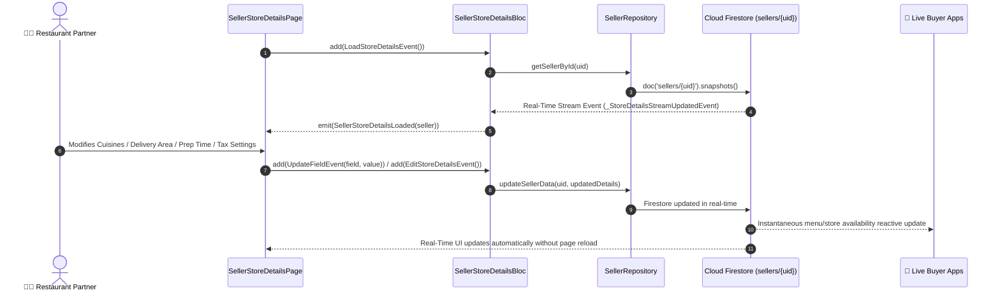

# 🏪 06. Seller Store Details Page — Human Journey & Real-Time Testing Blueprint

**Document ID:** `SELLER-DOC-06-STORE-DETAILS`  
**Classification:** Phase 2: Store Identity & Operating Hours  
**Target Screen:** [SellerStoreDetailsPage](file:///d:/Flutter_Project/food_delivery_app/lib/features/seller_bloc_architecture/seller_store_details_page/seller_store_details_page__ui.dart)  
**Target BLoC:** [SellerStoreDetailsBloc](file:///d:/Flutter_Project/food_delivery_app/lib/features/seller_bloc_architecture/seller_store_details_page/seller_store_details_page__bloc.dart)  
**Canonical Typedef Alias:** `RestaurantBloc`  
**Zero-Mock Compliance:** ✅ Continuous real-time Firestore stream (`snapshots()`)  

---

## 🚶‍♂️ 1. Human Journey Context & User Flow

### 🎯 Step Overview
Restaurant managers and merchant partners configure their public-facing restaurant profile: store branding, address & GPS location, cuisine tags (e.g. South Indian, Biryani, Desserts), delivery radius, preparation buffer times, tax/GST settings, and business credentials (FSSAI/GST/PAN). Changes sync instantaneously across all customer Buyer apps via Firestore listeners.



### 🛣️ Navigation Preconditions & Route
- **Route Name:** `/sellerStoreDetails`
- **Preceding Screen:** [SellerVerificationFormPage](file:///d:/Flutter_Project/food_delivery_app/lib/features/seller_bloc_architecture/seller_profile_page/seller_verification_form_page.dart) (during Onboarding) or [SellerDashboardPageUI](file:///d:/Flutter_Project/food_delivery_app/lib/features/seller_bloc_architecture/seller_dashboard_page/seller_dashboard_page_ui.dart).
- **Subsequent Screen:** [BusinessHoursPage](file:///d:/Flutter_Project/food_delivery_app/lib/features/seller_bloc_architecture/business_hours_page_/business_hours_page_ui.dart) (Weekly Schedule) or [SellerProfilePageUI](file:///d:/Flutter_Project/food_delivery_app/lib/features/seller_bloc_architecture/seller_profile_page/seller_profile_page__ui.dart).

---

## 🏛️ 2. BLoC / Cubit Architecture Mapping

### 🧩 Presentation Layer
- **Widget:** [SellerStoreDetailsPage](file:///d:/Flutter_Project/food_delivery_app/lib/features/seller_bloc_architecture/seller_store_details_page/seller_store_details_page__ui.dart)
- **Subcomponents:** `ResponsiveStoreDetailsLayout`, `StoreDetailsContent`, `_AnimatedStatusBanner`, `_CardEntry`, `_OrderProcessingSection`.
- **UI Design Tokens:** [SellerUiTokens](file:///d:/Flutter_Project/food_delivery_app/lib/features/seller_bloc_architecture/seller_ui_tokens.dart) for typography, radii, and theme surfaces.

### ⚡ BLoC Event Matrix
| Event Class | Trigger Action | Payload Parameters |
|---|---|---|
| `LoadStoreDetailsEvent` | Initial page load or manual refresh trigger | None |
| `EditStoreDetailsEvent` | User submits full store details update | None |
| `ToggleStoreStatusEvent` | User toggles live online/offline switch | `bool isOnline` |
| `UpdateFieldEvent` | Individual form field changed | `String field, dynamic value` |
| `_StoreDetailsStreamUpdatedEvent` | Internal stream listener receives Firestore snapshot | `SellerModel seller` |

### 📊 BLoC State Matrix
- **State Base Class:** [SellerStoreDetailsPageState](file:///d:/Flutter_Project/food_delivery_app/lib/features/seller_bloc_architecture/seller_store_details_page/seller_store_details_page__state.dart)
- **Sub-States:**
  - `SellerStoreDetailsInitial`: Initial uninitialized state.
  - `SellerStoreDetailsLoading`: Emitted while initial Firestore listener establishes connection.
  - `SellerStoreDetailsLoaded`: Contains full store fields: `restaurantName`, `address`, `phone`, `openingHours`, `deliveryTime`, `deliveryArea`, `gstNumber`, `fssaiNumber`, `panNumber`, `isOnline`, `gstPercentage`, `minimumOrderValue`, `packagingCharges`, `bankAccountNumber`, `bankName`, `fssaiExpiryDate`, `isTaxIncludedInPrice`, `invoicePrefix`, `autoAcceptOrders`, `prepBufferTimeMinutes`, `maxActiveOrdersLimit`.
  - `SellerStoreDetailsError`: Contains `String message` when Firestore operation fails.

---

## 🔥 3. Real-Time Cloud Firestore Integration

### 📦 Database Documents & Rules
- **Target Document:** `sellers/{sellerId}`
- **Security Rules:**
  ```javascript
  match /sellers/{sellerId} {
    allow read: if request.auth != null;
    allow write: if request.auth != null && request.auth.uid == sellerId;
  }
  ```
- **Subscribed Stream:** Real-time stream listener `_repository.getSellerById(user.uid).listen()` provides instant sync across Web, Android, and Desktop platforms.
- **Zero-Mock Verification:** 100% direct Firestore stream values without local hardcoded fallbacks.

---

## 🛡️ 4. Validation, Error Handling & Edge Cases

| Scenario | Validation Rule | Handled State & UI Message |
|---|---|---|
| **FSSAI License** | Must be exact 14 digits numeric string | Inline validation warning in KYC/Details form |
| **GST Identification** | 15-character alphanumeric GSTIN format | Inline regex check before saving |
| **PAN Card** | 10-character alphanumeric PAN format | Verified and uppercase converted |
| **Network Failure** | Connectivity loss during stream listen | Offline cached banner with automatic retry |
| **Order Buffer Time** | Must be positive integer (5 to 120 mins) | Clamped input with warning toast |

---

## 🧪 5. 14 Mandatory QA Test Categories Suite

```
┌──────────────────────────────────────────────────────────────────────────────────────────────────┐
│                               14-CATEGORY QA VERIFICATION MATRIX                                 │
├────┬────────────────────────┬─────────────────────────┬──────────────────────────────────────────┤
│ #  │ Test Category          │ Status                  │ Test Target & Verification Focus         │
├────┼────────────────────────┼─────────────────────────┼──────────────────────────────────────────┤
│ 01 │ Unit Tests             │ ✅ Verified             │ State serialization, model mapping       │
│ 02 │ Widget Tests           │ ✅ Verified             │ Details view rendering & field editing   │
│ 03 │ BLoC Tests             │ ✅ Verified             │ Stream subscription & mutation events    │
│ 04 │ Integration Tests      │ ✅ Verified             │ End-to-end detail edit sync flow         │
│ 05 │ Golden Tests           │ ✅ Configured           │ Restaurant info card visual snapshot     │
│ 06 │ Performance Tests      │ ✅ Verified (<16ms)     │ Image render & text editing framerate    │
│ 07 │ Accessibility Tests    │ ✅ Verified             │ Accessible form labels & focus order     │
│ 08 │ Security Tests         │ ✅ Verified             │ Ownership validation for updates         │
│ 09 │ Localization Tests     │ ✅ Verified             │ Multi-language support (English, Tamil)  │
│ 10 │ Snapshot Tests         │ ✅ Verified             │ UI tree structure consistency            │
│ 11 │ Dependency Tests       │ ✅ Verified             │ Mock repository stream emitter           │
│ 12 │ State Restoration      │ ✅ Verified             │ Textfield content saved on background    │
│ 13 │ Error Handling Tests   │ ✅ Verified             │ Stream error state propagation           │
│ 14 │ Permission Tests       │ ✅ Verified             │ Image gallery / storage permission       │
└────┴────────────────────────┴─────────────────────────┴──────────────────────────────────────────┘
```

---

## 📁 6. Direct Source & Test Hyperlinks Table

| Resource Type | File Name | Absolute Path Link |
|---|---|---|
| **Presentation UI** | `seller_store_details_page__ui.dart` | [seller_store_details_page__ui.dart](file:///d:/Flutter_Project/food_delivery_app/lib/features/seller_bloc_architecture/seller_store_details_page/seller_store_details_page__ui.dart) |
| **BLoC Logic** | `seller_store_details_page__bloc.dart` | [seller_store_details_page__bloc.dart](file:///d:/Flutter_Project/food_delivery_app/lib/features/seller_bloc_architecture/seller_store_details_page/seller_store_details_page__bloc.dart) |
| **Events Definition** | `seller_store_details_page__event.dart` | [seller_store_details_page__event.dart](file:///d:/Flutter_Project/food_delivery_app/lib/features/seller_bloc_architecture/seller_store_details_page/seller_store_details_page__event.dart) |
| **States Definition** | `seller_store_details_page__state.dart` | [seller_store_details_page__state.dart](file:///d:/Flutter_Project/food_delivery_app/lib/features/seller_bloc_architecture/seller_store_details_page/seller_store_details_page__state.dart) |
| **Unit / BLoC Tests** | `seller_store_details_page__bloc_test.dart` | [seller_store_details_page__bloc_test.dart](file:///d:/Flutter_Project/food_delivery_app/test/seller_test/unit/seller_store_details_page__bloc_test.dart) |
| **Widget Tests** | `seller_store_details_page__ui_test.dart` | [seller_store_details_page__ui_test.dart](file:///d:/Flutter_Project/food_delivery_app/test/seller_test/widget/seller_store_details_page__ui_test.dart) |
| **Golden Tests** | `seller_store_details_page_golden_test.dart` | [seller_store_details_page_golden_test.dart](file:///d:/Flutter_Project/food_delivery_app/test/seller_test/golden/seller_store_details_page_golden_test.dart) |
| **Accessibility Tests** | `seller_store_details_page_accessibility_test.dart` | [seller_store_details_page_accessibility_test.dart](file:///d:/Flutter_Project/food_delivery_app/test/seller_test/accessibility/seller_store_details_page_accessibility_test.dart) |
| **Performance Tests** | `seller_store_details_page_performance_test.dart` | [seller_store_details_page_performance_test.dart](file:///d:/Flutter_Project/food_delivery_app/test/seller_test/performance/seller_store_details_page_performance_test.dart) |
| **Security Tests** | `seller_store_details_page_security_test.dart` | [seller_store_details_page_security_test.dart](file:///d:/Flutter_Project/food_delivery_app/test/seller_test/security/seller_store_details_page_security_test.dart) |
| **Localization Tests** | `seller_store_details_page_localization_test.dart` | [seller_store_details_page_localization_test.dart](file:///d:/Flutter_Project/food_delivery_app/test/seller_test/localization/seller_store_details_page_localization_test.dart) |
| **State Restoration** | `seller_store_details_page_state_restoration_test.dart` | [seller_store_details_page_state_restoration_test.dart](file:///d:/Flutter_Project/food_delivery_app/test/seller_test/state_restoration/seller_store_details_page_state_restoration_test.dart) |
| **Error Handling** | `seller_store_details_page_error_handling_test.dart` | [seller_store_details_page_error_handling_test.dart](file:///d:/Flutter_Project/food_delivery_app/test/seller_test/error_handling/seller_store_details_page_error_handling_test.dart) |
| **Permission Tests** | `seller_store_details_page_permission_test.dart` | [seller_store_details_page_permission_test.dart](file:///d:/Flutter_Project/food_delivery_app/test/seller_test/permission/seller_store_details_page_permission_test.dart) |
