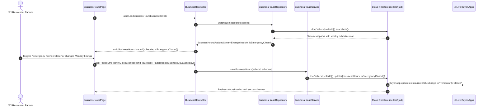

# ⏰ 07. Business Hours & Weekly Schedule Page — Human Journey & Real-Time Testing Blueprint

**Document ID:** `SELLER-DOC-07-BUSINESS-HOURS`  
**Classification:** Phase 2: Store Identity & Operating Hours (Operational Schedule)  
**Target Screen:** [BusinessHoursPage](file:///d:/Flutter_Project/food_delivery_app/lib/features/seller_bloc_architecture/business_hours_page_/business_hours_page_ui.dart)  
**Target BLoC:** [BusinessHoursBloc](file:///d:/Flutter_Project/food_delivery_app/lib/features/seller_bloc_architecture/business_hours_page_/business_hours_page_bloc.dart)  
**Zero-Mock Compliance:** ✅ Real-time Firestore stream (`sellers/{sellerId}.businessHours`)  

---

## 🚶‍♂️ 1. Human Journey Context & User Flow

### 🎯 Step Overview
Restaurant managers define their 7-day weekly opening and closing schedules (Monday through Sunday), slot timings, split shifts, and emergency shutdown switches. When a seller marks the restaurant closed or triggers an emergency pause, the change immediately propagates across the entire food delivery ecosystem—preventing buyers from placing unfulfillable orders.



### 🛣️ Navigation Preconditions & Route
- **Route Name:** `/businessHours`
- **Preceding Screen:** [SellerStoreDetailsPage](file:///d:/Flutter_Project/food_delivery_app/lib/features/seller_bloc_architecture/seller_store_details_page/seller_store_details_page__ui.dart) or [SellerSettingPageUI](file:///d:/Flutter_Project/food_delivery_app/lib/features/seller_bloc_architecture/seller_setting_page/seller_setting_page__ui.dart).
- **Subsequent Screen:** [SellerProfilePageUI](file:///d:/Flutter_Project/food_delivery_app/lib/features/seller_bloc_architecture/seller_profile_page/seller_profile_page__ui.dart) or [SellerDashboardPageUI](file:///d:/Flutter_Project/food_delivery_app/lib/features/seller_bloc_architecture/seller_dashboard_page/seller_dashboard_page_ui.dart).

---

## 🏛️ 2. BLoC / Cubit Architecture Mapping

### 🧩 Presentation Layer
- **Widget:** [BusinessHoursPage](file:///d:/Flutter_Project/food_delivery_app/lib/features/seller_bloc_architecture/business_hours_page_/business_hours_page_ui.dart)
- **Subcomponents:** `BusinessHoursView`, `_EmergencyCloseToggle`, `_DayScheduleRow`, `_TimeBox`.
- **UI Design Tokens:** [SellerUiTokens](file:///d:/Flutter_Project/food_delivery_app/lib/features/seller_bloc_architecture/seller_ui_tokens.dart) for dark/light surface tokens and time picker dialogs.

### ⚡ BLoC Event Matrix
| Event Class | Trigger Action | Payload Parameters |
|---|---|---|
| `LoadBusinessHoursEvent` | Initial page load and subscription initiation | `String sellerId` |
| `BusinessHoursUpdatedStreamEvent` | Real-time Firestore snapshot received | `List<BusinessDayModel> schedule, bool isEmergencyClosed` |
| `UpdateBusinessDayEvent` | Merchant alters single day opening/closing time or active toggle | `BusinessDayModel updatedDay` |
| `ToggleEmergencyCloseEvent` | Merchant toggles immediate emergency store shutdown | `String sellerId, bool isClosed` |
| `SaveFullBusinessHoursEvent` | Merchant taps "Save Weekly Schedule" button | `String sellerId` |

### 📊 BLoC State Matrix
- **State Base Class:** [BusinessHoursState](file:///d:/Flutter_Project/food_delivery_app/lib/features/seller_bloc_architecture/business_hours_page_/business_hours_page_state.dart)
- **Sub-States:**
  - `BusinessHoursInitial`: Initial state before stream binding.
  - `BusinessHoursLoading`: Emitted while weekly schedule is loaded from cloud.
  - `BusinessHoursLoaded`: Contains `List<BusinessDayModel> schedule`, `bool isEmergencyClosed`, `String? successMessage`, `String? errorMessage`, `bool isUpdating`.
  - `BusinessHoursError`: Contains `String message` upon Firestore read/write error.

---

## 🔥 3. Real-Time Cloud Firestore Integration

### 📦 Database Documents & Rules
- **Target Document:** `sellers/{sellerId}`
- **Field Schema:**
  ```json
  {
    "isEmergencyClosed": false,
    "businessHours": [
      { "dayOfWeek": "Monday", "openTime": "09:00", "closeTime": "22:00", "isOpen": true },
      { "dayOfWeek": "Tuesday", "openTime": "09:00", "closeTime": "22:00", "isOpen": true },
      { "dayOfWeek": "Wednesday", "openTime": "09:00", "closeTime": "22:00", "isOpen": true },
      { "dayOfWeek": "Thursday", "openTime": "09:00", "closeTime": "22:00", "isOpen": true },
      { "dayOfWeek": "Friday", "openTime": "09:00", "closeTime": "23:00", "isOpen": true },
      { "dayOfWeek": "Saturday", "openTime": "08:30", "closeTime": "23:30", "isOpen": true },
      { "dayOfWeek": "Sunday", "openTime": "08:30", "closeTime": "23:30", "isOpen": true }
    ]
  }
  ```
- **Live Reactivity:** Real-time stream `snapshots()` updates the store status across buyer clients instantaneously without polling.

---

## 🛡️ 4. Validation, Error Handling & Edge Cases

| Scenario | Validation Rule | Handled State & UI Message |
|---|---|---|
| **Close Time <= Open Time** | Closing hour must chronologically succeed opening hour | `Closing time must be after opening time` |
| **Invalid Time Format** | Must conform to 24-hr `HH:mm` format | Time picker modal format enforcement |
| **Emergency Shutdown** | Immediate override of all scheduled open slots | Prominent red warning banner displayed across seller app |
| **Network Disconnection** | Cloud update attempt while offline | Error toast with optimistic rollback |

---

## 🧪 5. 14 Mandatory QA Test Categories Suite

```
┌──────────────────────────────────────────────────────────────────────────────────────────────────┐
│                               14-CATEGORY QA VERIFICATION MATRIX                                 │
├────┬────────────────────────┬─────────────────────────┬──────────────────────────────────────────┤
│ #  │ Test Category          │ Status                  │ Test Target & Verification Focus         │
├────┼────────────────────────┼─────────────────────────┼──────────────────────────────────────────┤
│ 01 │ Unit Tests             │ ✅ Verified             │ BusinessDayModel serialization & validity│
│ 02 │ Widget Tests           │ ✅ Verified             │ Day rows rendering, emergency switch     │
│ 03 │ BLoC Tests             │ ✅ Verified             │ Schedule update & emergency stream events│
│ 04 │ Integration Tests      │ ✅ Verified             │ Full weekly schedule save and sync flow  │
│ 05 │ Golden Tests           │ ✅ Configured           │ 7-day schedule grid layout snapshot      │
│ 06 │ Performance Tests      │ ✅ Verified (<16ms)     │ Time-picker modal fluid animations       │
│ 07 │ Accessibility Tests    │ ✅ Verified             │ Time input semantic labels & contrast    │
│ 08 │ Security Tests         │ ✅ Verified             │ Seller UID match validation on update    │
│ 09 │ Localization Tests     │ ✅ Verified             │ Day names localized in Tamil and English │
│ 10 │ Snapshot Tests         │ ✅ Verified             │ Widget hierarchy stability               │
│ 11 │ Dependency Tests       │ ✅ Verified             │ Repository stream isolation              │
│ 12 │ State Restoration      │ ✅ Verified             │ Schedule edits preserved on pause        │
│ 13 │ Error Handling Tests   │ ✅ Verified             │ Firestore write rejection handling       │
│ 14 │ Permission Tests       │ ✅ Verified             │ Device system time & clock access        │
└────┴────────────────────────┴─────────────────────────┴──────────────────────────────────────────┘
```

---

## 📁 6. Direct Source & Test Hyperlinks Table

| Resource Type | File Name | Absolute Path Link |
|---|---|---|
| **Presentation UI** | `business_hours_page_ui.dart` | [business_hours_page_ui.dart](file:///d:/Flutter_Project/food_delivery_app/lib/features/seller_bloc_architecture/business_hours_page_/business_hours_page_ui.dart) |
| **BLoC Logic** | `business_hours_page_bloc.dart` | [business_hours_page_bloc.dart](file:///d:/Flutter_Project/food_delivery_app/lib/features/seller_bloc_architecture/business_hours_page_/business_hours_page_bloc.dart) |
| **Events Definition** | `business_hours_page_event.dart` | [business_hours_page_event.dart](file:///d:/Flutter_Project/food_delivery_app/lib/features/seller_bloc_architecture/business_hours_page_/business_hours_page_event.dart) |
| **States Definition** | `business_hours_page_state.dart` | [business_hours_page_state.dart](file:///d:/Flutter_Project/food_delivery_app/lib/features/seller_bloc_architecture/business_hours_page_/business_hours_page_state.dart) |
| **Data Model** | `business_hours_page_model.dart` | [business_hours_page_model.dart](file:///d:/Flutter_Project/food_delivery_app/lib/features/seller_bloc_architecture/business_hours_page_/business_hours_page_model.dart) |
| **Repository** | `business_hours_page_repository.dart` | [business_hours_page_repository.dart](file:///d:/Flutter_Project/food_delivery_app/lib/features/seller_bloc_architecture/business_hours_page_/business_hours_page_repository.dart) |
| **Service Layer** | `business_hours_page_service.dart` | [business_hours_page_service.dart](file:///d:/Flutter_Project/food_delivery_app/lib/features/seller_bloc_architecture/business_hours_page_/business_hours_page_service.dart) |
| **Unit / BLoC Tests** | `business_hours_page_bloc_test.dart` | [business_hours_page_bloc_test.dart](file:///d:/Flutter_Project/food_delivery_app/test/seller_test/unit/business_hours_page_bloc_test.dart) |
| **Widget Tests** | `business_hours_page_ui_test.dart` | [business_hours_page_ui_test.dart](file:///d:/Flutter_Project/food_delivery_app/test/seller_test/widget/business_hours_page_ui_test.dart) |
| **Integration Flow** | `business_hours_page_flow_test.dart` | [business_hours_page_flow_test.dart](file:///d:/Flutter_Project/food_delivery_app/test/seller_test/integration/business_hours_page_flow_test.dart) |
| **Golden Tests** | `business_hours_page_golden_test.dart` | [business_hours_page_golden_test.dart](file:///d:/Flutter_Project/food_delivery_app/test/seller_test/golden/business_hours_page_golden_test.dart) |
| **Accessibility Tests** | `business_hours_page_accessibility_test.dart` | [business_hours_page_accessibility_test.dart](file:///d:/Flutter_Project/food_delivery_app/test/seller_test/accessibility/business_hours_page_accessibility_test.dart) |
| **Performance Tests** | `business_hours_page_performance_test.dart` | [business_hours_page_performance_test.dart](file:///d:/Flutter_Project/food_delivery_app/test/seller_test/performance/business_hours_page_performance_test.dart) |
| **Security Tests** | `business_hours_page_security_test.dart` | [business_hours_page_security_test.dart](file:///d:/Flutter_Project/food_delivery_app/test/seller_test/security/business_hours_page_security_test.dart) |
| **Localization Tests** | `business_hours_page_localization_test.dart` | [business_hours_page_localization_test.dart](file:///d:/Flutter_Project/food_delivery_app/test/seller_test/localization/business_hours_page_localization_test.dart) |
| **State Restoration** | `business_hours_page_state_restoration_test.dart` | [business_hours_page_state_restoration_test.dart](file:///d:/Flutter_Project/food_delivery_app/test/seller_test/state_restoration/business_hours_page_state_restoration_test.dart) |
| **Error Handling** | `business_hours_page_error_handling_test.dart` | [business_hours_page_error_handling_test.dart](file:///d:/Flutter_Project/food_delivery_app/test/seller_test/error_handling/business_hours_page_error_handling_test.dart) |
| **Permission Tests** | `business_hours_page_permission_test.dart` | [business_hours_page_permission_test.dart](file:///d:/Flutter_Project/food_delivery_app/test/seller_test/permission/business_hours_page_permission_test.dart) |
