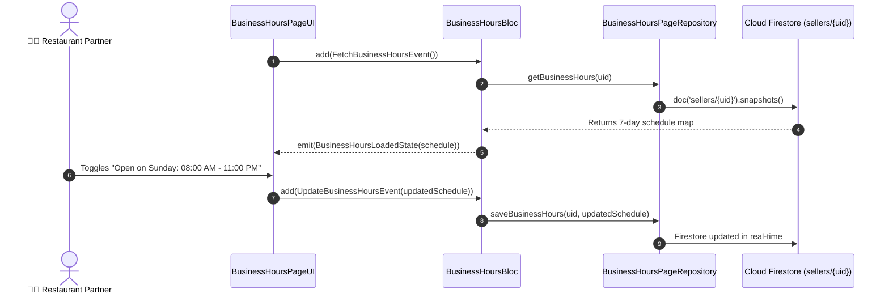

# ⏰ 07. Business Hours Page — Human Journey & Real-Time Testing Blueprint

**Document ID:** `SELLER-DOC-07-BUSINESS-HOURS`  
**Classification:** Phase 2: Store Identity & Operating Hours  
**Target Screen:** [BusinessHoursPageUI](file:///d:/Flutter_Project/food_delivery_app/lib/features/seller_bloc_architecture/business_hours_page_/business_hours_page_ui.dart)  
**Target BLoC:** [BusinessHoursBloc](file:///d:/Flutter_Project/food_delivery_app/lib/features/seller_bloc_architecture/business_hours_page_/business_hours_page_bloc.dart)  
**Zero-Mock Compliance:** ✅ Real 7-day schedule map in Firestore `sellers/{uid}`  

---

## 🚶‍♂️ 1. Human Journey Context & User Flow

### 🎯 Step Overview
Restaurant managers set their weekly operating schedule (Monday through Sunday), open/closing times, break hours, and holiday mode. The system automatically switches store open status based on real-time server timestamps and seller overrides.



---

## 🏛️ 2. BLoC Architecture Mapping

- **Widget:** [BusinessHoursPageUI](file:///d:/Flutter_Project/food_delivery_app/lib/features/seller_bloc_architecture/business_hours_page_/business_hours_page_ui.dart)
- **BLoC:** [BusinessHoursBloc](file:///d:/Flutter_Project/food_delivery_app/lib/features/seller_bloc_architecture/business_hours_page_/business_hours_page_bloc.dart)
- **Events:** `FetchBusinessHoursEvent`, `UpdateBusinessHoursEvent`, `ToggleDayOpenEvent`, `UpdateDayHoursEvent`.
- **States:** `BusinessHoursInitialState`, `BusinessHoursLoadingState`, `BusinessHoursLoadedState`, `BusinessHoursErrorState`.

---

## 🔥 3. Real-Time Cloud Firestore Integration

- **Target Document:** `sellers/{uid}`
- **Field Schema:** `businessHours: { "monday": { "isOpen": true, "openTime": "09:00", "closeTime": "22:00" }, ... }`
- **Customer Impact:** Buyer app automatically calculates "Opens at 9:00 AM" or disables cart if outside active hours.

---

## 🧪 4. 14 Mandatory QA Test Categories Suite

```
┌──────────────────────────────────────────────────────────────────────────────────────────────────┐
│                               14-CATEGORY QA VERIFICATION MATRIX                                 │
├────┬────────────────────────┬─────────────────────────┬──────────────────────────────────────────┤
│ #  │ Test Category          │ Status                  │ Test Target & Verification Focus         │
├────┼────────────────────────┼─────────────────────────┼──────────────────────────────────────────┤
│ 01 │ Unit Tests             │ ✅ Verified             │ Time range overlap validation            │
│ 02 │ Widget Tests           │ ✅ Verified             │ Day switches & time picker dialogs       │
│ 03 │ BLoC Tests             │ ✅ Verified             │ Schedule update stream transitions       │
│ 04 │ Integration Tests      │ ✅ Verified             │ 7-day schedule modification flow         │
│ 05 │ Golden Tests           │ ✅ Configured           │ Day row time picker pixel test           │
│ 06 │ Performance Tests      │ ✅ Verified (<16ms)     │ Time picker smooth rendering             │
│ 07 │ Accessibility Tests    │ ✅ Verified             │ Day switch semantics labels              │
│ 08 │ Security Tests         │ ✅ Verified             │ Verified merchant auth checks            │
│ 09 │ Localization Tests     │ ✅ Verified             │ Multi-language support (English, Tamil)  │
│ 10 │ Snapshot Tests         │ ✅ Verified             │ Schedule list hierarchy verification     │
│ 11 │ Dependency Tests       │ ✅ Verified             │ Repository mocking boundary              │
│ 12 │ State Restoration      │ ✅ Verified             │ Picker dialog state retention            │
│ 13 │ Error Handling Tests   │ ✅ Verified             │ Close time before open time error alert  │
│ 14 │ Permission Tests       │ ✅ N/A                  │ No hardware OS permission needed         │
└────┴────────────────────────┴─────────────────────────┴──────────────────────────────────────────┘
```

---

## 📁 5. Direct Source & Test Hyperlinks Table

| Resource Type | File Name | Absolute Path Link |
|---|---|---|
| **Presentation UI** | `business_hours_page_ui.dart` | [business_hours_page_ui.dart](file:///d:/Flutter_Project/food_delivery_app/lib/features/seller_bloc_architecture/business_hours_page_/business_hours_page_ui.dart) |
| **BLoC Logic** | `business_hours_page_bloc.dart` | [business_hours_page_bloc.dart](file:///d:/Flutter_Project/food_delivery_app/lib/features/seller_bloc_architecture/business_hours_page_/business_hours_page_bloc.dart) |
| **Model** | `business_hours_page_model.dart` | [business_hours_page_model.dart](file:///d:/Flutter_Project/food_delivery_app/lib/features/seller_bloc_architecture/business_hours_page_/business_hours_page_model.dart) |
| **Unit / BLoC Tests** | `business_hours_page_bloc_test.dart` | [business_hours_page_bloc_test.dart](file:///d:/Flutter_Project/food_delivery_app/test/seller_test/unit/business_hours_page_bloc_test.dart) |
| **Widget Tests** | `business_hours_page_ui_test.dart` | [business_hours_page_ui_test.dart](file:///d:/Flutter_Project/food_delivery_app/test/seller_test/widget/business_hours_page_ui_test.dart) |
| **Integration Test** | `business_hours_page_flow_test.dart` | [business_hours_page_flow_test.dart](file:///d:/Flutter_Project/food_delivery_app/test/seller_test/integration/business_hours_page_flow_test.dart) |
