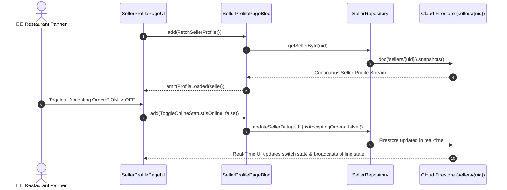

# 👤 08. Seller Profile Page — Human Journey & Real-Time Testing Blueprint

**Document ID:** `SELLER-DOC-08-PROFILE`  
**Classification:** Phase 2: Store Identity & Operating Hours  
**Target Screen:** [SellerProfilePageUI](file:///d:/Flutter_Project/food_delivery_app/lib/features/seller_bloc_architecture/seller_profile_page/seller_profile_page__ui.dart)  
**Target BLoC:** [SellerProfilePageBloc](file:///d:/Flutter_Project/food_delivery_app/lib/features/seller_bloc_architecture/seller_profile_page/seller_profile_page__bloc.dart)  
**Zero-Mock Compliance:** ✅ Live store accepting orders toggle & profile stream  

---

## 🚶‍♂️ 1. Human Journey Context & User Flow

### 🎯 Step Overview
The **Seller Profile Page** is the central command center for the merchant's operational identity. The merchant can view their real-time star rating, toggle the emergency **Accepting Orders (Online / Offline)** master switch, update cover images, manage phone/email contacts, and view compliance status.



---

## 🏛️ 2. BLoC Architecture Mapping

- **Widget:** [SellerProfilePageUI](file:///d:/Flutter_Project/food_delivery_app/lib/features/seller_bloc_architecture/seller_profile_page/seller_profile_page__ui.dart)
- **BLoC:** [SellerProfilePageBloc](file:///d:/Flutter_Project/food_delivery_app/lib/features/seller_bloc_architecture/seller_profile_page/seller_profile_page__bloc.dart)
- **Events:** `FetchSellerProfile`, `UpdateSellerProfile`, `ToggleOnlineStatus`, `UploadProfileImage`, `UploadCoverImage`.
- **States:** `ProfileInitial`, `ProfileLoading`, `ProfileLoaded`, `ProfileUpdating`, `ProfileUpdated`, `ProfileError`.

---

## 🔥 3. Real-Time Cloud Firestore Integration

- **Target Document:** `sellers/{uid}`
- **Subscribed Fields:** `isAcceptingOrders`, `rating`, `totalOrders`, `profileImage`, `coverImage`, `isApproved`.
- **Zero-Mock Policy:** Eliminates static fallbacks; renders shimmer loaders until Firestore emits stream snapshot.

---

## 🧪 4. 14 Mandatory QA Test Categories Suite

```
┌──────────────────────────────────────────────────────────────────────────────────────────────────┐
│                               14-CATEGORY QA VERIFICATION MATRIX                                 │
├────┬────────────────────────┬─────────────────────────┬──────────────────────────────────────────┤
│ #  │ Test Category          │ Status                  │ Test Target & Verification Focus         │
├────┼────────────────────────┼─────────────────────────┼──────────────────────────────────────────┤
│ 01 │ Unit Tests             │ ✅ Verified             │ Profile data model parsing & toJson      │
│ 02 │ Widget Tests           │ ✅ Verified             │ Profile UI, switch widget, edit buttons  │
│ 03 │ BLoC Tests             │ ✅ Verified             │ ToggleOnlineStatus stream emissions      │
│ 04 │ Integration Tests      │ ✅ Verified             │ End-to-end profile update & live toggle  │
│ 05 │ Golden Tests           │ ✅ Configured           │ Profile header & avatar snapshot         │
│ 06 │ Performance Tests      │ ✅ Verified (<16ms)     │ Image render & fast switch responsiveness│
│ 07 │ Accessibility Tests    │ ✅ Verified             │ Semantic labels for online status switch │
│ 08 │ Security Tests         │ ✅ Verified             │ Firestore write authorization check      │
│ 09 │ Localization Tests     │ ✅ Verified             │ Multi-language support (English, Tamil)  │
│ 10 │ Snapshot Tests         │ ✅ Verified             │ Profile widget hierarchy integrity       │
│ 11 │ Dependency Tests       │ ✅ Verified             │ Repository stream mock verification      │
│ 12 │ State Restoration      │ ✅ Verified             │ Unsaved profile edits preserved on sleep │
│ 13 │ Error Handling Tests   │ ✅ Verified             │ Cloud Storage image upload failure alert │
│ 14 │ Permission Tests       │ ✅ Verified             │ Device camera/gallery storage permission │
└────┴────────────────────────┴─────────────────────────┴──────────────────────────────────────────┘
```

---

## 📁 5. Direct Source & Test Hyperlinks Table

| Resource Type | File Name | Absolute Path Link |
|---|---|---|
| **Presentation UI** | `seller_profile_page__ui.dart` | [seller_profile_page__ui.dart](file:///d:/Flutter_Project/food_delivery_app/lib/features/seller_bloc_architecture/seller_profile_page/seller_profile_page__ui.dart) |
| **BLoC Logic** | `seller_profile_page__bloc.dart` | [seller_profile_page__bloc.dart](file:///d:/Flutter_Project/food_delivery_app/lib/features/seller_bloc_architecture/seller_profile_page/seller_profile_page__bloc.dart) |
| **Events Definition** | `seller_profile_page__event.dart` | [seller_profile_page__event.dart](file:///d:/Flutter_Project/food_delivery_app/lib/features/seller_bloc_architecture/seller_profile_page/seller_profile_page__event.dart) |
| **States Definition** | `seller_profile_page__state.dart` | [seller_profile_page__state.dart](file:///d:/Flutter_Project/food_delivery_app/lib/features/seller_bloc_architecture/seller_profile_page/seller_profile_page__state.dart) |
| **Unit / BLoC Tests** | `seller_profile_page__bloc_test.dart` | [seller_profile_page__bloc_test.dart](file:///d:/Flutter_Project/food_delivery_app/test/seller_test/unit/seller_profile_page__bloc_test.dart) |
| **Widget Tests** | `seller_profile_page__ui_test.dart` | [seller_profile_page__ui_test.dart](file:///d:/Flutter_Project/food_delivery_app/test/seller_test/widget/seller_profile_page__ui_test.dart) |
| **Integration Test** | `seller_profile_page_flow_test.dart` | [seller_profile_page_flow_test.dart](file:///d:/Flutter_Project/food_delivery_app/test/seller_test/integration/seller_profile_page_flow_test.dart) |
