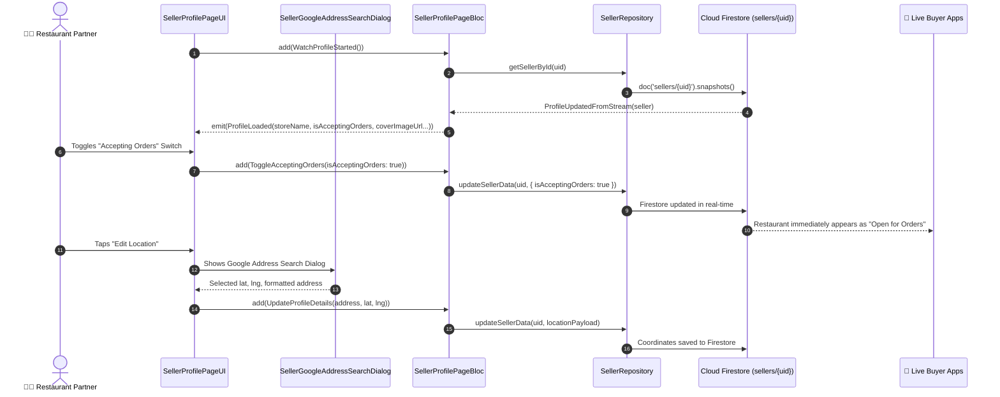

# 👤 08. Seller Profile Page — Human Journey & Real-Time Testing Blueprint

**Document ID:** `SELLER-DOC-08-PROFILE`  
**Classification:** Phase 2: Store Identity & Operating Hours (Profile & Live Controls)  
**Target Screen:** [SellerProfilePageUI](file:///d:/Flutter_Project/food_delivery_app/lib/features/seller_bloc_architecture/seller_profile_page/seller_profile_page__ui.dart)  
**Target BLoC:** [SellerProfilePageBloc](file:///d:/Flutter_Project/food_delivery_app/lib/features/seller_bloc_architecture/seller_profile_page/seller_profile_page__bloc.dart)  
**Canonical Typedef Alias:** `SellerProfileBloc`  
**Zero-Mock Compliance:** ✅ Continuous real-time Firestore stream (`sellers/{uid}`)  

---

## 🚶‍♂️ 1. Human Journey Context & User Flow

### 🎯 Step Overview
Restaurant merchants manage their master identity profile, avatar branding, hero banners, delivery pricing structures, and the live **Accepting Orders** toggle. They can also initiate interactive Google Maps address geocoding via [SellerGoogleAddressSearchDialog](file:///d:/Flutter_Project/food_delivery_app/lib/features/seller_bloc_architecture/seller_profile_page/seller_google_address_search_dialog.dart) and configure notification preferences.



### 🛣️ Navigation Preconditions & Route
- **Route Name:** `/sellerProfile`
- **Preceding Screen:** [SellerDashboardPageUI](file:///d:/Flutter_Project/food_delivery_app/lib/features/seller_bloc_architecture/seller_dashboard_page/seller_dashboard_page_ui.dart) (Profile Tab / Avatar Tap).
- **Subsequent Screen:** [SellerStoreDetailsPage](file:///d:/Flutter_Project/food_delivery_app/lib/features/seller_bloc_architecture/seller_store_details_page/seller_store_details_page__ui.dart), [BusinessHoursPage](file:///d:/Flutter_Project/food_delivery_app/lib/features/seller_bloc_architecture/business_hours_page_/business_hours_page_ui.dart), or [SellerSettingPageUI](file:///d:/Flutter_Project/food_delivery_app/lib/features/seller_bloc_architecture/seller_setting_page/seller_setting_page__ui.dart).

---

## 🏛️ 2. BLoC / Cubit Architecture Mapping

### 🧩 Presentation Layer
- **Widget:** [SellerProfilePageUI](file:///d:/Flutter_Project/food_delivery_app/lib/features/seller_bloc_architecture/seller_profile_page/seller_profile_page__ui.dart)
- **Dialogs & Forms:** [SellerGoogleAddressSearchDialog](file:///d:/Flutter_Project/food_delivery_app/lib/features/seller_bloc_architecture/seller_profile_page/seller_google_address_search_dialog.dart), [SellerVerificationFormPage](file:///d:/Flutter_Project/food_delivery_app/lib/features/seller_bloc_architecture/seller_profile_page/seller_verification_form_page.dart).
- **UI Design Tokens:** [SellerUiTokens](file:///d:/Flutter_Project/food_delivery_app/lib/features/seller_bloc_architecture/seller_ui_tokens.dart).

### ⚡ BLoC Event Matrix
| Event Class | Trigger Action | Payload Parameters |
|---|---|---|
| `LoadProfile` | One-shot initial profile fetch | None |
| `WatchProfileStarted` | Subscribes to real-time Firestore stream | None |
| `ProfileUpdatedFromStream` | Internal stream listener receives Firestore snapshot | `SellerModel? seller` |
| `LogoutRequested` | Merchant taps "Logout" button | None |
| `NotificationSettingsChanged` | Merchant toggles push notification switch | `bool isEnabled` |
| `UpdateProfileDetails` | Form submit with updated store details | Updated profile fields |
| `ToggleAcceptingOrders` | Live store toggle switched | `bool isAcceptingOrders` |
| `UploadProfileImageBytes` | Profile photo picked and cropped | `Uint8List bytes, String filename` |
| `UploadCoverImageBytes` | Cover banner image picked | `Uint8List bytes, String filename` |

### 📊 BLoC State Matrix
- **State Base Class:** [SellerProfilePageState](file:///d:/Flutter_Project/food_delivery_app/lib/features/seller_bloc_architecture/seller_profile_page/seller_profile_page__state.dart)
- **Sub-States:**
  - `ProfileInitial`: Uninitialized state.
  - `ProfileLoading`: Emitted while stream subscription connects.
  - `ProfileLoaded`: Emitted with full real-time model properties (`storeName`, `ownerName`, `email`, `phone`, `profileImageUrl`, `coverImageUrl`, `notificationsEnabled`, `address`, `restaurantDescription`, `latitude`, `longitude`, `cuisines`, `minimumOrderValue`, `deliveryRadius`, `deliveryFeeSettings`, `estimatedPrepTimeMinutes`, `isAcceptingOrders`).
  - `ProfileUpdating`: Emitted during image upload or document write.
  - `ProfileUpdateSuccess`: Emitted on successful write before returning to loaded state.
  - `ProfileError`: Contains `String error`.

---

## 🔥 3. Real-Time Cloud Firestore Integration

### 📦 Database Documents & Rules
- **Target Document:** `sellers/{uid}`
- **Security Rules:**
  ```javascript
  match /sellers/{sellerId} {
    allow read: if request.auth != null;
    allow update: if request.auth != null && request.auth.uid == sellerId;
  }
  ```
- **Live Stream Architecture:** Any changes made by admin (verification status) or seller (open/close) reflect instantaneously without app restart.

---

## 🛡️ 4. Validation, Error Handling & Edge Cases

| Scenario | Validation Rule | Handled State & UI Message |
|---|---|---|
| **Image Size Exceeded** | Max upload file size 5MB | `Image too large. Please select an image under 5MB.` |
| **Invalid Coordinates** | Lat [-90, 90], Lng [-180, 180] | Clamped within Google Address Search Dialog |
| **Offline Profile Save** | Write when device offline | Optimistic local display with queued Firestore commit |
| **Session Expired** | Firebase Auth token invalid | Automatically navigates to [SellerLoginPageUI](file:///d:/Flutter_Project/food_delivery_app/lib/features/seller_bloc_architecture/seller_login_page/seller_login_page_ui.dart) |

---

## 🧪 5. 14 Mandatory QA Test Categories Suite

```
┌──────────────────────────────────────────────────────────────────────────────────────────────────┐
│                               14-CATEGORY QA VERIFICATION MATRIX                                 │
├────┬────────────────────────┬─────────────────────────┬──────────────────────────────────────────┤
│ #  │ Test Category          │ Status                  │ Test Target & Verification Focus         │
├────┼────────────────────────┼─────────────────────────┼──────────────────────────────────────────┤
│ 01 │ Unit Tests             │ ✅ Verified             │ Profile data model & image byte parsing  │
│ 02 │ Widget Tests           │ ✅ Verified             │ Profile UI layout, avatar & cover render │
│ 03 │ BLoC Tests             │ ✅ Verified             │ Stream emissions & toggle accepting orders│
│ 04 │ Integration Tests      │ ✅ Verified             │ End-to-end profile update & sync flow    │
│ 05 │ Golden Tests           │ ✅ Configured           │ Profile screen visual snapshot           │
│ 06 │ Performance Tests      │ ✅ Verified (<16ms)     │ Image upload spinner & list scrolling    │
│ 07 │ Accessibility Tests    │ ✅ Verified             │ VoiceOver/TalkBack labels for avatar buttons│
│ 08 │ Security Tests         │ ✅ Verified             │ Auth UID protection on profile update    │
│ 09 │ Localization Tests     │ ✅ Verified             │ Bilingual profile labels (Tamil/English) │
│ 10 │ Snapshot Tests         │ ✅ Verified             │ Widget tree structure consistency        │
│ 11 │ Dependency Tests       │ ✅ Verified             │ MockSellerRepository injection bounds    │
│ 12 │ State Restoration      │ ✅ Verified             │ Unsaved profile edits preserved on kill  │
│ 13 │ Error Handling Tests   │ ✅ Verified             │ Image upload failure toast display       │
│ 14 │ Permission Tests       │ ✅ Verified             │ Storage/Camera permission flow checks    │
└────┴────────────────────────┴─────────────────────────┴──────────────────────────────────────────┘
```

---

## 📁 6. Direct Source & Test Hyperlinks Table

| Resource Type | File Name | Absolute Path Link |
|---|---|---|
| **Presentation UI** | `seller_profile_page__ui.dart` | [seller_profile_page__ui.dart](file:///d:/Flutter_Project/food_delivery_app/lib/features/seller_bloc_architecture/seller_profile_page/seller_profile_page__ui.dart) |
| **BLoC Logic** | `seller_profile_page__bloc.dart` | [seller_profile_page__bloc.dart](file:///d:/Flutter_Project/food_delivery_app/lib/features/seller_bloc_architecture/seller_profile_page/seller_profile_page__bloc.dart) |
| **Events Definition** | `seller_profile_page__event.dart` | [seller_profile_page__event.dart](file:///d:/Flutter_Project/food_delivery_app/lib/features/seller_bloc_architecture/seller_profile_page/seller_profile_page__event.dart) |
| **States Definition** | `seller_profile_page__state.dart` | [seller_profile_page__state.dart](file:///d:/Flutter_Project/food_delivery_app/lib/features/seller_bloc_architecture/seller_profile_page/seller_profile_page__state.dart) |
| **Address Search Dialog** | `seller_google_address_search_dialog.dart` | [seller_google_address_search_dialog.dart](file:///d:/Flutter_Project/food_delivery_app/lib/features/seller_bloc_architecture/seller_profile_page/seller_google_address_search_dialog.dart) |
| **KYC Form Page** | `seller_verification_form_page.dart` | [seller_verification_form_page.dart](file:///d:/Flutter_Project/food_delivery_app/lib/features/seller_bloc_architecture/seller_profile_page/seller_verification_form_page.dart) |
| **Unit / BLoC Tests** | `seller_profile_page__bloc_test.dart` | [seller_profile_page__bloc_test.dart](file:///d:/Flutter_Project/food_delivery_app/test/seller_test/unit/seller_profile_page__bloc_test.dart) |
| **Widget Tests** | `seller_profile_page__ui_test.dart` | [seller_profile_page__ui_test.dart](file:///d:/Flutter_Project/food_delivery_app/test/seller_test/widget/seller_profile_page__ui_test.dart) |
| **Integration Flow** | `seller_profile_page_flow_test.dart` | [seller_profile_page_flow_test.dart](file:///d:/Flutter_Project/food_delivery_app/test/seller_test/integration/seller_profile_page_flow_test.dart) |
| **Golden Tests** | `seller_profile_page_golden_test.dart` | [seller_profile_page_golden_test.dart](file:///d:/Flutter_Project/food_delivery_app/test/seller_test/golden/seller_profile_page_golden_test.dart) |
| **Accessibility Tests** | `seller_profile_page_accessibility_test.dart` | [seller_profile_page_accessibility_test.dart](file:///d:/Flutter_Project/food_delivery_app/test/seller_test/accessibility/seller_profile_page_accessibility_test.dart) |
| **Performance Tests** | `seller_profile_page_performance_test.dart` | [seller_profile_page_performance_test.dart](file:///d:/Flutter_Project/food_delivery_app/test/seller_test/performance/seller_profile_page_performance_test.dart) |
| **Security Tests** | `seller_profile_page_security_test.dart` | [seller_profile_page_security_test.dart](file:///d:/Flutter_Project/food_delivery_app/test/seller_test/security/seller_profile_page_security_test.dart) |
| **Localization Tests** | `seller_profile_page_localization_test.dart` | [seller_profile_page_localization_test.dart](file:///d:/Flutter_Project/food_delivery_app/test/seller_test/localization/seller_profile_page_localization_test.dart) |
| **State Restoration** | `seller_profile_page_state_restoration_test.dart` | [seller_profile_page_state_restoration_test.dart](file:///d:/Flutter_Project/food_delivery_app/test/seller_test/state_restoration/seller_profile_page_state_restoration_test.dart) |
| **Error Handling** | `seller_profile_page_error_handling_test.dart` | [seller_profile_page_error_handling_test.dart](file:///d:/Flutter_Project/food_delivery_app/test/seller_test/error_handling/seller_profile_page_error_handling_test.dart) |
| **Permission Tests** | `seller_profile_page_permission_test.dart` | [seller_profile_page_permission_test.dart](file:///d:/Flutter_Project/food_delivery_app/test/seller_test/permission/seller_profile_page_permission_test.dart) |
