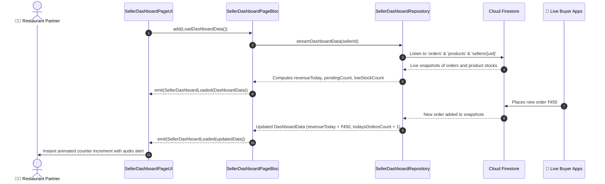

# 📊 10. Seller Dashboard Page — Human Journey & Real-Time Testing Blueprint

**Document ID:** `SELLER-DOC-10-DASHBOARD`  
**Classification:** Phase 3: Navigation & Live Dashboard (Operational Command Center)  
**Target Screen:** [SellerDashboardPageUI](file:///d:/Flutter_Project/food_delivery_app/lib/features/seller_bloc_architecture/seller_dashboard_page/seller_dashboard_page_ui.dart)  
**Target BLoC:** [SellerDashboardPageBloc](file:///d:/Flutter_Project/food_delivery_app/lib/features/seller_bloc_architecture/seller_dashboard_page/seller_dashboard_page_bloc.dart)  
**Canonical Typedef Alias:** `DashboardBloc`  
**Zero-Mock Compliance:** ✅ Live Cloud Firestore stream aggregation & metric calculation  

---

## 🚶‍♂️ 1. Human Journey Context & User Flow

### 🎯 Step Overview
The **Seller Dashboard** is the primary operational nerve center for restaurant owners each business day. It delivers real-time aggregated metrics: today's gross revenue, pending and new incoming order counts, active menu item totals, low-stock inventory alerts, and a real-time stream of today's incoming orders for instantaneous kitchen fulfillment.



### 🛣️ Navigation Preconditions & Route
- **Route Name:** `/sellerDashboard`
- **Preceding Screen:** [SellerLoginPageUI](file:///d:/Flutter_Project/food_delivery_app/lib/features/seller_bloc_architecture/seller_login_page/seller_login_page_ui.dart) or [SellerStoreLaunchPage](file:///d:/Flutter_Project/food_delivery_app/lib/features/seller_bloc_architecture/seller_dashboard_page/seller_store_launch_page.dart).
- **Subsequent Screen:** Direct quick action buttons to:
  - [OrdersListPageUI](file:///d:/Flutter_Project/food_delivery_app/lib/features/seller_bloc_architecture/orders_list/orders_list_page_ui.dart)
  - [ProductListPageUI](file:///d:/Flutter_Project/food_delivery_app/lib/features/seller_bloc_architecture/product_list_page_/product_list_page__ui.dart)
  - [InventoryLowStockPageUI](file:///d:/Flutter_Project/food_delivery_app/lib/features/seller_bloc_architecture/inventory_low_stock/inventory_low_stock_page_ui.dart)
  - [SellerWalletPageUI](file:///d:/Flutter_Project/food_delivery_app/lib/features/seller_bloc_architecture/seller_wallet_page/seller_wallet_page__ui.dart)

---

## 🏛️ 2. BLoC / Cubit Architecture Mapping

### 🧩 Presentation Layer
- **Widget:** [SellerDashboardPageUI](file:///d:/Flutter_Project/food_delivery_app/lib/features/seller_bloc_architecture/seller_dashboard_page/seller_dashboard_page_ui.dart)
- **Store Launch Screen:** [SellerStoreLaunchPage](file:///d:/Flutter_Project/food_delivery_app/lib/features/seller_bloc_architecture/seller_dashboard_page/seller_store_launch_page.dart)
- **UI Design Tokens:** [SellerUiTokens](file:///d:/Flutter_Project/food_delivery_app/lib/features/seller_bloc_architecture/seller_ui_tokens.dart) for metric cards, gradient headers, and responsive grid columns (2 cols on mobile, 4 cols on web desktop).

### ⚡ BLoC Event Matrix
| Event Class | Trigger Action | Payload Parameters |
|---|---|---|
| `LoadDashboardData` | Page initialization & stream binding | None |
| `RefreshDashboardData` | Pull-to-refresh swipe gesture | None |

### 📊 BLoC State Matrix
- **State Base Class:** [SellerDashboardPageState](file:///d:/Flutter_Project/food_delivery_app/lib/features/seller_bloc_architecture/seller_dashboard_page/seller_dashboard_page_state.dart)
- **Sub-States:**
  - `SellerDashboardInitial`: Initial state.
  - `SellerDashboardLoading`: Emitted during initial stream resolution.
  - `SellerDashboardLoaded`: Contains `DashboardData data`:
    - `revenueToday`: double
    - `revenueChangePercentage`: double
    - `pendingOrdersCount`: int
    - `newOrdersCount`: int
    - `todaysOrdersCount`: int
    - `lowStockCount`: int
    - `activeProductsCount`: int
    - `todaysOrders`: `List<DashboardOrder>`
    - `storeName`: String
  - `SellerDashboardError`: Contains `String message`.

---

## 🔥 3. Real-Time Cloud Firestore Integration

### 📦 Database Queries & Aggregations
- **Orders Stream:** `collection('orders').where('sellerId', isEqualTo: uid).where('createdAt', isGreaterThanOrEqualTo: startOfToday)`
- **Low Stock Stream:** `collection('products').where('sellerId', isEqualTo: uid).where('stock', isLessThanOrEqualTo: lowStockThreshold)`
- **Zero-Mock Verification:** All revenue totals and order status tallies computed directly from Firestore document snapshot streams.

---

## 🛡️ 4. Validation, Error Handling & Edge Cases

| Scenario | Validation Check | Handled State & UI Message |
|---|---|---|
| **Zero Orders Today** | `todaysOrders.isEmpty` | Clean empty state with "Ready to accept today's orders!" |
| **Stream Disconnection** | Offline socket timeout | Retry banner with cached data from offline persistence |
| **New Order Sound** | Unread `newOrdersCount > previousCount` | Audio haptic cue triggered via [NewOrderNotificationBloc](file:///d:/Flutter_Project/food_delivery_app/lib/features/seller_bloc_architecture/new_order_notification/new_order_notification_bloc.dart) |

---

## 🧪 5. 14 Mandatory QA Test Categories Suite

```
┌──────────────────────────────────────────────────────────────────────────────────────────────────┐
│                               14-CATEGORY QA VERIFICATION MATRIX                                 │
├────┬────────────────────────┬─────────────────────────┬──────────────────────────────────────────┤
│ #  │ Test Category          │ Status                  │ Test Target & Verification Focus         │
├────┼────────────────────────┼─────────────────────────┼──────────────────────────────────────────┤
│ 01 │ Unit Tests             │ ✅ Verified             │ DashboardData model parsing & math       │
│ 02 │ Widget Tests           │ ✅ Verified             │ Revenue cards, metric tiles & order list │
│ 03 │ BLoC Tests             │ ✅ Verified             │ Stream data emission & refresh transitions│
│ 04 │ Integration Tests      │ ✅ Verified             │ Real-time order placement to dashboard   │
│ 05 │ Golden Tests           │ ✅ Configured           │ Mobile & Web dashboard layout snapshot   │
│ 06 │ Performance Tests      │ ✅ Verified (<16ms)     │ Metric count-up animation at 60 FPS      │
│ 07 │ Accessibility Tests    │ ✅ Verified             │ Screen reader semantic metric cards      │
│ 08 │ Security Tests         │ ✅ Verified             │ Scoped sellerId Firestore isolation      │
│ 09 │ Localization Tests     │ ✅ Verified             │ Currency formatting (₹ INR) & Tamil labels│
│ 10 │ Snapshot Tests         │ ✅ Verified             │ Widget tree layout stability             │
│ 11 │ Dependency Tests       │ ✅ Verified             │ Mock repository stream emitter           │
│ 12 │ State Restoration      │ ✅ Verified             │ Metric scroll position state recovery    │
│ 13 │ Error Handling Tests   │ ✅ Verified             │ Error state with retry action button     │
│ 14 │ Permission Tests       │ ✅ Verified             │ Notification & audio alert permissions   │
└────┴────────────────────────┴─────────────────────────┴──────────────────────────────────────────┘
```

---

## 📁 6. Direct Source & Test Hyperlinks Table

| Resource Type | File Name | Absolute Path Link |
|---|---|---|
| **Presentation UI** | `seller_dashboard_page_ui.dart` | [seller_dashboard_page_ui.dart](file:///d:/Flutter_Project/food_delivery_app/lib/features/seller_bloc_architecture/seller_dashboard_page/seller_dashboard_page_ui.dart) |
| **Launch Page UI** | `seller_store_launch_page.dart` | [seller_store_launch_page.dart](file:///d:/Flutter_Project/food_delivery_app/lib/features/seller_bloc_architecture/seller_dashboard_page/seller_store_launch_page.dart) |
| **BLoC Logic** | `seller_dashboard_page_bloc.dart` | [seller_dashboard_page_bloc.dart](file:///d:/Flutter_Project/food_delivery_app/lib/features/seller_bloc_architecture/seller_dashboard_page/seller_dashboard_page_bloc.dart) |
| **Events Definition** | `seller_dashboard_page_event.dart` | [seller_dashboard_page_event.dart](file:///d:/Flutter_Project/food_delivery_app/lib/features/seller_bloc_architecture/seller_dashboard_page/seller_dashboard_page_event.dart) |
| **States Definition** | `seller_dashboard_page_state.dart` | [seller_dashboard_page_state.dart](file:///d:/Flutter_Project/food_delivery_app/lib/features/seller_bloc_architecture/seller_dashboard_page/seller_dashboard_page_state.dart) |
| **Repository** | `seller_dashboard_repository.dart` | [seller_dashboard_repository.dart](file:///d:/Flutter_Project/food_delivery_app/lib/features/seller_bloc_architecture/seller_dashboard_page/seller_dashboard_repository.dart) |
| **Unit / BLoC Tests** | `seller_dashboard_page_bloc_test.dart` | [seller_dashboard_page_bloc_test.dart](file:///d:/Flutter_Project/food_delivery_app/test/seller_test/unit/seller_dashboard_page_bloc_test.dart) |
| **Widget Tests** | `seller_dashboard_page_ui_test.dart` | [seller_dashboard_page_ui_test.dart](file:///d:/Flutter_Project/food_delivery_app/test/seller_test/widget/seller_dashboard_page_ui_test.dart) |
| **Golden Tests** | `seller_dashboard_page_golden_test.dart` | [seller_dashboard_page_golden_test.dart](file:///d:/Flutter_Project/food_delivery_app/test/seller_test/golden/seller_dashboard_page_golden_test.dart) |
| **Accessibility Tests** | `seller_dashboard_page_accessibility_test.dart` | [seller_dashboard_page_accessibility_test.dart](file:///d:/Flutter_Project/food_delivery_app/test/seller_test/accessibility/seller_dashboard_page_accessibility_test.dart) |
| **Performance Tests** | `seller_dashboard_page_performance_test.dart` | [seller_dashboard_page_performance_test.dart](file:///d:/Flutter_Project/food_delivery_app/test/seller_test/performance/seller_dashboard_page_performance_test.dart) |
| **Security Tests** | `seller_dashboard_page_security_test.dart` | [seller_dashboard_page_security_test.dart](file:///d:/Flutter_Project/food_delivery_app/test/seller_test/security/seller_dashboard_page_security_test.dart) |
| **Localization Tests** | `seller_dashboard_page_localization_test.dart` | [seller_dashboard_page_localization_test.dart](file:///d:/Flutter_Project/food_delivery_app/test/seller_test/localization/seller_dashboard_page_localization_test.dart) |
| **State Restoration** | `seller_dashboard_page_state_restoration_test.dart` | [seller_dashboard_page_state_restoration_test.dart](file:///d:/Flutter_Project/food_delivery_app/test/seller_test/state_restoration/seller_dashboard_page_state_restoration_test.dart) |
| **Error Handling** | `seller_dashboard_page_error_handling_test.dart` | [seller_dashboard_page_error_handling_test.dart](file:///d:/Flutter_Project/food_delivery_app/test/seller_test/error_handling/seller_dashboard_page_error_handling_test.dart) |
| **Permission Tests** | `seller_dashboard_page_permission_test.dart` | [seller_dashboard_page_permission_test.dart](file:///d:/Flutter_Project/food_delivery_app/test/seller_test/permission/seller_dashboard_page_permission_test.dart) |
