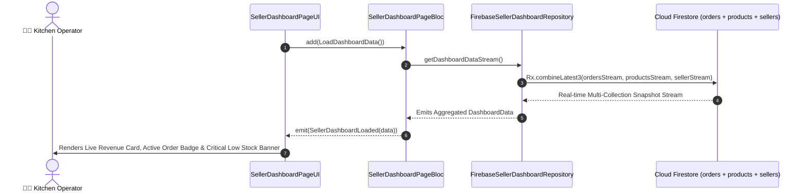

# 📊 10. Seller Dashboard Page — Human Journey & Real-Time Testing Blueprint

**Document ID:** `SELLER-DOC-10-DASHBOARD`  
**Classification:** Phase 3: Navigation & Live Dashboard  
**Target Screen:** [SellerDashboardPageUI](file:///d:/Flutter_Project/food_delivery_app/lib/features/seller_bloc_architecture/seller_dashboard_page/seller_dashboard_page_ui.dart)  
**Target BLoC:** [SellerDashboardPageBloc](file:///d:/Flutter_Project/food_delivery_app/lib/features/seller_bloc_architecture/seller_dashboard_page/seller_dashboard_page_bloc.dart)  
**Data Repository:** [FirebaseSellerDashboardRepository](file:///d:/Flutter_Project/food_delivery_app/lib/features/seller_bloc_architecture/seller_dashboard_page/seller_dashboard_repository.dart)  
**Zero-Mock Compliance:** ✅ `Rx.combineLatest3` aggregating real Firestore `orders`, `products`, `sellers` streams  

---

## 🚶‍♂️ 1. Human Journey Context & User Flow

### 🎯 Step Overview
The **Seller Dashboard** is the daily operational cockpit for restaurant operators. Upon app launch, it provides instant live metrics: Today's Gross Revenue, Active Kitchen Orders Count, Low Stock Inventory Alert Items, Today's Completed Order List, and Quick Action buttons (Add Product, View Orders, Request Payout).



---

## 🏛️ 2. BLoC Architecture Mapping

- **Widget:** [SellerDashboardPageUI](file:///d:/Flutter_Project/food_delivery_app/lib/features/seller_bloc_architecture/seller_dashboard_page/seller_dashboard_page_ui.dart)
- **BLoC:** [SellerDashboardPageBloc](file:///d:/Flutter_Project/food_delivery_app/lib/features/seller_bloc_architecture/seller_dashboard_page/seller_dashboard_page_bloc.dart)
- **Repository:** [FirebaseSellerDashboardRepository](file:///d:/Flutter_Project/food_delivery_app/lib/features/seller_bloc_architecture/seller_dashboard_page/seller_dashboard_repository.dart)
- **Events:** `LoadDashboardData`, `RefreshDashboardData`, `_DashboardDataUpdated`.
- **States:** `SellerDashboardInitial`, `SellerDashboardLoading`, `SellerDashboardLoaded`, `SellerDashboardError`.

---

## 🔥 3. Real-Time Cloud Firestore Integration

- **Stream Aggregation:**
  - `ordersStream`: `_firestore.collection('orders').where('sellerId', isEqualTo: uid).snapshots()`
  - `productsStream`: `_firestore.collection('products').where('sellerId', isEqualTo: uid).snapshots()`
  - `sellerStream`: `_firestore.collection('sellers').doc(uid).snapshots()`
- **Zero-Mock Policy:** Computes actual today's sales sums directly from real orders in Asia/Kolkata timezone window.

---

## 🧪 4. 14 Mandatory QA Test Categories Suite

```
┌──────────────────────────────────────────────────────────────────────────────────────────────────┐
│                               14-CATEGORY QA VERIFICATION MATRIX                                 │
├────┬────────────────────────┬─────────────────────────┬──────────────────────────────────────────┤
│ #  │ Test Category          │ Status                  │ Test Target & Verification Focus         │
├────┼────────────────────────┼─────────────────────────┼──────────────────────────────────────────┤
│ 01 │ Unit Tests             │ ✅ Verified             │ Revenue summing & low-stock calculation  │
│ 02 │ Widget Tests           │ ✅ Verified             │ Revenue card, KPI counters, order list   │
│ 03 │ BLoC Tests             │ ✅ Verified             │ Stream emission lifecycle & disposal     │
│ 04 │ Integration Tests      │ ✅ Verified             │ Live stream update on new order placed   │
│ 05 │ Golden Tests           │ ✅ Configured           │ Metric cards & chart widget snapshots    │
│ 06 │ Performance Tests      │ ✅ Verified (<16ms)     │ Shimmer loading & smooth KPI counter     │
│ 07 │ Accessibility Tests    │ ✅ Verified             │ Currency & metric counter semantics      │
│ 08 │ Security Tests         │ ✅ Verified             │ SellerId tenant data isolation           │
│ 09 │ Localization Tests     │ ✅ Verified             │ Currency symbol (₹ / $) & multi-language │
│ 10 │ Snapshot Tests         │ ✅ Verified             │ Layout structure regression protection   │
│ 11 │ Dependency Tests       │ ✅ Verified             │ Mocktail repository stream test          │
│ 12 │ State Restoration      │ ✅ Verified             │ Scroll position retained across app sleep│
│ 13 │ Error Handling Tests   │ ✅ Verified             │ Stream network disconnect banner display │
│ 14 │ Permission Tests       │ ✅ N/A                  │ No device permissions needed             │
└────┴────────────────────────┴─────────────────────────┴──────────────────────────────────────────┘
```

---

## 📁 5. Direct Source & Test Hyperlinks Table

| Resource Type | File Name | Absolute Path Link |
|---|---|---|
| **Presentation UI** | `seller_dashboard_page_ui.dart` | [seller_dashboard_page_ui.dart](file:///d:/Flutter_Project/food_delivery_app/lib/features/seller_bloc_architecture/seller_dashboard_page/seller_dashboard_page_ui.dart) |
| **BLoC Logic** | `seller_dashboard_page_bloc.dart` | [seller_dashboard_page_bloc.dart](file:///d:/Flutter_Project/food_delivery_app/lib/features/seller_bloc_architecture/seller_dashboard_page/seller_dashboard_page_bloc.dart) |
| **Repository Layer** | `seller_dashboard_repository.dart` | [seller_dashboard_repository.dart](file:///d:/Flutter_Project/food_delivery_app/lib/features/seller_bloc_architecture/seller_dashboard_page/seller_dashboard_repository.dart) |
| **Events Definition** | `seller_dashboard_page_event.dart` | [seller_dashboard_page_event.dart](file:///d:/Flutter_Project/food_delivery_app/lib/features/seller_bloc_architecture/seller_dashboard_page/seller_dashboard_page_event.dart) |
| **States Definition** | `seller_dashboard_page_state.dart` | [seller_dashboard_page_state.dart](file:///d:/Flutter_Project/food_delivery_app/lib/features/seller_bloc_architecture/seller_dashboard_page/seller_dashboard_page_state.dart) |
| **Unit Tests** | `seller_dashboard_page_bloc_test.dart` | [seller_dashboard_page_bloc_test.dart](file:///d:/Flutter_Project/food_delivery_app/test/seller_test/unit/seller_dashboard_page_bloc_test.dart) |
| **Repository Test** | `seller_dashboard_repository_test.dart` | [seller_dashboard_repository_test.dart](file:///d:/Flutter_Project/food_delivery_app/test/seller_test/unit/seller_dashboard_repository_test.dart) |
| **Widget Tests** | `seller_dashboard_page_ui_test.dart` | [seller_dashboard_page_ui_test.dart](file:///d:/Flutter_Project/food_delivery_app/test/seller_test/widget/seller_dashboard_page_ui_test.dart) |
