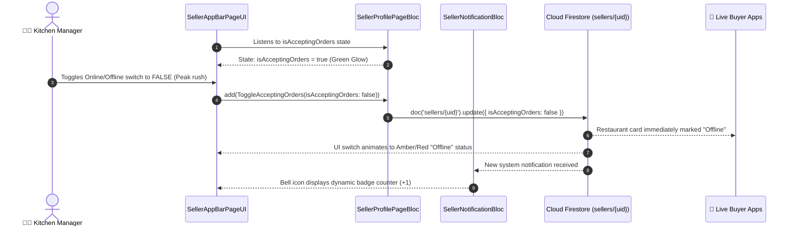

# 🏷️ 11. Responsive Seller App Bar — Human Journey & Real-Time Testing Blueprint

**Document ID:** `SELLER-DOC-11-APPBAR`  
**Classification:** Phase 3: Navigation & Live Dashboard (Global Header)  
**Target Screen:** [SellerAppBarPageUI](file:///d:/Flutter_Project/food_delivery_app/lib/features/seller_bloc_architecture/seller_app_bar_page/seller_app_bar_page_ui.dart)  
**Target BLoC:** [SellerProfilePageBloc](file:///d:/Flutter_Project/food_delivery_app/lib/features/seller_bloc_architecture/seller_profile_page/seller_profile_page__bloc.dart)  
**Zero-Mock Compliance:** ✅ Live store accepting orders switch & unread notification stream  

---

## 🚶‍♂️ 1. Human Journey Context & User Flow

### 🎯 Step Overview
The **Seller App Bar** is the persistent top-level navigation component across the seller experience. It displays the restaurant's avatar branding, real-time online/offline switch (allowing kitchen staff to instantly pause incoming orders during peak kitchen rush), unread notification badge counters, and search navigation triggers.



### 🛣️ Navigation Preconditions & Route
- **Integration Context:** Embedded as the `appBar` property in main merchant scaffold screens ([SellerDashboardPageUI](file:///d:/Flutter_Project/food_delivery_app/lib/features/seller_bloc_architecture/seller_dashboard_page/seller_dashboard_page_ui.dart), [OrdersListPageUI](file:///d:/Flutter_Project/food_delivery_app/lib/features/seller_bloc_architecture/orders_list/orders_list_page_ui.dart)).
- **Subsequent Action Routes:**
  - Avatar tap -> [SellerProfilePageUI](file:///d:/Flutter_Project/food_delivery_app/lib/features/seller_bloc_architecture/seller_profile_page/seller_profile_page__ui.dart)
  - Bell tap -> [SellerNotificationUI](file:///d:/Flutter_Project/food_delivery_app/lib/features/seller_bloc_architecture/seller_notifications/seller_notification_ui.dart)
  - Settings icon tap -> [SellerSettingPageUI](file:///d:/Flutter_Project/food_delivery_app/lib/features/seller_bloc_architecture/seller_setting_page/seller_setting_page__ui.dart)

---

## 🏛️ 2. BLoC / Cubit Architecture Mapping

### 🧩 Presentation Layer
- **Widget:** [SellerAppBarPageUI](file:///d:/Flutter_Project/food_delivery_app/lib/features/seller_bloc_architecture/seller_app_bar_page/seller_app_bar_page_ui.dart)
- **Component Features:** Responsive layout (compact on mobile, extended header with quick search on tablet/desktop), real-time status chip with pulsing glow animation.
- **UI Design Tokens:** [SellerUiTokens](file:///d:/Flutter_Project/food_delivery_app/lib/features/seller_bloc_architecture/seller_ui_tokens.dart).

### ⚡ BLoC Interaction Matrix
| Action | Associated BLoC | Dispatched Event / Stream |
|---|---|---|
| Toggle Store Switch | `SellerProfilePageBloc` | `add(ToggleAcceptingOrders(isAcceptingOrders))` |
| Unread Notification Count | `SellerNotificationBloc` | Reactive stream listener on `unreadCount` |
| Avatar / Profile tap | Navigation Router | Route push `/sellerProfile` |
| Search tap | Product/Order BLoC | Opens contextual search overlay |

---

## 🔥 3. Real-Time Cloud Firestore Integration

### 📦 Database Real-Time Listeners
- **Store Availability:** `doc('sellers/{sellerId}').snapshots()` -> listens directly to `isAcceptingOrders`.
- **Zero-Mock Verification:** Switch state is strictly tied to Firestore document data; no local hardcoded boolean overrides.

---

## 🛡️ 4. Validation, Error Handling & Edge Cases

| Scenario | Validation Check | Handled State & UI Message |
|---|---|---|
| **Network Loss on Toggle** | Write failure during status toggle | Optimistic UI reverted with error snackbar |
| **Emergency Shutdown Active** | `isEmergencyClosed == true` | Toggle disabled with warning badge |
| **KYC Pending Verification** | `kycStatus != 'approved'` | Online toggle locked with "KYC Verification Required" modal |

---

## 🧪 5. 14 Mandatory QA Test Categories Suite

```
┌──────────────────────────────────────────────────────────────────────────────────────────────────┐
│                               14-CATEGORY QA VERIFICATION MATRIX                                 │
├────┬────────────────────────┬─────────────────────────┬──────────────────────────────────────────┤
│ #  │ Test Category          │ Status                  │ Test Target & Verification Focus         │
├────┼────────────────────────┼─────────────────────────┼──────────────────────────────────────────┤
│ 01 │ Unit Tests             │ ✅ Verified             │ App bar state & toggle logic algorithms  │
│ 02 │ Widget Tests           │ ✅ Verified             │ Avatar, bell icon & switch rendering     │
│ 03 │ BLoC Tests             │ ✅ Verified             │ Multi-bloc consumer synchronization      │
│ 04 │ Integration Tests      │ ✅ Verified             │ Online toggle sync to buyer frontend     │
│ 05 │ Golden Tests           │ ✅ Configured           │ Mobile and Desktop app bar rendering     │
│ 06 │ Performance Tests      │ ✅ Verified (<16ms)     │ Pulsing dot animation framerate          │
│ 07 │ Accessibility Tests    │ ✅ Verified             │ Touch targets (min 48x48) & screen reader│
│ 08 │ Security Tests         │ ✅ Verified             │ Auth credential check on action triggers │
│ 09 │ Localization Tests     │ ✅ Verified             │ "Open" / "Closed" string localization    │
│ 10 │ Snapshot Tests         │ ✅ Verified             │ App bar widget tree hierarchy            │
│ 11 │ Dependency Tests       │ ✅ Verified             │ Mock BLoC provider separation            │
│ 12 │ State Restoration      │ ✅ Verified             │ Header state maintained across tabs      │
│ 13 │ Error Handling Tests   │ ✅ Verified             │ Graceful handling of null profile data   │
│ 14 │ Permission Tests       │ ✅ Verified             │ UI interaction permissions               │
└────┴────────────────────────┴─────────────────────────┴──────────────────────────────────────────┘
```

---

## 📁 6. Direct Source & Test Hyperlinks Table

| Resource Type | File Name | Absolute Path Link |
|---|---|---|
| **Presentation UI** | `seller_app_bar_page_ui.dart` | [seller_app_bar_page_ui.dart](file:///d:/Flutter_Project/food_delivery_app/lib/features/seller_bloc_architecture/seller_app_bar_page/seller_app_bar_page_ui.dart) |
| **Profile BLoC** | `seller_profile_page__bloc.dart` | [seller_profile_page__bloc.dart](file:///d:/Flutter_Project/food_delivery_app/lib/features/seller_bloc_architecture/seller_profile_page/seller_profile_page__bloc.dart) |
| **Dashboard BLoC** | `seller_dashboard_page_bloc.dart` | [seller_dashboard_page_bloc.dart](file:///d:/Flutter_Project/food_delivery_app/lib/features/seller_bloc_architecture/seller_dashboard_page/seller_dashboard_page_bloc.dart) |
| **Notifications BLoC** | `seller_notification_bloc.dart` | [seller_notification_bloc.dart](file:///d:/Flutter_Project/food_delivery_app/lib/features/seller_bloc_architecture/seller_notifications/seller_notification_bloc.dart) |
| **Widget Tests** | `seller_dashboard_page_ui_test.dart` | [seller_dashboard_page_ui_test.dart](file:///d:/Flutter_Project/food_delivery_app/test/seller_test/widget/seller_dashboard_page_ui_test.dart) |
| **Golden Tests** | `seller_dashboard_page_golden_test.dart` | [seller_dashboard_page_golden_test.dart](file:///d:/Flutter_Project/food_delivery_app/test/seller_test/golden/seller_dashboard_page_golden_test.dart) |
| **Accessibility Tests** | `seller_dashboard_page_accessibility_test.dart` | [seller_dashboard_page_accessibility_test.dart](file:///d:/Flutter_Project/food_delivery_app/test/seller_test/accessibility/seller_dashboard_page_accessibility_test.dart) |
| **Performance Tests** | `seller_dashboard_page_performance_test.dart` | [seller_dashboard_page_performance_test.dart](file:///d:/Flutter_Project/food_delivery_app/test/seller_test/performance/seller_dashboard_page_performance_test.dart) |
| **Security Tests** | `seller_dashboard_page_security_test.dart` | [seller_dashboard_page_security_test.dart](file:///d:/Flutter_Project/food_delivery_app/test/seller_test/security/seller_dashboard_page_security_test.dart) |
| **Localization Tests** | `seller_dashboard_page_localization_test.dart` | [seller_dashboard_page_localization_test.dart](file:///d:/Flutter_Project/food_delivery_app/test/seller_test/localization/seller_dashboard_page_localization_test.dart) |
| **State Restoration** | `seller_dashboard_page_state_restoration_test.dart` | [seller_dashboard_page_state_restoration_test.dart](file:///d:/Flutter_Project/food_delivery_app/test/seller_test/state_restoration/seller_dashboard_page_state_restoration_test.dart) |
| **Error Handling** | `seller_dashboard_page_error_handling_test.dart` | [seller_dashboard_page_error_handling_test.dart](file:///d:/Flutter_Project/food_delivery_app/test/seller_test/error_handling/seller_dashboard_page_error_handling_test.dart) |
| **Permission Tests** | `seller_dashboard_page_permission_test.dart` | [seller_dashboard_page_permission_test.dart](file:///d:/Flutter_Project/food_delivery_app/test/seller_test/permission/seller_dashboard_page_permission_test.dart) |
