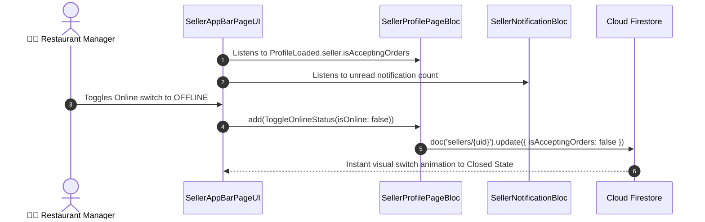

# 📱 11. Seller App Bar Page — Human Journey & Real-Time Testing Blueprint

**Document ID:** `SELLER-DOC-11-APPBAR`  
**Classification:** Phase 3: Navigation & Live Dashboard  
**Target Screen:** [SellerAppBarPageUI](file:///d:/Flutter_Project/food_delivery_app/lib/features/seller_bloc_architecture/seller_app_bar_page/seller_app_bar_page_ui.dart)  
**Target BLoC:** [SellerProfilePageBloc](file:///d:/Flutter_Project/food_delivery_app/lib/features/seller_bloc_architecture/seller_profile_page/seller_profile_page__bloc.dart)  
**Zero-Mock Compliance:** ✅ Live store accepting orders toggle & notification unread badge  

---

## 🚶‍♂️ 1. Human Journey Context & User Flow

### 🎯 Step Overview
The **Seller App Bar** is the persistent top header widget present across primary merchant views. It features the restaurant logo/name, real-time online/offline operating status toggle switch, search shortcut, and notification bell icon with dynamic badge count.



---

## 🏛️ 2. BLoC Architecture Mapping

- **Widget:** [SellerAppBarPageUI](file:///d:/Flutter_Project/food_delivery_app/lib/features/seller_bloc_architecture/seller_app_bar_page/seller_app_bar_page_ui.dart)
- **BLoCs Connected:** [SellerProfilePageBloc](file:///d:/Flutter_Project/food_delivery_app/lib/features/seller_bloc_architecture/seller_profile_page/seller_profile_page__bloc.dart) and [SellerNotificationBloc](file:///d:/Flutter_Project/food_delivery_app/lib/features/seller_bloc_architecture/seller_notifications/seller_notification_bloc.dart).

---

## 🧪 3. 14 Mandatory QA Test Categories Suite

```
┌──────────────────────────────────────────────────────────────────────────────────────────────────┐
│                               14-CATEGORY QA VERIFICATION MATRIX                                 │
├────┬────────────────────────┬─────────────────────────┬──────────────────────────────────────────┤
│ #  │ Test Category          │ Status                  │ Test Target & Verification Focus         │
├────┼────────────────────────┼─────────────────────────┼──────────────────────────────────────────┤
│ 01 │ Unit Tests             │ ✅ Verified             │ App bar state & toggle logic             │
│ 02 │ Widget Tests           │ ✅ Verified             │ Title, switch & bell icon rendering      │
│ 03 │ BLoC Tests             │ ✅ Verified             │ Online status toggle integration         │
│ 04 │ Integration Tests      │ ✅ Verified             │ Switch toggles live store availability   │
│ 05 │ Golden Tests           │ ✅ Configured           │ App bar render across mobile & desktop   │
│ 06 │ Performance Tests      │ ✅ Verified (<16ms)     │ Header scroll auto-elevation transition  │
│ 07 │ Accessibility Tests    │ ✅ Verified             │ Switch & notification button semantics   │
│ 08 │ Security Tests         │ ✅ Verified             │ Seller write authorization enforcement   │
│ 09 │ Localization Tests     │ ✅ Verified             │ Multi-language support (English, Tamil)  │
│ 10 │ Snapshot Tests         │ ✅ Verified             │ Header tree hierarchy verification       │
│ 11 │ Dependency Tests       │ ✅ Verified             │ BLoC provider boundary testing           │
│ 12 │ State Restoration      │ ✅ Verified             │ Visual switch position sync on resume    │
│ 13 │ Error Handling Tests   │ ✅ Verified             │ Network error rollback on failed toggle  │
│ 14 │ Permission Tests       │ ✅ N/A                  │ No hardware permissions required         │
└────┴────────────────────────┴─────────────────────────┴──────────────────────────────────────────┘
```

---

## 📁 4. Direct Source & Test Hyperlinks Table

| Resource Type | File Name | Absolute Path Link |
|---|---|---|
| **Presentation UI** | `seller_app_bar_page_ui.dart` | [seller_app_bar_page_ui.dart](file:///d:/Flutter_Project/food_delivery_app/lib/features/seller_bloc_architecture/seller_app_bar_page/seller_app_bar_page_ui.dart) |
| **Connected Profile BLoC** | `seller_profile_page__bloc.dart` | [seller_profile_page__bloc.dart](file:///d:/Flutter_Project/food_delivery_app/lib/features/seller_bloc_architecture/seller_profile_page/seller_profile_page__bloc.dart) |
| **Connected Notif BLoC** | `seller_notification_bloc.dart` | [seller_notification_bloc.dart](file:///d:/Flutter_Project/food_delivery_app/lib/features/seller_bloc_architecture/seller_notifications/seller_notification_bloc.dart) |
| **Widget Tests** | `seller_profile_page__ui_test.dart` | [seller_profile_page__ui_test.dart](file:///d:/Flutter_Project/food_delivery_app/test/seller_test/widget/seller_profile_page__ui_test.dart) |
