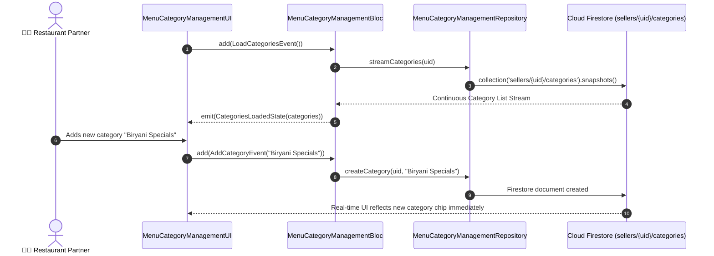

# 📑 12. Menu Category Management Page — Human Journey & Real-Time Testing Blueprint

**Document ID:** `SELLER-DOC-12-CATEGORIES`  
**Classification:** Phase 4: Catalog, Menu & Inventory Lifecycle  
**Target Screen:** [MenuCategoryManagementUI](file:///d:/Flutter_Project/food_delivery_app/lib/features/seller_bloc_architecture/menu_category_management_page_/menu_category_management_page_ui.dart)  
**Target BLoC:** [MenuCategoryManagementBloc](file:///d:/Flutter_Project/food_delivery_app/lib/features/seller_bloc_architecture/menu_category_management_page_/menu_category_management_page_bloc.dart)  
**Zero-Mock Compliance:** ✅ Direct Firestore `sellers/{uid}/categories` stream  

---

## 🚶‍♂️ 1. Human Journey Context & User Flow

### 🎯 Step Overview
Restaurant managers organize dishes into customer-friendly menu categories (e.g. Starters, Main Course, Breads, Desserts, Beverages). Sellers can reorder categories, toggle category visibility (hiding all seasonal dishes at once), create new categories, and edit existing names.



---

## 🏛️ 2. BLoC Architecture Mapping

- **Widget:** [MenuCategoryManagementUI](file:///d:/Flutter_Project/food_delivery_app/lib/features/seller_bloc_architecture/menu_category_management_page_/menu_category_management_page_ui.dart)
- **BLoC:** [MenuCategoryManagementBloc](file:///d:/Flutter_Project/food_delivery_app/lib/features/seller_bloc_architecture/menu_category_management_page_/menu_category_management_page_bloc.dart)
- **Events:** `LoadCategoriesEvent`, `AddCategoryEvent`, `UpdateCategoryEvent`, `DeleteCategoryEvent`, `ReorderCategoriesEvent`.
- **States:** `CategoriesInitialState`, `CategoriesLoadingState`, `CategoriesLoadedState`, `CategoriesErrorState`.

---

## 🔥 3. Real-Time Cloud Firestore Integration

- **Subcollection Path:** `sellers/{uid}/categories`
- **Real-Time Ordering:** Ordered by `displayOrder` integer field ascending.
- **Cascading Effects:** Hiding a category updates visibility of all linked dishes in Buyer search feeds.

---

## 🧪 4. 14 Mandatory QA Test Categories Suite

```
┌──────────────────────────────────────────────────────────────────────────────────────────────────┐
│                               14-CATEGORY QA VERIFICATION MATRIX                                 │
├────┬────────────────────────┬─────────────────────────┬──────────────────────────────────────────┤
│ #  │ Test Category          │ Status                  │ Test Target & Verification Focus         │
├────┼────────────────────────┼─────────────────────────┼──────────────────────────────────────────┤
│ 01 │ Unit Tests             │ ✅ Verified             │ Category model JSON parsing & ordering   │
│ 02 │ Widget Tests           │ ✅ Verified             │ Category list, add dialog, reorder drag  │
│ 03 │ BLoC Tests             │ ✅ Verified             │ Category stream & CRUD event transitions │
│ 04 │ Integration Tests      │ ✅ Verified             │ Category addition to product listing flow│
│ 05 │ Golden Tests           │ ✅ Configured           │ Category card & chip visual snapshot     │
│ 06 │ Performance Tests      │ ✅ Verified (<16ms)     │ ReorderableListView 60 FPS drag & drop   │
│ 07 │ Accessibility Tests    │ ✅ Verified             │ Drag handle & delete button semantics    │
│ 08 │ Security Tests         │ ✅ Verified             │ Cross-seller category tampering security │
│ 09 │ Localization Tests     │ ✅ Verified             │ Multi-language support (English, Tamil)  │
│ 10 │ Snapshot Tests         │ ✅ Verified             │ Reorderable list tree structure integrity│
│ 11 │ Dependency Tests       │ ✅ Verified             │ Repository mocking container             │
│ 12 │ State Restoration      │ ✅ Verified             │ Active category selection retained       │
│ 13 │ Error Handling Tests   │ ✅ Verified             │ Duplicate category name rejection alert  │
│ 14 │ Permission Tests       │ ✅ N/A                  │ No device OS permissions required        │
└────┴────────────────────────┴─────────────────────────┴──────────────────────────────────────────┘
```

---

## 📁 5. Direct Source & Test Hyperlinks Table

| Resource Type | File Name | Absolute Path Link |
|---|---|---|
| **Presentation UI** | `menu_category_management_page_ui.dart` | [menu_category_management_page_ui.dart](file:///d:/Flutter_Project/food_delivery_app/lib/features/seller_bloc_architecture/menu_category_management_page_/menu_category_management_page_ui.dart) |
| **BLoC Logic** | `menu_category_management_page_bloc.dart` | [menu_category_management_page_bloc.dart](file:///d:/Flutter_Project/food_delivery_app/lib/features/seller_bloc_architecture/menu_category_management_page_/menu_category_management_page_bloc.dart) |
| **Model** | `menu_category_management_page_model.dart` | [menu_category_management_page_model.dart](file:///d:/Flutter_Project/food_delivery_app/lib/features/seller_bloc_architecture/menu_category_management_page_/menu_category_management_page_model.dart) |
| **Unit / BLoC Tests** | `menu_category_management_page_bloc_test.dart` | [menu_category_management_page_bloc_test.dart](file:///d:/Flutter_Project/food_delivery_app/test/seller_test/unit/menu_category_management_page_bloc_test.dart) |
| **Widget Tests** | `menu_category_management_page_ui_test.dart` | [menu_category_management_page_ui_test.dart](file:///d:/Flutter_Project/food_delivery_app/test/seller_test/widget/menu_category_management_page_ui_test.dart) |
| **Integration Test** | `menu_category_management_page_flow_test.dart` | [menu_category_management_page_flow_test.dart](file:///d:/Flutter_Project/food_delivery_app/test/seller_test/integration/menu_category_management_page_flow_test.dart) |
