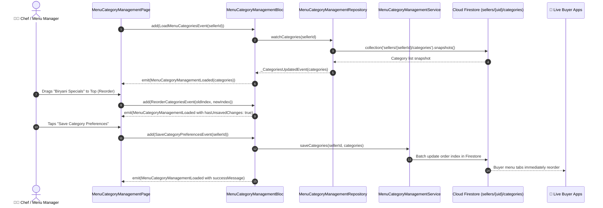

# 📑 12. Menu Category Management Page — Human Journey & Real-Time Testing Blueprint

**Document ID:** `SELLER-DOC-12-CATEGORIES`  
**Classification:** Phase 4: Catalog, Menu & Inventory Lifecycle (Category Hierarchy)  
**Target Screen:** [MenuCategoryManagementPage](file:///d:/Flutter_Project/food_delivery_app/lib/features/seller_bloc_architecture/menu_category_management_page_/menu_category_management_page_ui.dart)  
**Target BLoC:** [MenuCategoryManagementBloc](file:///d:/Flutter_Project/food_delivery_app/lib/features/seller_bloc_architecture/menu_category_management_page_/menu_category_management_page_bloc.dart)  
**Zero-Mock Compliance:** ✅ Continuous real-time Firestore stream (`sellers/{sellerId}/categories`)  

---

## 🚶‍♂️ 1. Human Journey Context & User Flow

### 🎯 Step Overview
Restaurant chefs and menu managers organize their food catalog into distinct operational categories (e.g. Starters, Main Course, Biryani, Beverages, Desserts). They can reorder categories using drag-and-drop handles to prioritize bestsellers, toggle category visibility in the buyer app, and save category configurations with atomic cloud writes.



### 🛣️ Navigation Preconditions & Route
- **Route Name:** `/menuCategoryManagement`
- **Preceding Screen:** [SellerDashboardPageUI](file:///d:/Flutter_Project/food_delivery_app/lib/features/seller_bloc_architecture/seller_dashboard_page/seller_dashboard_page_ui.dart) or [ProductListPageUI](file:///d:/Flutter_Project/food_delivery_app/lib/features/seller_bloc_architecture/product_list_page_/product_list_page__ui.dart).
- **Subsequent Screen:** [ProductListPageUI](file:///d:/Flutter_Project/food_delivery_app/lib/features/seller_bloc_architecture/product_list_page_/product_list_page__ui.dart) or [AddProductPageUI](file:///d:/Flutter_Project/food_delivery_app/lib/features/seller_bloc_architecture/add_product_page_/add_product_page__ui.dart).

---

## 🏛️ 2. BLoC / Cubit Architecture Mapping

### 🧩 Presentation Layer
- **Widget:** [MenuCategoryManagementPage](file:///d:/Flutter_Project/food_delivery_app/lib/features/seller_bloc_architecture/menu_category_management_page_/menu_category_management_page_ui.dart)
- **Subcomponents:** `MenuCategoryManagementView`, `_CategoryListItem`, `ReorderableListView`.
- **UI Design Tokens:** [SellerUiTokens](file:///d:/Flutter_Project/food_delivery_app/lib/features/seller_bloc_architecture/seller_ui_tokens.dart).

### ⚡ BLoC Event Matrix
| Event Class | Trigger Action | Payload Parameters |
|---|---|---|
| `LoadMenuCategoriesEvent` | Screen initialization & stream binding | `String sellerId` |
| `_CategoriesUpdatedEvent` | Internal stream listener snapshot update | `List<MenuCategoryModel> categories` |
| `ToggleCategorySelectionEvent` | Merchant toggles category active status | `String categoryId, bool isSelected` |
| `ReorderCategoriesEvent` | Drag-and-drop reorder operation | `int oldIndex, int newIndex` |
| `SaveCategoryPreferencesEvent` | Merchant taps "Save Preferences" button | `String sellerId` |

### 📊 BLoC State Matrix
- **State Base Class:** [MenuCategoryManagementState](file:///d:/Flutter_Project/food_delivery_app/lib/features/seller_bloc_architecture/menu_category_management_page_/menu_category_management_page_state.dart)
- **Sub-States:**
  - `MenuCategoryManagementInitial`: Initial uninitialized state.
  - `MenuCategoryManagementLoading`: Emitted while categories stream establishes.
  - `MenuCategoryManagementLoaded`: Contains `List<MenuCategoryModel> categories`, `bool isSaving`, `String? successMessage`, `String? errorMessage`, `bool hasUnsavedChanges`.
  - `MenuCategoryManagementError`: Contains `String message`.

---

## 🔥 3. Real-Time Cloud Firestore Integration

### 📦 Database Documents & Rules
- **Collection:** `sellers/{sellerId}/categories`
- **Document Schema (`MenuCategoryModel`):**
  ```json
  {
    "id": "cat_biryani_01",
    "name": "Biryani & Rice",
    "order": 1,
    "isSelected": true,
    "itemCount": 12,
    "icon": "restaurant_menu"
  }
  ```
- **Reactivity:** Real-time stream updates buyer app category tabs automatically without manual refresh.

---

## 🛡️ 4. Validation, Error Handling & Edge Cases

| Scenario | Validation Check | Handled State & UI Message |
|---|---|---|
| **Empty Categories** | `categories.isEmpty` | Clean empty state with "Add your first menu category" |
| **Unsaved Navigation** | Navigating back with `hasUnsavedChanges == true` | Confirmation dialog: "Discard unsaved category reordering?" |
| **Network Failure on Save** | Batch commit failure | Reverts ordering with error toast |

---

## 🧪 5. 14 Mandatory QA Test Categories Suite

```
┌──────────────────────────────────────────────────────────────────────────────────────────────────┐
│                               14-CATEGORY QA VERIFICATION MATRIX                                 │
├────┬────────────────────────┬─────────────────────────┬──────────────────────────────────────────┤
│ #  │ Test Category          │ Status                  │ Test Target & Verification Focus         │
├────┼────────────────────────┼─────────────────────────┼──────────────────────────────────────────┤
│ 01 │ Unit Tests             │ ✅ Verified             │ Category model serialization & ordering  │
│ 02 │ Widget Tests           │ ✅ Verified             │ Reorderable list tiles and drag handles  │
│ 03 │ BLoC Tests             │ ✅ Verified             │ Reorder & toggle event state emissions   │
│ 04 │ Integration Tests      │ ✅ Verified             │ End-to-end category reorder & save flow  │
│ 05 │ Golden Tests           │ ✅ Configured           │ Category list layout visual snapshot     │
│ 06 │ Performance Tests      │ ✅ Verified (<16ms)     │ 60 FPS drag-and-drop animation budget    │
│ 07 │ Accessibility Tests    │ ✅ Verified             │ Reorder accessibility actions & labels   │
│ 08 │ Security Tests         │ ✅ Verified             │ Seller UID verification on write         │
│ 09 │ Localization Tests     │ ✅ Verified             │ Bilingual category labels (Tamil/English)│
│ 10 │ Snapshot Tests         │ ✅ Verified             │ Widget tree structure consistency        │
│ 11 │ Dependency Tests       │ ✅ Verified             │ Service and repository isolation         │
│ 12 │ State Restoration      │ ✅ Verified             │ Unsaved reorder preserved across pause   │
│ 13 │ Error Handling Tests   │ ✅ Verified             │ Firestore write timeout handling         │
│ 14 │ Permission Tests       │ ✅ Verified             │ Standard touch input permissions         │
└────┴────────────────────────┴─────────────────────────┴──────────────────────────────────────────┘
```

---

## 📁 6. Direct Source & Test Hyperlinks Table

| Resource Type | File Name | Absolute Path Link |
|---|---|---|
| **Presentation UI** | `menu_category_management_page_ui.dart` | [menu_category_management_page_ui.dart](file:///d:/Flutter_Project/food_delivery_app/lib/features/seller_bloc_architecture/menu_category_management_page_/menu_category_management_page_ui.dart) |
| **BLoC Logic** | `menu_category_management_page_bloc.dart` | [menu_category_management_page_bloc.dart](file:///d:/Flutter_Project/food_delivery_app/lib/features/seller_bloc_architecture/menu_category_management_page_/menu_category_management_page_bloc.dart) |
| **Events Definition** | `menu_category_management_page_event.dart` | [menu_category_management_page_event.dart](file:///d:/Flutter_Project/food_delivery_app/lib/features/seller_bloc_architecture/menu_category_management_page_/menu_category_management_page_event.dart) |
| **States Definition** | `menu_category_management_page_state.dart` | [menu_category_management_page_state.dart](file:///d:/Flutter_Project/food_delivery_app/lib/features/seller_bloc_architecture/menu_category_management_page_/menu_category_management_page_state.dart) |
| **Data Model** | `menu_category_management_page_model.dart` | [menu_category_management_page_model.dart](file:///d:/Flutter_Project/food_delivery_app/lib/features/seller_bloc_architecture/menu_category_management_page_/menu_category_management_page_model.dart) |
| **Repository** | `menu_category_management_page_repository.dart` | [menu_category_management_page_repository.dart](file:///d:/Flutter_Project/food_delivery_app/lib/features/seller_bloc_architecture/menu_category_management_page_/menu_category_management_page_repository.dart) |
| **Service Layer** | `menu_category_management_page_service.dart` | [menu_category_management_page_service.dart](file:///d:/Flutter_Project/food_delivery_app/lib/features/seller_bloc_architecture/menu_category_management_page_/menu_category_management_page_service.dart) |
| **Unit / BLoC Tests** | `menu_category_management_page_bloc_test.dart` | [menu_category_management_page_bloc_test.dart](file:///d:/Flutter_Project/food_delivery_app/test/seller_test/unit/menu_category_management_page_bloc_test.dart) |
| **Widget Tests** | `menu_category_management_page_ui_test.dart` | [menu_category_management_page_ui_test.dart](file:///d:/Flutter_Project/food_delivery_app/test/seller_test/widget/menu_category_management_page_ui_test.dart) |
| **Integration Flow** | `menu_category_management_page_flow_test.dart` | [menu_category_management_page_flow_test.dart](file:///d:/Flutter_Project/food_delivery_app/test/seller_test/integration/menu_category_management_page_flow_test.dart) |
| **Golden Tests** | `menu_category_management_page_golden_test.dart` | [menu_category_management_page_golden_test.dart](file:///d:/Flutter_Project/food_delivery_app/test/seller_test/golden/menu_category_management_page_golden_test.dart) |
| **Accessibility Tests** | `menu_category_management_page_accessibility_test.dart` | [menu_category_management_page_accessibility_test.dart](file:///d:/Flutter_Project/food_delivery_app/test/seller_test/accessibility/menu_category_management_page_accessibility_test.dart) |
| **Performance Tests** | `menu_category_management_page_performance_test.dart` | [menu_category_management_page_performance_test.dart](file:///d:/Flutter_Project/food_delivery_app/test/seller_test/performance/menu_category_management_page_performance_test.dart) |
| **Security Tests** | `menu_category_management_page_security_test.dart` | [menu_category_management_page_security_test.dart](file:///d:/Flutter_Project/food_delivery_app/test/seller_test/security/menu_category_management_page_security_test.dart) |
| **Localization Tests** | `menu_category_management_page_localization_test.dart` | [menu_category_management_page_localization_test.dart](file:///d:/Flutter_Project/food_delivery_app/test/seller_test/localization/menu_category_management_page_localization_test.dart) |
| **State Restoration** | `menu_category_management_page_state_restoration_test.dart` | [menu_category_management_page_state_restoration_test.dart](file:///d:/Flutter_Project/food_delivery_app/test/seller_test/state_restoration/menu_category_management_page_state_restoration_test.dart) |
| **Error Handling** | `menu_category_management_page_error_handling_test.dart` | [menu_category_management_page_error_handling_test.dart](file:///d:/Flutter_Project/food_delivery_app/test/seller_test/error_handling/menu_category_management_page_error_handling_test.dart) |
| **Permission Tests** | `menu_category_management_page_permission_test.dart` | [menu_category_management_page_permission_test.dart](file:///d:/Flutter_Project/food_delivery_app/test/seller_test/permission/menu_category_management_page_permission_test.dart) |
