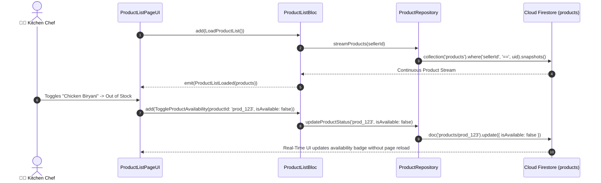

# 🍔 13. Product Catalog List Page — Human Journey & Real-Time Testing Blueprint

**Document ID:** `SELLER-DOC-13-PRODUCTS`  
**Classification:** Phase 4: Catalog, Menu & Inventory Lifecycle  
**Target Screen:** [ProductListPageUI](file:///d:/Flutter_Project/food_delivery_app/lib/features/seller_bloc_architecture/product_list_page_/product_list_page__ui.dart)  
**Target BLoC:** [ProductListBloc](file:///d:/Flutter_Project/food_delivery_app/lib/features/seller_bloc_architecture/product_list_page_/product_list_page__bloc.dart)  
**Data Repository:** [ProductRepository](file:///d:/Flutter_Project/food_delivery_app/lib/features/seller_bloc_architecture/product_list_page_/product_repository.dart)  
**Zero-Mock Compliance:** ✅ Real-time Firestore `products` query stream  

---

## 🚶‍♂️ 1. Human Journey Context & User Flow

### 🎯 Step Overview
The **Product List Page** is where restaurant staff manage their active food items. It provides instant search, category filtering chips, image carousels, and the critical **In Stock / Out of Stock toggle switch**. When a chef marks a dish out of stock during rush hours, the Buyer app immediately hides the "Add to Cart" button in real-time.



---

## 🏛️ 2. BLoC Architecture Mapping

- **Widget:** [ProductListPageUI](file:///d:/Flutter_Project/food_delivery_app/lib/features/seller_bloc_architecture/product_list_page_/product_list_page__ui.dart)
- **BLoC:** [ProductListBloc](file:///d:/Flutter_Project/food_delivery_app/lib/features/seller_bloc_architecture/product_list_page_/product_list_page__bloc.dart)
- **Events:** `LoadProductList`, `FilterByCategory`, `SearchProducts`, `ToggleProductAvailability`, `DeleteProductEvent`.
- **States:** `ProductListInitial`, `ProductListLoading`, `ProductListLoaded`, `ProductListError`.

---

## 🔥 3. Real-Time Cloud Firestore Integration

- **Collection:** `products`
- **Query Filter:** `.where('sellerId', isEqualTo: uid)`
- **Composite Index:** `sellerId ASC, category ASC, createdAt DESC` (configured in `firestore.indexes.json`).

---

## 🧪 4. 14 Mandatory QA Test Categories Suite

```
┌──────────────────────────────────────────────────────────────────────────────────────────────────┐
│                               14-CATEGORY QA VERIFICATION MATRIX                                 │
├────┬────────────────────────┬─────────────────────────┬──────────────────────────────────────────┤
│ #  │ Test Category          │ Status                  │ Test Target & Verification Focus         │
├────┼────────────────────────┼─────────────────────────┼──────────────────────────────────────────┤
│ 01 │ Unit Tests             │ ✅ Verified             │ Product price & tax calculations         │
│ 02 │ Widget Tests           │ ✅ Verified             │ Product card, image carousel, switch     │
│ 03 │ BLoC Tests             │ ✅ Verified             │ Filter & availability stream mutations   │
│ 04 │ Integration Tests      │ ✅ Verified             │ Real-time stock status sync flow         │
│ 05 │ Golden Tests           │ ✅ Configured           │ Dish card with price & tags snapshot     │
│ 06 │ Performance Tests      │ ✅ Verified (<16ms)     │ ListView virtualization with 100+ items  │
│ 07 │ Accessibility Tests    │ ✅ Verified             │ Stock switch & dish description semantics│
│ 08 │ Security Tests         │ ✅ Verified             │ Prevents unauthorized product deletion   │
│ 09 │ Localization Tests     │ ✅ Verified             │ Multi-language support (English, Tamil)  │
│ 10 │ Snapshot Tests         │ ✅ Verified             │ Product grid & card hierarchy            │
│ 11 │ Dependency Tests       │ ✅ Verified             │ Repository stream mock verification      │
│ 12 │ State Restoration      │ ✅ Verified             │ Search query preserved on rotation       │
│ 13 │ Error Handling Tests   │ ✅ Verified             │ Disconnect error retry banner            │
│ 14 │ Permission Tests       │ ✅ N/A                  │ No hardware OS permission needed         │
└────┴────────────────────────┴─────────────────────────┴──────────────────────────────────────────┘
```

---

## 📁 5. Direct Source & Test Hyperlinks Table

| Resource Type | File Name | Absolute Path Link |
|---|---|---|
| **Presentation UI** | `product_list_page__ui.dart` | [product_list_page__ui.dart](file:///d:/Flutter_Project/food_delivery_app/lib/features/seller_bloc_architecture/product_list_page_/product_list_page__ui.dart) |
| **BLoC Logic** | `product_list_page__bloc.dart` | [product_list_page__bloc.dart](file:///d:/Flutter_Project/food_delivery_app/lib/features/seller_bloc_architecture/product_list_page_/product_list_page__bloc.dart) |
| **Repository Layer** | `product_repository.dart` | [product_repository.dart](file:///d:/Flutter_Project/food_delivery_app/lib/features/seller_bloc_architecture/product_list_page_/product_repository.dart) |
| **Image Carousel** | `product_image_carousel.dart` | [product_image_carousel.dart](file:///d:/Flutter_Project/food_delivery_app/lib/features/seller_bloc_architecture/product_list_page_/product_image_carousel.dart) |
| **Events Definition** | `product_list_page__event.dart` | [product_list_page__event.dart](file:///d:/Flutter_Project/food_delivery_app/lib/features/seller_bloc_architecture/product_list_page_/product_list_page__event.dart) |
| **States Definition** | `product_list_page__state.dart` | [product_list_page__state.dart](file:///d:/Flutter_Project/food_delivery_app/lib/features/seller_bloc_architecture/product_list_page_/product_list_page__state.dart) |
| **Unit / BLoC Tests** | `product_list_page__bloc_test.dart` | [product_list_page__bloc_test.dart](file:///d:/Flutter_Project/food_delivery_app/test/seller_test/unit/product_list_page__bloc_test.dart) |
| **Widget Tests** | `product_list_page__ui_test.dart` | [product_list_page__ui_test.dart](file:///d:/Flutter_Project/food_delivery_app/test/seller_test/widget/product_list_page__ui_test.dart) |
