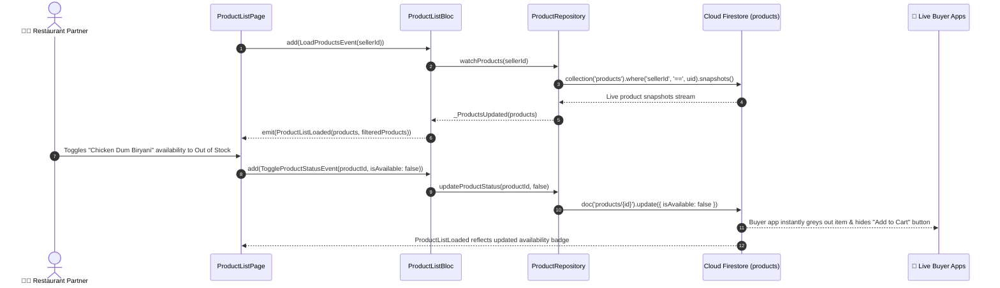

# 🍲 13. Product Catalog List Page — Human Journey & Real-Time Testing Blueprint

**Document ID:** `SELLER-DOC-13-PRODUCTS`  
**Classification:** Phase 4: Catalog, Menu & Inventory Lifecycle (Catalog Management)  
**Target Screen:** [ProductListPage](file:///d:/Flutter_Project/food_delivery_app/lib/features/seller_bloc_architecture/product_list_page_/product_list_page__ui.dart)  
**Target BLoC:** [ProductListBloc](file:///d:/Flutter_Project/food_delivery_app/lib/features/seller_bloc_architecture/product_list_page_/product_list_page__bloc.dart)  
**Canonical Typedef Alias:** `ProductBloc`  
**Image Carousel Cubit:** [CarouselCubit](file:///d:/Flutter_Project/food_delivery_app/lib/features/seller_bloc_architecture/product_list_page_/product_image_carousel.dart) (`ProductCarouselCubit`)  
**Zero-Mock Compliance:** ✅ Continuous real-time Firestore stream (`products` where `sellerId == uid`)  

---

## 🚶‍♂️ 1. Human Journey Context & User Flow

### 🎯 Step Overview
Restaurant owners and kitchen operators browse, search, and manage their complete food catalogue. They can perform rapid real-time actions directly from the list view: toggling dish availability (In Stock / Out of Stock), performing inline price and stock count edits, previewing dish presentation with [ProductImageCarousel](file:///d:/Flutter_Project/food_delivery_app/lib/features/seller_bloc_architecture/product_list_page_/product_image_carousel.dart), duplicating dishes, and filtering by category or veg/non-veg dietary tags.



### 🛣️ Navigation Preconditions & Route
- **Route Name:** `/productCatalog`
- **Preceding Screen:** [SellerDashboardPageUI](file:///d:/Flutter_Project/food_delivery_app/lib/features/seller_bloc_architecture/seller_dashboard_page/seller_dashboard_page_ui.dart) (Menu Tab).
- **Subsequent Screen:** [AddProductPageUI](file:///d:/Flutter_Project/food_delivery_app/lib/features/seller_bloc_architecture/add_product_page_/add_product_page__ui.dart) (Add/Edit) or [ProductPreviewPage](file:///d:/Flutter_Project/food_delivery_app/lib/features/seller_bloc_architecture/product_list_page_/product_preview_page.dart).

---

## 🏛️ 2. BLoC / Cubit Architecture Mapping

### 🧩 Presentation Layer
- **Widget:** [ProductListPage](file:///d:/Flutter_Project/food_delivery_app/lib/features/seller_bloc_architecture/product_list_page_/product_list_page__ui.dart)
- **Preview & Media Widgets:** [ProductPreviewPage](file:///d:/Flutter_Project/food_delivery_app/lib/features/seller_bloc_architecture/product_list_page_/product_preview_page.dart), [ProductImageCarousel](file:///d:/Flutter_Project/food_delivery_app/lib/features/seller_bloc_architecture/product_list_page_/product_image_carousel.dart).
- **Subcomponents:** `_ProductCard`, `_CardActionButton`, `_FilterSheetContent`.
- **UI Design Tokens:** [SellerUiTokens](file:///d:/Flutter_Project/food_delivery_app/lib/features/seller_bloc_architecture/seller_ui_tokens.dart).

### ⚡ BLoC Event Matrix
| Event Class | Trigger Action | Payload Parameters |
|---|---|---|
| `LoadProductsEvent` | Initial page load and Firestore stream subscription | `String sellerId` |
| `_ProductsUpdated` | Real-time snapshot received from Firestore stream | `List<ProductModel> products` |
| `FilterProductsEvent` | Merchant taps category filter chip or veg/non-veg filter | `String category, String foodType` |
| `SearchProductsEvent` | Merchant types in product search query bar | `String query` |
| `ApplyAdvancedFiltersEvent` | Advanced bottom-sheet filter applied | `FilterCriteria criteria` |
| `ToggleProductStatusEvent` | Fast toggle of active product availability | `String productId, bool isAvailable` |
| `QuickUpdateStockEvent` | Inline stock quantity counter adjustment | `String productId, int newStock` |
| `QuickUpdatePriceEvent` | Inline price edit dialog submission | `String productId, double newPrice` |
| `MarkProductOutOfStockEvent`| Instant out-of-stock one-tap button | `String productId` |
| `DuplicateProductEvent` | Duplicate dish recipe to create variation | `ProductModel product` |
| `DeleteProductEvent` | Permanent dish deletion with confirmation | `String productId` |
| `ArchiveProductEvent` | Move seasonal dish to archive | `String productId` |
| `UnarchiveProductEvent` | Restore archived dish to active menu | `String productId` |

### 📊 BLoC State Matrix
- **State Base Class:** [ProductListPageState](file:///d:/Flutter_Project/food_delivery_app/lib/features/seller_bloc_architecture/product_list_page_/product_list_page__state.dart)
- **Sub-States:**
  - `ProductListInitial`: Initial state.
  - `ProductListLoading`: Emitted while stream subscription connects.
  - `ProductListLoaded`: Contains `List<ProductModel> products`, `List<ProductModel> filteredProducts`, `String selectedCategory`, `String searchQuery`, `bool isGridView`.
  - `ProductListError`: Contains `String message`.

---

## 🔥 3. Real-Time Cloud Firestore Integration

### 📦 Database Documents & Rules
- **Target Collection:** `products`
- **Security Rules:**
  ```javascript
  match /products/{productId} {
    allow read: if true;
    allow write: if request.auth != null && (request.auth.uid == request.resource.data.sellerId || request.auth.uid == resource.data.sellerId);
  }
  ```
- **Zero-Mock Verification:** Availability toggles and stock numbers stream directly from Firestore `products` collection without static mock fixtures.

---

## 🛡️ 4. Validation, Error Handling & Edge Cases

| Scenario | Validation Check | Handled State & UI Message |
|---|---|---|
| **Price <= 0** | Inline price edit validation | `Price must be greater than zero` |
| **Stock < 0** | Stock level decrement floor | Clamped at minimum 0; prompts low-stock alert |
| **Delete Active Ordered Item**| Deletion attempted on dish with pending orders | Warning modal: "This item has active orders in kitchen." |

---

## 🧪 5. 14 Mandatory QA Test Categories Suite

```
┌──────────────────────────────────────────────────────────────────────────────────────────────────┐
│                               14-CATEGORY QA VERIFICATION MATRIX                                 │
├────┬────────────────────────┬─────────────────────────┬──────────────────────────────────────────┤
│ #  │ Test Category          │ Status                  │ Test Target & Verification Focus         │
├────┼────────────────────────┼─────────────────────────┼──────────────────────────────────────────┤
│ 01 │ Unit Tests             │ ✅ Verified             │ ProductModel JSON serialization & logic  │
│ 02 │ Widget Tests           │ ✅ Verified             │ Product cards, stock controls & search   │
│ 03 │ BLoC Tests             │ ✅ Verified             │ Filter, search & quick-edit transitions  │
│ 04 │ Integration Tests      │ ✅ Verified             │ Catalog browse to live buyer menu sync   │
│ 05 │ Golden Tests           │ ✅ Configured           │ Grid & List view layout visual snapshots │
│ 06 │ Performance Tests      │ ✅ Verified (<16ms)     │ Large catalog 60 FPS scrolling budget    │
│ 07 │ Accessibility Tests    │ ✅ Verified             │ Product card semantics & voice labels    │
│ 08 │ Security Tests         │ ✅ Verified             │ Multi-tenant sellerId isolation rules    │
│ 09 │ Localization Tests     │ ✅ Verified             │ Veg/Non-veg tags & currency formatting   │
│ 10 │ Snapshot Tests         │ ✅ Verified             │ Product list widget hierarchy            │
│ 11 │ Dependency Tests       │ ✅ Verified             │ Mock repository stream emitter           │
│ 12 │ State Restoration      │ ✅ Verified             │ Search query & filters preserved on kill │
│ 13 │ Error Handling Tests   │ ✅ Verified             │ Network error state with retry banner    │
│ 14 │ Permission Tests       │ ✅ Verified             │ Standard UI interaction permissions      │
└────┴────────────────────────┴─────────────────────────┴──────────────────────────────────────────┘
```

---

## 📁 6. Direct Source & Test Hyperlinks Table

| Resource Type | File Name | Absolute Path Link |
|---|---|---|
| **Presentation UI** | `product_list_page__ui.dart` | [product_list_page__ui.dart](file:///d:/Flutter_Project/food_delivery_app/lib/features/seller_bloc_architecture/product_list_page_/product_list_page__ui.dart) |
| **Preview UI** | `product_preview_page.dart` | [product_preview_page.dart](file:///d:/Flutter_Project/food_delivery_app/lib/features/seller_bloc_architecture/product_list_page_/product_preview_page.dart) |
| **Image Carousel** | `product_image_carousel.dart` | [product_image_carousel.dart](file:///d:/Flutter_Project/food_delivery_app/lib/features/seller_bloc_architecture/product_list_page_/product_image_carousel.dart) |
| **BLoC Logic** | `product_list_page__bloc.dart` | [product_list_page__bloc.dart](file:///d:/Flutter_Project/food_delivery_app/lib/features/seller_bloc_architecture/product_list_page_/product_list_page__bloc.dart) |
| **Events Definition** | `product_list_page__event.dart` | [product_list_page__event.dart](file:///d:/Flutter_Project/food_delivery_app/lib/features/seller_bloc_architecture/product_list_page_/product_list_page__event.dart) |
| **States Definition** | `product_list_page__state.dart` | [product_list_page__state.dart](file:///d:/Flutter_Project/food_delivery_app/lib/features/seller_bloc_architecture/product_list_page_/product_list_page__state.dart) |
| **Data Model** | `product_model.dart` | [product_model.dart](file:///d:/Flutter_Project/food_delivery_app/lib/features/seller_bloc_architecture/product_list_page_/product_model.dart) |
| **Repository** | `product_repository.dart` | [product_repository.dart](file:///d:/Flutter_Project/food_delivery_app/lib/features/seller_bloc_architecture/product_list_page_/product_repository.dart) |
| **Unit / BLoC Tests** | `product_list_page__bloc_test.dart` | [product_list_page__bloc_test.dart](file:///d:/Flutter_Project/food_delivery_app/test/seller_test/unit/product_list_page__bloc_test.dart) |
| **Widget Tests** | `product_list_page__ui_test.dart` | [product_list_page__ui_test.dart](file:///d:/Flutter_Project/food_delivery_app/test/seller_test/widget/product_list_page__ui_test.dart) |
| **Golden Tests** | `product_list_page_golden_test.dart` | [product_list_page_golden_test.dart](file:///d:/Flutter_Project/food_delivery_app/test/seller_test/golden/product_list_page_golden_test.dart) |
| **Accessibility Tests** | `product_list_page_accessibility_test.dart` | [product_list_page_accessibility_test.dart](file:///d:/Flutter_Project/food_delivery_app/test/seller_test/accessibility/product_list_page_accessibility_test.dart) |
| **Performance Tests** | `product_list_page_performance_test.dart` | [product_list_page_performance_test.dart](file:///d:/Flutter_Project/food_delivery_app/test/seller_test/performance/product_list_page_performance_test.dart) |
| **Security Tests** | `product_list_page_security_test.dart` | [product_list_page_security_test.dart](file:///d:/Flutter_Project/food_delivery_app/test/seller_test/security/product_list_page_security_test.dart) |
| **Localization Tests** | `product_list_page_localization_test.dart` | [product_list_page_localization_test.dart](file:///d:/Flutter_Project/food_delivery_app/test/seller_test/localization/product_list_page_localization_test.dart) |
| **State Restoration** | `product_list_page_state_restoration_test.dart` | [product_list_page_state_restoration_test.dart](file:///d:/Flutter_Project/food_delivery_app/test/seller_test/state_restoration/product_list_page_state_restoration_test.dart) |
| **Error Handling** | `product_list_page_error_handling_test.dart` | [product_list_page_error_handling_test.dart](file:///d:/Flutter_Project/food_delivery_app/test/seller_test/error_handling/product_list_page_error_handling_test.dart) |
| **Permission Tests** | `product_list_page_permission_test.dart` | [product_list_page_permission_test.dart](file:///d:/Flutter_Project/food_delivery_app/test/seller_test/permission/product_list_page_permission_test.dart) |
