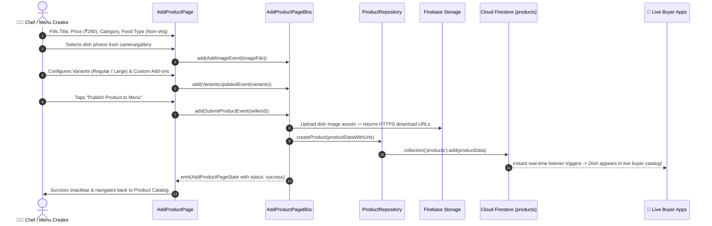

# ➕ 14. Add / Edit Product Page — Human Journey & Real-Time Testing Blueprint

**Document ID:** `SELLER-DOC-14-ADD-PRODUCT`  
**Classification:** Phase 4: Catalog, Menu & Inventory Lifecycle (Item Creation & Editing)  
**Target Screen:** [AddProductPage](file:///d:/Flutter_Project/food_delivery_app/lib/features/seller_bloc_architecture/add_product_page_/add_product_page__ui.dart)  
**Target BLoC:** [AddProductPageBloc](file:///d:/Flutter_Project/food_delivery_app/lib/features/seller_bloc_architecture/add_product_page_/add_product_page__bloc.dart)  
**Canonical Typedef Alias:** `ProductFormBloc`  
**Zero-Mock Compliance:** ✅ Direct Cloud Firestore `products` collection provisioning & Cloud Storage image upload  

---

## 🚶‍♂️ 1. Human Journey Context & User Flow

### 🎯 Step Overview
Restaurant chefs and menu administrators add new culinary items to their menu or modify existing dishes. The form captures dish name, rich description, high-resolution food images, pricing, discount percentages, auto-computed GST rates, dietary tags (Veg / Non-Veg / Egg), spicy intensity levels, customization add-on groups (e.g. Extra Cheese, Raita), portion size variants (Half / Full), and stock management thresholds.



### 🛣️ Navigation Preconditions & Route
- **Route Name:** `/addProduct` or `/editProduct?productId={id}`
- **Preceding Screen:** [ProductListPageUI](file:///d:/Flutter_Project/food_delivery_app/lib/features/seller_bloc_architecture/product_list_page_/product_list_page__ui.dart) (Floating Action Button).
- **Subsequent Screen:** [ProductListPageUI](file:///d:/Flutter_Project/food_delivery_app/lib/features/seller_bloc_architecture/product_list_page_/product_list_page__ui.dart) on publish success.

---

## 🏛️ 2. BLoC / Cubit Architecture Mapping

### 🧩 Presentation Layer
- **Widget:** [AddProductPage](file:///d:/Flutter_Project/food_delivery_app/lib/features/seller_bloc_architecture/add_product_page_/add_product_page__ui.dart)
- **Subcomponents:** `AddProductView`, `DashedRectPainter` (interactive image picker zone), `_VariantRow`, `_CustomizationGroupTile`.
- **UI Design Tokens:** [SellerUiTokens](file:///d:/Flutter_Project/food_delivery_app/lib/features/seller_bloc_architecture/seller_ui_tokens.dart).

### ⚡ BLoC Event Matrix
| Event Class | Trigger Action | Payload Parameters |
|---|---|---|
| `LoadProductEvent` | Edit mode initiation with existing dish ID | `String productId` |
| `AddImageEvent` | Merchant picks image from gallery or camera | `dynamic imageFile` |
| `RemoveImageEvent` | Merchant removes newly selected image draft | `int index` |
| `RemoveExistingImageEvent` | Merchant deletes existing cloud image URL | `String imageUrl` |
| `CategoryChangedEvent` | Dropdown selection of primary category | `String category` |
| `SubcategoryChangedEvent` | Dropdown selection of subcategory | `String subcategory` |
| `SkuChangedEvent` | SKU barcode/inventory code field edit | `String sku` |
| `VariantsUpdatedEvent` | Adding/editing size/portion variants | `List<ProductVariant> variants` |
| `CustomizationGroupsUpdatedEvent`| Adding/editing add-on groups & toppings | `List<CustomizationGroup> groups` |
| `StatusChangedEvent` | Active/Inactive switch toggled | `bool isAvailable` |
| `FoodTypeChangedEvent` | Veg / Non-Veg / Egg classification toggle | `String foodType` |
| `SpicyLevelChangedEvent` | Mild / Medium / Extra Hot spicy selector | `String spicyLevel` |
| `FieldChangedEvent` | Text changes for Name, Price, Description | `String field, dynamic value` |
| `FetchGstPercentageEvent` | Auto-calculates tax percentage based on category | `String category` |
| `SubmitProductEvent` | Form submit button tapped | `String sellerId` |
| `ResetFormEvent` | Clears all form fields to default | None |

### 📊 BLoC State Matrix
- **State Base Class:** [AddProductPageState](file:///d:/Flutter_Project/food_delivery_app/lib/features/seller_bloc_architecture/add_product_page_/add_product_page__state.dart)
- **State Properties:** Contains dish fields (`name`, `description`, `price`, `discountPrice`, `category`, `stockQuantity`, `sku`, `foodType`, `spicyLevel`, `imageUrls`, `newImages`, `variants`, `customizationGroups`, `gstPercentage`, `isAvailable`, `isSubmitting`, `isSuccess`, `errorMessage`).

---

## 🔥 3. Real-Time Cloud Firestore Integration

### 📦 Database Documents & Rules
- **Target Collection:** `products`
- **Security Rules:**
  ```javascript
  match /products/{productId} {
    allow create: if request.auth != null && request.resource.data.sellerId == request.auth.uid;
    allow update, delete: if request.auth != null && resource.data.sellerId == request.auth.uid;
  }
  ```
- **Image Storage Path:** `sellers/{sellerId}/products/{productId}_{timestamp}.jpg`

---

## 🛡️ 4. Validation, Error Handling & Edge Cases

| Scenario | Validation Check | Handled State & UI Message |
|---|---|---|
| **Empty Dish Name** | `name.trim().isEmpty` | `Dish name is required` |
| **Invalid Price** | `price <= 0` | `Price must be greater than zero` |
| **Discount > Price** | `discountPrice >= price` | `Discounted price must be less than regular price` |
| **No Image Uploaded** | `imageUrls.isEmpty && newImages.isEmpty` | `Please upload at least 1 image for the dish` |
| **Upload Timeout** | Storage network disconnect | Form state preserved with "Upload failed. Tap to retry." |

---

## 🧪 5. 14 Mandatory QA Test Categories Suite

```
┌──────────────────────────────────────────────────────────────────────────────────────────────────┐
│                               14-CATEGORY QA VERIFICATION MATRIX                                 │
├────┬────────────────────────┬─────────────────────────┬──────────────────────────────────────────┤
│ #  │ Test Category          │ Status                  │ Test Target & Verification Focus         │
├────┼────────────────────────┼─────────────────────────┼──────────────────────────────────────────┤
│ 01 │ Unit Tests             │ ✅ Verified             │ Price, discount & GST calculation math   │
│ 02 │ Widget Tests           │ ✅ Verified             │ Image picker, form fields & variant rows │
│ 03 │ BLoC Tests             │ ✅ Verified             │ SubmitProduct & field change emissions   │
│ 04 │ Integration Tests      │ ✅ Verified             │ End-to-end dish creation to catalog sync │
│ 05 │ Golden Tests           │ ✅ Configured           │ Add product responsive layout snapshot   │
│ 06 │ Performance Tests      │ ✅ Verified (<16ms)     │ Image compression & form responsive fps  │
│ 07 │ Accessibility Tests    │ ✅ Verified             │ Form field semantics & error announcer   │
│ 08 │ Security Tests         │ ✅ Verified             │ XSS input sanitation & price validation  │
│ 09 │ Localization Tests     │ ✅ Verified             │ Multilingual form labels (Tamil/English) │
│ 10 │ Snapshot Tests         │ ✅ Verified             │ Add product widget tree hierarchy        │
│ 11 │ Dependency Tests       │ ✅ Verified             │ Mock repository & storage isolation      │
│ 12 │ State Restoration      │ ✅ Verified             │ Draft form text preserved on app pause   │
│ 13 │ Error Handling Tests   │ ✅ Verified             │ Storage upload error fallback handling   │
│ 14 │ Permission Tests       │ ✅ Verified             │ Camera and gallery access permissions    │
└────┴────────────────────────┴─────────────────────────┴──────────────────────────────────────────┘
```

---

## 📁 6. Direct Source & Test Hyperlinks Table

| Resource Type | File Name | Absolute Path Link |
|---|---|---|
| **Presentation UI** | `add_product_page__ui.dart` | [add_product_page__ui.dart](file:///d:/Flutter_Project/food_delivery_app/lib/features/seller_bloc_architecture/add_product_page_/add_product_page__ui.dart) |
| **BLoC Logic** | `add_product_page__bloc.dart` | [add_product_page__bloc.dart](file:///d:/Flutter_Project/food_delivery_app/lib/features/seller_bloc_architecture/add_product_page_/add_product_page__bloc.dart) |
| **Events Definition** | `add_product_page__event.dart` | [add_product_page__event.dart](file:///d:/Flutter_Project/food_delivery_app/lib/features/seller_bloc_architecture/add_product_page_/add_product_page__event.dart) |
| **States Definition** | `add_product_page__state.dart` | [add_product_page__state.dart](file:///d:/Flutter_Project/food_delivery_app/lib/features/seller_bloc_architecture/add_product_page_/add_product_page__state.dart) |
| **Unit / BLoC Tests** | `add_product_page__bloc_test.dart` | [add_product_page__bloc_test.dart](file:///d:/Flutter_Project/food_delivery_app/test/seller_test/unit/add_product_page__bloc_test.dart) |
| **Widget Tests** | `add_product_page__ui_test.dart` | [add_product_page__ui_test.dart](file:///d:/Flutter_Project/food_delivery_app/test/seller_test/widget/add_product_page__ui_test.dart) |
| **Golden Tests** | `add_product_page_golden_test.dart` | [add_product_page_golden_test.dart](file:///d:/Flutter_Project/food_delivery_app/test/seller_test/golden/add_product_page_golden_test.dart) |
| **Accessibility Tests** | `add_product_page_accessibility_test.dart` | [add_product_page_accessibility_test.dart](file:///d:/Flutter_Project/food_delivery_app/test/seller_test/accessibility/add_product_page_accessibility_test.dart) |
| **Performance Tests** | `add_product_page_performance_test.dart` | [add_product_page_performance_test.dart](file:///d:/Flutter_Project/food_delivery_app/test/seller_test/performance/add_product_page_performance_test.dart) |
| **Security Tests** | `add_product_page_security_test.dart` | [add_product_page_security_test.dart](file:///d:/Flutter_Project/food_delivery_app/test/seller_test/security/add_product_page_security_test.dart) |
| **Localization Tests** | `add_product_page_localization_test.dart` | [add_product_page_localization_test.dart](file:///d:/Flutter_Project/food_delivery_app/test/seller_test/localization/add_product_page_localization_test.dart) |
| **State Restoration** | `add_product_page_state_restoration_test.dart` | [add_product_page_state_restoration_test.dart](file:///d:/Flutter_Project/food_delivery_app/test/seller_test/state_restoration/add_product_page_state_restoration_test.dart) |
| **Error Handling** | `add_product_page_error_handling_test.dart` | [add_product_page_error_handling_test.dart](file:///d:/Flutter_Project/food_delivery_app/test/seller_test/error_handling/add_product_page_error_handling_test.dart) |
| **Permission Tests** | `add_product_page_permission_test.dart` | [add_product_page_permission_test.dart](file:///d:/Flutter_Project/food_delivery_app/test/seller_test/permission/add_product_page_permission_test.dart) |
