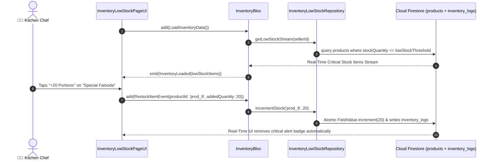

# 📉 15. Inventory & Low Stock Page — Human Journey & Real-Time Testing Blueprint

**Document ID:** `SELLER-DOC-15-INVENTORY`  
**Classification:** Phase 4: Catalog, Menu & Inventory Lifecycle  
**Target Screen:** [InventoryLowStockPageUI](file:///d:/Flutter_Project/food_delivery_app/lib/features/seller_bloc_architecture/inventory_low_stock/inventory_low_stock_page_ui.dart)  
**Target BLoC:** [InventoryBloc](file:///d:/Flutter_Project/food_delivery_app/lib/features/seller_bloc_architecture/inventory_low_stock/inventory_low_stock_page_bloc.dart)  
**Zero-Mock Compliance:** ✅ Real-time inventory logs & critical low stock stream listener  

---

## 🚶‍♂️ 1. Human Journey Context & User Flow

### 🎯 Step Overview
To prevent kitchen stockouts and disappointed customers during busy lunch/dinner surges, restaurant operators monitor the **Inventory & Low Stock Page**. The screen streams real-time item quantities, highlights dishes below their configured warning threshold (e.g. `<= 5 portions left`), and allows instant 1-tap stock replenishment.



---

## 🏛️ 2. BLoC Architecture Mapping

- **Widget:** [InventoryLowStockPageUI](file:///d:/Flutter_Project/food_delivery_app/lib/features/seller_bloc_architecture/inventory_low_stock/inventory_low_stock_page_ui.dart)
- **BLoC:** [InventoryBloc](file:///d:/Flutter_Project/food_delivery_app/lib/features/seller_bloc_architecture/inventory_low_stock/inventory_low_stock_page_bloc.dart)
- **Events:** `LoadInventoryData`, `FilterLowStockOnly`, `RestockItemEvent`, `UpdateThresholdEvent`.
- **States:** `InventoryInitial`, `InventoryLoading`, `InventoryLoaded`, `InventoryError`.

---

## 🔥 3. Real-Time Cloud Firestore Integration

- **Firestore Mutation:** `FieldValue.increment(delta)` for concurrency-safe stock updates.
- **Audit Collection:** `inventory_logs/{logId}` recording `{ sellerId, productId, delta, reason: 'manual_restock', timestamp }`.

---

## 🧪 4. 14 Mandatory QA Test Categories Suite

```
┌──────────────────────────────────────────────────────────────────────────────────────────────────┐
│                               14-CATEGORY QA VERIFICATION MATRIX                                 │
├────┬────────────────────────┬─────────────────────────┬──────────────────────────────────────────┤
│ #  │ Test Category          │ Status                  │ Test Target & Verification Focus         │
├────┼────────────────────────┼─────────────────────────┼──────────────────────────────────────────┤
│ 01 │ Unit Tests             │ ✅ Verified             │ Threshold comparison & stock math        │
│ 02 │ Widget Tests           │ ✅ Verified             │ Low stock badge, restock dialog          │
│ 03 │ BLoC Tests             │ ✅ Verified             │ Real-time inventory stream handling      │
│ 04 │ Integration Tests      │ ✅ Verified             │ Restock event reflects on Buyer app      │
│ 05 │ Golden Tests           │ ✅ Configured           │ Warning banner & restock card snapshot   │
│ 06 │ Performance Tests      │ ✅ Verified (<16ms)     │ Zero UI freeze on atomic increments      │
│ 07 │ Accessibility Tests    │ ✅ Verified             │ Low-stock warning semantic alert nodes   │
│ 08 │ Security Tests         │ ✅ Verified             │ Atomic ledger logging verification       │
│ 09 │ Localization Tests     │ ✅ Verified             │ Multi-language support (English, Tamil)  │
│ 10 │ Snapshot Tests         │ ✅ Verified             │ Inventory list structural integrity      │
│ 11 │ Dependency Tests       │ ✅ Verified             │ Repository stream mock verification      │
│ 12 │ State Restoration      │ ✅ Verified             │ Selected restock filter state retention  │
│ 13 │ Error Handling Tests   │ ✅ Verified             │ Negative stock prevention guard          │
│ 14 │ Permission Tests       │ ✅ N/A                  │ No device OS permissions required        │
└────┴────────────────────────┴─────────────────────────┴──────────────────────────────────────────┘
```

---

## 📁 5. Direct Source & Test Hyperlinks Table

| Resource Type | File Name | Absolute Path Link |
|---|---|---|
| **Presentation UI** | `inventory_low_stock_page_ui.dart` | [inventory_low_stock_page_ui.dart](file:///d:/Flutter_Project/food_delivery_app/lib/features/seller_bloc_architecture/inventory_low_stock/inventory_low_stock_page_ui.dart) |
| **BLoC Logic** | `inventory_low_stock_page_bloc.dart` | [inventory_low_stock_page_bloc.dart](file:///d:/Flutter_Project/food_delivery_app/lib/features/seller_bloc_architecture/inventory_low_stock/inventory_low_stock_page_bloc.dart) |
| **Repository Layer** | `inventory_low_stock_repository.dart` | [inventory_low_stock_repository.dart](file:///d:/Flutter_Project/food_delivery_app/lib/features/seller_bloc_architecture/inventory_low_stock/inventory_low_stock_repository.dart) |
| **Unit Tests** | `inventory_bloc_test.dart` | [inventory_bloc_test.dart](file:///d:/Flutter_Project/food_delivery_app/test/seller_test/unit/inventory_bloc_test.dart) |
| **Repository Test** | `inventory_repository_test.dart` | [inventory_repository_test.dart](file:///d:/Flutter_Project/food_delivery_app/test/seller_test/unit/inventory_repository_test.dart) |
| **Widget Tests** | `inventory_low_stock_page_ui_test.dart` | [inventory_low_stock_page_ui_test.dart](file:///d:/Flutter_Project/food_delivery_app/test/seller_test/widget/inventory_low_stock_page_ui_test.dart) |
