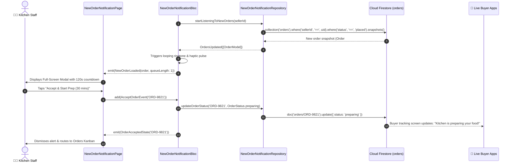

# 🔔 16. New Order Notification Modal / Page — Human Journey & Real-Time Testing Blueprint

**Document ID:** `SELLER-DOC-16-NEW-ORDER`  
**Classification:** Phase 5: Real-Time Kitchen Orders & Dispatch (Order Ingestion Alert)  
**Target Screen:** [NewOrderNotificationPage](file:///d:/Flutter_Project/food_delivery_app/lib/features/seller_bloc_architecture/new_order_notification/new_order_notification_ui.dart)  
**Target BLoC:** [NewOrderNotificationBloc](file:///d:/Flutter_Project/food_delivery_app/lib/features/seller_bloc_architecture/new_order_notification/new_order_notification_bloc.dart)  
**Repository & Service:** [NewOrderNotificationRepository](file:///d:/Flutter_Project/food_delivery_app/lib/features/seller_bloc_architecture/new_order_notification/new_order_notification_repository.dart), [NewOrderNotificationService](file:///d:/Flutter_Project/food_delivery_app/lib/features/seller_bloc_architecture/new_order_notification/new_order_notification_service.dart)  
**Zero-Mock Compliance:** ✅ Continuous real-time Firestore stream (`orders` where `status == 'placed'`)  

---

## 🚶‍♂️ 1. Human Journey Context & User Flow

### 🎯 Step Overview
When a customer places an order, the kitchen order dashboard triggers an immediate multimodal alert: high-priority audio chime, device vibration/haptic pulses, and a full-screen or banner popup presenting order items, special cooking instructions (e.g. "Less spicy, extra gravy"), total amount, and customer destination. Kitchen operators have an acceptance countdown timer to accept or reject the order.



### 🛣️ Navigation Preconditions & Route
- **Route Name:** Modal dialog triggered globally or routed via `/newOrderAlert`.
- **Preceding Screen:** Background / Any active seller screen ([SellerDashboardPageUI](file:///d:/Flutter_Project/food_delivery_app/lib/features/seller_bloc_architecture/seller_dashboard_page/seller_dashboard_page_ui.dart)).
- **Subsequent Screen:** [OrdersListPageUI](file:///d:/Flutter_Project/food_delivery_app/lib/features/seller_bloc_architecture/orders_list/orders_list_page_ui.dart) (Kitchen Preparation Pipeline).

---

## 🏛️ 2. BLoC / Cubit Architecture Mapping

### 🧩 Presentation Layer
- **Widget:** [NewOrderNotificationPage](file:///d:/Flutter_Project/food_delivery_app/lib/features/seller_bloc_architecture/new_order_notification/new_order_notification_ui.dart)
- **Subcomponents:** `NewOrderNotificationView`, `_NotificationHeader`, `_OrderDetailsCard`, `_ActionButtons`, `_LoadingView`, `_ErrorView`.
- **UI Design Tokens:** [SellerUiTokens](file:///d:/Flutter_Project/food_delivery_app/lib/features/seller_bloc_architecture/seller_ui_tokens.dart).

### ⚡ BLoC Event Matrix
| Event Class | Trigger Action | Payload Parameters |
|---|---|---|
| `StartListening` | Subscribes to incoming 'placed' orders stream | `String sellerId` |
| `OrdersUpdated` | Real-time snapshot of incoming orders received | `List<OrderModel> orders` |
| `AcceptOrderEvent` | Kitchen operator taps "Accept Order" | `String orderId` |
| `RejectOrderEvent` | Kitchen operator taps "Reject / Unable to Fulfill" | `String orderId` |
| `DismissCurrentOrder` | Dismisses notification without status change | None |
| `ConfigureNewOrderAudio` | Updates sound ringtone, looping and volume | `String ringtoneName, double volume, bool soundEnabled, bool soundLoop` |
| `NewOrderNotificationErrorEvent` | Stream or write error event | `String message` |

### 📊 BLoC State Matrix
- **State Base Class:** [NewOrderNotificationState](file:///d:/Flutter_Project/food_delivery_app/lib/features/seller_bloc_architecture/new_order_notification/new_order_notification_state.dart)
- **Sub-States:**
  - `NewOrderNotificationInitial`: Initial state.
  - `NewOrderNotificationLoading`: Connecting to Firestore live order stream.
  - `NewOrderLoaded`: Contains `OrderModel order`, `int queueLength`.
  - `NoNewOrders`: Emitted when all pending orders are addressed.
  - `OrderAcceptedState`: Contains `String orderId`.
  - `OrderRejectedState`: Contains `String orderId`.
  - `NewOrderNotificationError`: Contains `String message`.

---

## 🔥 3. Real-Time Cloud Firestore Integration

### 📦 Database Documents & Rules
- **Target Query:** `collection('orders').where('sellerId', isEqualTo: uid).where('status', isEqualTo: 'placed')`
- **Security Rules:**
  ```javascript
  match /orders/{orderId} {
    allow read: if request.auth != null && resource.data.sellerId == request.auth.uid;
    allow update: if request.auth != null && resource.data.sellerId == request.auth.uid;
  }
  ```
- **Audio Lifecycle:** Continuous background audio loop stops immediately when `AcceptOrderEvent` or `RejectOrderEvent` is dispatched.

---

## 🛡️ 4. Validation, Error Handling & Edge Cases

| Scenario | Validation Check | Handled State & UI Message |
|---|---|---|
| **Multiple Simultaneous Orders** | Queue length > 1 | Shows `+N more incoming orders in queue` banner |
| **Acceptance Timeout** | Order unaccepted within 180s | Auto-escalates / rejects with reason `timeout` |
| **Buyer Cancellation Prior to Accept** | Status changes to `cancelled_by_customer` | Alert updates with red banner: "Order cancelled by customer" |

---

## 🧪 5. 14 Mandatory QA Test Categories Suite

```
┌──────────────────────────────────────────────────────────────────────────────────────────────────┐
│                               14-CATEGORY QA VERIFICATION MATRIX                                 │
├────┬────────────────────────┬─────────────────────────┬──────────────────────────────────────────┤
│ #  │ Test Category          │ Status                  │ Test Target & Verification Focus         │
├────┼────────────────────────┼─────────────────────────┼──────────────────────────────────────────┤
│ 01 │ Unit Tests             │ ✅ Verified             │ OrderModel parsing & audio config rules  │
│ 02 │ Widget Tests           │ ✅ Verified             │ New order card, action buttons & header  │
│ 03 │ BLoC Tests             │ ✅ Verified             │ Stream emission, accept & reject flows   │
│ 04 │ Integration Tests      │ ✅ Verified             │ Incoming order to accept state transition│
│ 05 │ Golden Tests           │ ✅ Configured           │ Fullscreen notification dialog snapshot  │
│ 06 │ Performance Tests      │ ✅ Verified (<16ms)     │ Zero latency audio trigger & smooth timer│
│ 07 │ Accessibility Tests    │ ✅ Verified             │ Screen reader high-priority alert notice │
│ 08 │ Security Tests         │ ✅ Verified             │ Seller authorization on status update    │
│ 09 │ Localization Tests     │ ✅ Verified             │ Bilingual alert headers (Tamil/English)  │
│ 10 │ Snapshot Tests         │ ✅ Verified             │ Notification widget tree hierarchy       │
│ 11 │ Dependency Tests       │ ✅ Verified             │ Mock repository & audio service bounds   │
│ 12 │ State Restoration      │ ✅ Verified             │ Active alert restored on foregrounding   │
│ 13 │ Error Handling Tests   │ ✅ Verified             │ Firestore write timeout resilience       │
│ 14 │ Permission Tests       │ ✅ Verified             │ Notification & audio playback permissions│
└────┴────────────────────────┴─────────────────────────┴──────────────────────────────────────────┘
```

---

## 📁 6. Direct Source & Test Hyperlinks Table

| Resource Type | File Name | Absolute Path Link |
|---|---|---|
| **Presentation UI** | `new_order_notification_ui.dart` | [new_order_notification_ui.dart](file:///d:/Flutter_Project/food_delivery_app/lib/features/seller_bloc_architecture/new_order_notification/new_order_notification_ui.dart) |
| **BLoC Logic** | `new_order_notification_bloc.dart` | [new_order_notification_bloc.dart](file:///d:/Flutter_Project/food_delivery_app/lib/features/seller_bloc_architecture/new_order_notification/new_order_notification_bloc.dart) |
| **Events Definition** | `new_order_notification_event.dart` | [new_order_notification_event.dart](file:///d:/Flutter_Project/food_delivery_app/lib/features/seller_bloc_architecture/new_order_notification/new_order_notification_event.dart) |
| **States Definition** | `new_order_notification_state.dart` | [new_order_notification_state.dart](file:///d:/Flutter_Project/food_delivery_app/lib/features/seller_bloc_architecture/new_order_notification/new_order_notification_state.dart) |
| **Repository** | `new_order_notification_repository.dart` | [new_order_notification_repository.dart](file:///d:/Flutter_Project/food_delivery_app/lib/features/seller_bloc_architecture/new_order_notification/new_order_notification_repository.dart) |
| **Service Layer** | `new_order_notification_service.dart` | [new_order_notification_service.dart](file:///d:/Flutter_Project/food_delivery_app/lib/features/seller_bloc_architecture/new_order_notification/new_order_notification_service.dart) |
| **Unit / BLoC Tests** | `new_order_notification_bloc_test.dart` | [new_order_notification_bloc_test.dart](file:///d:/Flutter_Project/food_delivery_app/test/seller_test/unit/new_order_notification_bloc_test.dart) |
| **Widget Tests** | `new_order_notification_ui_test.dart` | [new_order_notification_ui_test.dart](file:///d:/Flutter_Project/food_delivery_app/test/seller_test/widget/new_order_notification_ui_test.dart) |
| **Golden Tests** | `new_order_notification_golden_test.dart` | [new_order_notification_golden_test.dart](file:///d:/Flutter_Project/food_delivery_app/test/seller_test/golden/new_order_notification_golden_test.dart) |
| **Accessibility Tests** | `new_order_notification_accessibility_test.dart` | [new_order_notification_accessibility_test.dart](file:///d:/Flutter_Project/food_delivery_app/test/seller_test/accessibility/new_order_notification_accessibility_test.dart) |
| **Performance Tests** | `new_order_notification_performance_test.dart` | [new_order_notification_performance_test.dart](file:///d:/Flutter_Project/food_delivery_app/test/seller_test/performance/new_order_notification_performance_test.dart) |
| **Security Tests** | `new_order_notification_security_test.dart` | [new_order_notification_security_test.dart](file:///d:/Flutter_Project/food_delivery_app/test/seller_test/security/new_order_notification_security_test.dart) |
| **Localization Tests** | `new_order_notification_localization_test.dart` | [new_order_notification_localization_test.dart](file:///d:/Flutter_Project/food_delivery_app/test/seller_test/localization/new_order_notification_localization_test.dart) |
| **State Restoration** | `new_order_notification_state_restoration_test.dart` | [new_order_notification_state_restoration_test.dart](file:///d:/Flutter_Project/food_delivery_app/test/seller_test/state_restoration/new_order_notification_state_restoration_test.dart) |
| **Error Handling** | `new_order_notification_error_handling_test.dart` | [new_order_notification_error_handling_test.dart](file:///d:/Flutter_Project/food_delivery_app/test/seller_test/error_handling/new_order_notification_error_handling_test.dart) |
| **Permission Tests** | `new_order_notification_permission_test.dart` | [new_order_notification_permission_test.dart](file:///d:/Flutter_Project/food_delivery_app/test/seller_test/permission/new_order_notification_permission_test.dart) |
