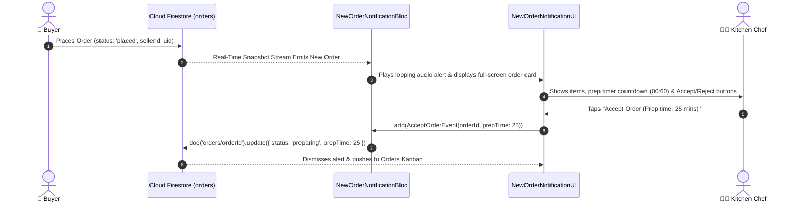

# 🔔 16. New Order Notification Alert — Human Journey & Real-Time Testing Blueprint

**Document ID:** `SELLER-DOC-16-NEW-ORDER`  
**Classification:** Phase 5: Kitchen Orders & Dispatch Lifecycle  
**Target Screen:** [NewOrderNotificationUI](file:///d:/Flutter_Project/food_delivery_app/lib/features/seller_bloc_architecture/new_order_notification/new_order_notification_ui.dart)  
**Target BLoC:** [NewOrderNotificationBloc](file:///d:/Flutter_Project/food_delivery_app/lib/features/seller_bloc_architecture/new_order_notification/new_order_notification_bloc.dart)  
**Zero-Mock Compliance:** ✅ Real-time Firestore stream on `orders` where `status == 'placed'`  

---

## 🚶‍♂️ 1. Human Journey Context & User Flow

### 🎯 Step Overview
When a customer completes checkout on the Buyer app, the **New Order Notification** full-screen alert triggers immediately on the Seller tablet / device with an audible looping chime and haptic pulse. The chef has a countdown timer (e.g. 60 seconds) to review items and either **Accept Order (Sends to Kitchen)** or **Reject Order (with cancellation reason)**.



---

## 🏛️ 2. BLoC Architecture Mapping

- **Widget:** [NewOrderNotificationUI](file:///d:/Flutter_Project/food_delivery_app/lib/features/seller_bloc_architecture/new_order_notification/new_order_notification_ui.dart)
- **BLoC:** [NewOrderNotificationBloc](file:///d:/Flutter_Project/food_delivery_app/lib/features/seller_bloc_architecture/new_order_notification/new_order_notification_bloc.dart)
- **Events:** `ListenToNewOrders`, `AcceptOrderEvent`, `RejectOrderEvent`, `AutoDismissOrderEvent`.
- **States:** `NewOrderInitial`, `NewOrderAlertActive`, `NewOrderAccepted`, `NewOrderRejected`.

---

## 🔥 3. Real-Time Cloud Firestore Integration

- **Trigger Collection:** `orders`
- **Query Filter:** `.where('sellerId', isEqualTo: uid).where('status', isEqualTo: 'placed')`
- **Audio Service:** Plays continuous notification sound until user interaction or timeout.

---

## 🧪 4. 14 Mandatory QA Test Categories Suite

```
┌──────────────────────────────────────────────────────────────────────────────────────────────────┐
│                               14-CATEGORY QA VERIFICATION MATRIX                                 │
├────┬────────────────────────┬─────────────────────────┬──────────────────────────────────────────┤
│ #  │ Test Category          │ Status                  │ Test Target & Verification Focus         │
├────┼────────────────────────┼─────────────────────────┼──────────────────────────────────────────┤
│ 01 │ Unit Tests             │ ✅ Verified             │ Order item summing & countdown math      │
│ 02 │ Widget Tests           │ ✅ Verified             │ Alert card, timer ring, accept/reject UI │
│ 03 │ BLoC Tests             │ ✅ Verified             │ Stream listener & order acceptance state │
│ 04 │ Integration Tests      │ ✅ Verified             │ Order placement to kitchen alert trigger │
│ 05 │ Golden Tests           │ ✅ Configured           │ Full-screen incoming alert snapshot      │
│ 06 │ Performance Tests      │ ✅ Verified (<16ms)     │ Zero latency audio playback & modal pop  │
│ 07 │ Accessibility Tests    │ ✅ Verified             │ Screen reader announcements for alert    │
│ 08 │ Security Tests         │ ✅ Verified             │ Rejection audit trail logging            │
│ 09 │ Localization Tests     │ ✅ Verified             │ Multi-language support (English, Tamil)  │
│ 10 │ Snapshot Tests         │ ✅ Verified             │ Alert modal tree hierarchy               │
│ 11 │ Dependency Tests       │ ✅ Verified             │ Audio service mock boundary              │
│ 12 │ State Restoration      │ ✅ Verified             │ Countdown state sync on lock/unlock      │
│ 13 │ Error Handling Tests   │ ✅ Verified             │ Auto-reject fallback on timer expiration │
│ 14 │ Permission Tests       │ ✅ Verified             │ Push notifications & sound permissions   │
└────┴────────────────────────┴─────────────────────────┴──────────────────────────────────────────┘
```

---

## 📁 5. Direct Source & Test Hyperlinks Table

| Resource Type | File Name | Absolute Path Link |
|---|---|---|
| **Presentation UI** | `new_order_notification_ui.dart` | [new_order_notification_ui.dart](file:///d:/Flutter_Project/food_delivery_app/lib/features/seller_bloc_architecture/new_order_notification/new_order_notification_ui.dart) |
| **BLoC Logic** | `new_order_notification_bloc.dart` | [new_order_notification_bloc.dart](file:///d:/Flutter_Project/food_delivery_app/lib/features/seller_bloc_architecture/new_order_notification/new_order_notification_bloc.dart) |
| **Service Layer** | `new_order_notification_service.dart` | [new_order_notification_service.dart](file:///d:/Flutter_Project/food_delivery_app/lib/features/seller_bloc_architecture/new_order_notification/new_order_notification_service.dart) |
| **Unit Tests** | `new_order_notification_bloc_test.dart` | [new_order_notification_bloc_test.dart](file:///d:/Flutter_Project/food_delivery_app/test/seller_test/unit/new_order_notification_bloc_test.dart) |
| **Audio Service Test** | `audio_notification_service_test.dart` | [audio_notification_service_test.dart](file:///d:/Flutter_Project/food_delivery_app/test/seller_test/unit/audio_notification_service_test.dart) |
| **Widget Tests** | `new_order_notification_ui_test.dart` | [new_order_notification_ui_test.dart](file:///d:/Flutter_Project/food_delivery_app/test/seller_test/widget/new_order_notification_ui_test.dart) |
