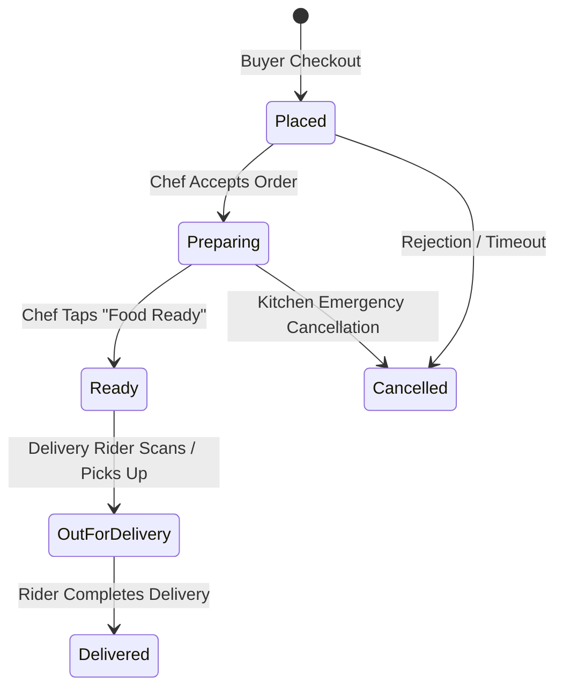

# 📋 17. Orders List Kanban Page — Human Journey & Real-Time Testing Blueprint

**Document ID:** `SELLER-DOC-17-ORDERS-LIST`  
**Classification:** Phase 5: Kitchen Orders & Dispatch Lifecycle  
**Target Screen:** [OrdersListPageUI](file:///d:/Flutter_Project/food_delivery_app/lib/features/seller_bloc_architecture/orders_list/orders_list_page_ui.dart)  
**Target BLoC:** [OrdersListBloc](file:///d:/Flutter_Project/food_delivery_app/lib/features/seller_bloc_architecture/orders_list/orders_list_page_bloc.dart)  
**Zero-Mock Compliance:** ✅ Continuous real-time Firestore order pipeline stream  

---

## 🚶‍♂️ 1. Human Journey Context & User Flow

### 🎯 Step Overview
The **Orders List Page** is the kitchen dispatch board (Kanban / Tabbed status pipeline). Kitchen staff track active orders across sequential lifecycle stages:
`Incoming` ➔ `Preparing` ➔ `Food Ready (Waiting for Rider)` ➔ `Picked Up / Out for Delivery` ➔ `Delivered / Completed` ➔ `Cancelled`.



---

## 🏛️ 2. BLoC Architecture Mapping

- **Widget:** [OrdersListPageUI](file:///d:/Flutter_Project/food_delivery_app/lib/features/seller_bloc_architecture/orders_list/orders_list_page_ui.dart)
- **BLoC:** [OrdersListBloc](file:///d:/Flutter_Project/food_delivery_app/lib/features/seller_bloc_architecture/orders_list/orders_list_page_bloc.dart)
- **Events:** `LoadOrdersEvent`, `FilterOrdersByStatus`, `UpdateOrderStatusEvent`, `PrintKitchenKOTEvent`.
- **States:** `OrdersListInitial`, `OrdersListLoading`, `OrdersListLoaded`, `OrdersListError`.

---

## 🔥 3. Real-Time Cloud Firestore Integration

- **Collection:** `orders`
- **Query Filter:** `.where('sellerId', isEqualTo: uid).orderBy('createdAt', descending: true)`
- **Cloud Functions Trigger:** Status changes fire `onOrderStatusChanged` to notify the Buyer and Rider via FCM push messages.

---

## 🧪 4. 14 Mandatory QA Test Categories Suite

```
┌──────────────────────────────────────────────────────────────────────────────────────────────────┐
│                               14-CATEGORY QA VERIFICATION MATRIX                                 │
├────┬────────────────────────┬─────────────────────────┬──────────────────────────────────────────┤
│ #  │ Test Category          │ Status                  │ Test Target & Verification Focus         │
├────┼────────────────────────┼─────────────────────────┼──────────────────────────────────────────┤
│ 01 │ Unit Tests             │ ✅ Verified             │ Order total, tax, discount calculations  │
│ 02 │ Widget Tests           │ ✅ Verified             │ Tab filters, order card, KOT print button│
│ 03 │ BLoC Tests             │ ✅ Verified             │ Lifecycle status transition emissions    │
│ 04 │ Integration Tests      │ ✅ Verified             │ Complete order lifecycle progression flow│
│ 05 │ Golden Tests           │ ✅ Configured           │ Order item breakdown card snapshot       │
│ 06 │ Performance Tests      │ ✅ Verified (<16ms)     │ Tab switching with 200+ historic orders  │
│ 07 │ Accessibility Tests    │ ✅ Verified             │ Status badge & action button semantics   │
│ 08 │ Security Tests         │ ✅ Verified             │ Prevents unauthorized status bypass      │
│ 09 │ Localization Tests     │ ✅ Verified             │ Multi-language support (English, Tamil)  │
│ 10 │ Snapshot Tests         │ ✅ Verified             │ Kanban column hierarchy verification     │
│ 11 │ Dependency Tests       │ ✅ Verified             │ Firestore mock listener bounds           │
│ 12 │ State Restoration      │ ✅ Verified             │ Active tab selection retained            │
│ 13 │ Error Handling Tests   │ ✅ Verified             │ Stream disconnect reconnection retry     │
│ 14 │ Permission Tests       │ ✅ Verified             │ Bluetooth printer permission for KOT     │
└────┴────────────────────────┴─────────────────────────┴──────────────────────────────────────────┘
```

---

## 📁 5. Direct Source & Test Hyperlinks Table

| Resource Type | File Name | Absolute Path Link |
|---|---|---|
| **Presentation UI** | `orders_list_page_ui.dart` | [orders_list_page_ui.dart](file:///d:/Flutter_Project/food_delivery_app/lib/features/seller_bloc_architecture/orders_list/orders_list_page_ui.dart) |
| **BLoC Logic** | `orders_list_page_bloc.dart` | [orders_list_page_bloc.dart](file:///d:/Flutter_Project/food_delivery_app/lib/features/seller_bloc_architecture/orders_list/orders_list_page_bloc.dart) |
| **Events Definition** | `orders_list_page_event.dart` | [orders_list_page_event.dart](file:///d:/Flutter_Project/food_delivery_app/lib/features/seller_bloc_architecture/orders_list/orders_list_page_event.dart) |
| **States Definition** | `orders_list_page_state.dart` | [orders_list_page_state.dart](file:///d:/Flutter_Project/food_delivery_app/lib/features/seller_bloc_architecture/orders_list/orders_list_page_state.dart) |
| **Unit / BLoC Tests** | `orders_list_page_bloc_test.dart` | [orders_list_page_bloc_test.dart](file:///d:/Flutter_Project/food_delivery_app/test/seller_test/unit/orders_list_page_bloc_test.dart) |
| **Widget Tests** | `orders_list_page_ui_test.dart` | [orders_list_page_ui_test.dart](file:///d:/Flutter_Project/food_delivery_app/test/seller_test/widget/orders_list_page_ui_test.dart) |
| **Integration Test** | `orders_list_page_flow_test.dart` | [orders_list_page_flow_test.dart](file:///d:/Flutter_Project/food_delivery_app/test/seller_test/integration/orders_list_page_flow_test.dart) |
