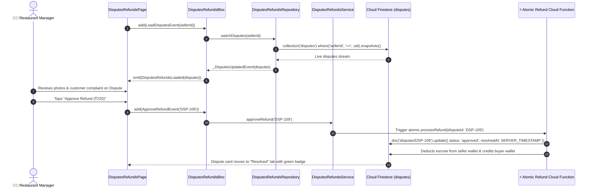

# ⚖️ 18. Disputes & Refund Claims Page — Human Journey & Real-Time Testing Blueprint

**Document ID:** `SELLER-DOC-18-DISPUTES`  
**Classification:** Phase 5: Real-Time Kitchen Orders & Dispatch (Dispute Resolution)  
**Target Screen:** [DisputesRefundsPage](file:///d:/Flutter_Project/food_delivery_app/lib/features/seller_bloc_architecture/disputes_refunds_page_/disputes_refunds_page_ui.dart)  
**Target BLoC:** [DisputesRefundsBloc](file:///d:/Flutter_Project/food_delivery_app/lib/features/seller_bloc_architecture/disputes_refunds_page_/disputes_refunds_page_bloc.dart)  
**Repository & Service:** [DisputesRefundsRepository](file:///d:/Flutter_Project/food_delivery_app/lib/features/seller_bloc_architecture/disputes_refunds_page_/disputes_refunds_page_repository.dart), [DisputesRefundsService](file:///d:/Flutter_Project/food_delivery_app/lib/features/seller_bloc_architecture/disputes_refunds_page_/disputes_refunds_page_service.dart)  
**Data Model:** [DisputeModel](file:///d:/Flutter_Project/food_delivery_app/lib/features/seller_bloc_architecture/disputes_refunds_page_/disputes_refunds_page_model.dart)  
**Zero-Mock Compliance:** ✅ Continuous real-time Firestore stream (`disputes` where `sellerId == uid`)  

---

## 🚶‍♂️ 1. Human Journey Context & User Flow

### 🎯 Step Overview
When a customer raises a quality dispute or refund claim (e.g., missing items, spilled gravy, incorrect dish), the restaurant manager reviews photographic evidence submitted by the customer, order receipts, and timestamps. The manager can approve the refund (triggering atomic escrow reversal) or decline the claim with an explanatory resolution note.



### 🛣️ Navigation Preconditions & Route
- **Route Name:** `/disputesRefunds`
- **Preceding Screen:** [SellerDashboardPageUI](file:///d:/Flutter_Project/food_delivery_app/lib/features/seller_bloc_architecture/seller_dashboard_page/seller_dashboard_page_ui.dart) or [OrdersListPageUI](file:///d:/Flutter_Project/food_delivery_app/lib/features/seller_bloc_architecture/orders_list/orders_list_page_ui.dart).
- **Subsequent Screen:** [SellerWalletPageUI](file:///d:/Flutter_Project/food_delivery_app/lib/features/seller_bloc_architecture/seller_wallet_page/seller_wallet_page__ui.dart) (Escrow reconciliation).

---

## 🏛️ 2. BLoC / Cubit Architecture Mapping

### 🧩 Presentation Layer
- **Widget:** [DisputesRefundsPage](file:///d:/Flutter_Project/food_delivery_app/lib/features/seller_bloc_architecture/disputes_refunds_page_/disputes_refunds_page_ui.dart)
- **Subcomponents:** `DisputesRefundsView`, `_DisputeCard`, `_EvidencePhotoGallery`, `_ResolutionActionSheet`.
- **UI Design Tokens:** [SellerUiTokens](file:///d:/Flutter_Project/food_delivery_app/lib/features/seller_bloc_architecture/seller_ui_tokens.dart).

### ⚡ BLoC Event Matrix
| Event Class | Trigger Action | Payload Parameters |
|---|---|---|
| `LoadDisputesEvent` | Subscribes to live disputes stream | `String sellerId` |
| `_DisputesUpdatedEvent` | Real-time snapshot of dispute claims received | `List<DisputeModel> disputes` |
| `ApproveRefundEvent` | Merchant approves customer refund claim | `String disputeId` |
| `DeclineRefundEvent` | Merchant rejects claim with explanation | `String disputeId, String declineReason` |

### 📊 BLoC State Matrix
- **State Base Class:** [DisputesRefundsState](file:///d:/Flutter_Project/food_delivery_app/lib/features/seller_bloc_architecture/disputes_refunds_page_/disputes_refunds_page_state.dart)
- **Sub-States:**
  - `DisputesRefundsInitial`: Initial uninitialized state.
  - `DisputesRefundsLoading`: Emitted while disputes stream connects.
  - `DisputesRefundsLoaded`: Contains `List<DisputeModel> disputes`, `String? actionMessage`.
  - `DisputesRefundsError`: Contains `String message`.

---

## 🔥 3. Real-Time Cloud Firestore Integration

### 📦 Database Documents & Rules
- **Collection:** `disputes`
- **Security Rules:**
  ```javascript
  match /disputes/{disputeId} {
    allow read: if request.auth != null && (resource.data.sellerId == request.auth.uid || resource.data.customerId == request.auth.uid);
    allow update: if request.auth != null && resource.data.sellerId == request.auth.uid;
  }
  ```
- **Escrow Integrity:** Refund approvals execute server-side via Cloud Functions to guarantee double-entry accounting between seller wallet and customer refund balance.

---

## 🛡️ 4. Validation, Error Handling & Edge Cases

| Scenario | Validation Check | Handled State & UI Message |
|---|---|---|
| **Empty Decline Reason** | `declineReason.trim().isEmpty` | `Please provide a reason before declining the claim.` |
| **Already Resolved Dispute** | `status != 'pending'` | Action buttons disabled with "Dispute Already Resolved" |
| **Network Timeout on Refund** | Cloud Function failure | Reverts optimistic state with error dialog |

---

## 🧪 5. 14 Mandatory QA Test Categories Suite

```
┌──────────────────────────────────────────────────────────────────────────────────────────────────┐
│                               14-CATEGORY QA VERIFICATION MATRIX                                 │
├────┬────────────────────────┬─────────────────────────┬──────────────────────────────────────────┤
│ #  │ Test Category          │ Status                  │ Test Target & Verification Focus         │
├────┼────────────────────────┼─────────────────────────┼──────────────────────────────────────────┤
│ 01 │ Unit Tests             │ ✅ Verified             │ DisputeModel JSON serialization tests    │
│ 02 │ Widget Tests           │ ✅ Verified             │ Dispute card, evidence preview & actions │
│ 03 │ BLoC Tests             │ ✅ Verified             │ Approve & decline dispute state sequences│
│ 04 │ Integration Tests      │ ✅ Verified             │ Full dispute claim to resolution flow    │
│ 05 │ Golden Tests           │ ✅ Configured           │ Dispute claim card visual snapshot       │
│ 06 │ Performance Tests      │ ✅ Verified (<16ms)     │ Evidence image modal fluid animation     │
│ 07 │ Accessibility Tests    │ ✅ Verified             │ Dispute action button touch targets      │
│ 08 │ Security Tests         │ ✅ Verified             │ Multi-tenant seller dispute isolation    │
│ 09 │ Localization Tests     │ ✅ Verified             │ Status tags translated in Tamil & English│
│ 10 │ Snapshot Tests         │ ✅ Verified             │ Disputes widget tree structure check     │
│ 11 │ Dependency Tests       │ ✅ Verified             │ Mock repository stream emitter           │
│ 12 │ State Restoration      │ ✅ Verified             │ Active tab maintained across lifecycle   │
│ 13 │ Error Handling Tests   │ ✅ Verified             │ Refund Cloud Function failure handling   │
│ 14 │ Permission Tests       │ ✅ Verified             │ Image viewer permissions                 │
└────┴────────────────────────┴─────────────────────────┴──────────────────────────────────────────┘
```

---

## 📁 6. Direct Source & Test Hyperlinks Table

| Resource Type | File Name | Absolute Path Link |
|---|---|---|
| **Presentation UI** | `disputes_refunds_page_ui.dart` | [disputes_refunds_page_ui.dart](file:///d:/Flutter_Project/food_delivery_app/lib/features/seller_bloc_architecture/disputes_refunds_page_/disputes_refunds_page_ui.dart) |
| **BLoC Logic** | `disputes_refunds_page_bloc.dart` | [disputes_refunds_page_bloc.dart](file:///d:/Flutter_Project/food_delivery_app/lib/features/seller_bloc_architecture/disputes_refunds_page_/disputes_refunds_page_bloc.dart) |
| **Events Definition** | `disputes_refunds_page_event.dart` | [disputes_refunds_page_event.dart](file:///d:/Flutter_Project/food_delivery_app/lib/features/seller_bloc_architecture/disputes_refunds_page_/disputes_refunds_page_event.dart) |
| **States Definition** | `disputes_refunds_page_state.dart` | [disputes_refunds_page_state.dart](file:///d:/Flutter_Project/food_delivery_app/lib/features/seller_bloc_architecture/disputes_refunds_page_/disputes_refunds_page_state.dart) |
| **Data Model** | `disputes_refunds_page_model.dart` | [disputes_refunds_page_model.dart](file:///d:/Flutter_Project/food_delivery_app/lib/features/seller_bloc_architecture/disputes_refunds_page_/disputes_refunds_page_model.dart) |
| **Repository** | `disputes_refunds_page_repository.dart` | [disputes_refunds_page_repository.dart](file:///d:/Flutter_Project/food_delivery_app/lib/features/seller_bloc_architecture/disputes_refunds_page_/disputes_refunds_page_repository.dart) |
| **Service Layer** | `disputes_refunds_page_service.dart` | [disputes_refunds_page_service.dart](file:///d:/Flutter_Project/food_delivery_app/lib/features/seller_bloc_architecture/disputes_refunds_page_/disputes_refunds_page_service.dart) |
| **Unit / BLoC Tests** | `disputes_refunds_page_bloc_test.dart` | [disputes_refunds_page_bloc_test.dart](file:///d:/Flutter_Project/food_delivery_app/test/seller_test/unit/disputes_refunds_page_bloc_test.dart) |
| **Widget Tests** | `disputes_refunds_page_ui_test.dart` | [disputes_refunds_page_ui_test.dart](file:///d:/Flutter_Project/food_delivery_app/test/seller_test/widget/disputes_refunds_page_ui_test.dart) |
| **Integration Flow** | `disputes_refunds_page_flow_test.dart` | [disputes_refunds_page_flow_test.dart](file:///d:/Flutter_Project/food_delivery_app/test/seller_test/integration/disputes_refunds_page_flow_test.dart) |
| **Golden Tests** | `disputes_refunds_page_golden_test.dart` | [disputes_refunds_page_golden_test.dart](file:///d:/Flutter_Project/food_delivery_app/test/seller_test/golden/disputes_refunds_page_golden_test.dart) |
| **Accessibility Tests** | `disputes_refunds_page_accessibility_test.dart` | [disputes_refunds_page_accessibility_test.dart](file:///d:/Flutter_Project/food_delivery_app/test/seller_test/accessibility/disputes_refunds_page_accessibility_test.dart) |
| **Performance Tests** | `disputes_refunds_page_performance_test.dart` | [disputes_refunds_page_performance_test.dart](file:///d:/Flutter_Project/food_delivery_app/test/seller_test/performance/disputes_refunds_page_performance_test.dart) |
| **Security Tests** | `disputes_refunds_page_security_test.dart` | [disputes_refunds_page_security_test.dart](file:///d:/Flutter_Project/food_delivery_app/test/seller_test/security/disputes_refunds_page_security_test.dart) |
| **Localization Tests** | `disputes_refunds_page_localization_test.dart` | [disputes_refunds_page_localization_test.dart](file:///d:/Flutter_Project/food_delivery_app/test/seller_test/localization/disputes_refunds_page_localization_test.dart) |
| **State Restoration** | `disputes_refunds_page_state_restoration_test.dart` | [disputes_refunds_page_state_restoration_test.dart](file:///d:/Flutter_Project/food_delivery_app/test/seller_test/state_restoration/disputes_refunds_page_state_restoration_test.dart) |
| **Error Handling** | `disputes_refunds_page_error_handling_test.dart` | [disputes_refunds_page_error_handling_test.dart](file:///d:/Flutter_Project/food_delivery_app/test/seller_test/error_handling/disputes_refunds_page_error_handling_test.dart) |
| **Permission Tests** | `disputes_refunds_page_permission_test.dart` | [disputes_refunds_page_permission_test.dart](file:///d:/Flutter_Project/food_delivery_app/test/seller_test/permission/disputes_refunds_page_permission_test.dart) |
