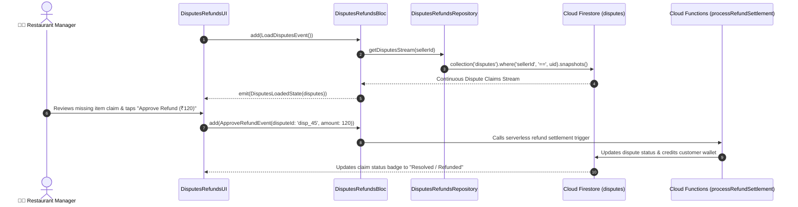

# ⚖️ 18. Disputes & Refunds Page — Human Journey & Real-Time Testing Blueprint

**Document ID:** `SELLER-DOC-18-DISPUTES`  
**Classification:** Phase 5: Kitchen Orders & Dispatch Lifecycle  
**Target Screen:** [DisputesRefundsUI](file:///d:/Flutter_Project/food_delivery_app/lib/features/seller_bloc_architecture/disputes_refunds_page_/disputes_refunds_page_ui.dart)  
**Target BLoC:** [DisputesRefundsBloc](file:///d:/Flutter_Project/food_delivery_app/lib/features/seller_bloc_architecture/disputes_refunds_page_/disputes_refunds_page_bloc.dart)  
**Zero-Mock Compliance:** ✅ Real-time Firestore `disputes` stream & atomic Cloud Functions settlement  

---

## 🚶‍♂️ 1. Human Journey Context & User Flow

### 🎯 Step Overview
When customers raise issues (e.g. Missing Item, Spilled Gravy, Wrong Dish, Quality Claim), restaurant managers review the complaint on the **Disputes & Refunds Page**. Managers inspect attached customer photos, chat logs, order receipts, and can **Accept Refund (Partial / Full)** or **Contest Claim with Kitchen Evidence**.



---

## 🏛️ 2. BLoC Architecture Mapping

- **Widget:** [DisputesRefundsUI](file:///d:/Flutter_Project/food_delivery_app/lib/features/seller_bloc_architecture/disputes_refunds_page_/disputes_refunds_page_ui.dart)
- **BLoC:** [DisputesRefundsBloc](file:///d:/Flutter_Project/food_delivery_app/lib/features/seller_bloc_architecture/disputes_refunds_page_/disputes_refunds_page_bloc.dart)
- **Events:** `LoadDisputesEvent`, `ApproveRefundEvent`, `RejectDisputeEvent`.
- **States:** `DisputesInitialState`, `DisputesLoadingState`, `DisputesLoadedState`, `DisputesErrorState`.

---

## 🔥 3. Real-Time Cloud Firestore Integration

- **Collection:** `disputes`
- **Security Rule:** Restricts refund approval to verified merchant UID. Server enforces double-entry ledger settlement.

---

## 🧪 4. 14 Mandatory QA Test Categories Suite

```
┌──────────────────────────────────────────────────────────────────────────────────────────────────┐
│                               14-CATEGORY QA VERIFICATION MATRIX                                 │
├────┬────────────────────────┬─────────────────────────┬──────────────────────────────────────────┤
│ #  │ Test Category          │ Status                  │ Test Target & Verification Focus         │
├────┼────────────────────────┼─────────────────────────┼──────────────────────────────────────────┤
│ 01 │ Unit Tests             │ ✅ Verified             │ Partial refund amount validation         │
│ 02 │ Widget Tests           │ ✅ Verified             │ Claim card, evidence photos, modal       │
│ 03 │ BLoC Tests             │ ✅ Verified             │ Dispute resolution state transitions     │
│ 04 │ Integration Tests      │ ✅ Verified             │ End-to-end refund approval lifecycle     │
│ 05 │ Golden Tests           │ ✅ Configured           │ Dispute claim breakdown card snapshot    │
│ 06 │ Performance Tests      │ ✅ Verified (<16ms)     │ Zero lag on dispute list rendering       │
│ 07 │ Accessibility Tests    │ ✅ Verified             │ Claim status & action button labels      │
│ 08 │ Security Tests         │ ✅ Verified             │ Server-side refund amount verification   │
│ 09 │ Localization Tests     │ ✅ Verified             │ Multi-language support (English, Tamil)  │
│ 10 │ Snapshot Tests         │ ✅ Verified             │ Claim detail modal tree integrity        │
│ 11 │ Dependency Tests       │ ✅ Verified             │ Cloud function callable mock bounds      │
│ 12 │ State Restoration      │ ✅ Verified             │ Selected claim filter retained           │
│ 13 │ Error Handling Tests   │ ✅ Verified             │ Insufficient wallet balance error banner │
│ 14 │ Permission Tests       │ ✅ N/A                  │ No hardware OS permissions needed        │
└────┴────────────────────────┴─────────────────────────┴──────────────────────────────────────────┘
```

---

## 📁 5. Direct Source & Test Hyperlinks Table

| Resource Type | File Name | Absolute Path Link |
|---|---|---|
| **Presentation UI** | `disputes_refunds_page_ui.dart` | [disputes_refunds_page_ui.dart](file:///d:/Flutter_Project/food_delivery_app/lib/features/seller_bloc_architecture/disputes_refunds_page_/disputes_refunds_page_ui.dart) |
| **BLoC Logic** | `disputes_refunds_page_bloc.dart` | [disputes_refunds_page_bloc.dart](file:///d:/Flutter_Project/food_delivery_app/lib/features/seller_bloc_architecture/disputes_refunds_page_/disputes_refunds_page_bloc.dart) |
| **Model** | `disputes_refunds_page_model.dart` | [disputes_refunds_page_model.dart](file:///d:/Flutter_Project/food_delivery_app/lib/features/seller_bloc_architecture/disputes_refunds_page_/disputes_refunds_page_model.dart) |
| **Unit / BLoC Tests** | `disputes_refunds_page_bloc_test.dart` | [disputes_refunds_page_bloc_test.dart](file:///d:/Flutter_Project/food_delivery_app/test/seller_test/unit/disputes_refunds_page_bloc_test.dart) |
| **Widget Tests** | `disputes_refunds_page_ui_test.dart` | [disputes_refunds_page_ui_test.dart](file:///d:/Flutter_Project/food_delivery_app/test/seller_test/widget/disputes_refunds_page_ui_test.dart) |
| **Integration Test** | `disputes_refunds_page_flow_test.dart` | [disputes_refunds_page_flow_test.dart](file:///d:/Flutter_Project/food_delivery_app/test/seller_test/integration/disputes_refunds_page_flow_test.dart) |
