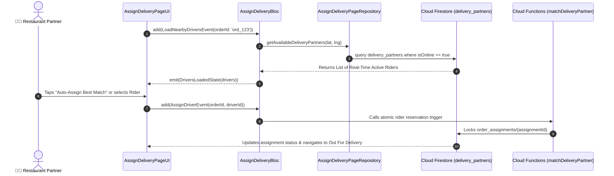

# 🛵 19. Assign Delivery Partner Page — Human Journey & Real-Time Testing Blueprint

**Document ID:** `SELLER-DOC-19-ASSIGN-DELIVERY`  
**Classification:** Phase 5: Kitchen Orders & Dispatch Lifecycle  
**Target Screen:** [AssignDeliveryPageUI](file:///d:/Flutter_Project/food_delivery_app/lib/features/seller_bloc_architecture/assign_delivery_page_/assign_delivery_page__ui.dart)  
**Target BLoC:** [AssignDeliveryBloc](file:///d:/Flutter_Project/food_delivery_app/lib/features/seller_bloc_architecture/assign_delivery_page_/assign_delivery_page__bloc.dart)  
**Zero-Mock Compliance:** ✅ Real-time Firestore rider dispatch & Cloud Functions matchmaking  

---

## 🚶‍♂️ 1. Human Journey Context & User Flow

### 🎯 Step Overview
Once a kitchen order reaches "Food Ready" state, the merchant uses the **Assign Delivery Partner Page** to assign a delivery partner. Merchants can trigger automated algorithmic rider matching (broadcast within 3km geo-fence) or choose from an active nearby partner list with vehicle type and estimated pickup ETA.



---

## 🏛️ 2. BLoC Architecture Mapping

- **Widget:** [AssignDeliveryPageUI](file:///d:/Flutter_Project/food_delivery_app/lib/features/seller_bloc_architecture/assign_delivery_page_/assign_delivery_page__ui.dart)
- **BLoC:** [AssignDeliveryBloc](file:///d:/Flutter_Project/food_delivery_app/lib/features/seller_bloc_architecture/assign_delivery_page_/assign_delivery_page__bloc.dart)
- **Events:** `LoadNearbyDriversEvent`, `AssignDriverEvent`, `CancelAssignmentEvent`.
- **States:** `AssignDeliveryInitialState`, `DriversLoadingState`, `DriversLoadedState`, `DriverAssignedState`, `AssignDeliveryErrorState`.

---

## 🔥 3. Real-Time Cloud Firestore Integration

- **Collection:** `delivery_partners`
- **Lock Collection:** `order_assignments` managed by atomic Cloud Function to prevent race condition double-booking.

---

## 🧪 4. 14 Mandatory QA Test Categories Suite

```
┌──────────────────────────────────────────────────────────────────────────────────────────────────┐
│                               14-CATEGORY QA VERIFICATION MATRIX                                 │
├────┬────────────────────────┬─────────────────────────┬──────────────────────────────────────────┤
│ #  │ Test Category          │ Status                  │ Test Target & Verification Focus         │
├────┼────────────────────────┼─────────────────────────┼──────────────────────────────────────────┤
│ 01 │ Unit Tests             │ ✅ Verified             │ Distance & ETA computation algorithms    │
│ 02 │ Widget Tests           │ ✅ Verified             │ Rider list tiles, vehicle icon, ETA tag  │
│ 03 │ BLoC Tests             │ ✅ Verified             │ Driver search & assignment emissions     │
│ 04 │ Integration Tests      │ ✅ Verified             │ Rider assignment to dispatch pipeline    │
│ 05 │ Golden Tests           │ ✅ Configured           │ Rider selection bottom sheet snapshot    │
│ 06 │ Performance Tests      │ ✅ Verified (<16ms)     │ Real-time radar radar search animation   │
│ 07 │ Accessibility Tests    │ ✅ Verified             │ Rider card & vehicle badge semantics     │
│ 08 │ Security Tests         │ ✅ Verified             │ Concurrency locking against race conditions│
│ 09 │ Localization Tests     │ ✅ Verified             │ Multi-language support (English, Tamil)  │
│ 10 │ Snapshot Tests         │ ✅ Verified             │ Rider candidate list hierarchy           │
│ 11 │ Dependency Tests       │ ✅ Verified             │ Cloud Function callable mock boundary    │
│ 12 │ State Restoration      │ ✅ Verified             │ Selected driver state preserved on sleep │
│ 13 │ Error Handling Tests   │ ✅ Verified             │ "No riders nearby" retry prompt          │
│ 14 │ Permission Tests       │ ✅ Verified             │ Store GPS location access permission     │
└────┴────────────────────────┴─────────────────────────┴──────────────────────────────────────────┘
```

---

## 📁 5. Direct Source & Test Hyperlinks Table

| Resource Type | File Name | Absolute Path Link |
|---|---|---|
| **Presentation UI** | `assign_delivery_page__ui.dart` | [assign_delivery_page__ui.dart](file:///d:/Flutter_Project/food_delivery_app/lib/features/seller_bloc_architecture/assign_delivery_page_/assign_delivery_page__ui.dart) |
| **BLoC Logic** | `assign_delivery_page__bloc.dart` | [assign_delivery_page__bloc.dart](file:///d:/Flutter_Project/food_delivery_app/lib/features/seller_bloc_architecture/assign_delivery_page_/assign_delivery_page__bloc.dart) |
| **Service Layer** | `assign_delivery_page__service.dart` | [assign_delivery_page__service.dart](file:///d:/Flutter_Project/food_delivery_app/lib/features/seller_bloc_architecture/assign_delivery_page_/assign_delivery_page__service.dart) |
| **Unit / BLoC Tests** | `assign_delivery_page__bloc_test.dart` | [assign_delivery_page__bloc_test.dart](file:///d:/Flutter_Project/food_delivery_app/test/seller_test/unit/assign_delivery_page__bloc_test.dart) |
| **Widget Tests** | `assign_delivery_page__ui_test.dart` | [assign_delivery_page__ui_test.dart](file:///d:/Flutter_Project/food_delivery_app/test/seller_test/widget/assign_delivery_page__ui_test.dart) |
