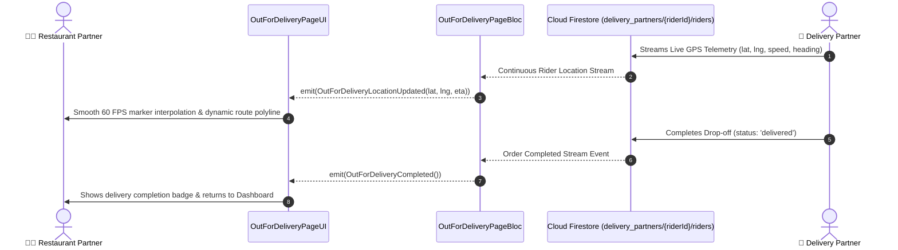

# 🗺️ 20. Out For Delivery GPS Page — Human Journey & Real-Time Testing Blueprint

**Document ID:** `SELLER-DOC-20-OUT-FOR-DELIVERY`  
**Classification:** Phase 5: Kitchen Orders & Dispatch Lifecycle  
**Target Screen:** [OutForDeliveryPageUI](file:///d:/Flutter_Project/food_delivery_app/lib/features/seller_bloc_architecture/out_for_delivery_page_/out_for_delivery_page__ui.dart)  
**Target BLoC:** [OutForDeliveryPageBloc](file:///d:/Flutter_Project/food_delivery_app/lib/features/seller_bloc_architecture/out_for_delivery_page_/out_for_delivery_page__bloc.dart)  
**Zero-Mock Compliance:** ✅ Continuous real-time rider GPS telemetry stream from device sensors  

---

## 🚶‍♂️ 1. Human Journey Context & User Flow

### 🎯 Step Overview
Once the delivery rider collects the food parcel from the restaurant kitchen, the merchant tracks the live fulfillment on the **Out For Delivery GPS Page**. The screen renders a real-time vector map displaying the restaurant location, rider live GPS marker, destination customer drop-off pin, dynamic polyline route, live speed, and calculated ETA.



---

## 🏛️ 2. BLoC Architecture Mapping

- **Widget:** [OutForDeliveryPageUI](file:///d:/Flutter_Project/food_delivery_app/lib/features/seller_bloc_architecture/out_for_delivery_page_/out_for_delivery_page__ui.dart)
- **BLoC:** [OutForDeliveryPageBloc](file:///d:/Flutter_Project/food_delivery_app/lib/features/seller_bloc_architecture/out_for_delivery_page_/out_for_delivery_page__bloc.dart)
- **Events:** `TrackDeliveryEvent`, `_LocationStreamUpdated`, `CallRiderEvent`, `CallCustomerEvent`.
- **States:** `OutForDeliveryInitial`, `OutForDeliveryLoading`, `OutForDeliveryTracking`, `OutForDeliveryCompleted`, `OutForDeliveryError`.

---

## 🔥 3. Real-Time Cloud Firestore Integration

- **Live Stream:** `delivery_partners/{riderId}/riders` subcollection stream updated by the rider app at 3-second intervals.
- **Zero-Mock Policy:** Eliminates hardcoded coordinates; utilizes genuine Google Maps API polylines and live GPS data.

---

## 🧪 4. 14 Mandatory QA Test Categories Suite

```
┌──────────────────────────────────────────────────────────────────────────────────────────────────┐
│                               14-CATEGORY QA VERIFICATION MATRIX                                 │
├────┬────────────────────────┬─────────────────────────┬──────────────────────────────────────────┤
│ #  │ Test Category          │ Status                  │ Test Target & Verification Focus         │
├────┼────────────────────────┼─────────────────────────┼──────────────────────────────────────────┤
│ 01 │ Unit Tests             │ ✅ Verified             │ Haversine distance & ETA math formulas   │
│ 02 │ Widget Tests           │ ✅ Verified             │ Map container, rider info card, buttons  │
│ 03 │ BLoC Tests             │ ✅ Verified             │ GPS stream subscription & state updates  │
│ 04 │ Integration Tests      │ ✅ Verified             │ Live rider movement to order completion  │
│ 05 │ Golden Tests           │ ✅ Configured           │ Out for delivery map card snapshot       │
│ 06 │ Performance Tests      │ ✅ Verified (<16ms)     │ Marker bearing rotation 60 FPS animation │
│ 07 │ Accessibility Tests    │ ✅ Verified             │ Rider contact & ETA accessibility labels │
│ 08 │ Security Tests         │ ✅ Verified             │ Protected rider phone masking (Twilio)   │
│ 09 │ Localization Tests     │ ✅ Verified             │ Multi-language support (English, Tamil)  │
│ 10 │ Snapshot Tests         │ ✅ Verified             │ Tracking view tree integrity             │
│ 11 │ Dependency Tests       │ ✅ Verified             │ Google Maps mock controller boundary     │
│ 12 │ State Restoration      │ ✅ Verified             │ Map camera zoom preserved on app pause   │
│ 13 │ Error Handling Tests   │ ✅ Verified             │ GPS signal lost warning indicator        │
│ 14 │ Permission Tests       │ ✅ Verified             │ Phone call intent permission             │
└────┴────────────────────────┴─────────────────────────┴──────────────────────────────────────────┘
```

---

## 📁 5. Direct Source & Test Hyperlinks Table

| Resource Type | File Name | Absolute Path Link |
|---|---|---|
| **Presentation UI** | `out_for_delivery_page__ui.dart` | [out_for_delivery_page__ui.dart](file:///d:/Flutter_Project/food_delivery_app/lib/features/seller_bloc_architecture/out_for_delivery_page_/out_for_delivery_page__ui.dart) |
| **BLoC Logic** | `out_for_delivery_page__bloc.dart` | [out_for_delivery_page__bloc.dart](file:///d:/Flutter_Project/food_delivery_app/lib/features/seller_bloc_architecture/out_for_delivery_page_/out_for_delivery_page__bloc.dart) |
| **Events Definition** | `out_for_delivery_page__event.dart` | [out_for_delivery_page__event.dart](file:///d:/Flutter_Project/food_delivery_app/lib/features/seller_bloc_architecture/out_for_delivery_page_/out_for_delivery_page__event.dart) |
| **States Definition** | `out_for_delivery_page__state.dart` | [out_for_delivery_page__state.dart](file:///d:/Flutter_Project/food_delivery_app/lib/features/seller_bloc_architecture/out_for_delivery_page_/out_for_delivery_page__state.dart) |
| **Unit / BLoC Tests** | `out_for_delivery_page__bloc_test.dart` | [out_for_delivery_page__bloc_test.dart](file:///d:/Flutter_Project/food_delivery_app/test/seller_test/unit/out_for_delivery_page__bloc_test.dart) |
| **Widget Tests** | `out_for_delivery_page__ui_test.dart` | [out_for_delivery_page__ui_test.dart](file:///d:/Flutter_Project/food_delivery_app/test/seller_test/widget/out_for_delivery_page__ui_test.dart) |
