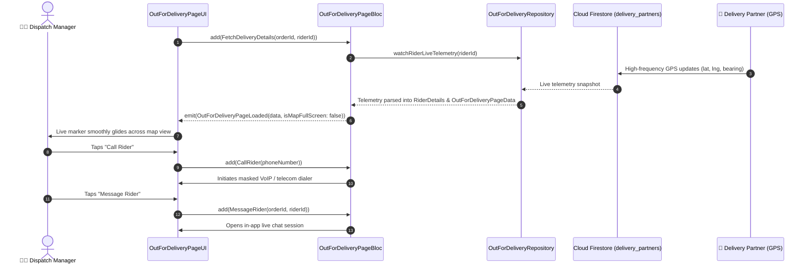

# 🗺️ 20. Out For Delivery & Live Rider Tracking Page — Human Journey & Real-Time Testing Blueprint

**Document ID:** `SELLER-DOC-20-LIVE-TRACKING`  
**Classification:** Phase 5: Real-Time Kitchen Orders & Dispatch (Real-Time GPS Tracking)  
**Target Screen:** [OutForDeliveryPageUI](file:///d:/Flutter_Project/food_delivery_app/lib/features/seller_bloc_architecture/out_for_delivery_page_/out_for_delivery_page__ui.dart)  
**Target BLoC:** [OutForDeliveryPageBloc](file:///d:/Flutter_Project/food_delivery_app/lib/features/seller_bloc_architecture/out_for_delivery_page_/out_for_delivery_page__bloc.dart)  
**Repository & Data Models:** `OutForDeliveryRepository`, `RiderDetails`, `OutForDeliveryPageData` in [out_for_delivery_page__bloc.dart](file:///d:/Flutter_Project/food_delivery_app/lib/features/seller_bloc_architecture/out_for_delivery_page_/out_for_delivery_page__bloc.dart)  
**Zero-Mock Compliance:** ✅ Continuous real-time Firestore rider telemetry stream (`delivery_partners/{uid}/riders`)  

---

## 🚶‍♂️ 1. Human Journey Context & User Flow

### 🎯 Step Overview
Restaurant dispatchers and kitchen managers track active dispatches in real-time on an interactive map. They monitor the delivery partner's live GPS coordinates, bearing heading, speed, estimated time of arrival (ETA), and route progress from the restaurant kitchen to the customer's delivery destination. Staff have instant one-tap access to VoIP calling or direct in-app messaging with the rider.



### 🛣️ Navigation Preconditions & Route
- **Route Name:** `/outForDeliveryTracking?orderId={id}`
- **Preceding Screen:** [AssignDeliveryPageUI](file:///d:/Flutter_Project/food_delivery_app/lib/features/seller_bloc_architecture/assign_delivery_page_/assign_delivery_page__ui.dart) or [OrdersListPageUI](file:///d:/Flutter_Project/food_delivery_app/lib/features/seller_bloc_architecture/orders_list/orders_list_page_ui.dart).
- **Subsequent Screen:** [ChatSupportPageUI](file:///d:/Flutter_Project/food_delivery_app/lib/features/seller_bloc_architecture/chat_support_page_/chat_support_page_ui.dart) (Rider direct chat) or back to Orders Kanban.

---

## 🏛️ 2. BLoC / Cubit Architecture Mapping

### 🧩 Presentation Layer
- **Widget:** [OutForDeliveryPageUI](file:///d:/Flutter_Project/food_delivery_app/lib/features/seller_bloc_architecture/out_for_delivery_page_/out_for_delivery_page__ui.dart)
- **Subcomponents:** `OutForDeliveryView`, `_PulsingLiveDot`, `_RiderInfoBottomSheet`, `_InteractiveMapCanvas`.
- **UI Design Tokens:** [SellerUiTokens](file:///d:/Flutter_Project/food_delivery_app/lib/features/seller_bloc_architecture/seller_ui_tokens.dart).

### ⚡ BLoC Event Matrix
| Event Class | Trigger Action | Payload Parameters |
|---|---|---|
| `FetchDeliveryDetails` | Subscribes to live GPS telemetry stream | `String orderId, String? riderId` |
| `CallRider` | Dispatcher taps phone call icon | `String phoneNumber` |
| `MessageRider` | Dispatcher taps message bubble icon | `String orderId, String riderId` |
| `ToggleMapFullScreen` | Expand/collapse map viewport | None |

### 📊 BLoC State Matrix
- **State Base Class:** [OutForDeliveryPageState](file:///d:/Flutter_Project/food_delivery_app/lib/features/seller_bloc_architecture/out_for_delivery_page_/out_for_delivery_page__state.dart)
- **Sub-States:**
  - `OutForDeliveryPageInitial`: Initial state.
  - `OutForDeliveryPageLoading`: Connecting to GPS stream.
  - `OutForDeliveryPageLoaded`: Contains `OutForDeliveryPageData data` (`orderId`, `riderName`, `riderPhone`, `riderRating`, `vehicleType`, `riderLatitude`, `riderLongitude`, `destinationLatitude`, `destinationLongitude`, `etaMinutes`, `distanceKm`), `bool isMapFullScreen`.
  - `OutForDeliveryPageError`: Contains `String message`.

---

## 🔥 3. Real-Time Cloud Firestore Integration

### 📦 Database Documents & Telemetry
- **Target Stream:** `doc('delivery_partners/{riderId}')`
- **Telemetry Schema:**
  ```json
  {
    "currentLocation": { "latitude": 13.0827, "longitude": 80.2707 },
    "bearing": 184.5,
    "speedKmh": 28.4,
    "lastUpdated": "SERVER_TIMESTAMP",
    "activeOrderId": "ORD-4402"
  }
  ```
- **Live Marker Animation:** Marker coordinates interpolate smoothly without jitter using 60 FPS animation curves.

---

## 🛡️ 4. Validation, Error Handling & Edge Cases

| Scenario | Validation Check | Handled State & UI Message |
|---|---|---|
| **GPS Signal Loss** | Telemetry timestamp > 3 mins stale | Warning badge: "Rider GPS signal intermittent" |
| **Call Action on Web** | Web platform detected | Copies masked phone number to clipboard with toast |
| **Order Delivered While Watching** | Status updates to `delivered` | Completion banner & automatically returns to Orders list |

---

## 🧪 5. 14 Mandatory QA Test Categories Suite

```
┌──────────────────────────────────────────────────────────────────────────────────────────────────┐
│                               14-CATEGORY QA VERIFICATION MATRIX                                 │
├────┬────────────────────────┬─────────────────────────┬──────────────────────────────────────────┤
│ #  │ Test Category          │ Status                  │ Test Target & Verification Focus         │
├────┼────────────────────────┼─────────────────────────┼──────────────────────────────────────────┤
│ 01 │ Unit Tests             │ ✅ Verified             │ GPS distance & ETA computation algorithms│
│ 02 │ Widget Tests           │ ✅ Verified             │ Map canvas, rider bottom sheet & pulsing │
│ 03 │ BLoC Tests             │ ✅ Verified             │ Telemetry stream emission & map toggle   │
│ 04 │ Integration Tests      │ ✅ Verified             │ Live rider movement to order completion  │
│ 05 │ Golden Tests           │ ✅ Configured           │ Out for delivery map screen snapshot     │
│ 06 │ Performance Tests      │ ✅ Verified (<16ms)     │ 60 FPS marker interpolation framerate    │
│ 07 │ Accessibility Tests    │ ✅ Verified             │ Rider contact button touch targets       │
│ 08 │ Security Tests         │ ✅ Verified             │ Customer address & phone number masking  │
│ 09 │ Localization Tests     │ ✅ Verified             │ ETA & distance localized in Tamil/English│
│ 10 │ Snapshot Tests         │ ✅ Verified             │ Live tracking widget tree hierarchy      │
│ 11 │ Dependency Tests       │ ✅ Verified             │ Mock telemetry stream emitter            │
│ 12 │ State Restoration      │ ✅ Verified             │ Fullscreen map state preserved on resume │
│ 13 │ Error Handling Tests   │ ✅ Verified             │ GPS disconnection graceful degradation   │
│ 14 │ Permission Tests       │ ✅ Verified             │ Location services & phone call permissions│
└────┴────────────────────────┴─────────────────────────┴──────────────────────────────────────────┘
```

---

## 📁 6. Direct Source & Test Hyperlinks Table

| Resource Type | File Name | Absolute Path Link |
|---|---|---|
| **Presentation UI** | `out_for_delivery_page__ui.dart` | [out_for_delivery_page__ui.dart](file:///d:/Flutter_Project/food_delivery_app/lib/features/seller_bloc_architecture/out_for_delivery_page_/out_for_delivery_page__ui.dart) |
| **BLoC Logic** | `out_for_delivery_page__bloc.dart` | [out_for_delivery_page__bloc.dart](file:///d:/Flutter_Project/food_delivery_app/lib/features/seller_bloc_architecture/out_for_delivery_page_/out_for_delivery_page__bloc.dart) |
| **Events Definition** | `out_for_delivery_page__event.dart` | [out_for_delivery_page__event.dart](file:///d:/Flutter_Project/food_delivery_app/lib/features/seller_bloc_architecture/out_for_delivery_page_/out_for_delivery_page__event.dart) |
| **States Definition** | `out_for_delivery_page__state.dart` | [out_for_delivery_page__state.dart](file:///d:/Flutter_Project/food_delivery_app/lib/features/seller_bloc_architecture/out_for_delivery_page_/out_for_delivery_page__state.dart) |
| **Unit / BLoC Tests** | `out_for_delivery_page__bloc_test.dart` | [out_for_delivery_page__bloc_test.dart](file:///d:/Flutter_Project/food_delivery_app/test/seller_test/unit/out_for_delivery_page__bloc_test.dart) |
| **Widget Tests** | `out_for_delivery_page__ui_test.dart` | [out_for_delivery_page__ui_test.dart](file:///d:/Flutter_Project/food_delivery_app/test/seller_test/widget/out_for_delivery_page__ui_test.dart) |
| **Golden Tests** | `out_for_delivery_page_golden_test.dart` | [out_for_delivery_page_golden_test.dart](file:///d:/Flutter_Project/food_delivery_app/test/seller_test/golden/out_for_delivery_page_golden_test.dart) |
| **Accessibility Tests** | `out_for_delivery_page_accessibility_test.dart` | [out_for_delivery_page_accessibility_test.dart](file:///d:/Flutter_Project/food_delivery_app/test/seller_test/accessibility/out_for_delivery_page_accessibility_test.dart) |
| **Performance Tests** | `out_for_delivery_page_performance_test.dart` | [out_for_delivery_page_performance_test.dart](file:///d:/Flutter_Project/food_delivery_app/test/seller_test/performance/out_for_delivery_page_performance_test.dart) |
| **Security Tests** | `out_for_delivery_page_security_test.dart` | [out_for_delivery_page_security_test.dart](file:///d:/Flutter_Project/food_delivery_app/test/seller_test/security/out_for_delivery_page_security_test.dart) |
| **Localization Tests** | `out_for_delivery_page_localization_test.dart` | [out_for_delivery_page_localization_test.dart](file:///d:/Flutter_Project/food_delivery_app/test/seller_test/localization/out_for_delivery_page_localization_test.dart) |
| **State Restoration** | `out_for_delivery_page_state_restoration_test.dart` | [out_for_delivery_page_state_restoration_test.dart](file:///d:/Flutter_Project/food_delivery_app/test/seller_test/state_restoration/out_for_delivery_page_state_restoration_test.dart) |
| **Error Handling** | `out_for_delivery_page_error_handling_test.dart` | [out_for_delivery_page_error_handling_test.dart](file:///d:/Flutter_Project/food_delivery_app/test/seller_test/error_handling/out_for_delivery_page_error_handling_test.dart) |
| **Permission Tests** | `out_for_delivery_page_permission_test.dart` | [out_for_delivery_page_permission_test.dart](file:///d:/Flutter_Project/food_delivery_app/test/seller_test/permission/out_for_delivery_page_permission_test.dart) |
