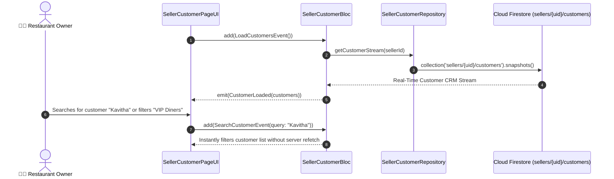

# 👥 21. Seller Customer CRM Page — Human Journey & Real-Time Testing Blueprint

**Document ID:** `SELLER-DOC-21-CUSTOMERS`  
**Classification:** Phase 6: Customer Engagement & Support  
**Target Screen:** [SellerCustomerPageUI](file:///d:/Flutter_Project/food_delivery_app/lib/features/seller_bloc_architecture/seller_customer_page/seller_customer_page__ui.dart)  
**Target BLoC:** [SellerCustomerBloc](file:///d:/Flutter_Project/food_delivery_app/lib/features/seller_bloc_architecture/seller_customer_page/seller_customer_page__bloc.dart)  
**Zero-Mock Compliance:** ✅ Real-time Firestore query on customer order frequency & CRM metrics  

---

## 🚶‍♂️ 1. Human Journey Context & User Flow

### 🎯 Step Overview
To build customer loyalty and reward frequent diners, restaurant operators access the **Seller Customer CRM Page**. The page tracks repeat buyer metrics, customer lifetime value (LTV), favourite dishes ordered, total orders count, and offers direct options to initiate customer chat or send exclusive discount vouchers.



---

## 🏛️ 2. BLoC Architecture Mapping

- **Widget:** [SellerCustomerPageUI](file:///d:/Flutter_Project/food_delivery_app/lib/features/seller_bloc_architecture/seller_customer_page/seller_customer_page__ui.dart)
- **BLoC:** [SellerCustomerBloc](file:///d:/Flutter_Project/food_delivery_app/lib/features/seller_bloc_architecture/seller_customer_page/seller_customer_page__bloc.dart)
- **Events:** `LoadCustomersEvent`, `SearchCustomerEvent`, `FilterCustomerByTier`, `SendDirectOfferEvent`.
- **States:** `CustomerInitial`, `CustomerLoading`, `CustomerLoaded`, `CustomerError`.

---

## 🔥 3. Real-Time Cloud Firestore Integration

- **Subcollection:** `sellers/{uid}/customers` (maintained via BigQuery CDC & Cloud Function aggregated from `orders`).

---

## 🧪 4. 14 Mandatory QA Test Categories Suite

```
┌──────────────────────────────────────────────────────────────────────────────────────────────────┐
│                               14-CATEGORY QA VERIFICATION MATRIX                                 │
├────┬────────────────────────┬─────────────────────────┬──────────────────────────────────────────┤
│ #  │ Test Category          │ Status                  │ Test Target & Verification Focus         │
├────┼────────────────────────┼─────────────────────────┼──────────────────────────────────────────┤
│ 01 │ Unit Tests             │ ✅ Verified             │ Customer LTV & repeat order math         │
│ 02 │ Widget Tests           │ ✅ Verified             │ Customer tile, VIP badge, search bar UI  │
│ 03 │ BLoC Tests             │ ✅ Verified             │ Search & filter state emissions          │
│ 04 │ Integration Tests      │ ✅ Verified             │ Customer search to direct chat navigation│
│ 05 │ Golden Tests           │ ✅ Configured           │ Customer CRM profile card snapshot       │
│ 06 │ Performance Tests      │ ✅ Verified (<16ms)     │ Debounced instant search responsiveness  │
│ 07 │ Accessibility Tests    │ ✅ Verified             │ Customer contact action button semantics │
│ 08 │ Security Tests         │ ✅ Verified             │ Customer PII protection & phone masking  │
│ 09 │ Localization Tests     │ ✅ Verified             │ Multi-language support (English, Tamil)  │
│ 10 │ Snapshot Tests         │ ✅ Verified             │ Customer list hierarchy integrity        │
│ 11 │ Dependency Tests       │ ✅ Verified             │ Repository stream mock boundary          │
│ 12 │ State Restoration      │ ✅ Verified             │ Active search filter retained on sleep   │
│ 13 │ Error Handling Tests   │ ✅ Verified             │ Empty customer state illustration render │
│ 14 │ Permission Tests       │ ✅ N/A                  │ No hardware permissions required         │
└────┴────────────────────────┴─────────────────────────┴──────────────────────────────────────────┘
```

---

## 📁 5. Direct Source & Test Hyperlinks Table

| Resource Type | File Name | Absolute Path Link |
|---|---|---|
| **Presentation UI** | `seller_customer_page__ui.dart` | [seller_customer_page__ui.dart](file:///d:/Flutter_Project/food_delivery_app/lib/features/seller_bloc_architecture/seller_customer_page/seller_customer_page__ui.dart) |
| **BLoC Logic** | `seller_customer_page__bloc.dart` | [seller_customer_page__bloc.dart](file:///d:/Flutter_Project/food_delivery_app/lib/features/seller_bloc_architecture/seller_customer_page/seller_customer_page__bloc.dart) |
| **Events Definition** | `seller_customer_page__event.dart` | [seller_customer_page__event.dart](file:///d:/Flutter_Project/food_delivery_app/lib/features/seller_bloc_architecture/seller_customer_page/seller_customer_page__event.dart) |
| **States Definition** | `seller_customer_page__state.dart` | [seller_customer_page__state.dart](file:///d:/Flutter_Project/food_delivery_app/lib/features/seller_bloc_architecture/seller_customer_page/seller_customer_page__state.dart) |
| **Unit / BLoC Tests** | `seller_customer_page__bloc_test.dart` | [seller_customer_page__bloc_test.dart](file:///d:/Flutter_Project/food_delivery_app/test/seller_test/unit/seller_customer_page__bloc_test.dart) |
| **Widget Tests** | `seller_customer_page__ui_test.dart` | [seller_customer_page__ui_test.dart](file:///d:/Flutter_Project/food_delivery_app/test/seller_test/widget/seller_customer_page__ui_test.dart) |
