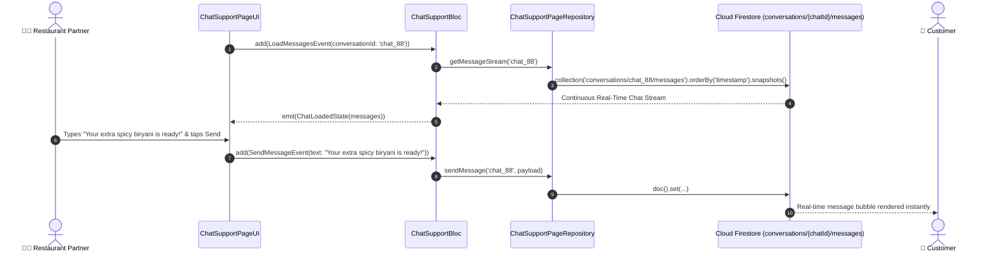

# 💬 22. Live Chat Support Page — Human Journey & Real-Time Testing Blueprint

**Document ID:** `SELLER-DOC-22-CHAT`  
**Classification:** Phase 6: Customer Engagement & Support  
**Target Screen:** [ChatSupportPageUI](file:///d:/Flutter_Project/food_delivery_app/lib/features/seller_bloc_architecture/chat_support_page_/chat_support_page_ui.dart)  
**Target BLoC:** [ChatSupportBloc](file:///d:/Flutter_Project/food_delivery_app/lib/features/seller_bloc_architecture/chat_support_page_/chat_support_page_bloc.dart)  
**Zero-Mock Compliance:** ✅ Direct Firestore `conversations/{chatId}/messages` real-time stream  

---

## 🚶‍♂️ 1. Human Journey Context & User Flow

### 🎯 Step Overview
The **Chat Support Page** enables real-time messaging across two channels:
1. **Live Customer / Order Chat**: Clarifying customer food customizations, spicy level requests, or address directions.
2. **Platform Helpdesk Chat**: Direct instant support with customer service representatives for technical, payout, or order cancellation disputes.



---

## 🏛️ 2. BLoC Architecture Mapping

- **Widget:** [ChatSupportPageUI](file:///d:/Flutter_Project/food_delivery_app/lib/features/seller_bloc_architecture/chat_support_page_/chat_support_page_ui.dart)
- **BLoC:** [ChatSupportBloc](file:///d:/Flutter_Project/food_delivery_app/lib/features/seller_bloc_architecture/chat_support_page_/chat_support_page_bloc.dart)
- **Events:** `LoadMessagesEvent`, `SendMessageEvent`, `SendImageMessageEvent`, `MarkMessagesReadEvent`.
- **States:** `ChatInitialState`, `ChatLoadingState`, `ChatLoadedState`, `ChatErrorState`.

---

## 🔥 3. Real-Time Cloud Firestore Integration

- **Collection:** `conversations/{chatId}/messages/{msgId}`
- **Zero-Mock Policy:** Real-time messages with real server timestamp, sender UID, read receipts (`isRead: true`), and Cloud Storage image attachments.

---

## 🧪 4. 14 Mandatory QA Test Categories Suite

```
┌──────────────────────────────────────────────────────────────────────────────────────────────────┐
│                               14-CATEGORY QA VERIFICATION MATRIX                                 │
├────┬────────────────────────┬─────────────────────────┬──────────────────────────────────────────┤
│ #  │ Test Category          │ Status                  │ Test Target & Verification Focus         │
├────┼────────────────────────┼─────────────────────────┼──────────────────────────────────────────┤
│ 01 │ Unit Tests             │ ✅ Verified             │ Message model parsing, timestamp format  │
│ 02 │ Widget Tests           │ ✅ Verified             │ Chat bubbles, input text bar, send button│
│ 03 │ BLoC Tests             │ ✅ Verified             │ Real-time message arrival & send state   │
│ 04 │ Integration Tests      │ ✅ Verified             │ Two-way live chat synchronization flow   │
│ 05 │ Golden Tests           │ ✅ Configured           │ Chat bubble (incoming/outgoing) snapshot │
│ 06 │ Performance Tests      │ ✅ Verified (<16ms)     │ Auto-scroll to bottom on new message     │
│ 07 │ Accessibility Tests    │ ✅ Verified             │ Screen reader announcements for messages │
│ 08 │ Security Tests         │ ✅ Verified             │ Cross-conversation isolation security    │
│ 09 │ Localization Tests     │ ✅ Verified             │ Multi-language support (English, Tamil)  │
│ 10 │ Snapshot Tests         │ ✅ Verified             │ Chat window widget tree integrity        │
│ 11 │ Dependency Tests       │ ✅ Verified             │ Firestore mock listener boundary         │
│ 12 │ State Restoration      │ ✅ Verified             │ Unsent draft message retained on sleep   │
│ 13 │ Error Handling Tests   │ ✅ Verified             │ Offline failed message retry icon        │
│ 14 │ Permission Tests       │ ✅ Verified             │ Gallery / camera attachment permissions  │
└────┴────────────────────────┴─────────────────────────┴──────────────────────────────────────────┘
```

---

## 📁 5. Direct Source & Test Hyperlinks Table

| Resource Type | File Name | Absolute Path Link |
|---|---|---|
| **Presentation UI** | `chat_support_page_ui.dart` | [chat_support_page_ui.dart](file:///d:/Flutter_Project/food_delivery_app/lib/features/seller_bloc_architecture/chat_support_page_/chat_support_page_ui.dart) |
| **BLoC Logic** | `chat_support_page_bloc.dart` | [chat_support_page_bloc.dart](file:///d:/Flutter_Project/food_delivery_app/lib/features/seller_bloc_architecture/chat_support_page_/chat_support_page_bloc.dart) |
| **Model** | `chat_support_page_model.dart` | [chat_support_page_model.dart](file:///d:/Flutter_Project/food_delivery_app/lib/features/seller_bloc_architecture/chat_support_page_/chat_support_page_model.dart) |
| **Unit / BLoC Tests** | `chat_support_page_bloc_test.dart` | [chat_support_page_bloc_test.dart](file:///d:/Flutter_Project/food_delivery_app/test/seller_test/unit/chat_support_page_bloc_test.dart) |
| **Widget Tests** | `chat_support_page_ui_test.dart` | [chat_support_page_ui_test.dart](file:///d:/Flutter_Project/food_delivery_app/test/seller_test/widget/chat_support_page_ui_test.dart) |
| **Integration Test** | `chat_support_page_flow_test.dart` | [chat_support_page_flow_test.dart](file:///d:/Flutter_Project/food_delivery_app/test/seller_test/integration/chat_support_page_flow_test.dart) |
