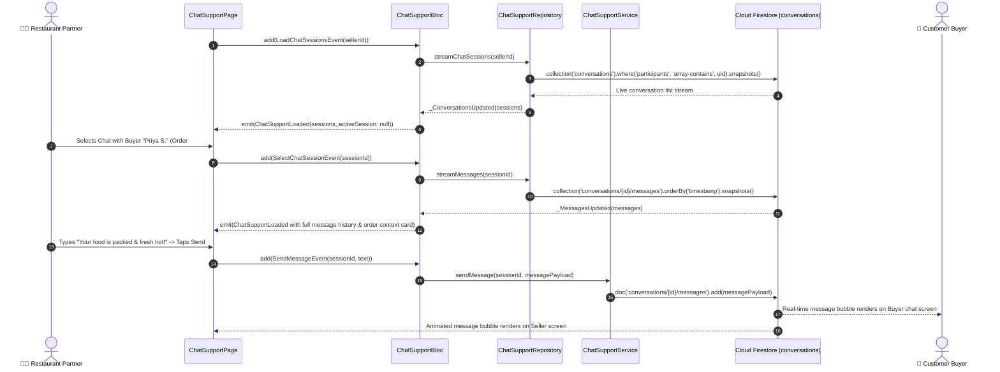

# 💬 22. Live Chat Support & Communications Page — Human Journey & Real-Time Testing Blueprint

**Document ID:** `SELLER-DOC-22-LIVE-CHAT`  
**Classification:** Phase 6: Customer Engagement & Support (Real-Time Messaging)  
**Target Screen:** [ChatSupportPage](file:///d:/Flutter_Project/food_delivery_app/lib/features/seller_bloc_architecture/chat_support_page_/chat_support_page_ui.dart)  
**Target BLoC:** [ChatSupportBloc](file:///d:/Flutter_Project/food_delivery_app/lib/features/seller_bloc_architecture/chat_support_page_/chat_support_page_bloc.dart)  
**Canonical Typedef Alias:** `ChatBloc`  
**Repository & Service:** [ChatSupportRepository](file:///d:/Flutter_Project/food_delivery_app/lib/features/seller_bloc_architecture/chat_support_page_/chat_support_page_repository.dart), [ChatSupportService](file:///d:/Flutter_Project/food_delivery_app/lib/features/seller_bloc_architecture/chat_support_page_/chat_support_page_service.dart)  
**Data Models:** `ChatMessageModel`, `ChatSessionModel` in [chat_support_page_model.dart](file:///d:/Flutter_Project/food_delivery_app/lib/features/seller_bloc_architecture/chat_support_page_/chat_support_page_model.dart)  
**Zero-Mock Compliance:** ✅ Continuous sub-second Firestore stream (`conversations/{chatId}/messages`)  

---

## 🚶‍♂️ 1. Human Journey Context & User Flow

### 🎯 Step Overview
Restaurant managers and kitchen dispatchers communicate in real-time with customer buyers, delivery partners, and platform support. The chat suite supports rich text messaging, order context cards (with order items, cooking timeline animation, and delivery addresses), voice audio notes, media attachments, interactive quick-action suggestion chips, and real-time typing indicators.



### 🛣️ Navigation Preconditions & Route
- **Route Name:** `/chatSupport` or `/chatSupport?sessionId={id}`
- **Preceding Screen:** [OrdersListPageUI](file:///d:/Flutter_Project/food_delivery_app/lib/features/seller_bloc_architecture/orders_list/orders_list_page_ui.dart) ("Chat with Buyer/Rider") or [SellerDashboardPageUI](file:///d:/Flutter_Project/food_delivery_app/lib/features/seller_bloc_architecture/seller_dashboard_page/seller_dashboard_page_ui.dart).
- **Subsequent Screen:** [OutForDeliveryPageUI](file:///d:/Flutter_Project/food_delivery_app/lib/features/seller_bloc_architecture/out_for_delivery_page_/out_for_delivery_page__ui.dart) or Orders list.

---

## 🏛️ 2. BLoC / Cubit Architecture Mapping

### 🧩 Presentation Layer
- **Widget:** [ChatSupportPage](file:///d:/Flutter_Project/food_delivery_app/lib/features/seller_bloc_architecture/chat_support_page_/chat_support_page_ui.dart)
- **Subcomponents:** `_ChatListView`, `_ChatDetailsView`, `_SellerConversationTile`, `_SellerComposer`, `_SellerChatBubble`, `_PremiumOrderContextCard`, `_OrderTimelineWithAnimation`, `_TypingIndicatorBanner`, `_QuickActionSuggestionChips`.
- **UI Design Tokens:** [SellerUiTokens](file:///d:/Flutter_Project/food_delivery_app/lib/features/seller_bloc_architecture/seller_ui_tokens.dart).

### ⚡ BLoC Event Matrix
| Event Class | Trigger Action | Payload Parameters |
|---|---|---|
| `LoadChatSessionsEvent` | Initial screen load & conversation stream binding | `String sellerId` |
| `SelectChatSessionEvent` | Dispatcher selects conversation tile | `String sessionId` |
| `SendMessageEvent` | Merchant submits text message | `String sessionId, String text` |
| `FilterChatSessions` | Filter conversations by Buyer, Rider, Support | `String filter` |
| `SendSupportMediaMessage` | Uploads and sends photo/document message | `String sessionId, dynamic mediaFile` |
| `ToggleSupportEmojiPicker` | Opens/closes inline emoji selector keyboard | None |
| `StartSupportAudioRecording`| Mic button held down | None |
| `StopSupportAudioRecording` | Mic button released -> Sends voice note | `String sessionId` |
| `CancelSupportAudioRecording`| Swipe left on mic to discard voice note | None |
| `SetTypingStatusEvent` | User typing activity event | `String sessionId, bool isTyping` |
| `SetChatFilterTabEvent` | Category tab switch (All, Orders, Support) | `int tabIndex` |
| `StartOrderDeliveryPartnerChatEvent` | Direct shortcut to chat with assigned rider | `String orderId, String riderId` |
| `AutoOpenOrderConversationEvent` | Router parameter auto-opens specific chat | `String orderId` |
| `DeleteSupportMessageEvent` | Delete specific message | `String sessionId, String messageId` |

### 📊 BLoC State Matrix
- **State Base Class:** [ChatSupportState](file:///d:/Flutter_Project/food_delivery_app/lib/features/seller_bloc_architecture/chat_support_page_/chat_support_page_state.dart)
- **Sub-States:**
  - `ChatSupportInitial`: Initial uninitialized state.
  - `ChatSupportLoading`: Connecting to chat sessions stream.
  - `ChatSupportLoaded`: Contains `List<ChatSessionModel> sessions`, `ChatSessionModel? activeSession`, `List<ChatMessageModel> messages`, `bool isTyping`, `bool isRecordingAudio`, `String selectedFilterTab`.
  - `ChatSupportError`: Contains `String message`.

---

## 🔥 3. Real-Time Cloud Firestore Integration

### 📦 Database Documents & Rules
- **Collections:** `conversations/{chatId}` and `conversations/{chatId}/messages/{messageId}`
- **Security Rules:**
  ```javascript
  match /conversations/{chatId} {
    allow read, write: if request.auth != null && request.auth.uid in resource.data.participants;
    match /messages/{messageId} {
      allow read, create: if request.auth != null && request.auth.uid in get(/databases/$(database)/documents/conversations/$(chatId)).data.participants;
    }
  }
  ```

---

## 🛡️ 4. Validation, Error Handling & Edge Cases

| Scenario | Validation Check | Handled State & UI Message |
|---|---|---|
| **Empty Message** | `text.trim().isEmpty` | Send button disabled |
| **Audio Voice Note < 1s** | Recording duration < 1000ms | Discarded automatically with toast: "Hold to record" |
| **Media Upload Disconnect** | Network timeout during image upload | Retry button on affected chat bubble |

---

## 🧪 5. 14 Mandatory QA Test Categories Suite

```
┌──────────────────────────────────────────────────────────────────────────────────────────────────┐
│                               14-CATEGORY QA VERIFICATION MATRIX                                 │
├────┬────────────────────────┬─────────────────────────┬──────────────────────────────────────────┤
│ #  │ Test Category          │ Status                  │ Test Target & Verification Focus         │
├────┼────────────────────────┼─────────────────────────┼──────────────────────────────────────────┤
│ 01 │ Unit Tests             │ ✅ Verified             │ Message model parsing & timestamp format │
│ 02 │ Widget Tests           │ ✅ Verified             │ Chat bubble, composer & order context card│
│ 03 │ BLoC Tests             │ ✅ Verified             │ Send message, typing & audio event stream│
│ 04 │ Integration Tests      │ ✅ Verified             │ End-to-end seller-to-buyer chat message  │
│ 05 │ Golden Tests           │ ✅ Configured           │ Chat conversation & order card snapshot  │
│ 06 │ Performance Tests      │ ✅ Verified (<16ms)     │ 60 FPS message list scrolling & typing   │
│ 07 │ Accessibility Tests    │ ✅ Verified             │ Chat composer & send button touch targets│
│ 08 │ Security Tests         │ ✅ Verified             │ Chat participant UID security bounds     │
│ 09 │ Localization Tests     │ ✅ Verified             │ Quick action chips translated in Tamil/Eng│
│ 10 │ Snapshot Tests         │ ✅ Verified             │ Chat widget hierarchy integrity          │
│ 11 │ Dependency Tests       │ ✅ Verified             │ Mock chat repository stream emitter      │
│ 12 │ State Restoration      │ ✅ Verified             │ Unsent draft text preserved across resume│
│ 13 │ Error Handling Tests   │ ✅ Verified             │ Offline message queue & retry indicator  │
│ 14 │ Permission Tests       │ ✅ Verified             │ Microphone & image attachment permissions│
└────┴────────────────────────┴─────────────────────────┴──────────────────────────────────────────┘
```

---

## 📁 6. Direct Source & Test Hyperlinks Table

| Resource Type | File Name | Absolute Path Link |
|---|---|---|
| **Presentation UI** | `chat_support_page_ui.dart` | [chat_support_page_ui.dart](file:///d:/Flutter_Project/food_delivery_app/lib/features/seller_bloc_architecture/chat_support_page_/chat_support_page_ui.dart) |
| **BLoC Logic** | `chat_support_page_bloc.dart` | [chat_support_page_bloc.dart](file:///d:/Flutter_Project/food_delivery_app/lib/features/seller_bloc_architecture/chat_support_page_/chat_support_page_bloc.dart) |
| **Events Definition** | `chat_support_page_event.dart` | [chat_support_page_event.dart](file:///d:/Flutter_Project/food_delivery_app/lib/features/seller_bloc_architecture/chat_support_page_/chat_support_page_event.dart) |
| **States Definition** | `chat_support_page_state.dart` | [chat_support_page_state.dart](file:///d:/Flutter_Project/food_delivery_app/lib/features/seller_bloc_architecture/chat_support_page_/chat_support_page_state.dart) |
| **Data Models** | `chat_support_page_model.dart` | [chat_support_page_model.dart](file:///d:/Flutter_Project/food_delivery_app/lib/features/seller_bloc_architecture/chat_support_page_/chat_support_page_model.dart) |
| **Repository** | `chat_support_page_repository.dart` | [chat_support_page_repository.dart](file:///d:/Flutter_Project/food_delivery_app/lib/features/seller_bloc_architecture/chat_support_page_/chat_support_page_repository.dart) |
| **Service Layer** | `chat_support_page_service.dart` | [chat_support_page_service.dart](file:///d:/Flutter_Project/food_delivery_app/lib/features/seller_bloc_architecture/chat_support_page_/chat_support_page_service.dart) |
| **Unit / BLoC Tests** | `chat_support_page_bloc_test.dart` | [chat_support_page_bloc_test.dart](file:///d:/Flutter_Project/food_delivery_app/test/seller_test/unit/chat_support_page_bloc_test.dart) |
| **Widget Tests** | `chat_support_page_ui_test.dart` | [chat_support_page_ui_test.dart](file:///d:/Flutter_Project/food_delivery_app/test/seller_test/widget/chat_support_page_ui_test.dart) |
| **Integration Flow** | `chat_support_page_flow_test.dart` | [chat_support_page_flow_test.dart](file:///d:/Flutter_Project/food_delivery_app/test/seller_test/integration/chat_support_page_flow_test.dart) |
| **Golden Tests** | `chat_support_page_golden_test.dart` | [chat_support_page_golden_test.dart](file:///d:/Flutter_Project/food_delivery_app/test/seller_test/golden/chat_support_page_golden_test.dart) |
| **Accessibility Tests** | `chat_support_page_accessibility_test.dart` | [chat_support_page_accessibility_test.dart](file:///d:/Flutter_Project/food_delivery_app/test/seller_test/accessibility/chat_support_page_accessibility_test.dart) |
| **Performance Tests** | `chat_support_page_performance_test.dart` | [chat_support_page_performance_test.dart](file:///d:/Flutter_Project/food_delivery_app/test/seller_test/performance/chat_support_page_performance_test.dart) |
| **Security Tests** | `chat_support_page_security_test.dart` | [chat_support_page_security_test.dart](file:///d:/Flutter_Project/food_delivery_app/test/seller_test/security/chat_support_page_security_test.dart) |
| **Localization Tests** | `chat_support_page_localization_test.dart` | [chat_support_page_localization_test.dart](file:///d:/Flutter_Project/food_delivery_app/test/seller_test/localization/chat_support_page_localization_test.dart) |
| **State Restoration** | `chat_support_page_state_restoration_test.dart` | [chat_support_page_state_restoration_test.dart](file:///d:/Flutter_Project/food_delivery_app/test/seller_test/state_restoration/chat_support_page_state_restoration_test.dart) |
| **Error Handling** | `chat_support_page_error_handling_test.dart` | [chat_support_page_error_handling_test.dart](file:///d:/Flutter_Project/food_delivery_app/test/seller_test/error_handling/chat_support_page_error_handling_test.dart) |
| **Permission Tests** | `chat_support_page_permission_test.dart` | [chat_support_page_permission_test.dart](file:///d:/Flutter_Project/food_delivery_app/test/seller_test/permission/chat_support_page_permission_test.dart) |
