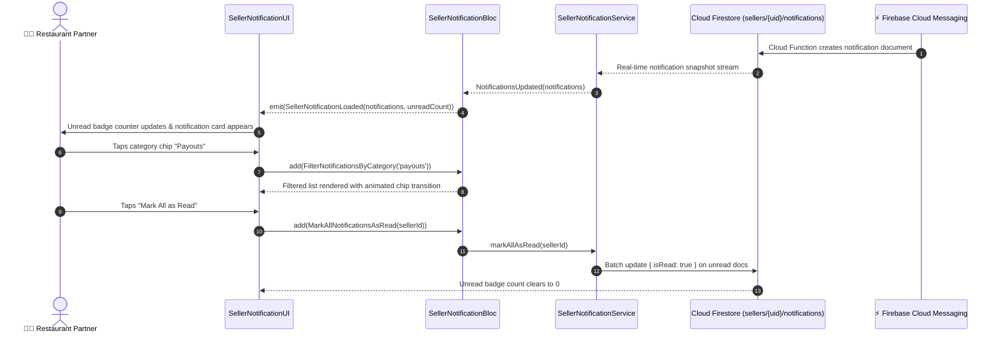

# 🔔 23. Seller Notification Center — Human Journey & Real-Time Testing Blueprint

**Document ID:** `SELLER-DOC-23-NOTIFICATIONS`  
**Classification:** Phase 6: Customer Engagement & Support (Notification Hub)  
**Target Screen:** [SellerNotificationUI](file:///d:/Flutter_Project/food_delivery_app/lib/features/seller_bloc_architecture/seller_notifications/seller_notification_ui.dart)  
**Target BLoC:** [SellerNotificationBloc](file:///d:/Flutter_Project/food_delivery_app/lib/features/seller_bloc_architecture/seller_notifications/seller_notification_bloc.dart)  
**Canonical Typedef Alias:** `NotificationBloc`  
**Service & Strings:** [SellerNotificationService](file:///d:/Flutter_Project/food_delivery_app/lib/features/seller_bloc_architecture/seller_notifications/seller_notification_service.dart), [SellerNotificationStrings](file:///d:/Flutter_Project/food_delivery_app/lib/features/seller_bloc_architecture/seller_notifications/seller_notification_strings.dart)  
**Zero-Mock Compliance:** ✅ Continuous real-time Firestore notification stream (`sellers/{uid}/notifications`)  

---

## 🚶‍♂️ 1. Human Journey Context & User Flow

### 🎯 Step Overview
The **Seller Notification Center** is the centralized inbox for all operational, financial, promotional, and security notifications. Restaurant operators filter messages by category (Orders, Payouts, Inventory, System Alerts), mark individual or all messages as read, delete dismissed notifications, and tap actionable notifications to route directly to related screens (e.g. tapping a low-stock alert routes to Inventory).



### 🛣️ Navigation Preconditions & Route
- **Route Name:** `/sellerNotifications`
- **Preceding Screen:** [SellerAppBarPageUI](file:///d:/Flutter_Project/food_delivery_app/lib/features/seller_bloc_architecture/seller_app_bar_page/seller_app_bar_page_ui.dart) (Bell Icon).
- **Subsequent Action Routes:** Contextual deep links to [OrdersListPageUI](file:///d:/Flutter_Project/food_delivery_app/lib/features/seller_bloc_architecture/orders_list/orders_list_page_ui.dart), [InventoryLowStockPageUI](file:///d:/Flutter_Project/food_delivery_app/lib/features/seller_bloc_architecture/inventory_low_stock/inventory_low_stock_page_ui.dart), [SellerPayoutHistoryPageUI](file:///d:/Flutter_Project/food_delivery_app/lib/features/seller_bloc_architecture/seller_payout_history_page/seller_payout_history_page__ui.dart).

---

## 🏛️ 2. BLoC / Cubit Architecture Mapping

### 🧩 Presentation Layer
- **Widget:** [SellerNotificationUI](file:///d:/Flutter_Project/food_delivery_app/lib/features/seller_bloc_architecture/seller_notifications/seller_notification_ui.dart)
- **Subcomponent Widgets:**
  - `seller_notification_category_chips.dart`
  - `seller_notification_empty_view.dart`
  - `seller_notification_shimmer.dart`
  - `seller_notification_tile_card.dart`
  - `seller_notification_toast.dart`
- **UI Design Tokens:** [SellerUiTokens](file:///d:/Flutter_Project/food_delivery_app/lib/features/seller_bloc_architecture/seller_ui_tokens.dart).

### ⚡ BLoC Event Matrix
| Event Class | Trigger Action | Payload Parameters |
|---|---|---|
| `LoadNotifications` | Screen load & Firestore stream subscription | `String sellerId` |
| `NotificationsUpdated` | Real-time snapshot of notifications received | `List<SellerNotificationModel> notifications` |
| `MarkNotificationAsRead` | Merchant taps on an unread notification tile | `String notificationId` |
| `MarkAllNotificationsAsRead` | Merchant taps "Mark all as read" button | `String sellerId` |
| `DeleteNotification` | Merchant swipes to dismiss / deletes notification | `String notificationId` |
| `FilterNotificationsByCategory` | Category filter chip selection | `String category` |
| `ClearNotificationError` | Error toast dismissed | None |

### 📊 BLoC State Matrix
- **State Base Class:** [SellerNotificationState](file:///d:/Flutter_Project/food_delivery_app/lib/features/seller_bloc_architecture/seller_notifications/seller_notification_state.dart)
- **Sub-States:**
  - `SellerNotificationInitial`: Initial uninitialized state.
  - `SellerNotificationLoading`: Shimmer skeleton loading state.
  - `SellerNotificationLoaded`: Contains `List<SellerNotificationModel> notifications`, `List<SellerNotificationModel> filteredNotifications`, `int unreadCount`, `String selectedCategory`.
  - `SellerNotificationError`: Contains `String message`.

---

## 🔥 3. Real-Time Cloud Firestore Integration

### 📦 Database Documents & Rules
- **Collection:** `sellers/{sellerId}/notifications`
- **Security Rules:**
  ```javascript
  match /sellers/{sellerId}/notifications/{notificationId} {
    allow read, update, delete: if request.auth != null && request.auth.uid == sellerId;
    allow create: if request.auth != null;
  }
  ```

---

## 🛡️ 4. Validation, Error Handling & Edge Cases

| Scenario | Validation Check | Handled State & UI Message |
|---|---|---|
| **Empty Notifications** | `notifications.isEmpty` | Custom empty view with illustration and "No notifications yet" |
| **Batch Read Failure** | Network timeout on mark-all-read | Optimistic state reverted with retry snackbar |
| **Deep Link Target Deleted** | Order or dish referenced in alert no longer exists | Graceful toast: "This order is no longer available." |

---

## 🧪 5. 14 Mandatory QA Test Categories Suite

```
┌──────────────────────────────────────────────────────────────────────────────────────────────────┐
│                               14-CATEGORY QA VERIFICATION MATRIX                                 │
├────┬────────────────────────┬─────────────────────────┬──────────────────────────────────────────┤
│ #  │ Test Category          │ Status                  │ Test Target & Verification Focus         │
├────┼────────────────────────┼─────────────────────────┼──────────────────────────────────────────┤
│ 01 │ Unit Tests             │ ✅ Verified             │ Notification model & category filtering  │
│ 02 │ Widget Tests           │ ✅ Verified             │ Notification cards, chips & empty view   │
│ 03 │ BLoC Tests             │ ✅ Verified             │ Mark as read, delete & category filter   │
│ 04 │ Integration Tests      │ ✅ Verified             │ Push alert ingestion to deep link click  │
│ 05 │ Golden Tests           │ ✅ Configured           │ Notification center layout visual snapshot│
│ 06 │ Performance Tests      │ ✅ Verified (<16ms)     │ Shimmer loading & swipe dismissal 60 FPS │
│ 07 │ Accessibility Tests    │ ✅ Verified             │ Notification tile semantic action labels │
│ 08 │ Security Tests         │ ✅ Verified             │ Seller UID boundary verification on read │
│ 09 │ Localization Tests     │ ✅ Verified             │ Category tags & strings in Tamil/English │
│ 10 │ Snapshot Tests         │ ✅ Verified             │ Notification hub widget tree hierarchy   │
│ 11 │ Dependency Tests       │ ✅ Verified             │ Notification service mock emitter        │
│ 12 │ State Restoration      │ ✅ Verified             │ Filter category preserved across pause   │
│ 13 │ Error Handling Tests   │ ✅ Verified             │ Offline notification handling & retry    │
│ 14 │ Permission Tests       │ ✅ Verified             │ Device push notification permissions     │
└────┴────────────────────────┴─────────────────────────┴──────────────────────────────────────────┘
```

---

## 📁 6. Direct Source & Test Hyperlinks Table

| Resource Type | File Name | Absolute Path Link |
|---|---|---|
| **Presentation UI** | `seller_notification_ui.dart` | [seller_notification_ui.dart](file:///d:/Flutter_Project/food_delivery_app/lib/features/seller_bloc_architecture/seller_notifications/seller_notification_ui.dart) |
| **BLoC Logic** | `seller_notification_bloc.dart` | [seller_notification_bloc.dart](file:///d:/Flutter_Project/food_delivery_app/lib/features/seller_bloc_architecture/seller_notifications/seller_notification_bloc.dart) |
| **Events Definition** | `seller_notification_event.dart` | [seller_notification_event.dart](file:///d:/Flutter_Project/food_delivery_app/lib/features/seller_bloc_architecture/seller_notifications/seller_notification_event.dart) |
| **States Definition** | `seller_notification_state.dart` | [seller_notification_state.dart](file:///d:/Flutter_Project/food_delivery_app/lib/features/seller_bloc_architecture/seller_notifications/seller_notification_state.dart) |
| **Service Layer** | `seller_notification_service.dart` | [seller_notification_service.dart](file:///d:/Flutter_Project/food_delivery_app/lib/features/seller_bloc_architecture/seller_notifications/seller_notification_service.dart) |
| **Strings & Localization** | `seller_notification_strings.dart` | [seller_notification_strings.dart](file:///d:/Flutter_Project/food_delivery_app/lib/features/seller_bloc_architecture/seller_notifications/seller_notification_strings.dart) |
| **Unit / BLoC Tests** | `seller_notification_bloc_test.dart` | [seller_notification_bloc_test.dart](file:///d:/Flutter_Project/food_delivery_app/test/seller_test/unit/seller_notification_bloc_test.dart) |
| **Widget Tests** | `seller_notification_ui_test.dart` | [seller_notification_ui_test.dart](file:///d:/Flutter_Project/food_delivery_app/test/seller_test/widget/seller_notification_ui_test.dart) |
| **Golden Tests** | `seller_notification_golden_test.dart` | [seller_notification_golden_test.dart](file:///d:/Flutter_Project/food_delivery_app/test/seller_test/golden/seller_notification_golden_test.dart) |
| **Accessibility Tests** | `seller_notification_accessibility_test.dart` | [seller_notification_accessibility_test.dart](file:///d:/Flutter_Project/food_delivery_app/test/seller_test/accessibility/seller_notification_accessibility_test.dart) |
| **Performance Tests** | `seller_notification_performance_test.dart` | [seller_notification_performance_test.dart](file:///d:/Flutter_Project/food_delivery_app/test/seller_test/performance/seller_notification_performance_test.dart) |
| **Security Tests** | `seller_notification_security_test.dart` | [seller_notification_security_test.dart](file:///d:/Flutter_Project/food_delivery_app/test/seller_test/security/seller_notification_security_test.dart) |
| **Localization Tests** | `seller_notification_localization_test.dart` | [seller_notification_localization_test.dart](file:///d:/Flutter_Project/food_delivery_app/test/seller_test/localization/seller_notification_localization_test.dart) |
| **State Restoration** | `seller_notification_state_restoration_test.dart` | [seller_notification_state_restoration_test.dart](file:///d:/Flutter_Project/food_delivery_app/test/seller_test/state_restoration/seller_notification_state_restoration_test.dart) |
| **Error Handling** | `seller_notification_error_handling_test.dart` | [seller_notification_error_handling_test.dart](file:///d:/Flutter_Project/food_delivery_app/test/seller_test/error_handling/seller_notification_error_handling_test.dart) |
| **Permission Tests** | `seller_notification_permission_test.dart` | [seller_notification_permission_test.dart](file:///d:/Flutter_Project/food_delivery_app/test/seller_test/permission/seller_notification_permission_test.dart) |
