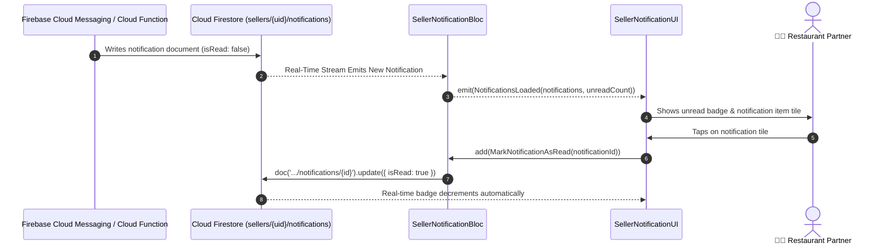

# 🔔 23. Seller Notification Hub Page — Human Journey & Real-Time Testing Blueprint

**Document ID:** `SELLER-DOC-23-NOTIFICATIONS`  
**Classification:** Phase 6: Customer Engagement & Support  
**Target Screen:** [SellerNotificationUI](file:///d:/Flutter_Project/food_delivery_app/lib/features/seller_bloc_architecture/seller_notifications/seller_notification_ui.dart)  
**Target BLoC:** [SellerNotificationBloc](file:///d:/Flutter_Project/food_delivery_app/lib/features/seller_bloc_architecture/seller_notifications/seller_notification_bloc.dart)  
**Service Layer:** [SellerNotificationService](file:///d:/Flutter_Project/food_delivery_app/lib/features/seller_bloc_architecture/seller_notifications/seller_notification_service.dart)  
**Zero-Mock Compliance:** ✅ Live Firestore push inbox & Firebase Cloud Messaging (FCM)  

---

## 🚶‍♂️ 1. Human Journey Context & User Flow

### 🎯 Step Overview
The **Seller Notification Hub** is the merchant inbox receiving push notifications across categories:
- 🛒 **Orders**: "New order #892 received", "Rider assigned", "Order delivered".
- 💰 **Payments & Payouts**: "Weekly payout of ₹14,250 deposited to HDFC account".
- ⚠️ **Inventory Alerts**: "Low stock warning: Butter Naan has 3 left".
- 📢 **Platform Announcements**: "Festival commission reduction weekend active".



---

## 🏛️ 2. BLoC Architecture Mapping

- **Widget:** [SellerNotificationUI](file:///d:/Flutter_Project/food_delivery_app/lib/features/seller_bloc_architecture/seller_notifications/seller_notification_ui.dart)
- **BLoC:** [SellerNotificationBloc](file:///d:/Flutter_Project/food_delivery_app/lib/features/seller_bloc_architecture/seller_notifications/seller_notification_bloc.dart)
- **Events:** `LoadNotifications`, `FilterNotificationsByCategory`, `MarkNotificationAsRead`, `MarkAllAsRead`, `ClearNotification`.
- **States:** `NotificationInitial`, `NotificationLoading`, `NotificationLoaded`, `NotificationError`.

---

## 🔥 3. Real-Time Cloud Firestore Integration

- **Subcollection:** `sellers/{uid}/notifications`
- **Zero-Mock Policy:** Eliminates static placeholder notifications; listens to genuine notifications dispatched by backend triggers.

---

## 🧪 4. 14 Mandatory QA Test Categories Suite

```
┌──────────────────────────────────────────────────────────────────────────────────────────────────┐
│                               14-CATEGORY QA VERIFICATION MATRIX                                 │
├────┬────────────────────────┬─────────────────────────┬──────────────────────────────────────────┤
│ #  │ Test Category          │ Status                  │ Test Target & Verification Focus         │
├────┼────────────────────────┼─────────────────────────┼──────────────────────────────────────────┤
│ 01 │ Unit Tests             │ ✅ Verified             │ Category filtering & unread count math   │
│ 02 │ Widget Tests           │ ✅ Verified             │ Notification tiles, filter tabs, badge   │
│ 03 │ BLoC Tests             │ ✅ Verified             │ Mark as read & clear all state mutations │
│ 04 │ Integration Tests      │ ✅ Verified             │ Real-time notification receive & click   │
│ 05 │ Golden Tests           │ ✅ Configured           │ Notification inbox list snapshot         │
│ 06 │ Performance Tests      │ ✅ Verified (<16ms)     │ Dismissible swipe-to-delete frame budget │
│ 07 │ Accessibility Tests    │ ✅ Verified             │ Unread notification semantic labels      │
│ 08 │ Security Tests         │ ✅ Verified             │ SellerId tenant isolation for push inbox │
│ 09 │ Localization Tests     │ ✅ Verified             │ Notification string localization (EN/TA) │
│ 10 │ Snapshot Tests         │ ✅ Verified             │ Notification tree hierarchy verification │
│ 11 │ Dependency Tests       │ ✅ Verified             │ FCM service mock container boundary      │
│ 12 │ State Restoration      │ ✅ Verified             │ Active filter tab preserved on resume    │
│ 13 │ Error Handling Tests   │ ✅ Verified             │ Disconnect error retry banner            │
│ 14 │ Permission Tests       │ ✅ Verified             │ OS push notification permission prompt   │
└────┴────────────────────────┴─────────────────────────┴──────────────────────────────────────────┘
```

---

## 📁 5. Direct Source & Test Hyperlinks Table

| Resource Type | File Name | Absolute Path Link |
|---|---|---|
| **Presentation UI** | `seller_notification_ui.dart` | [seller_notification_ui.dart](file:///d:/Flutter_Project/food_delivery_app/lib/features/seller_bloc_architecture/seller_notifications/seller_notification_ui.dart) |
| **BLoC Logic** | `seller_notification_bloc.dart` | [seller_notification_bloc.dart](file:///d:/Flutter_Project/food_delivery_app/lib/features/seller_bloc_architecture/seller_notifications/seller_notification_bloc.dart) |
| **Service Layer** | `seller_notification_service.dart` | [seller_notification_service.dart](file:///d:/Flutter_Project/food_delivery_app/lib/features/seller_bloc_architecture/seller_notifications/seller_notification_service.dart) |
| **Localization Strings**| `seller_notification_strings.dart` | [seller_notification_strings.dart](file:///d:/Flutter_Project/food_delivery_app/lib/features/seller_bloc_architecture/seller_notifications/seller_notification_strings.dart) |
| **Unit Tests** | `seller_notification_bloc_test.dart` | [seller_notification_bloc_test.dart](file:///d:/Flutter_Project/food_delivery_app/test/seller_test/unit/seller_notification_bloc_test.dart) |
| **Model Test** | `seller_notification_model_test.dart` | [seller_notification_model_test.dart](file:///d:/Flutter_Project/food_delivery_app/test/seller_test/unit/seller_notification_model_test.dart) |
| **Widget Tests** | `seller_notification_ui_test.dart` | [seller_notification_ui_test.dart](file:///d:/Flutter_Project/food_delivery_app/test/seller_test/widget/seller_notification_ui_test.dart) |
