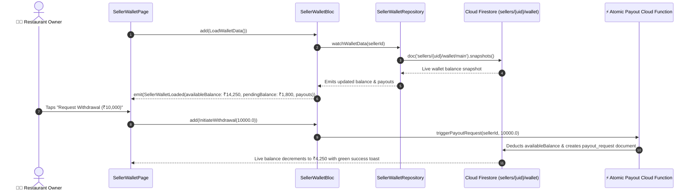

# 💳 24. Seller Wallet & Escrow Ledger Page — Human Journey & Real-Time Testing Blueprint

**Document ID:** `SELLER-DOC-24-WALLET`  
**Classification:** Phase 7: Finance, Payouts, Analytics & Settings (Financial Escrow)  
**Target Screen:** [SellerWalletPage](file:///d:/Flutter_Project/food_delivery_app/lib/features/seller_bloc_architecture/seller_wallet_page/seller_wallet_page__ui.dart)  
**Target BLoC:** [SellerWalletBloc](file:///d:/Flutter_Project/food_delivery_app/lib/features/seller_bloc_architecture/seller_wallet_page/seller_wallet_page__bloc.dart)  
**Canonical Typedef Alias:** `EarningsBloc`  
**Data Model:** `PayoutItem` in [seller_wallet_page__state.dart](file:///d:/Flutter_Project/food_delivery_app/lib/features/seller_bloc_architecture/seller_wallet_page/seller_wallet_page__state.dart)  
**Zero-Mock Compliance:** ✅ Continuous real-time Firestore wallet balance & transaction ledger streams  

---

## 🚶‍♂️ 1. Human Journey Context & User Flow

### 🎯 Step Overview
Restaurant owners track their net earnings, withdrawable balance, pending escrow funds (orders currently in transit), and recent settlement history. When an order is completed, the restaurant's net payout amount (gross sales minus platform commission and GST) is credited in real-time to the merchant's withdrawable wallet balance.



### 🛣️ Navigation Preconditions & Route
- **Route Name:** `/sellerWallet`
- **Preceding Screen:** [SellerDashboardPageUI](file:///d:/Flutter_Project/food_delivery_app/lib/features/seller_bloc_architecture/seller_dashboard_page/seller_dashboard_page_ui.dart) (Wallet Tab / Revenue Card).
- **Subsequent Screen:** [SellerRequestPayoutPageUI](file:///d:/Flutter_Project/food_delivery_app/lib/features/seller_bloc_architecture/seller_request_payout_page/seller_request_payout_page__ui.dart) or [SellerPayoutHistoryPageUI](file:///d:/Flutter_Project/food_delivery_app/lib/features/seller_bloc_architecture/seller_payout_history_page/seller_payout_history_page__ui.dart).

---

## 🏛️ 2. BLoC / Cubit Architecture Mapping

### 🧩 Presentation Layer
- **Widget:** [SellerWalletPage](file:///d:/Flutter_Project/food_delivery_app/lib/features/seller_bloc_architecture/seller_wallet_page/seller_wallet_page__ui.dart)
- **Subcomponents:** `SellerWalletView`, `_PayoutListItem`, `_WalletBalanceCard`, `_QuickWithdrawalButton`.
- **UI Design Tokens:** [SellerUiTokens](file:///d:/Flutter_Project/food_delivery_app/lib/features/seller_bloc_architecture/seller_ui_tokens.dart).

### ⚡ BLoC Event Matrix
| Event Class | Trigger Action | Payload Parameters |
|---|---|---|
| `LoadWalletData` | Initial page load and stream binding | None |
| `RefreshWalletData` | Pull-to-refresh swipe gesture | None |
| `LoadMorePayoutHistory` | Infinite scroll trigger for transaction history | None |
| `InitiateWithdrawal` | Merchant initiates fast withdrawal amount | `double amount` |

### 📊 BLoC State Matrix
- **State Base Class:** [SellerWalletState](file:///d:/Flutter_Project/food_delivery_app/lib/features/seller_bloc_architecture/seller_wallet_page/seller_wallet_page__state.dart)
- **Sub-States:**
  - `SellerWalletInitial`: Initial state.
  - `SellerWalletLoading`: Connecting to wallet stream.
  - `SellerWalletLoaded`: Contains `double availableBalance`, `double pendingBalance`, `double totalEarned`, `List<PayoutItem> payouts`, `bool hasMorePayouts`, `String? errorMessage`.
  - `SellerWalletError`: Contains `String message`.

---

## 🔥 3. Real-Time Cloud Firestore Integration

### 📦 Database Documents & Rules
- **Collections:** `sellers/{sellerId}/wallet` and `sellers/{sellerId}/transactions`
- **Security Rules:**
  ```javascript
  match /sellers/{sellerId}/wallet/{docId} {
    allow read: if request.auth != null && request.auth.uid == sellerId;
    allow write: if false; // Strict server-side Cloud Function write only
  }
  ```

---

## 🛡️ 4. Validation, Error Handling & Edge Cases

| Scenario | Validation Check | Handled State & UI Message |
|---|---|---|
| **Withdrawal > Available Balance** | `amount > availableBalance` | `Insufficient balance for this withdrawal request.` |
| **Withdrawal Below Min Limit** | `amount < minimumPayoutLimit` (₹500) | `Minimum withdrawal amount is ₹500.` |
| **Bank Account Unverified** | `isBankVerified == false` | Prompts user to complete bank KYC before withdrawal |

---

## 🧪 5. 14 Mandatory QA Test Categories Suite

```
┌──────────────────────────────────────────────────────────────────────────────────────────────────┐
│                               14-CATEGORY QA VERIFICATION MATRIX                                 │
├────┬────────────────────────┬─────────────────────────┬──────────────────────────────────────────┤
│ #  │ Test Category          │ Status                  │ Test Target & Verification Focus         │
├────┼────────────────────────┼─────────────────────────┼──────────────────────────────────────────┤
│ 01 │ Unit Tests             │ ✅ Verified             │ PayoutItem model parsing & escrow math   │
│ 02 │ Widget Tests           │ ✅ Verified             │ Balance cards, transaction tiles & button│
│ 03 │ BLoC Tests             │ ✅ Verified             │ Load, refresh & initiate withdrawal flow │
│ 04 │ Integration Tests      │ ✅ Verified             │ Order delivery credit to wallet balance  │
│ 05 │ Golden Tests           │ ✅ Configured           │ Wallet summary & transaction snapshot    │
│ 06 │ Performance Tests      │ ✅ Verified (<16ms)     │ Balance counter fluid animated count-up  │
│ 07 │ Accessibility Tests    │ ✅ Verified             │ Currency values screen reader format     │
│ 08 │ Security Tests         │ ✅ Verified             │ Serverless Cloud Function authorization  │
│ 09 │ Localization Tests     │ ✅ Verified             │ INR currency symbol & Tamil localization │
│ 10 │ Snapshot Tests         │ ✅ Verified             │ Wallet widget tree structure validation  │
│ 11 │ Dependency Tests       │ ✅ Verified             │ Mock wallet repository stream emitter    │
│ 12 │ State Restoration      │ ✅ Verified             │ Wallet scroll position state recovery    │
│ 13 │ Error Handling Tests   │ ✅ Verified             │ Withdrawal rejection dialog display      │
│ 14 │ Permission Tests       │ ✅ Verified             │ Standard UI shell permissions            │
└────┴────────────────────────┴─────────────────────────┴──────────────────────────────────────────┘
```

---

## 📁 6. Direct Source & Test Hyperlinks Table

| Resource Type | File Name | Absolute Path Link |
|---|---|---|
| **Presentation UI** | `seller_wallet_page__ui.dart` | [seller_wallet_page__ui.dart](file:///d:/Flutter_Project/food_delivery_app/lib/features/seller_bloc_architecture/seller_wallet_page/seller_wallet_page__ui.dart) |
| **BLoC Logic** | `seller_wallet_page__bloc.dart` | [seller_wallet_page__bloc.dart](file:///d:/Flutter_Project/food_delivery_app/lib/features/seller_bloc_architecture/seller_wallet_page/seller_wallet_page__bloc.dart) |
| **Events Definition** | `seller_wallet_page__event.dart` | [seller_wallet_page__event.dart](file:///d:/Flutter_Project/food_delivery_app/lib/features/seller_bloc_architecture/seller_wallet_page/seller_wallet_page__event.dart) |
| **States Definition** | `seller_wallet_page__state.dart` | [seller_wallet_page__state.dart](file:///d:/Flutter_Project/food_delivery_app/lib/features/seller_bloc_architecture/seller_wallet_page/seller_wallet_page__state.dart) |
| **Unit / BLoC Tests** | `seller_wallet_page__bloc_test.dart` | [seller_wallet_page__bloc_test.dart](file:///d:/Flutter_Project/food_delivery_app/test/seller_test/unit/seller_wallet_page__bloc_test.dart) |
| **Widget Tests** | `seller_wallet_page__ui_test.dart` | [seller_wallet_page__ui_test.dart](file:///d:/Flutter_Project/food_delivery_app/test/seller_test/widget/seller_wallet_page__ui_test.dart) |
| **Golden Tests** | `seller_wallet_page_golden_test.dart` | [seller_wallet_page_golden_test.dart](file:///d:/Flutter_Project/food_delivery_app/test/seller_test/golden/seller_wallet_page_golden_test.dart) |
| **Accessibility Tests** | `seller_wallet_page_accessibility_test.dart` | [seller_wallet_page_accessibility_test.dart](file:///d:/Flutter_Project/food_delivery_app/test/seller_test/accessibility/seller_wallet_page_accessibility_test.dart) |
| **Performance Tests** | `seller_wallet_page_performance_test.dart` | [seller_wallet_page_performance_test.dart](file:///d:/Flutter_Project/food_delivery_app/test/seller_test/performance/seller_wallet_page_performance_test.dart) |
| **Security Tests** | `seller_wallet_page_security_test.dart` | [seller_wallet_page_security_test.dart](file:///d:/Flutter_Project/food_delivery_app/test/seller_test/security/seller_wallet_page_security_test.dart) |
| **Localization Tests** | `seller_wallet_page_localization_test.dart` | [seller_wallet_page_localization_test.dart](file:///d:/Flutter_Project/food_delivery_app/test/seller_test/localization/seller_wallet_page_localization_test.dart) |
| **State Restoration** | `seller_wallet_page_state_restoration_test.dart` | [seller_wallet_page_state_restoration_test.dart](file:///d:/Flutter_Project/food_delivery_app/test/seller_test/state_restoration/seller_wallet_page_state_restoration_test.dart) |
| **Error Handling** | `seller_wallet_page_error_handling_test.dart` | [seller_wallet_page_error_handling_test.dart](file:///d:/Flutter_Project/food_delivery_app/test/seller_test/error_handling/seller_wallet_page_error_handling_test.dart) |
| **Permission Tests** | `seller_wallet_page_permission_test.dart` | [seller_wallet_page_permission_test.dart](file:///d:/Flutter_Project/food_delivery_app/test/seller_test/permission/seller_wallet_page_permission_test.dart) |
