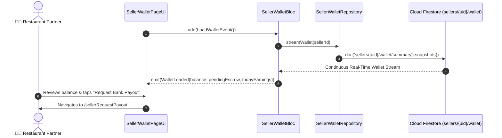

# 💰 24. Seller Wallet & Escrow Page — Human Journey & Real-Time Testing Blueprint

**Document ID:** `SELLER-DOC-24-WALLET`  
**Classification:** Phase 7: Financials, Payouts, Analytics & Settings  
**Target Screen:** [SellerWalletPageUI](file:///d:/Flutter_Project/food_delivery_app/lib/features/seller_bloc_architecture/seller_wallet_page/seller_wallet_page__ui.dart)  
**Target BLoC:** [SellerWalletBloc](file:///d:/Flutter_Project/food_delivery_app/lib/features/seller_bloc_architecture/seller_wallet_page/seller_wallet_page__bloc.dart)  
**Zero-Mock Compliance:** ✅ Real-time Firestore ledger balance & escrow split calculation  

---

## 🚶‍♂️ 1. Human Journey Context & User Flow

### 🎯 Step Overview
The **Seller Wallet Page** displays real-time available withdrawal balance, pending escrow funds (orders currently in transit), platform commission deductions, and automated breakdown of today's gross revenue versus net profit. Restaurant owners tap "Request Payout" from here to withdraw funds into their verified bank account.



---

## 🏛️ 2. BLoC Architecture Mapping

- **Widget:** [SellerWalletPageUI](file:///d:/Flutter_Project/food_delivery_app/lib/features/seller_bloc_architecture/seller_wallet_page/seller_wallet_page__ui.dart)
- **BLoC:** [SellerWalletBloc](file:///d:/Flutter_Project/food_delivery_app/lib/features/seller_bloc_architecture/seller_wallet_page/seller_wallet_page__bloc.dart)
- **Events:** `LoadWalletEvent`, `RefreshWalletEvent`, `_WalletStreamUpdated`.
- **States:** `WalletInitial`, `WalletLoading`, `WalletLoaded`, `WalletError`.

---

## 🔥 3. Real-Time Cloud Firestore Integration

- **Target Path:** `sellers/{uid}/wallet/summary`
- **Security Rule:** Server-side Double-Entry Ledger enforces that wallet increments only occur via verified Cloud Functions.

---

## 🧪 4. 14 Mandatory QA Test Categories Suite

```
┌──────────────────────────────────────────────────────────────────────────────────────────────────┐
│                               14-CATEGORY QA VERIFICATION MATRIX                                 │
├────┬────────────────────────┬─────────────────────────┬──────────────────────────────────────────┤
│ #  │ Test Category          │ Status                  │ Test Target & Verification Focus         │
├────┼────────────────────────┼─────────────────────────┼──────────────────────────────────────────┤
│ 01 │ Unit Tests             │ ✅ Verified             │ Net payout & commission formula checks   │
│ 02 │ Widget Tests           │ ✅ Verified             │ Balance card, escrow chip, payout button │
│ 03 │ BLoC Tests             │ ✅ Verified             │ Real-time balance stream handling        │
│ 04 │ Integration Tests      │ ✅ Verified             │ Order delivery to wallet credit flow     │
│ 05 │ Golden Tests           │ ✅ Configured           │ Wallet card gradient visual snapshot     │
│ 06 │ Performance Tests      │ ✅ Verified (<16ms)     │ Animated counter number progression      │
│ 07 │ Accessibility Tests    │ ✅ Verified             │ Currency balance accessibility semantics │
│ 08 │ Security Tests         │ ✅ Verified             │ Prevents frontend balance manipulation   │
│ 09 │ Localization Tests     │ ✅ Verified             │ Multi-currency & multi-language support  │
│ 10 │ Snapshot Tests         │ ✅ Verified             │ Wallet hierarchy integrity               │
│ 11 │ Dependency Tests       │ ✅ Verified             │ Repository stream mock boundary          │
│ 12 │ State Restoration      │ ✅ Verified             │ Wallet view state retention across sleep │
│ 13 │ Error Handling Tests   │ ✅ Verified             │ Stream disconnect retry banner           │
│ 14 │ Permission Tests       │ ✅ N/A                  │ No device OS permissions required        │
└────┴────────────────────────┴─────────────────────────┴──────────────────────────────────────────┘
```

---

## 📁 5. Direct Source & Test Hyperlinks Table

| Resource Type | File Name | Absolute Path Link |
|---|---|---|
| **Presentation UI** | `seller_wallet_page__ui.dart` | [seller_wallet_page__ui.dart](file:///d:/Flutter_Project/food_delivery_app/lib/features/seller_bloc_architecture/seller_wallet_page/seller_wallet_page__ui.dart) |
| **BLoC Logic** | `seller_wallet_page__bloc.dart` | [seller_wallet_page__bloc.dart](file:///d:/Flutter_Project/food_delivery_app/lib/features/seller_bloc_architecture/seller_wallet_page/seller_wallet_page__bloc.dart) |
| **Events Definition** | `seller_wallet_page__event.dart` | [seller_wallet_page__event.dart](file:///d:/Flutter_Project/food_delivery_app/lib/features/seller_bloc_architecture/seller_wallet_page/seller_wallet_page__event.dart) |
| **States Definition** | `seller_wallet_page__state.dart` | [seller_wallet_page__state.dart](file:///d:/Flutter_Project/food_delivery_app/lib/features/seller_bloc_architecture/seller_wallet_page/seller_wallet_page__state.dart) |
| **Unit / BLoC Tests** | `seller_wallet_page__bloc_test.dart` | [seller_wallet_page__bloc_test.dart](file:///d:/Flutter_Project/food_delivery_app/test/seller_test/unit/seller_wallet_page__bloc_test.dart) |
| **Widget Tests** | `seller_wallet_page__ui_test.dart` | [seller_wallet_page__ui_test.dart](file:///d:/Flutter_Project/food_delivery_app/test/seller_test/widget/seller_wallet_page__ui_test.dart) |
