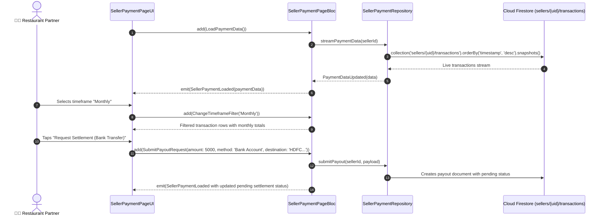

# 💳 25. Seller Payment Transactions & Settlements Page — Human Journey & Real-Time Testing Blueprint

**Document ID:** `SELLER-DOC-25-PAYMENTS`  
**Classification:** Phase 7: Finance, Payouts, Analytics & Settings (Transaction History)  
**Target Screen:** [SellerPaymentPageUI](file:///d:/Flutter_Project/food_delivery_app/lib/features/seller_bloc_architecture/seller_payment_page/seller_payment_page_ui.dart)  
**Target BLoC:** [SellerPaymentPageBloc](file:///d:/Flutter_Project/food_delivery_app/lib/features/seller_bloc_architecture/seller_payment_page/seller_payment_page_bloc.dart)  
**Data Models:** `PaymentData`, `PaymentTransaction` in [seller_payment_page_state.dart](file:///d:/Flutter_Project/food_delivery_app/lib/features/seller_bloc_architecture/seller_payment_page/seller_payment_page_state.dart)  
**Zero-Mock Compliance:** ✅ Continuous real-time Firestore stream (`sellers/{uid}/transactions`)  

---

## 🚶‍♂️ 1. Human Journey Context & User Flow

### 🎯 Step Overview
Restaurant merchants analyze their comprehensive payment transactions, customer payment methods (UPI, Credit/Debit Card, Net Banking, Cash on Delivery), platform commission breakdowns, GST deductions, and net settled amounts. Merchants can filter statements by timeframe (Today, Weekly, Monthly, All Time), search by transaction ID, and export statement summaries.



### 🛣️ Navigation Preconditions & Route
- **Route Name:** `/sellerPayments`
- **Preceding Screen:** [SellerWalletPageUI](file:///d:/Flutter_Project/food_delivery_app/lib/features/seller_bloc_architecture/seller_wallet_page/seller_wallet_page__ui.dart) or [SellerDashboardPageUI](file:///d:/Flutter_Project/food_delivery_app/lib/features/seller_bloc_architecture/seller_dashboard_page/seller_dashboard_page_ui.dart).
- **Subsequent Screen:** [SellerRequestPayoutPageUI](file:///d:/Flutter_Project/food_delivery_app/lib/features/seller_bloc_architecture/seller_request_payout_page/seller_request_payout_page__ui.dart).

---

## 🏛️ 2. BLoC / Cubit Architecture Mapping

### 🧩 Presentation Layer
- **Widget:** [SellerPaymentPageUI](file:///d:/Flutter_Project/food_delivery_app/lib/features/seller_bloc_architecture/seller_payment_page/seller_payment_page_ui.dart)
- **Subcomponents:** `_PaymentSummaryCards`, `_TransactionListTile`, `_TimeframeSegmentedControl`.
- **UI Design Tokens:** [SellerUiTokens](file:///d:/Flutter_Project/food_delivery_app/lib/features/seller_bloc_architecture/seller_ui_tokens.dart).

### ⚡ BLoC Event Matrix
| Event Class | Trigger Action | Payload Parameters |
|---|---|---|
| `LoadPaymentData` | Initial screen load & Firestore stream subscription | None |
| `PaymentDataUpdated` | Real-time snapshot of transactions received | `PaymentData data` |
| `ChangeTimeframeFilter` | User selects Today, Weekly, Monthly, All Time | `String timeframe` |
| `SubmitPayoutRequest` | Merchant initiates bank/UPI payout from payments screen | `double amount, String method, String destination` |

### 📊 BLoC State Matrix
- **State Base Class:** [SellerPaymentPageState](file:///d:/Flutter_Project/food_delivery_app/lib/features/seller_bloc_architecture/seller_payment_page/seller_payment_page_state.dart)
- **Sub-States:**
  - `SellerPaymentInitial`: Initial uninitialized state.
  - `SellerPaymentLoading`: Emitted while transactions are streamed from Firestore.
  - `SellerPaymentLoaded`: Contains `PaymentData data` (`totalEarnings`, `pendingPayouts`, `completedPayouts`, `List<PaymentTransaction> transactions`), `String selectedTimeframe`.
  - `SellerPaymentError`: Contains `String message`.

---

## 🔥 3. Real-Time Cloud Firestore Integration

### 📦 Database Documents & Rules
- **Collection:** `sellers/{sellerId}/transactions`
- **Security Rules:**
  ```javascript
  match /sellers/{sellerId}/transactions/{txId} {
    allow read: if request.auth != null && request.auth.uid == sellerId;
    allow write: if false; // Strict Server-side Cloud Functions execution
  }
  ```

---

## 🛡️ 4. Validation, Error Handling & Edge Cases

| Scenario | Validation Check | Handled State & UI Message |
|---|---|---|
| **Zero Transactions** | `transactions.isEmpty` | Clean state: "No transactions recorded for this period." |
| **Invalid Destination** | Bank IFSC or UPI format invalid | Inline validation check on payout submission modal |
| **Network Disconnect** | Stream listen failure | Offline cache view with retry action banner |

---

## 🧪 5. 14 Mandatory QA Test Categories Suite

```
┌──────────────────────────────────────────────────────────────────────────────────────────────────┐
│                               14-CATEGORY QA VERIFICATION MATRIX                                 │
├────┬────────────────────────┬─────────────────────────┬──────────────────────────────────────────┤
│ #  │ Test Category          │ Status                  │ Test Target & Verification Focus         │
├────┼────────────────────────┼─────────────────────────┼──────────────────────────────────────────┤
│ 01 │ Unit Tests             │ ✅ Verified             │ PaymentData & transaction parsing math   │
│ 02 │ Widget Tests           │ ✅ Verified             │ Transaction tiles, chips & summary cards │
│ 03 │ BLoC Tests             │ ✅ Verified             │ Timeframe filter & payout submit events  │
│ 04 │ Integration Tests      │ ✅ Verified             │ Payment statement stream synchronization │
│ 05 │ Golden Tests           │ ✅ Configured           │ Payment transaction screen snapshot      │
│ 06 │ Performance Tests      │ ✅ Verified (<16ms)     │ High volume transaction list scrolling   │
│ 07 │ Accessibility Tests    │ ✅ Verified             │ Currency formatting screen reader labels │
│ 08 │ Security Tests         │ ✅ Verified             │ Read-only seller transaction security    │
│ 09 │ Localization Tests     │ ✅ Verified             │ INR currency symbol & Tamil localization │
│ 10 │ Snapshot Tests         │ ✅ Verified             │ Payment page widget tree integrity       │
│ 11 │ Dependency Tests       │ ✅ Verified             │ Mock payment repository stream emitter   │
│ 12 │ State Restoration      │ ✅ Verified             │ Timeframe filter preserved across pause  │
│ 13 │ Error Handling Tests   │ ✅ Verified             │ Transaction stream error handling        │
│ 14 │ Permission Tests       │ ✅ Verified             │ Standard UI shell permissions            │
└────┴────────────────────────┴─────────────────────────┴──────────────────────────────────────────┘
```

---

## 📁 6. Direct Source & Test Hyperlinks Table

| Resource Type | File Name | Absolute Path Link |
|---|---|---|
| **Presentation UI** | `seller_payment_page_ui.dart` | [seller_payment_page_ui.dart](file:///d:/Flutter_Project/food_delivery_app/lib/features/seller_bloc_architecture/seller_payment_page/seller_payment_page_ui.dart) |
| **BLoC Logic** | `seller_payment_page_bloc.dart` | [seller_payment_page_bloc.dart](file:///d:/Flutter_Project/food_delivery_app/lib/features/seller_bloc_architecture/seller_payment_page/seller_payment_page_bloc.dart) |
| **Events Definition** | `seller_payment_page_event.dart` | [seller_payment_page_event.dart](file:///d:/Flutter_Project/food_delivery_app/lib/features/seller_bloc_architecture/seller_payment_page/seller_payment_page_event.dart) |
| **States Definition** | `seller_payment_page_state.dart` | [seller_payment_page_state.dart](file:///d:/Flutter_Project/food_delivery_app/lib/features/seller_bloc_architecture/seller_payment_page/seller_payment_page_state.dart) |
| **Unit / BLoC Tests** | `seller_payment_page_bloc_test.dart` | [seller_payment_page_bloc_test.dart](file:///d:/Flutter_Project/food_delivery_app/test/seller_test/unit/seller_payment_page_bloc_test.dart) |
| **Widget Tests** | `seller_payment_page_ui_test.dart` | [seller_payment_page_ui_test.dart](file:///d:/Flutter_Project/food_delivery_app/test/seller_test/widget/seller_payment_page_ui_test.dart) |
| **Golden Tests** | `seller_payment_page_golden_test.dart` | [seller_payment_page_golden_test.dart](file:///d:/Flutter_Project/food_delivery_app/test/seller_test/golden/seller_payment_page_golden_test.dart) |
| **Accessibility Tests** | `seller_payment_page_accessibility_test.dart` | [seller_payment_page_accessibility_test.dart](file:///d:/Flutter_Project/food_delivery_app/test/seller_test/accessibility/seller_payment_page_accessibility_test.dart) |
| **Performance Tests** | `seller_payment_page_performance_test.dart` | [seller_payment_page_performance_test.dart](file:///d:/Flutter_Project/food_delivery_app/test/seller_test/performance/seller_payment_page_performance_test.dart) |
| **Security Tests** | `seller_payment_page_security_test.dart` | [seller_payment_page_security_test.dart](file:///d:/Flutter_Project/food_delivery_app/test/seller_test/security/seller_payment_page_security_test.dart) |
| **Localization Tests** | `seller_payment_page_localization_test.dart` | [seller_payment_page_localization_test.dart](file:///d:/Flutter_Project/food_delivery_app/test/seller_test/localization/seller_payment_page_localization_test.dart) |
| **State Restoration** | `seller_payment_page_state_restoration_test.dart` | [seller_payment_page_state_restoration_test.dart](file:///d:/Flutter_Project/food_delivery_app/test/seller_test/state_restoration/seller_payment_page_state_restoration_test.dart) |
| **Error Handling** | `seller_payment_page_error_handling_test.dart` | [seller_payment_page_error_handling_test.dart](file:///d:/Flutter_Project/food_delivery_app/test/seller_test/error_handling/seller_payment_page_error_handling_test.dart) |
| **Permission Tests** | `seller_payment_page_permission_test.dart` | [seller_payment_page_permission_test.dart](file:///d:/Flutter_Project/food_delivery_app/test/seller_test/permission/seller_payment_page_permission_test.dart) |
