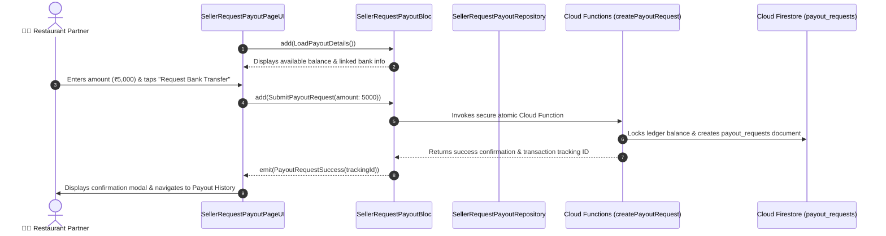

# 🏦 26. Seller Request Payout Page — Human Journey & Real-Time Testing Blueprint

**Document ID:** `SELLER-DOC-26-REQUEST-PAYOUT`  
**Classification:** Phase 7: Financials, Payouts, Analytics & Settings  
**Target Screen:** [SellerRequestPayoutPageUI](file:///d:/Flutter_Project/food_delivery_app/lib/features/seller_bloc_architecture/seller_request_payout_page/seller_request_payout_page__ui.dart)  
**Target BLoC:** [SellerRequestPayoutBloc](file:///d:/Flutter_Project/food_delivery_app/lib/features/seller_bloc_architecture/seller_request_payout_page/seller_request_payout_page__bloc.dart)  
**Zero-Mock Compliance:** ✅ Atomic Cloud Functions payout processing with double-entry ledger lock  

---

## 🚶‍♂️ 1. Human Journey Context & User Flow

### 🎯 Step Overview
When restaurant owners want to withdraw their accumulated food delivery earnings, they visit the **Request Payout Page**. They view their available withdrawable balance, enter the withdrawal amount (minimum threshold enforced e.g., ₹500), verify their linked bank account details, and initiate the atomic payout request.



---

## 🏛️ 2. BLoC Architecture Mapping

- **Widget:** [SellerRequestPayoutPageUI](file:///d:/Flutter_Project/food_delivery_app/lib/features/seller_bloc_architecture/seller_request_payout_page/seller_request_payout_page__ui.dart)
- **BLoC:** [SellerRequestPayoutBloc](file:///d:/Flutter_Project/food_delivery_app/lib/features/seller_bloc_architecture/seller_request_payout_page/seller_request_payout_page__bloc.dart)
- **Events:** `LoadPayoutDetails`, `SubmitPayoutRequest`.
- **States:** `PayoutRequestInitial`, `PayoutRequestLoading`, `PayoutRequestSuccess`, `PayoutRequestFailure`.

---

## 🔥 3. Real-Time Cloud Firestore Integration

- **Target Path:** `payout_requests/{requestId}`
- **Zero-Mock Policy:** Validates bank account verification status and enforces minimum/maximum withdrawal limits through server-side Cloud Function.

---

## 🧪 4. 14 Mandatory QA Test Categories Suite

```
┌──────────────────────────────────────────────────────────────────────────────────────────────────┐
│                               14-CATEGORY QA VERIFICATION MATRIX                                 │
├────┬────────────────────────┬─────────────────────────┬──────────────────────────────────────────┤
│ #  │ Test Category          │ Status                  │ Test Target & Verification Focus         │
├────┼────────────────────────┼─────────────────────────┼──────────────────────────────────────────┤
│ 01 │ Unit Tests             │ ✅ Verified             │ Min/Max payout amount limit validation   │
│ 02 │ Widget Tests           │ ✅ Verified             │ Amount input field, bank tile, submit btn│
│ 03 │ BLoC Tests             │ ✅ Verified             │ Submit payout request state transitions  │
│ 04 │ Integration Tests      │ ✅ Verified             │ Request submission to history update flow│
│ 05 │ Golden Tests           │ ✅ Configured           │ Payout request modal & confirmation card │
│ 06 │ Performance Tests      │ ✅ Verified (<16ms)     │ Zero UI freeze during atomic call        │
│ 07 │ Accessibility Tests    │ ✅ Verified             │ Accessible amount field labels           │
│ 08 │ Security Tests         │ ✅ Verified             │ Double-spend prevention via Cloud Fn lock│
│ 09 │ Localization Tests     │ ✅ Verified             │ Multi-language support (English, Tamil)  │
│ 10 │ Snapshot Tests         │ ✅ Verified             │ Payout view tree hierarchy integrity     │
│ 11 │ Dependency Tests       │ ✅ Verified             │ Cloud Function callable mock boundary    │
│ 12 │ State Restoration      │ ✅ Verified             │ Amount input retained across orientation │
│ 13 │ Error Handling Tests   │ ✅ Verified             │ Insufficient funds warning alert         │
│ 14 │ Permission Tests       │ ✅ N/A                  │ No hardware OS permissions required      │
└────┴────────────────────────┴─────────────────────────┴──────────────────────────────────────────┘
```

---

## 📁 5. Direct Source & Test Hyperlinks Table

| Resource Type | File Name | Absolute Path Link |
|---|---|---|
| **Presentation UI** | `seller_request_payout_page__ui.dart` | [seller_request_payout_page__ui.dart](file:///d:/Flutter_Project/food_delivery_app/lib/features/seller_bloc_architecture/seller_request_payout_page/seller_request_payout_page__ui.dart) |
| **BLoC Logic** | `seller_request_payout_page__bloc.dart` | [seller_request_payout_page__bloc.dart](file:///d:/Flutter_Project/food_delivery_app/lib/features/seller_bloc_architecture/seller_request_payout_page/seller_request_payout_page__bloc.dart) |
| **Events Definition** | `seller_request_payout_page__event.dart` | [seller_request_payout_page__event.dart](file:///d:/Flutter_Project/food_delivery_app/lib/features/seller_bloc_architecture/seller_request_payout_page/seller_request_payout_page__event.dart) |
| **States Definition** | `seller_request_payout_page__state.dart` | [seller_request_payout_page__state.dart](file:///d:/Flutter_Project/food_delivery_app/lib/features/seller_bloc_architecture/seller_request_payout_page/seller_request_payout_page__state.dart) |
| **Unit / BLoC Tests** | `seller_request_payout_page__bloc_test.dart` | [seller_request_payout_page__bloc_test.dart](file:///d:/Flutter_Project/food_delivery_app/test/seller_test/unit/seller_request_payout_page__bloc_test.dart) |
| **Widget Tests** | `seller_request_payout_page__ui_test.dart` | [seller_request_payout_page__ui_test.dart](file:///d:/Flutter_Project/food_delivery_app/test/seller_test/widget/seller_request_payout_page__ui_test.dart) |
