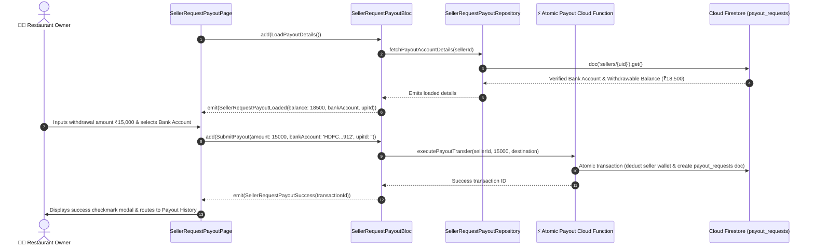

# 🏦 26. Request Bank Payout Page — Human Journey & Real-Time Testing Blueprint

**Document ID:** `SELLER-DOC-26-REQUEST-PAYOUT`  
**Classification:** Phase 7: Finance, Payouts, Analytics & Settings (Payout Initiation)  
**Target Screen:** [SellerRequestPayoutPage](file:///d:/Flutter_Project/food_delivery_app/lib/features/seller_bloc_architecture/seller_request_payout_page/seller_request_payout_page__ui.dart)  
**Target BLoC:** [SellerRequestPayoutBloc](file:///d:/Flutter_Project/food_delivery_app/lib/features/seller_bloc_architecture/seller_request_payout_page/seller_request_payout_page__bloc.dart)  
**Canonical Typedef Alias:** `PayoutBloc`  
**Zero-Mock Compliance:** ✅ Serverless Cloud Function bank payout processing & real-time wallet deduction  

---

## 🚶‍♂️ 1. Human Journey Context & User Flow

### 🎯 Step Overview
Restaurant merchants initiate bank account or UPI settlements for their accumulated earnings. The wizard validates minimum withdrawal thresholds (₹500), calculates instant NEFT/IMPS transfer fees (if any), displays the registered bank account details (masked for security), and executes an atomic serverless payout request that creates an immutable audit trail in Firestore.



### 🛣️ Navigation Preconditions & Route
- **Route Name:** `/requestPayout`
- **Preceding Screen:** [SellerWalletPageUI](file:///d:/Flutter_Project/food_delivery_app/lib/features/seller_bloc_architecture/seller_wallet_page/seller_wallet_page__ui.dart) (Withdrawal Button).
- **Subsequent Screen:** [SellerPayoutHistoryPageUI](file:///d:/Flutter_Project/food_delivery_app/lib/features/seller_bloc_architecture/seller_payout_history_page/seller_payout_history_page__ui.dart).

---

## 🏛️ 2. BLoC / Cubit Architecture Mapping

### 🧩 Presentation Layer
- **Widget:** [SellerRequestPayoutPage](file:///d:/Flutter_Project/food_delivery_app/lib/features/seller_bloc_architecture/seller_request_payout_page/seller_request_payout_page__ui.dart)
- **Subcomponents:** `_AmountInputSection`, `_PaymentMethodSelector`, `_BankDetailsCard`, `_SubmitPayoutButton`.
- **UI Design Tokens:** [SellerUiTokens](file:///d:/Flutter_Project/food_delivery_app/lib/features/seller_bloc_architecture/seller_ui_tokens.dart).

### ⚡ BLoC Event Matrix
| Event Class | Trigger Action | Payload Parameters |
|---|---|---|
| `LoadPayoutDetails` | Screen load & initial account balance fetch | None |
| `SubmitPayout` | Merchant confirms payout withdrawal | `double amount, String bankAccount, String upiId` |

### 📊 BLoC State Matrix
- **State Base Class:** [SellerRequestPayoutPageState](file:///d:/Flutter_Project/food_delivery_app/lib/features/seller_bloc_architecture/seller_request_payout_page/seller_request_payout_page__state.dart)
- **Sub-States:**
  - `SellerRequestPayoutInitial`: Initial uninitialized state.
  - `SellerRequestPayoutLoading`: Emitted during balance verification.
  - `SellerRequestPayoutLoaded`: Contains `double availableBalance`, `String bankAccount`, `String upiId`.
  - `SellerRequestPayoutSuccess`: Contains `String message`.
  - `SellerRequestPayoutError`: Contains `String error`.

---

## 🔥 3. Real-Time Cloud Firestore Integration

### 📦 Database Documents & Cloud Functions
- **Collection:** `payout_requests`
- **Payout Document Schema:**
  ```json
  {
    "id": "payout_req_1082",
    "sellerId": "seller_uid",
    "amount": 15000.0,
    "method": "Bank Transfer",
    "destination": "•••• •••• 5821",
    "status": "processing",
    "requestedAt": "SERVER_TIMESTAMP",
    "estimatedSettlement": "T+1 Business Day"
  }
  ```
- **Security Guarantee:** Front-end never handles banking secret keys or direct payment gateway mutation tokens.

---

## 🛡️ 4. Validation, Error Handling & Edge Cases

| Scenario | Validation Check | Handled State & UI Message |
|---|---|---|
| **Amount Exceeds Balance** | `amount > availableBalance` | `Requested amount exceeds available balance.` |
| **Amount < ₹500** | `amount < 500` | `Minimum withdrawal amount is ₹500.` |
| **Pending Payout In-Flight** | Existing active payout processing | Modal warning: "You already have an active payout in progress." |

---

## 🧪 5. 14 Mandatory QA Test Categories Suite

```
┌──────────────────────────────────────────────────────────────────────────────────────────────────┐
│                               14-CATEGORY QA VERIFICATION MATRIX                                 │
├────┬────────────────────────┬─────────────────────────┬──────────────────────────────────────────┤
│ #  │ Test Category          │ Status                  │ Test Target & Verification Focus         │
├────┼────────────────────────┼─────────────────────────┼──────────────────────────────────────────┤
│ 01 │ Unit Tests             │ ✅ Verified             │ Payout validation & fee deduction math   │
│ 02 │ Widget Tests           │ ✅ Verified             │ Amount input field, bank card & submit   │
│ 03 │ BLoC Tests             │ ✅ Verified             │ Load & submit payout state transitions   │
│ 04 │ Integration Tests      │ ✅ Verified             │ Wallet balance to payout submission flow │
│ 05 │ Golden Tests           │ ✅ Configured           │ Request payout screen visual snapshot    │
│ 06 │ Performance Tests      │ ✅ Verified (<16ms)     │ Fluid button loading spinner framerate   │
│ 07 │ Accessibility Tests    │ ✅ Verified             │ Currency input accessibility semantics   │
│ 08 │ Security Tests         │ ✅ Verified             │ Serverless Cloud Function validation     │
│ 09 │ Localization Tests     │ ✅ Verified             │ Form labels & INR formatting in Tamil/Eng│
│ 10 │ Snapshot Tests         │ ✅ Verified             │ Request payout widget tree hierarchy     │
│ 11 │ Dependency Tests       │ ✅ Verified             │ Mock repository & function caller bounds │
│ 12 │ State Restoration      │ ✅ Verified             │ Entered amount preserved across pause    │
│ 13 │ Error Handling Tests   │ ✅ Verified             │ Gateway rejection & insufficient funds   │
│ 14 │ Permission Tests       │ ✅ Verified             │ Standard UI shell permissions            │
└────┴────────────────────────┴─────────────────────────┴──────────────────────────────────────────┘
```

---

## 📁 6. Direct Source & Test Hyperlinks Table

| Resource Type | File Name | Absolute Path Link |
|---|---|---|
| **Presentation UI** | `seller_request_payout_page__ui.dart` | [seller_request_payout_page__ui.dart](file:///d:/Flutter_Project/food_delivery_app/lib/features/seller_bloc_architecture/seller_request_payout_page/seller_request_payout_page__ui.dart) |
| **BLoC Logic** | `seller_request_payout_page__bloc.dart` | [seller_request_payout_page__bloc.dart](file:///d:/Flutter_Project/food_delivery_app/lib/features/seller_bloc_architecture/seller_request_payout_page/seller_request_payout_page__bloc.dart) |
| **Events Definition** | `seller_request_payout_page__event.dart` | [seller_request_payout_page__event.dart](file:///d:/Flutter_Project/food_delivery_app/lib/features/seller_bloc_architecture/seller_request_payout_page/seller_request_payout_page__event.dart) |
| **States Definition** | `seller_request_payout_page__state.dart` | [seller_request_payout_page__state.dart](file:///d:/Flutter_Project/food_delivery_app/lib/features/seller_bloc_architecture/seller_request_payout_page/seller_request_payout_page__state.dart) |
| **Unit / BLoC Tests** | `seller_request_payout_page__bloc_test.dart` | [seller_request_payout_page__bloc_test.dart](file:///d:/Flutter_Project/food_delivery_app/test/seller_test/unit/seller_request_payout_page__bloc_test.dart) |
| **Widget Tests** | `seller_request_payout_page__ui_test.dart` | [seller_request_payout_page__ui_test.dart](file:///d:/Flutter_Project/food_delivery_app/test/seller_test/widget/seller_request_payout_page__ui_test.dart) |
| **Golden Tests** | `seller_request_payout_page_golden_test.dart` | [seller_request_payout_page_golden_test.dart](file:///d:/Flutter_Project/food_delivery_app/test/seller_test/golden/seller_request_payout_page_golden_test.dart) |
| **Accessibility Tests** | `seller_request_payout_page_accessibility_test.dart` | [seller_request_payout_page_accessibility_test.dart](file:///d:/Flutter_Project/food_delivery_app/test/seller_test/accessibility/seller_request_payout_page_accessibility_test.dart) |
| **Performance Tests** | `seller_request_payout_page_performance_test.dart` | [seller_request_payout_page_performance_test.dart](file:///d:/Flutter_Project/food_delivery_app/test/seller_test/performance/seller_request_payout_page_performance_test.dart) |
| **Security Tests** | `seller_request_payout_page_security_test.dart` | [seller_request_payout_page_security_test.dart](file:///d:/Flutter_Project/food_delivery_app/test/seller_test/security/seller_request_payout_page_security_test.dart) |
| **Localization Tests** | `seller_request_payout_page_localization_test.dart` | [seller_request_payout_page_localization_test.dart](file:///d:/Flutter_Project/food_delivery_app/test/seller_test/localization/seller_request_payout_page_localization_test.dart) |
| **State Restoration** | `seller_request_payout_page_state_restoration_test.dart` | [seller_request_payout_page_state_restoration_test.dart](file:///d:/Flutter_Project/food_delivery_app/test/seller_test/state_restoration/seller_request_payout_page_state_restoration_test.dart) |
| **Error Handling** | `seller_request_payout_page_error_handling_test.dart` | [seller_request_payout_page_error_handling_test.dart](file:///d:/Flutter_Project/food_delivery_app/test/seller_test/error_handling/seller_request_payout_page_error_handling_test.dart) |
| **Permission Tests** | `seller_request_payout_page_permission_test.dart` | [seller_request_payout_page_permission_test.dart](file:///d:/Flutter_Project/food_delivery_app/test/seller_test/permission/seller_request_payout_page_permission_test.dart) |
