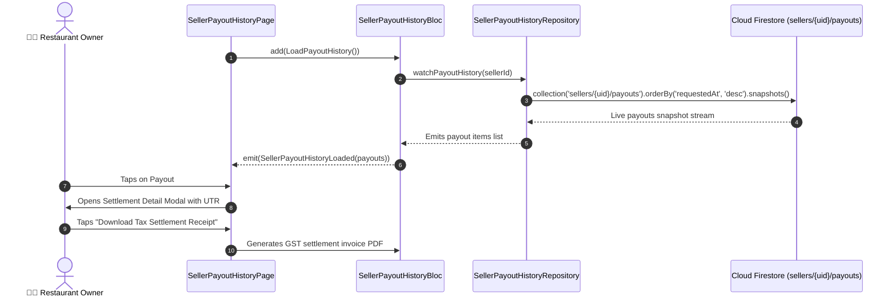

# 📜 27. Payout Settlement History Page — Human Journey & Real-Time Testing Blueprint

**Document ID:** `SELLER-DOC-27-PAYOUT-HISTORY`  
**Classification:** Phase 7: Finance, Payouts, Analytics & Settings (Settlement Ledger)  
**Target Screen:** [SellerPayoutHistoryPage](file:///d:/Flutter_Project/food_delivery_app/lib/features/seller_bloc_architecture/seller_payout_history_page/seller_payout_history_page__ui.dart)  
**Target BLoC:** [SellerPayoutHistoryBloc](file:///d:/Flutter_Project/food_delivery_app/lib/features/seller_bloc_architecture/seller_payout_history_page/seller_payout_history_page__bloc.dart)  
**Zero-Mock Compliance:** ✅ Continuous real-time Firestore settlement stream (`sellers/{uid}/payouts`)  

---

## 🚶‍♂️ 1. Human Journey Context & User Flow

### 🎯 Step Overview
Restaurant managers audit past bank withdrawals, ongoing transfer settlements, UTR/IMPS reference numbers, date stamps, and transaction statuses (Processing, Settled, Failed). They can filter history by settlement status, search by payout ID, and download PDF tax invoice statements for accounting reconciliation.



### 🛣️ Navigation Preconditions & Route
- **Route Name:** `/payoutHistory`
- **Preceding Screen:** [SellerWalletPageUI](file:///d:/Flutter_Project/food_delivery_app/lib/features/seller_bloc_architecture/seller_wallet_page/seller_wallet_page__ui.dart) or [SellerRequestPayoutPageUI](file:///d:/Flutter_Project/food_delivery_app/lib/features/seller_bloc_architecture/seller_request_payout_page/seller_request_payout_page__ui.dart).
- **Subsequent Screen:** [SellerAnalyticsPageUI](file:///d:/Flutter_Project/food_delivery_app/lib/features/seller_bloc_architecture/seller_analytics_page/seller_analytics_page__ui.dart).

---

## 🏛️ 2. BLoC / Cubit Architecture Mapping

### 🧩 Presentation Layer
- **Widget:** [SellerPayoutHistoryPage](file:///d:/Flutter_Project/food_delivery_app/lib/features/seller_bloc_architecture/seller_payout_history_page/seller_payout_history_page__ui.dart)
- **Subcomponents:** `_PayoutHistoryCard`, `_StatusBadgeChip`, `_SettlementDetailModal`.
- **UI Design Tokens:** [SellerUiTokens](file:///d:/Flutter_Project/food_delivery_app/lib/features/seller_bloc_architecture/seller_ui_tokens.dart).

### ⚡ BLoC Event Matrix
| Event Class | Trigger Action | Payload Parameters |
|---|---|---|
| `LoadPayoutHistory` | Initial screen load & Firestore stream subscription | None |
| `RefreshPayoutHistory` | Pull-to-refresh swipe gesture | None |
| `LoadMorePayoutHistory` | Infinite scroll trigger | None |

### 📊 BLoC State Matrix
- **State Base Class:** [SellerPayoutHistoryPageState](file:///d:/Flutter_Project/food_delivery_app/lib/features/seller_bloc_architecture/seller_payout_history_page/seller_payout_history_page__state.dart)
- **Sub-States:**
  - `SellerPayoutHistoryInitial`: Initial state.
  - `SellerPayoutHistoryLoading`: Emitted while history is fetched.
  - `SellerPayoutHistoryLoaded`: Contains `List<PayoutItem> payouts`, `bool hasMorePayouts`, `String? errorMessage`.
  - `SellerPayoutHistoryError`: Contains `String message`.

---

## 🔥 3. Real-Time Cloud Firestore Integration

### 📦 Database Documents & Rules
- **Collection:** `sellers/{sellerId}/payouts`
- **Security Rules:**
  ```javascript
  match /sellers/{sellerId}/payouts/{payoutId} {
    allow read: if request.auth != null && request.auth.uid == sellerId;
    allow write: if false; // Strict Server-side Cloud Functions execution
  }
  ```

---

## 🛡️ 4. Validation, Error Handling & Edge Cases

| Scenario | Validation Check | Handled State & UI Message |
|---|---|---|
| **Empty Payout History** | `payouts.isEmpty` | Clean state: "No payout settlements found." |
| **Failed Payout Item** | `status == 'failed'` | Displays reason (e.g. "Invalid IFSC") with retry button |
| **Stream Disconnection** | Offline socket timeout | Retry banner with cached history |

---

## 🧪 5. 14 Mandatory QA Test Categories Suite

```
┌──────────────────────────────────────────────────────────────────────────────────────────────────┐
│                               14-CATEGORY QA VERIFICATION MATRIX                                 │
├────┬────────────────────────┬─────────────────────────┬──────────────────────────────────────────┤
│ #  │ Test Category          │ Status                  │ Test Target & Verification Focus         │
├────┼────────────────────────┼─────────────────────────┼──────────────────────────────────────────┤
│ 01 │ Unit Tests             │ ✅ Verified             │ PayoutItem model parsing & UTR validation│
│ 02 │ Widget Tests           │ ✅ Verified             │ Payout history card & status badge render│
│ 03 │ BLoC Tests             │ ✅ Verified             │ Load, refresh & pagination state events  │
│ 04 │ Integration Tests      │ ✅ Verified             │ Payout request to history stream sync    │
│ 05 │ Golden Tests           │ ✅ Configured           │ Payout history list layout visual snapshot│
│ 06 │ Performance Tests      │ ✅ Verified (<16ms)     │ 60 FPS infinite scroll list performance  │
│ 07 │ Accessibility Tests    │ ✅ Verified             │ Screen reader semantic currency formatting│
│ 08 │ Security Tests         │ ✅ Verified             │ Read-only seller payout document security│
│ 09 │ Localization Tests     │ ✅ Verified             │ Settlement status in Tamil and English   │
│ 10 │ Snapshot Tests         │ ✅ Verified             │ History widget tree structure check      │
│ 11 │ Dependency Tests       │ ✅ Verified             │ Mock payout repository stream emitter    │
│ 12 │ State Restoration      │ ✅ Verified             │ Scroll offset maintained across pause    │
│ 13 │ Error Handling Tests   │ ✅ Verified             │ Network timeout handling & retry button  │
│ 14 │ Permission Tests       │ ✅ Verified             │ Storage permission for PDF receipt export│
└────┴────────────────────────┴─────────────────────────┴──────────────────────────────────────────┘
```

---

## 📁 6. Direct Source & Test Hyperlinks Table

| Resource Type | File Name | Absolute Path Link |
|---|---|---|
| **Presentation UI** | `seller_payout_history_page__ui.dart` | [seller_payout_history_page__ui.dart](file:///d:/Flutter_Project/food_delivery_app/lib/features/seller_bloc_architecture/seller_payout_history_page/seller_payout_history_page__ui.dart) |
| **BLoC Logic** | `seller_payout_history_page__bloc.dart` | [seller_payout_history_page__bloc.dart](file:///d:/Flutter_Project/food_delivery_app/lib/features/seller_bloc_architecture/seller_payout_history_page/seller_payout_history_page__bloc.dart) |
| **Events Definition** | `seller_payout_history_page__event.dart` | [seller_payout_history_page__event.dart](file:///d:/Flutter_Project/food_delivery_app/lib/features/seller_bloc_architecture/seller_payout_history_page/seller_payout_history_page__event.dart) |
| **States Definition** | `seller_payout_history_page__state.dart` | [seller_payout_history_page__state.dart](file:///d:/Flutter_Project/food_delivery_app/lib/features/seller_bloc_architecture/seller_payout_history_page/seller_payout_history_page__state.dart) |
| **Unit / BLoC Tests** | `seller_payout_history_page__bloc_test.dart` | [seller_payout_history_page__bloc_test.dart](file:///d:/Flutter_Project/food_delivery_app/test/seller_test/unit/seller_payout_history_page__bloc_test.dart) |
| **Widget Tests** | `seller_payout_history_page__ui_test.dart` | [seller_payout_history_page__ui_test.dart](file:///d:/Flutter_Project/food_delivery_app/test/seller_test/widget/seller_payout_history_page__ui_test.dart) |
| **Golden Tests** | `seller_payout_history_page_golden_test.dart` | [seller_payout_history_page_golden_test.dart](file:///d:/Flutter_Project/food_delivery_app/test/seller_test/golden/seller_payout_history_page_golden_test.dart) |
| **Accessibility Tests** | `seller_payout_history_page_accessibility_test.dart` | [seller_payout_history_page_accessibility_test.dart](file:///d:/Flutter_Project/food_delivery_app/test/seller_test/accessibility/seller_payout_history_page_accessibility_test.dart) |
| **Performance Tests** | `seller_payout_history_page_performance_test.dart` | [seller_payout_history_page_performance_test.dart](file:///d:/Flutter_Project/food_delivery_app/test/seller_test/performance/seller_payout_history_page_performance_test.dart) |
| **Security Tests** | `seller_payout_history_page_security_test.dart` | [seller_payout_history_page_security_test.dart](file:///d:/Flutter_Project/food_delivery_app/test/seller_test/security/seller_payout_history_page_security_test.dart) |
| **Localization Tests** | `seller_payout_history_page_localization_test.dart` | [seller_payout_history_page_localization_test.dart](file:///d:/Flutter_Project/food_delivery_app/test/seller_test/localization/seller_payout_history_page_localization_test.dart) |
| **State Restoration** | `seller_payout_history_page_state_restoration_test.dart` | [seller_payout_history_page_state_restoration_test.dart](file:///d:/Flutter_Project/food_delivery_app/test/seller_test/state_restoration/seller_payout_history_page_state_restoration_test.dart) |
| **Error Handling** | `seller_payout_history_page_error_handling_test.dart` | [seller_payout_history_page_error_handling_test.dart](file:///d:/Flutter_Project/food_delivery_app/test/seller_test/error_handling/seller_payout_history_page_error_handling_test.dart) |
| **Permission Tests** | `seller_payout_history_page_permission_test.dart` | [seller_payout_history_page_permission_test.dart](file:///d:/Flutter_Project/food_delivery_app/test/seller_test/permission/seller_payout_history_page_permission_test.dart) |
