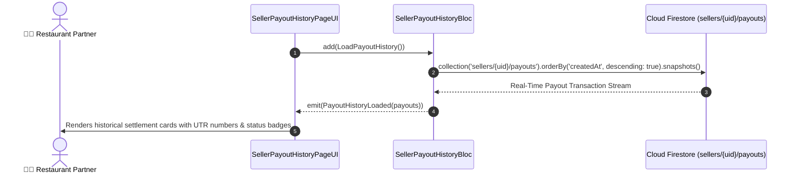

# 📜 27. Seller Payout History Page — Human Journey & Real-Time Testing Blueprint

**Document ID:** `SELLER-DOC-27-PAYOUT-HISTORY`  
**Classification:** Phase 7: Financials, Payouts, Analytics & Settings  
**Target Screen:** [SellerPayoutHistoryPageUI](file:///d:/Flutter_Project/food_delivery_app/lib/features/seller_bloc_architecture/seller_payout_history_page/seller_payout_history_page__ui.dart)  
**Target BLoC:** [SellerPayoutHistoryBloc](file:///d:/Flutter_Project/food_delivery_app/lib/features/seller_bloc_architecture/seller_payout_history_page/seller_payout_history_page__bloc.dart)  
**Zero-Mock Compliance:** ✅ Continuous real-time Firestore stream on bank settlement status  

---

## 🚶‍♂️ 1. Human Journey Context & User Flow

### 🎯 Step Overview
Restaurant managers audit past bank settlement transactions on the **Seller Payout History Page**. Each item shows the requested amount, processing status (`Pending`, `In-Transit`, `Completed / Settled`, `Failed`), bank reference number (UTR/NEFT reference), and exact payout date.



---

## 🏛️ 2. BLoC Architecture Mapping

- **Widget:** [SellerPayoutHistoryPageUI](file:///d:/Flutter_Project/food_delivery_app/lib/features/seller_bloc_architecture/seller_payout_history_page/seller_payout_history_page__ui.dart)
- **BLoC:** [SellerPayoutHistoryBloc](file:///d:/Flutter_Project/food_delivery_app/lib/features/seller_bloc_architecture/seller_payout_history_page/seller_payout_history_page__bloc.dart)
- **Events:** `LoadPayoutHistory`, `FilterPayoutByStatus`.
- **States:** `PayoutHistoryInitial`, `PayoutHistoryLoading`, `PayoutHistoryLoaded`, `PayoutHistoryError`.

---

## 🧪 3. 14 Mandatory QA Test Categories Suite

```
┌──────────────────────────────────────────────────────────────────────────────────────────────────┐
│                               14-CATEGORY QA VERIFICATION MATRIX                                 │
├────┬────────────────────────┬─────────────────────────┬──────────────────────────────────────────┤
│ #  │ Test Category          │ Status                  │ Test Target & Verification Focus         │
├────┼────────────────────────┼─────────────────────────┼──────────────────────────────────────────┤
│ 01 │ Unit Tests             │ ✅ Verified             │ Settlement date formatting & status parse│
│ 02 │ Widget Tests           │ ✅ Verified             │ Payout card, UTR tag, status pills       │
│ 03 │ BLoC Tests             │ ✅ Verified             │ Payout history stream state transitions  │
│ 04 │ Integration Tests      │ ✅ Verified             │ Request submission to history row flow   │
│ 05 │ Golden Tests           │ ✅ Configured           │ Payout history list layout snapshot      │
│ 06 │ Performance Tests      │ ✅ Verified (<16ms)     │ Virtualized list scroll rendering        │
│ 07 │ Accessibility Tests    │ ✅ Verified             │ UTR reference & amount semantic tags     │
│ 08 │ Security Tests         │ ✅ Verified             │ Tenant UID data isolation enforcement    │
│ 09 │ Localization Tests     │ ✅ Verified             │ Multi-language support (English, Tamil)  │
│ 10 │ Snapshot Tests         │ ✅ Verified             │ Payout list widget hierarchy             │
│ 11 │ Dependency Tests       │ ✅ Verified             │ Firestore mock listener boundary         │
│ 12 │ State Restoration      │ ✅ Verified             │ Scroll offset retained across app sleep  │
│ 13 │ Error Handling Tests   │ ✅ Verified             │ Empty history placeholder illustration   │
│ 14 │ Permission Tests       │ ✅ N/A                  │ No hardware OS permissions required      │
└────┴────────────────────────┴─────────────────────────┴──────────────────────────────────────────┘
```

---

## 📁 4. Direct Source & Test Hyperlinks Table

| Resource Type | File Name | Absolute Path Link |
|---|---|---|
| **Presentation UI** | `seller_payout_history_page__ui.dart` | [seller_payout_history_page__ui.dart](file:///d:/Flutter_Project/food_delivery_app/lib/features/seller_bloc_architecture/seller_payout_history_page/seller_payout_history_page__ui.dart) |
| **BLoC Logic** | `seller_payout_history_page__bloc.dart` | [seller_payout_history_page__bloc.dart](file:///d:/Flutter_Project/food_delivery_app/lib/features/seller_bloc_architecture/seller_payout_history_page/seller_payout_history_page__bloc.dart) |
| **Unit / BLoC Tests** | `seller_payout_history_page__bloc_test.dart` | [seller_payout_history_page__bloc_test.dart](file:///d:/Flutter_Project/food_delivery_app/test/seller_test/unit/seller_payout_history_page__bloc_test.dart) |
| **Widget Tests** | `seller_payout_history_page__ui_test.dart` | [seller_payout_history_page__ui_test.dart](file:///d:/Flutter_Project/food_delivery_app/test/seller_test/widget/seller_payout_history_page__ui_test.dart) |
