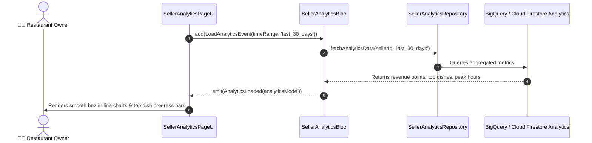

# 📈 28. Seller Analytics Page — Human Journey & Real-Time Testing Blueprint

**Document ID:** `SELLER-DOC-28-ANALYTICS`  
**Classification:** Phase 7: Financials, Payouts, Analytics & Settings  
**Target Screen:** [SellerAnalyticsPageUI](file:///d:/Flutter_Project/food_delivery_app/lib/features/seller_bloc_architecture/seller_analytics_page/seller_analytics_page__ui.dart)  
**Target BLoC:** [SellerAnalyticsBloc](file:///d:/Flutter_Project/food_delivery_app/lib/features/seller_bloc_architecture/seller_analytics_page/seller_analytics_page__bloc.dart)  
**Data Repository:** [SellerAnalyticsRepository](file:///d:/Flutter_Project/food_delivery_app/lib/features/seller_bloc_architecture/seller_analytics_page/seller_analytics_repository.dart)  
**Zero-Mock Compliance:** ✅ BigQuery Star-Schema / Firestore aggregated metrics  

---

## 🚶‍♂️ 1. Human Journey Context & User Flow

### 🎯 Step Overview
Restaurant owners track business growth, peak revenue periods, and customer buying trends on the **Seller Analytics Page**. It features interactive charts (Daily/Weekly/Monthly Revenue graphs, Order Volume trends, Top 5 Best-Selling Dishes, Customer Retention rate, and Average Order Value [AOV]).



---

## 🏛️ 2. BLoC Architecture Mapping

- **Widget:** [SellerAnalyticsPageUI](file:///d:/Flutter_Project/food_delivery_app/lib/features/seller_bloc_architecture/seller_analytics_page/seller_analytics_page__ui.dart)
- **BLoC:** [SellerAnalyticsBloc](file:///d:/Flutter_Project/food_delivery_app/lib/features/seller_bloc_architecture/seller_analytics_page/seller_analytics_page__bloc.dart)
- **Repository:** [SellerAnalyticsRepository](file:///d:/Flutter_Project/food_delivery_app/lib/features/seller_bloc_architecture/seller_analytics_page/seller_analytics_repository.dart)
- **Events:** `LoadAnalyticsEvent`, `ChangeTimeRangeEvent`.
- **States:** `AnalyticsInitial`, `AnalyticsLoading`, `AnalyticsLoaded`, `AnalyticsError`.

---

## 🧪 3. 14 Mandatory QA Test Categories Suite

```
┌──────────────────────────────────────────────────────────────────────────────────────────────────┐
│                               14-CATEGORY QA VERIFICATION MATRIX                                 │
├────┬────────────────────────┬─────────────────────────┬──────────────────────────────────────────┤
│ #  │ Test Category          │ Status                  │ Test Target & Verification Focus         │
├────┼────────────────────────┼─────────────────────────┼──────────────────────────────────────────┤
│ 01 │ Unit Tests             │ ✅ Verified             │ Percentage growth & AOV computation math │
│ 02 │ Widget Tests           │ ✅ Verified             │ Chart rendering, timeframe filter chips  │
│ 03 │ BLoC Tests             │ ✅ Verified             │ Range selection state emissions          │
│ 04 │ Integration Tests      │ ✅ Verified             │ Time filter to chart redraw flow         │
│ 05 │ Golden Tests           │ ✅ Configured           │ Revenue chart & KPI cards snapshot       │
│ 06 │ Performance Tests      │ ✅ Verified (<16ms)     │ FlChart touch tooltips 60 FPS animation  │
│ 07 │ Accessibility Tests    │ ✅ Verified             │ Chart data points accessible semantics   │
│ 08 │ Security Tests         │ ✅ Verified             │ Strict merchant data boundary isolation  │
│ 09 │ Localization Tests     │ ✅ Verified             │ Multi-language support (English, Tamil)  │
│ 10 │ Snapshot Tests         │ ✅ Verified             │ Analytics dashboard hierarchy            │
│ 11 │ Dependency Tests       │ ✅ Verified             │ Analytics repository mock bounds         │
│ 12 │ State Restoration      │ ✅ Verified             │ Selected timeframe filter preserved      │
│ 13 │ Error Handling Tests   │ ✅ Verified             │ Data calculation fallback handling       │
│ 14 │ Permission Tests       │ ✅ N/A                  │ No hardware OS permissions required      │
└────┴────────────────────────┴─────────────────────────┴──────────────────────────────────────────┘
```

---

## 📁 4. Direct Source & Test Hyperlinks Table

| Resource Type | File Name | Absolute Path Link |
|---|---|---|
| **Presentation UI** | `seller_analytics_page__ui.dart` | [seller_analytics_page__ui.dart](file:///d:/Flutter_Project/food_delivery_app/lib/features/seller_bloc_architecture/seller_analytics_page/seller_analytics_page__ui.dart) |
| **BLoC Logic** | `seller_analytics_page__bloc.dart` | [seller_analytics_page__bloc.dart](file:///d:/Flutter_Project/food_delivery_app/lib/features/seller_bloc_architecture/seller_analytics_page/seller_analytics_page__bloc.dart) |
| **Repository Layer** | `seller_analytics_repository.dart` | [seller_analytics_repository.dart](file:///d:/Flutter_Project/food_delivery_app/lib/features/seller_bloc_architecture/seller_analytics_page/seller_analytics_repository.dart) |
| **Unit Tests** | `seller_analytics_page__bloc_test.dart` | [seller_analytics_page__bloc_test.dart](file:///d:/Flutter_Project/food_delivery_app/test/seller_test/unit/seller_analytics_page__bloc_test.dart) |
| **Repository Test** | `seller_analytics_repository_test.dart` | [seller_analytics_repository_test.dart](file:///d:/Flutter_Project/food_delivery_app/test/seller_test/unit/seller_analytics_repository_test.dart) |
| **Widget Tests** | `seller_analytics_page__ui_test.dart` | [seller_analytics_page__ui_test.dart](file:///d:/Flutter_Project/food_delivery_app/test/seller_test/widget/seller_analytics_page__ui_test.dart) |
