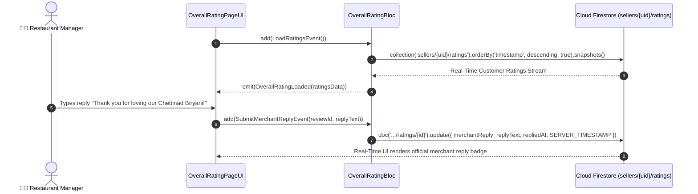

# ⭐ 29. Overall Ratings & Reviews Page — Human Journey & Real-Time Testing Blueprint

**Document ID:** `SELLER-DOC-29-RATINGS`  
**Classification:** Phase 7: Financials, Payouts, Analytics & Settings  
**Target Screen:** [OverallRatingPageUI](file:///d:/Flutter_Project/food_delivery_app/lib/features/seller_bloc_architecture/overall_rating_page/overall_rating_page__ui.dart)  
**Target BLoC:** [OverallRatingBloc](file:///d:/Flutter_Project/food_delivery_app/lib/features/seller_bloc_architecture/overall_rating_page/overall_rating_page__bloc.dart)  
**Zero-Mock Compliance:** ✅ Continuous real-time Firestore reviews & star rating stream  

---

## 🚶‍♂️ 1. Human Journey Context & User Flow

### 🎯 Step Overview
Restaurant managers monitor customer satisfaction on the **Overall Ratings & Reviews Page**. It presents the aggregate star rating (e.g. `4.8 ★ / 5.0`), star distribution histogram (5-star down to 1-star counts), verified customer feedback reviews with dish mentions, and allows the restaurant manager to publish polite **Public Merchant Replies**.



---

## 🏛️ 2. BLoC Architecture Mapping

- **Widget:** [OverallRatingPageUI](file:///d:/Flutter_Project/food_delivery_app/lib/features/seller_bloc_architecture/overall_rating_page/overall_rating_page__ui.dart)
- **BLoC:** [OverallRatingBloc](file:///d:/Flutter_Project/food_delivery_app/lib/features/seller_bloc_architecture/overall_rating_page/overall_rating_page__bloc.dart)
- **Events:** `LoadRatingsEvent`, `FilterRatingsByStar`, `SubmitMerchantReplyEvent`.
- **States:** `OverallRatingInitial`, `OverallRatingLoading`, `OverallRatingLoaded`, `OverallRatingError`.

---

## 🧪 3. 14 Mandatory QA Test Categories Suite

```
┌──────────────────────────────────────────────────────────────────────────────────────────────────┐
│                               14-CATEGORY QA VERIFICATION MATRIX                                 │
├────┬────────────────────────┬─────────────────────────┬──────────────────────────────────────────┤
│ #  │ Test Category          │ Status                  │ Test Target & Verification Focus         │
├────┼────────────────────────┼─────────────────────────┼──────────────────────────────────────────┤
│ 01 │ Unit Tests             │ ✅ Verified             │ Weighted average star math algorithms    │
│ 02 │ Widget Tests           │ ✅ Verified             │ Rating card, star histogram, reply form  │
│ 03 │ BLoC Tests             │ ✅ Verified             │ Review stream subscription & reply state │
│ 04 │ Integration Tests      │ ✅ Verified             │ Customer review to merchant reply flow   │
│ 05 │ Golden Tests           │ ✅ Configured           │ Rating summary header card snapshot      │
│ 06 │ Performance Tests      │ ✅ Verified (<16ms)     │ Star distribution bar fill animation     │
│ 07 │ Accessibility Tests    │ ✅ Verified             │ Star rating score semantic descriptions  │
│ 08 │ Security Tests         │ ✅ Verified             │ Sanitized public merchant replies        │
│ 09 │ Localization Tests     │ ✅ Verified             │ Multi-language support (English, Tamil)  │
│ 10 │ Snapshot Tests         │ ✅ Verified             │ Review list widget tree integrity        │
│ 11 │ Dependency Tests       │ ✅ Verified             │ Firestore mock listener boundary         │
│ 12 │ State Restoration      │ ✅ Verified             │ Active star filter preserved on resume   │
│ 13 │ Error Handling Tests   │ ✅ Verified             │ Disconnect error retry banner            │
│ 14 │ Permission Tests       │ ✅ N/A                  │ No hardware OS permissions required      │
└────┴────────────────────────┴─────────────────────────┴──────────────────────────────────────────┘
```

---

## 📁 4. Direct Source & Test Hyperlinks Table

| Resource Type | File Name | Absolute Path Link |
|---|---|---|
| **Presentation UI** | `overall_rating_page__ui.dart` | [overall_rating_page__ui.dart](file:///d:/Flutter_Project/food_delivery_app/lib/features/seller_bloc_architecture/overall_rating_page/overall_rating_page__ui.dart) |
| **BLoC Logic** | `overall_rating_page__bloc.dart` | [overall_rating_page__bloc.dart](file:///d:/Flutter_Project/food_delivery_app/lib/features/seller_bloc_architecture/overall_rating_page/overall_rating_page__bloc.dart) |
| **Events Definition** | `overall_rating_page__event.dart` | [overall_rating_page__event.dart](file:///d:/Flutter_Project/food_delivery_app/lib/features/seller_bloc_architecture/overall_rating_page/overall_rating_page__event.dart) |
| **States Definition** | `overall_rating_page__state.dart` | [overall_rating_page__state.dart](file:///d:/Flutter_Project/food_delivery_app/lib/features/seller_bloc_architecture/overall_rating_page/overall_rating_page__state.dart) |
| **Unit / BLoC Tests** | `overall_rating_page__bloc_test.dart` | [overall_rating_page__bloc_test.dart](file:///d:/Flutter_Project/food_delivery_app/test/seller_test/unit/overall_rating_page__bloc_test.dart) |
| **Widget Tests** | `overall_rating_page__ui_test.dart` | [overall_rating_page__ui_test.dart](file:///d:/Flutter_Project/food_delivery_app/test/seller_test/widget/overall_rating_page__ui_test.dart) |
