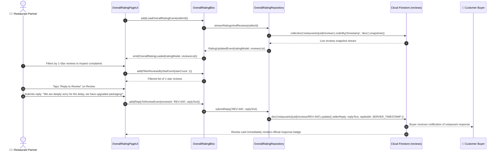

# ⭐ 29. Overall Ratings & Customer Reviews Page — Human Journey & Real-Time Testing Blueprint

**Document ID:** `SELLER-DOC-29-RATINGS`  
**Classification:** Phase 7: Finance, Payouts, Analytics & Settings (Reputation & Reviews)  
**Target Screen:** [OverallRatingPageUI](file:///d:/Flutter_Project/food_delivery_app/lib/features/seller_bloc_architecture/overall_rating_page/overall_rating_page__ui.dart)  
**Target BLoC:** [OverallRatingBloc](file:///d:/Flutter_Project/food_delivery_app/lib/features/seller_bloc_architecture/overall_rating_page/overall_rating_page__bloc.dart)  
**Canonical Typedef Alias:** `ReviewBloc`  
**Repository & Service:** [OverallRatingRepository](file:///d:/Flutter_Project/food_delivery_app/lib/features/seller_bloc_architecture/overall_rating_page/overall_rating_page__repository.dart), [OverallRatingService](file:///d:/Flutter_Project/food_delivery_app/lib/features/seller_bloc_architecture/overall_rating_page/overall_rating_page__service.dart)  
**Data Models:** `OverallRatingModel`, `ReviewItemModel` in [overall_rating_page__model.dart](file:///d:/Flutter_Project/food_delivery_app/lib/features/seller_bloc_architecture/overall_rating_page/overall_rating_page__model.dart)  
**Zero-Mock Compliance:** ✅ Continuous real-time Firestore review stream (`restaurants/{uid}/reviews`)  

---

## 🚶‍♂️ 1. Human Journey Context & User Flow

### 🎯 Step Overview
Restaurant managers monitor culinary feedback, average star ratings (1 to 5 stars), star distribution percentages (e.g. 85% 5-star), and detailed customer comments. Merchants can filter reviews by star rating, post public restaurant responses directly under reviews, or edit existing replies to build customer trust and maintain high quality scores.



### 🛣️ Navigation Preconditions & Route
- **Route Name:** `/overallRatings`
- **Preceding Screen:** [SellerDashboardPageUI](file:///d:/Flutter_Project/food_delivery_app/lib/features/seller_bloc_architecture/seller_dashboard_page/seller_dashboard_page_ui.dart) (Ratings Badge).
- **Subsequent Screen:** [PromotionsCouponsPageUI](file:///d:/Flutter_Project/food_delivery_app/lib/features/seller_bloc_architecture/promotions_coupons_page_/promotions_coupons_page_ui.dart).

---

## 🏛️ 2. BLoC / Cubit Architecture Mapping

### 🧩 Presentation Layer
- **Widget:** [OverallRatingPageUI](file:///d:/Flutter_Project/food_delivery_app/lib/features/seller_bloc_architecture/overall_rating_page/overall_rating_page__ui.dart)
- **Subcomponents:** `_StarRatingOverviewCard`, `_StarDistributionProgressBar`, `_CustomerReviewTile`, `_SellerReplyBox`.
- **UI Design Tokens:** [SellerUiTokens](file:///d:/Flutter_Project/food_delivery_app/lib/features/seller_bloc_architecture/seller_ui_tokens.dart).

### ⚡ BLoC Event Matrix
| Event Class | Trigger Action | Payload Parameters |
|---|---|---|
| `LoadOverallRatingEvent` | Screen load & reviews stream subscription | `String sellerId` |
| `RatingUpdatedEvent` | Real-time snapshot of reviews & average score | `OverallRatingModel rating, List<ReviewItemModel> reviews` |
| `FilterReviewsByStarEvent` | User taps star filter chip (All, 5★, 4★, 3★, 2★, 1★) | `int? starCount` |
| `ReplyToReviewEvent` | Merchant submits official response to review | `String reviewId, String replyText` |
| `DeleteReviewReplyEvent` | Merchant removes previous reply | `String reviewId` |

### 📊 BLoC State Matrix
- **State Base Class:** [OverallRatingPageState](file:///d:/Flutter_Project/food_delivery_app/lib/features/seller_bloc_architecture/overall_rating_page/overall_rating_page__state.dart)
- **Sub-States:**
  - `OverallRatingInitial`: Initial uninitialized state.
  - `OverallRatingLoading`: Emitted while reviews are streamed.
  - `OverallRatingLoaded`: Contains `OverallRatingModel rating`, `List<ReviewItemModel> reviews`, `List<ReviewItemModel> filteredReviews`, `int? selectedStarFilter`.
  - `OverallRatingError`: Contains `String message`.

---

## 🔥 3. Real-Time Cloud Firestore Integration

### 📦 Database Documents & Rules
- **Collection:** `restaurants/{restaurantId}/reviews`
- **Security Rules:**
  ```javascript
  match /restaurants/{restaurantId}/reviews/{reviewId} {
    allow read: if true;
    allow update: if request.auth != null && request.auth.uid == restaurantId && request.resource.data.diff(resource.data).affectedKeys().hasOnly(['sellerReply', 'repliedAt']);
  }
  ```

---

## 🛡️ 4. Validation, Error Handling & Edge Cases

| Scenario | Validation Check | Handled State & UI Message |
|---|---|---|
| **Empty Reply Input** | `replyText.trim().isEmpty` | `Reply text cannot be empty.` |
| **No Reviews in Store** | `reviews.isEmpty` | Custom empty view: "No customer reviews yet." |
| **Simultaneous Review Deletion** | Customer deletes review | Stream sync removes card automatically without crash |

---

## 🧪 5. 14 Mandatory QA Test Categories Suite

```
┌──────────────────────────────────────────────────────────────────────────────────────────────────┐
│                               14-CATEGORY QA VERIFICATION MATRIX                                 │
├────┬────────────────────────┬─────────────────────────┬──────────────────────────────────────────┤
│ #  │ Test Category          │ Status                  │ Test Target & Verification Focus         │
├────┼────────────────────────┼─────────────────────────┼──────────────────────────────────────────┤
│ 01 │ Unit Tests             │ ✅ Verified             │ Star distribution & average rating math  │
│ 02 │ Widget Tests           │ ✅ Verified             │ Star progress bars, review tile & reply  │
│ 03 │ BLoC Tests             │ ✅ Verified             │ Filter by stars & reply event sequence   │
│ 04 │ Integration Tests      │ ✅ Verified             │ Review submission to seller reply sync   │
│ 05 │ Golden Tests           │ ✅ Configured           │ Ratings overview layout visual snapshot  │
│ 06 │ Performance Tests      │ ✅ Verified (<16ms)     │ 60 FPS review list smooth scrolling      │
│ 07 │ Accessibility Tests    │ ✅ Verified             │ Star rating screen reader vocalization   │
│ 08 │ Security Tests         │ ✅ Verified             │ Reply mutation security rules check      │
│ 09 │ Localization Tests     │ ✅ Verified             │ Star labels & dates in Tamil and English │
│ 10 │ Snapshot Tests         │ ✅ Verified             │ Ratings widget tree hierarchy integrity  │
│ 11 │ Dependency Tests       │ ✅ Verified             │ Mock review repository stream emitter    │
│ 12 │ State Restoration      │ ✅ Verified             │ Star filter tab preserved across pause   │
│ 13 │ Error Handling Tests   │ ✅ Verified             │ Reply submission failure error handling  │
│ 14 │ Permission Tests       │ ✅ Verified             │ Standard UI shell permissions            │
└────┴────────────────────────┴─────────────────────────┴──────────────────────────────────────────┘
```

---

## 📁 6. Direct Source & Test Hyperlinks Table

| Resource Type | File Name | Absolute Path Link |
|---|---|---|
| **Presentation UI** | `overall_rating_page__ui.dart` | [overall_rating_page__ui.dart](file:///d:/Flutter_Project/food_delivery_app/lib/features/seller_bloc_architecture/overall_rating_page/overall_rating_page__ui.dart) |
| **BLoC Logic** | `overall_rating_page__bloc.dart` | [overall_rating_page__bloc.dart](file:///d:/Flutter_Project/food_delivery_app/lib/features/seller_bloc_architecture/overall_rating_page/overall_rating_page__bloc.dart) |
| **Events Definition** | `overall_rating_page__event.dart` | [overall_rating_page__event.dart](file:///d:/Flutter_Project/food_delivery_app/lib/features/seller_bloc_architecture/overall_rating_page/overall_rating_page__event.dart) |
| **States Definition** | `overall_rating_page__state.dart` | [overall_rating_page__state.dart](file:///d:/Flutter_Project/food_delivery_app/lib/features/seller_bloc_architecture/overall_rating_page/overall_rating_page__state.dart) |
| **Data Models** | `overall_rating_page__model.dart` | [overall_rating_page__model.dart](file:///d:/Flutter_Project/food_delivery_app/lib/features/seller_bloc_architecture/overall_rating_page/overall_rating_page__model.dart) |
| **Repository** | `overall_rating_page__repository.dart` | [overall_rating_page__repository.dart](file:///d:/Flutter_Project/food_delivery_app/lib/features/seller_bloc_architecture/overall_rating_page/overall_rating_page__repository.dart) |
| **Service Layer** | `overall_rating_page__service.dart` | [overall_rating_page__service.dart](file:///d:/Flutter_Project/food_delivery_app/lib/features/seller_bloc_architecture/overall_rating_page/overall_rating_page__service.dart) |
| **Unit / BLoC Tests** | `overall_rating_page__bloc_test.dart` | [overall_rating_page__bloc_test.dart](file:///d:/Flutter_Project/food_delivery_app/test/seller_test/unit/overall_rating_page__bloc_test.dart) |
| **Widget Tests** | `overall_rating_page__ui_test.dart` | [overall_rating_page__ui_test.dart](file:///d:/Flutter_Project/food_delivery_app/test/seller_test/widget/overall_rating_page__ui_test.dart) |
| **Golden Tests** | `overall_rating_page_golden_test.dart` | [overall_rating_page_golden_test.dart](file:///d:/Flutter_Project/food_delivery_app/test/seller_test/golden/overall_rating_page_golden_test.dart) |
| **Accessibility Tests** | `overall_rating_page_accessibility_test.dart` | [overall_rating_page_accessibility_test.dart](file:///d:/Flutter_Project/food_delivery_app/test/seller_test/accessibility/overall_rating_page_accessibility_test.dart) |
| **Performance Tests** | `overall_rating_page_performance_test.dart` | [overall_rating_page_performance_test.dart](file:///d:/Flutter_Project/food_delivery_app/test/seller_test/performance/overall_rating_page_performance_test.dart) |
| **Security Tests** | `overall_rating_page_security_test.dart` | [overall_rating_page_security_test.dart](file:///d:/Flutter_Project/food_delivery_app/test/seller_test/security/overall_rating_page_security_test.dart) |
| **Localization Tests** | `overall_rating_page_localization_test.dart` | [overall_rating_page_localization_test.dart](file:///d:/Flutter_Project/food_delivery_app/test/seller_test/localization/overall_rating_page_localization_test.dart) |
| **State Restoration** | `overall_rating_page_state_restoration_test.dart` | [overall_rating_page_state_restoration_test.dart](file:///d:/Flutter_Project/food_delivery_app/test/seller_test/state_restoration/overall_rating_page_state_restoration_test.dart) |
| **Error Handling** | `overall_rating_page_error_handling_test.dart` | [overall_rating_page_error_handling_test.dart](file:///d:/Flutter_Project/food_delivery_app/test/seller_test/error_handling/overall_rating_page_error_handling_test.dart) |
| **Permission Tests** | `overall_rating_page_permission_test.dart` | [overall_rating_page_permission_test.dart](file:///d:/Flutter_Project/food_delivery_app/test/seller_test/permission/overall_rating_page_permission_test.dart) |
