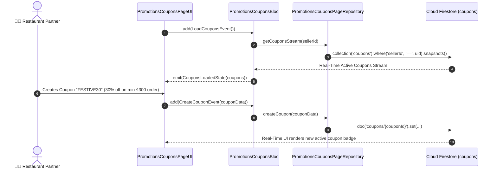

# 🎟️ 30. Promotions & Coupons Page — Human Journey & Real-Time Testing Blueprint

**Document ID:** `SELLER-DOC-30-COUPONS`  
**Classification:** Phase 7: Financials, Payouts, Analytics & Settings  
**Target Screen:** [PromotionsCouponsPageUI](file:///d:/Flutter_Project/food_delivery_app/lib/features/seller_bloc_architecture/promotions_coupons_page_/promotions_coupons_page_ui.dart)  
**Target BLoC:** [PromotionsCouponsBloc](file:///d:/Flutter_Project/food_delivery_app/lib/features/seller_bloc_architecture/promotions_coupons_page_/promotions_coupons_page_bloc.dart)  
**Data Repository:** [PromotionsCouponsPageRepository](file:///d:/Flutter_Project/food_delivery_app/lib/features/seller_bloc_architecture/promotions_coupons_page_/promotions_coupons_page_repository.dart)  
**Zero-Mock Compliance:** ✅ Direct Firestore `coupons` collection stream & validation engine  

---

## 🚶‍♂️ 1. Human Journey Context & User Flow

### 🎯 Step Overview
To drive higher order volumes during non-peak hours, restaurant owners launch marketing campaigns on the **Promotions & Coupons Page**. Sellers configure discount codes (e.g. `WELCOME50`, `BIRYANI20`), discount types (Percentage % vs Flat ₹ off), minimum order values, maximum discount caps, active start/expiry dates, and per-user usage limits.



---

## 🏛️ 2. BLoC Architecture Mapping

- **Widget:** [PromotionsCouponsPageUI](file:///d:/Flutter_Project/food_delivery_app/lib/features/seller_bloc_architecture/promotions_coupons_page_/promotions_coupons_page_ui.dart)
- **BLoC:** [PromotionsCouponsBloc](file:///d:/Flutter_Project/food_delivery_app/lib/features/seller_bloc_architecture/promotions_coupons_page_/promotions_coupons_page_bloc.dart)
- **Repository:** [PromotionsCouponsPageRepository](file:///d:/Flutter_Project/food_delivery_app/lib/features/seller_bloc_architecture/promotions_coupons_page_/promotions_coupons_page_repository.dart)
- **Events:** `LoadCouponsEvent`, `CreateCouponEvent`, `ToggleCouponStatusEvent`, `DeleteCouponEvent`.
- **States:** `CouponsInitialState`, `CouponsLoadingState`, `CouponsLoadedState`, `CouponsErrorState`.

---

## 🧪 3. 14 Mandatory QA Test Categories Suite

```
┌──────────────────────────────────────────────────────────────────────────────────────────────────┐
│                               14-CATEGORY QA VERIFICATION MATRIX                                 │
├────┬────────────────────────┬─────────────────────────┬──────────────────────────────────────────┤
│ #  │ Test Category          │ Status                  │ Test Target & Verification Focus         │
├────┼────────────────────────┼─────────────────────────┼──────────────────────────────────────────┤
│ 01 │ Unit Tests             │ ✅ Verified             │ Discount percentage vs flat amount math  │
│ 02 │ Widget Tests           │ ✅ Verified             │ Coupon tile, create modal, date picker   │
│ 03 │ BLoC Tests             │ ✅ Verified             │ Coupon stream state emission lifecycle   │
│ 04 │ Integration Tests      │ ✅ Verified             │ Create coupon to Buyer cart apply flow   │
│ 05 │ Golden Tests           │ ✅ Configured           │ Voucher card dashed border snapshot      │
│ 06 │ Performance Tests      │ ✅ Verified (<16ms)     │ Coupon toggle switch instantaneous FPS   │
│ 07 │ Accessibility Tests    │ ✅ Verified             │ Coupon code copy & toggle semantics      │
│ 08 │ Security Tests         │ ✅ Verified             │ Prevents coupon discount stacking abuse  │
│ 09 │ Localization Tests     │ ✅ Verified             │ Multi-language support (English, Tamil)  │
│ 10 │ Snapshot Tests         │ ✅ Verified             │ Coupon card widget tree integrity        │
│ 11 │ Dependency Tests       │ ✅ Verified             │ Repository stream mock boundary          │
│ 12 │ State Restoration      │ ✅ Verified             │ Form modal inputs retained on pause      │
│ 13 │ Error Handling Tests   │ ✅ Verified             │ Duplicate coupon code rejection alert    │
│ 14 │ Permission Tests       │ ✅ N/A                  │ No hardware OS permissions required      │
└────┴────────────────────────┴─────────────────────────┴──────────────────────────────────────────┘
```

---

## 📁 4. Direct Source & Test Hyperlinks Table

| Resource Type | File Name | Absolute Path Link |
|---|---|---|
| **Presentation UI** | `promotions_coupons_page_ui.dart` | [promotions_coupons_page_ui.dart](file:///d:/Flutter_Project/food_delivery_app/lib/features/seller_bloc_architecture/promotions_coupons_page_/promotions_coupons_page_ui.dart) |
| **BLoC Logic** | `promotions_coupons_page_bloc.dart` | [promotions_coupons_page_bloc.dart](file:///d:/Flutter_Project/food_delivery_app/lib/features/seller_bloc_architecture/promotions_coupons_page_/promotions_coupons_page_bloc.dart) |
| **Repository Layer** | `promotions_coupons_page_repository.dart` | [promotions_coupons_page_repository.dart](file:///d:/Flutter_Project/food_delivery_app/lib/features/seller_bloc_architecture/promotions_coupons_page_/promotions_coupons_page_repository.dart) |
| **Unit Tests** | `promotions_coupons_page_bloc_test.dart` | [promotions_coupons_page_bloc_test.dart](file:///d:/Flutter_Project/food_delivery_app/test/seller_test/unit/promotions_coupons_page_bloc_test.dart) |
| **Model Test** | `promotions_coupons_page_model_test.dart` | [promotions_coupons_page_model_test.dart](file:///d:/Flutter_Project/food_delivery_app/test/seller_test/unit/promotions_coupons_page_model_test.dart) |
| **Widget Tests** | `promotions_coupons_page_ui_test.dart` | [promotions_coupons_page_ui_test.dart](file:///d:/Flutter_Project/food_delivery_app/test/seller_test/widget/promotions_coupons_page_ui_test.dart) |
| **Integration Test** | `promotions_coupons_page_flow_test.dart` | [promotions_coupons_page_flow_test.dart](file:///d:/Flutter_Project/food_delivery_app/test/seller_test/integration/promotions_coupons_page_flow_test.dart) |
