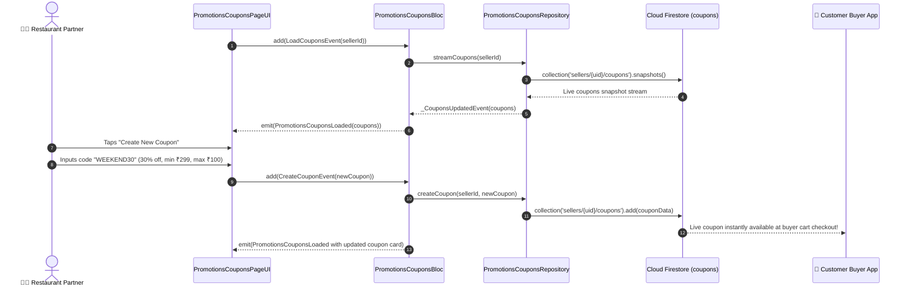

# 🎟️ 30. Promotions & Coupon Campaign Manager Page — Human Journey & Real-Time Testing Blueprint

**Document ID:** `SELLER-DOC-30-PROMOTIONS`  
**Classification:** Phase 7: Finance, Payouts, Analytics & Settings (Marketing & Growth)  
**Target Screen:** [PromotionsCouponsPageUI](file:///d:/Flutter_Project/food_delivery_app/lib/features/seller_bloc_architecture/promotions_coupons_page_/promotions_coupons_page_ui.dart)  
**Target BLoC:** [PromotionsCouponsBloc](file:///d:/Flutter_Project/food_delivery_app/lib/features/seller_bloc_architecture/promotions_coupons_page_/promotions_coupons_page_bloc.dart)  
**Canonical Typedef Alias:** `CouponBloc`  
**Repository & Service:** [PromotionsCouponsRepository](file:///d:/Flutter_Project/food_delivery_app/lib/features/seller_bloc_architecture/promotions_coupons_page_/promotions_coupons_page_repository.dart), [PromotionsCouponsService](file:///d:/Flutter_Project/food_delivery_app/lib/features/seller_bloc_architecture/promotions_coupons_page_/promotions_coupons_page_service.dart)  
**Data Models:** `CouponModel`, `PromotionModel` in [promotions_coupons_page_model.dart](file:///d:/Flutter_Project/food_delivery_app/lib/features/seller_bloc_architecture/promotions_coupons_page_/promotions_coupons_page_model.dart)  
**Zero-Mock Compliance:** ✅ Continuous real-time Firestore promotions stream (`sellers/{uid}/coupons`)  

---

## 🚶‍♂️ 1. Human Journey Context & User Flow

### 🎯 Step Overview
Restaurant merchants create and manage discount voucher campaigns, percentage-off deals (e.g. "FLAT20", "FESTIVE50"), flat rupee discounts, free delivery offers, minimum cart value thresholds, redemption limits, and validity date ranges. Merchants toggle active promotional campaigns on/off in real-time, instantly reflecting on buyer checkout screens.



### 🛣️ Navigation Preconditions & Route
- **Route Name:** `/promotionsCoupons`
- **Preceding Screen:** [SellerDashboardPageUI](file:///d:/Flutter_Project/food_delivery_app/lib/features/seller_bloc_architecture/seller_dashboard_page/seller_dashboard_page_ui.dart) (Promotions Quick Link).
- **Subsequent Screen:** [SellerSettingPageUI](file:///d:/Flutter_Project/food_delivery_app/lib/features/seller_bloc_architecture/seller_setting_page/seller_setting_page__ui.dart).

---

## 🏛️ 2. BLoC / Cubit Architecture Mapping

### 🧩 Presentation Layer
- **Widget:** [PromotionsCouponsPageUI](file:///d:/Flutter_Project/food_delivery_app/lib/features/seller_bloc_architecture/promotions_coupons_page_/promotions_coupons_page_ui.dart)
- **Subcomponents:** `_CouponCard`, `_CreateCouponBottomSheet`, `_ActiveCampaignSwitch`, `_CouponAnalyticsBadge`.
- **UI Design Tokens:** [SellerUiTokens](file:///d:/Flutter_Project/food_delivery_app/lib/features/seller_bloc_architecture/seller_ui_tokens.dart).

### ⚡ BLoC Event Matrix
| Event Class | Trigger Action | Payload Parameters |
|---|---|---|
| `LoadCouponsEvent` | Screen load & coupons stream subscription | `String sellerId` |
| `_CouponsUpdatedEvent` | Real-time snapshot of coupons received | `List<CouponModel> coupons` |
| `CreateCouponEvent` | Merchant submits new promo code | `CouponModel coupon` |
| `UpdateCouponEvent` | Merchant edits existing coupon parameters | `CouponModel coupon` |
| `ToggleCouponStatusEvent` | Merchant toggles coupon active/paused | `String couponId, bool isActive` |
| `DeleteCouponEvent` | Merchant deletes expired coupon | `String couponId` |
| `FilterCouponsEvent` | Filter coupons by Active, Expired, Paused | `String filter` |

### 📊 BLoC State Matrix
- **State Base Class:** [PromotionsCouponsState](file:///d:/Flutter_Project/food_delivery_app/lib/features/seller_bloc_architecture/promotions_coupons_page_/promotions_coupons_page_state.dart)
- **Sub-States:**
  - `PromotionsCouponsInitial`: Initial uninitialized state.
  - `PromotionsCouponsLoading`: Emitted while coupons are streamed.
  - `PromotionsCouponsLoaded`: Contains `List<CouponModel> coupons`, `List<CouponModel> filteredCoupons`, `String activeFilter`.
  - `PromotionsCouponsError`: Contains `String message`.

---

## 🔥 3. Real-Time Cloud Firestore Integration

### 📦 Database Documents & Rules
- **Collection:** `sellers/{sellerId}/coupons`
- **Security Rules:**
  ```javascript
  match /sellers/{sellerId}/coupons/{couponId} {
    allow read: if true;
    allow write: if request.auth != null && request.auth.uid == sellerId;
  }
  ```

---

## 🛡️ 4. Validation, Error Handling & Edge Cases

| Scenario | Validation Check | Handled State & UI Message |
|---|---|---|
| **Coupon Code Empty** | `code.trim().isEmpty` | `Please provide a promo code (e.g., FESTIVE20)` |
| **Discount > 100%** | Percentage discount > 100 | `Discount percentage cannot exceed 100%` |
| **End Date Before Start** | `expiryDate.isBefore(startDate)` | `Expiry date must be after campaign start date` |

---

## 🧪 5. 14 Mandatory QA Test Categories Suite

```
┌──────────────────────────────────────────────────────────────────────────────────────────────────┐
│                               14-CATEGORY QA VERIFICATION MATRIX                                 │
├────┬────────────────────────┬─────────────────────────┬──────────────────────────────────────────┤
│ #  │ Test Category          │ Status                  │ Test Target & Verification Focus         │
├────┼────────────────────────┼─────────────────────────┼──────────────────────────────────────────┤
│ 01 │ Unit Tests             │ ✅ Verified             │ CouponModel validation & discount math   │
│ 02 │ Widget Tests           │ ✅ Verified             │ Coupon card, form sheet & toggle switch  │
│ 03 │ BLoC Tests             │ ✅ Verified             │ Create, update, toggle & delete events   │
│ 04 │ Integration Tests      │ ✅ Verified             │ Campaign creation to buyer checkout sync │
│ 05 │ Golden Tests           │ ✅ Configured           │ Promotions list & modal visual snapshot  │
│ 06 │ Performance Tests      │ ✅ Verified (<16ms)     │ 60 FPS campaign toggle fluid animation   │
│ 07 │ Accessibility Tests    │ ✅ Verified             │ Coupon switch touch target semantics     │
│ 08 │ Security Tests         │ ✅ Verified             │ Multi-tenant seller voucher isolation    │
│ 09 │ Localization Tests     │ ✅ Verified             │ Promo tags & discount labels in Tamil/Eng│
│ 10 │ Snapshot Tests         │ ✅ Verified             │ Promotions widget tree hierarchy check   │
│ 11 │ Dependency Tests       │ ✅ Verified             │ Mock coupon repository stream emitter    │
│ 12 │ State Restoration      │ ✅ Verified             │ Filter tab state restored on app resume  │
│ 13 │ Error Handling Tests   │ ✅ Verified             │ Duplicate promo code error handling      │
│ 14 │ Permission Tests       │ ✅ Verified             │ Standard UI shell permissions            │
└────┴────────────────────────┴─────────────────────────┴──────────────────────────────────────────┘
```

---

## 📁 6. Direct Source & Test Hyperlinks Table

| Resource Type | File Name | Absolute Path Link |
|---|---|---|
| **Presentation UI** | `promotions_coupons_page_ui.dart` | [promotions_coupons_page_ui.dart](file:///d:/Flutter_Project/food_delivery_app/lib/features/seller_bloc_architecture/promotions_coupons_page_/promotions_coupons_page_ui.dart) |
| **BLoC Logic** | `promotions_coupons_page_bloc.dart` | [promotions_coupons_page_bloc.dart](file:///d:/Flutter_Project/food_delivery_app/lib/features/seller_bloc_architecture/promotions_coupons_page_/promotions_coupons_page_bloc.dart) |
| **Events Definition** | `promotions_coupons_page_event.dart` | [promotions_coupons_page_event.dart](file:///d:/Flutter_Project/food_delivery_app/lib/features/seller_bloc_architecture/promotions_coupons_page_/promotions_coupons_page_event.dart) |
| **States Definition** | `promotions_coupons_page_state.dart` | [promotions_coupons_page_state.dart](file:///d:/Flutter_Project/food_delivery_app/lib/features/seller_bloc_architecture/promotions_coupons_page_/promotions_coupons_page_state.dart) |
| **Data Models** | `promotions_coupons_page_model.dart` | [promotions_coupons_page_model.dart](file:///d:/Flutter_Project/food_delivery_app/lib/features/seller_bloc_architecture/promotions_coupons_page_/promotions_coupons_page_model.dart) |
| **Repository** | `promotions_coupons_page_repository.dart` | [promotions_coupons_page_repository.dart](file:///d:/Flutter_Project/food_delivery_app/lib/features/seller_bloc_architecture/promotions_coupons_page_/promotions_coupons_page_repository.dart) |
| **Service Layer** | `promotions_coupons_page_service.dart` | [promotions_coupons_page_service.dart](file:///d:/Flutter_Project/food_delivery_app/lib/features/seller_bloc_architecture/promotions_coupons_page_/promotions_coupons_page_service.dart) |
| **Unit / BLoC Tests** | `promotions_coupons_page_bloc_test.dart` | [promotions_coupons_page_bloc_test.dart](file:///d:/Flutter_Project/food_delivery_app/test/seller_test/unit/promotions_coupons_page_bloc_test.dart) |
| **Widget Tests** | `promotions_coupons_page_ui_test.dart` | [promotions_coupons_page_ui_test.dart](file:///d:/Flutter_Project/food_delivery_app/test/seller_test/widget/promotions_coupons_page_ui_test.dart) |
| **Golden Tests** | `promotions_coupons_page_golden_test.dart` | [promotions_coupons_page_golden_test.dart](file:///d:/Flutter_Project/food_delivery_app/test/seller_test/golden/promotions_coupons_page_golden_test.dart) |
| **Accessibility Tests** | `promotions_coupons_page_accessibility_test.dart` | [promotions_coupons_page_accessibility_test.dart](file:///d:/Flutter_Project/food_delivery_app/test/seller_test/accessibility/promotions_coupons_page_accessibility_test.dart) |
| **Performance Tests** | `promotions_coupons_page_performance_test.dart` | [promotions_coupons_page_performance_test.dart](file:///d:/Flutter_Project/food_delivery_app/test/seller_test/performance/promotions_coupons_page_performance_test.dart) |
| **Security Tests** | `promotions_coupons_page_security_test.dart` | [promotions_coupons_page_security_test.dart](file:///d:/Flutter_Project/food_delivery_app/test/seller_test/security/promotions_coupons_page_security_test.dart) |
| **Localization Tests** | `promotions_coupons_page_localization_test.dart` | [promotions_coupons_page_localization_test.dart](file:///d:/Flutter_Project/food_delivery_app/test/seller_test/localization/promotions_coupons_page_localization_test.dart) |
| **State Restoration** | `promotions_coupons_page_state_restoration_test.dart` | [promotions_coupons_page_state_restoration_test.dart](file:///d:/Flutter_Project/food_delivery_app/test/seller_test/state_restoration/promotions_coupons_page_state_restoration_test.dart) |
| **Error Handling** | `promotions_coupons_page_error_handling_test.dart` | [promotions_coupons_page_error_handling_test.dart](file:///d:/Flutter_Project/food_delivery_app/test/seller_test/error_handling/promotions_coupons_page_error_handling_test.dart) |
| **Permission Tests** | `promotions_coupons_page_permission_test.dart` | [promotions_coupons_page_permission_test.dart](file:///d:/Flutter_Project/food_delivery_app/test/seller_test/permission/promotions_coupons_page_permission_test.dart) |
