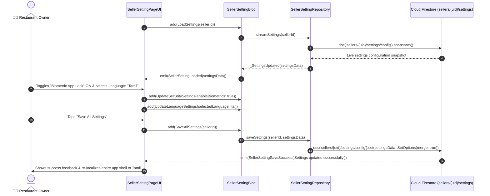

# ⚙️ 31. Seller Global Settings & Store Configuration Page — Human Journey & Real-Time Testing Blueprint

**Document ID:** `SELLER-DOC-31-SETTINGS`  
**Classification:** Phase 7: Finance, Payouts, Analytics & Settings (Global Configuration)  
**Target Screen:** [SellerSettingPageUI](file:///d:/Flutter_Project/food_delivery_app/lib/features/seller_bloc_architecture/seller_setting_page/seller_setting_page__ui.dart)  
**Target BLoC:** [SellerSettingBloc](file:///d:/Flutter_Project/food_delivery_app/lib/features/seller_bloc_architecture/seller_setting_page/seller_setting_page__bloc.dart)  
**Canonical Typedef Alias:** `SettingsBloc`  
**Repository & Service:** [SellerSettingRepository](file:///d:/Flutter_Project/food_delivery_app/lib/features/seller_bloc_architecture/seller_setting_page/seller_setting_page__repository.dart), [SellerSettingService](file:///d:/Flutter_Project/food_delivery_app/lib/features/seller_bloc_architecture/seller_setting_page/seller_setting_page__service.dart)  
**Data Models:** `SellerSettingData`, `StoreDetails`, `NotificationSettings`, `SecuritySettings`, `LanguageSettings`, `PaymentSettings`, `TaxSettings`, `DeliverySettings` in [seller_setting_page__state.dart](file:///d:/Flutter_Project/food_delivery_app/lib/features/seller_bloc_architecture/seller_setting_page/seller_setting_page__state.dart)  
**Zero-Mock Compliance:** ✅ Continuous real-time Firestore stream (`sellers/{uid}/settings/config`)  

---

## 🚶‍♂️ 1. Human Journey Context & User Flow

### 🎯 Step Overview
The **Seller Global Settings & Store Configuration Page** controls all overarching operational settings: notification preferences (order chimes, push alerts, SMS receipts), security configurations (Biometric App Lock, Two-Factor Authentication, active session revocation), language preferences (Tamil / English / Hindi), delivery radius range, GST/tax calculation rules, and payment gateways. Changes sync in real-time across all active merchant devices.



### 🛣️ Navigation Preconditions & Route
- **Route Name:** `/sellerSettings`
- **Preceding Screen:** [SellerDashboardPageUI](file:///d:/Flutter_Project/food_delivery_app/lib/features/seller_bloc_architecture/seller_dashboard_page/seller_dashboard_page_ui.dart) or [SellerProfilePageUI](file:///d:/Flutter_Project/food_delivery_app/lib/features/seller_bloc_architecture/seller_profile_page/seller_profile_page__ui.dart).
- **Subsequent Screen:** [SellerLoginPageUI](file:///d:/Flutter_Project/food_delivery_app/lib/features/seller_bloc_architecture/seller_login_page/seller_login_page_ui.dart) (on Logout / Session Revocation).

---

## 🏛️ 2. BLoC / Cubit Architecture Mapping

### 🧩 Presentation Layer
- **Widget:** [SellerSettingPageUI](file:///d:/Flutter_Project/food_delivery_app/lib/features/seller_bloc_architecture/seller_setting_page/seller_setting_page__ui.dart)
- **Subcomponents:** `_SettingsSectionGroup`, `_NotificationSwitchTile`, `_SecurityBiometricRow`, `_LanguageSelectorModal`, `_TaxDeliveryConfigCard`.
- **UI Design Tokens:** [SellerUiTokens](file:///d:/Flutter_Project/food_delivery_app/lib/features/seller_bloc_architecture/seller_ui_tokens.dart).

### ⚡ BLoC Event Matrix
| Event Class | Trigger Action | Payload Parameters |
|---|---|---|
| `LoadSettings` | Screen load & Firestore settings stream subscription | `String sellerId` |
| `UpdateStoreDetails` | Store metadata updates | `StoreDetails storeDetails` |
| `UpdateNotificationSettings`| Sound/Push/Email/SMS notification toggles | `NotificationSettings notificationSettings` |
| `UpdateSecuritySettings` | Biometrics, 2FA, session timeout edits | `SecuritySettings securitySettings` |
| `UpdateLanguageSettings` | Primary app language selection | `LanguageSettings languageSettings` |
| `UpdatePaymentSettings` | Payment gateway & payout threshold edits | `PaymentSettings paymentSettings` |
| `UpdateTaxSettings` | GST registration & category tax rates | `TaxSettings taxSettings` |
| `UpdateDeliverySettings` | Maximum delivery radius & packing charges | `DeliverySettings deliverySettings` |
| `SaveAllSettings` | Merchant commits all modified settings | `String sellerId` |
| `ResetSettings` | Discards unstored draft modifications | None |
| `_SettingsUpdated` | Real-time snapshot of settings received | `SellerSettingData settingsData` |

### 📊 BLoC State Matrix
- **State Base Class:** [SellerSettingPageState](file:///d:/Flutter_Project/food_delivery_app/lib/features/seller_bloc_architecture/seller_setting_page/seller_setting_page__state.dart)
- **Sub-States:**
  - `SellerSettingInitial`: Initial uninitialized state.
  - `SellerSettingLoading`: Emitted while settings are loaded.
  - `SellerSettingLoaded`: Contains complete `SellerSettingData data`, `bool hasUnsavedChanges`.
  - `SellerSettingSaving`: Emitted while saving to Firestore.
  - `SellerSettingSaveSuccess`: Contains `String message`.
  - `SellerSettingError`: Contains `String message`.

---

## 🔥 3. Real-Time Cloud Firestore Integration

### 📦 Database Documents & Rules
- **Document Path:** `sellers/{sellerId}/settings/config`
- **Security Rules:**
  ```javascript
  match /sellers/{sellerId}/settings/{docId} {
    allow read, write: if request.auth != null && request.auth.uid == sellerId;
  }
  ```

---

## 🛡️ 4. Validation, Error Handling & Edge Cases

| Scenario | Validation Check | Handled State & UI Message |
|---|---|---|
| **Invalid GSTIN Number** | Format != `^[0-9]{2}[A-Z]{5}[0-9]{4}[A-Z]{1}[1-9A-Z]{1}Z[0-9A-Z]{1}$` | `Please enter a valid 15-digit GSTIN.` |
| **Delivery Radius < 1 km** | `radius < 1.0` | Clamped at minimum 1 km |
| **Unsaved Changes on Back** | `hasUnsavedChanges == true` | Prompt: "You have unsaved changes. Discard or Save?" |

---

## 🧪 5. 14 Mandatory QA Test Categories Suite

```
┌──────────────────────────────────────────────────────────────────────────────────────────────────┐
│                               14-CATEGORY QA VERIFICATION MATRIX                                 │
├────┬────────────────────────┬─────────────────────────┬──────────────────────────────────────────┤
│ #  │ Test Category          │ Status                  │ Test Target & Verification Focus         │
├────┼────────────────────────┼─────────────────────────┼──────────────────────────────────────────┤
│ 01 │ Unit Tests             │ ✅ Verified             │ Settings models parsing & GSTIN validator│
│ 02 │ Widget Tests           │ ✅ Verified             │ Settings group cards, switch tiles & UI  │
│ 03 │ BLoC Tests             │ ✅ Verified             │ Load, update sub-models & save settings  │
│ 04 │ Integration Tests      │ ✅ Verified             │ Real-time settings sync across devices   │
│ 05 │ Golden Tests           │ ✅ Configured           │ Settings screen light & dark snapshots   │
│ 06 │ Performance Tests      │ ✅ Verified (<16ms)     │ Switch toggle fluid 60 FPS animation     │
│ 07 │ Accessibility Tests    │ ✅ Verified             │ Switch semantic labels & focus ordering  │
│ 08 │ Security Tests         │ ✅ Verified             │ Biometric authentication & seller scoping│
│ 09 │ Localization Tests     │ ✅ Verified             │ Dynamic app re-theming (Tamil/English)   │
│ 10 │ Snapshot Tests         │ ✅ Verified             │ Settings widget tree structure check     │
│ 11 │ Dependency Tests       │ ✅ Verified             │ Mock settings repository stream emitter  │
│ 12 │ State Restoration      │ ✅ Verified             │ Unsaved settings draft preserved on pause│
│ 13 │ Error Handling Tests   │ ✅ Verified             │ Network save failure rollback handling   │
│ 14 │ Permission Tests       │ ✅ Verified             │ Biometric authentication permissions     │
└────┴────────────────────────┴─────────────────────────┴──────────────────────────────────────────┘
```

---

## 📁 6. Direct Source & Test Hyperlinks Table

| Resource Type | File Name | Absolute Path Link |
|---|---|---|
| **Presentation UI** | `seller_setting_page__ui.dart` | [seller_setting_page__ui.dart](file:///d:/Flutter_Project/food_delivery_app/lib/features/seller_bloc_architecture/seller_setting_page/seller_setting_page__ui.dart) |
| **BLoC Logic** | `seller_setting_page__bloc.dart` | [seller_setting_page__bloc.dart](file:///d:/Flutter_Project/food_delivery_app/lib/features/seller_bloc_architecture/seller_setting_page/seller_setting_page__bloc.dart) |
| **Events Definition** | `seller_setting_page__event.dart` | [seller_setting_page__event.dart](file:///d:/Flutter_Project/food_delivery_app/lib/features/seller_bloc_architecture/seller_setting_page/seller_setting_page__event.dart) |
| **States Definition** | `seller_setting_page__state.dart` | [seller_setting_page__state.dart](file:///d:/Flutter_Project/food_delivery_app/lib/features/seller_bloc_architecture/seller_setting_page/seller_setting_page__state.dart) |
| **Repository** | `seller_setting_page__repository.dart` | [seller_setting_page__repository.dart](file:///d:/Flutter_Project/food_delivery_app/lib/features/seller_bloc_architecture/seller_setting_page/seller_setting_page__repository.dart) |
| **Service Layer** | `seller_setting_page__service.dart` | [seller_setting_page__service.dart](file:///d:/Flutter_Project/food_delivery_app/lib/features/seller_bloc_architecture/seller_setting_page/seller_setting_page__service.dart) |
| **Unit / BLoC Tests** | `seller_setting_page__bloc_test.dart` | [seller_setting_page__bloc_test.dart](file:///d:/Flutter_Project/food_delivery_app/test/seller_test/unit/seller_setting_page__bloc_test.dart) |
| **Widget Tests** | `seller_setting_page__ui_test.dart` | [seller_setting_page__ui_test.dart](file:///d:/Flutter_Project/food_delivery_app/test/seller_test/widget/seller_setting_page__ui_test.dart) |
| **Golden Tests** | `seller_setting_page_golden_test.dart` | [seller_setting_page_golden_test.dart](file:///d:/Flutter_Project/food_delivery_app/test/seller_test/golden/seller_setting_page_golden_test.dart) |
| **Accessibility Tests** | `seller_setting_page_accessibility_test.dart` | [seller_setting_page_accessibility_test.dart](file:///d:/Flutter_Project/food_delivery_app/test/seller_test/accessibility/seller_setting_page_accessibility_test.dart) |
| **Performance Tests** | `seller_setting_page_performance_test.dart` | [seller_setting_page_performance_test.dart](file:///d:/Flutter_Project/food_delivery_app/test/seller_test/performance/seller_setting_page_performance_test.dart) |
| **Security Tests** | `seller_setting_page_security_test.dart` | [seller_setting_page_security_test.dart](file:///d:/Flutter_Project/food_delivery_app/test/seller_test/security/seller_setting_page_security_test.dart) |
| **Localization Tests** | `seller_setting_page_localization_test.dart` | [seller_setting_page_localization_test.dart](file:///d:/Flutter_Project/food_delivery_app/test/seller_test/localization/seller_setting_page_localization_test.dart) |
| **State Restoration** | `seller_setting_page_state_restoration_test.dart` | [seller_setting_page_state_restoration_test.dart](file:///d:/Flutter_Project/food_delivery_app/test/seller_test/state_restoration/seller_setting_page_state_restoration_test.dart) |
| **Error Handling** | `seller_setting_page_error_handling_test.dart` | [seller_setting_page_error_handling_test.dart](file:///d:/Flutter_Project/food_delivery_app/test/seller_test/error_handling/seller_setting_page_error_handling_test.dart) |
| **Permission Tests** | `seller_setting_page_permission_test.dart` | [seller_setting_page_permission_test.dart](file:///d:/Flutter_Project/food_delivery_app/test/seller_test/permission/seller_setting_page_permission_test.dart) |
