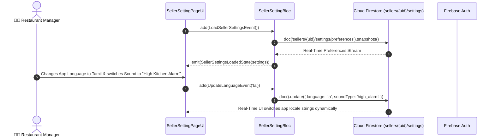

# ⚙️ 31. Seller Global Settings Page — Human Journey & Real-Time Testing Blueprint

**Document ID:** `SELLER-DOC-31-SETTINGS`  
**Classification:** Phase 7: Financials, Payouts, Analytics & Settings  
**Target Screen:** [SellerSettingPageUI](file:///d:/Flutter_Project/food_delivery_app/lib/features/seller_bloc_architecture/seller_setting_page/seller_setting_page__ui.dart)  
**Target BLoC:** [SellerSettingBloc](file:///d:/Flutter_Project/food_delivery_app/lib/features/seller_bloc_architecture/seller_setting_page/seller_setting_page__bloc.dart)  
**Zero-Mock Compliance:** ✅ Direct Firestore store settings, device sound prefs & secure auth logout  

---

## 🚶‍♂️ 1. Human Journey Context & User Flow

### 🎯 Step Overview
The **Seller Settings Page** allows restaurant managers to configure global system preferences:
- 🔊 **Sound & Alert Preferences**: Louder kitchen ringtone volume for noisy kitchen environments.
- 🌐 **App Localization**: Switch languages dynamically between English, Tamil (தமிழ்), etc.
- 🌓 **Theme Mode**: Dark Mode / Light Mode toggle.
- 🔒 **Security & Password**: Change master password & biometric authentication lock.
- 🚪 **Secure Logout**: Revokes active Firebase Auth session tokens cleanly.



---

## 🏛️ 2. BLoC Architecture Mapping

- **Widget:** [SellerSettingPageUI](file:///d:/Flutter_Project/food_delivery_app/lib/features/seller_bloc_architecture/seller_setting_page/seller_setting_page__ui.dart)
- **BLoC:** [SellerSettingBloc](file:///d:/Flutter_Project/food_delivery_app/lib/features/seller_bloc_architecture/seller_setting_page/seller_setting_page__bloc.dart)
- **Events:** `LoadSellerSettingsEvent`, `UpdateNotificationPreference`, `UpdateSoundAlertPreference`, `UpdateLanguageEvent`, `ToggleThemeModeEvent`, `LogoutRequested`.
- **States:** `SellerSettingInitialState`, `SellerSettingLoadingState`, `SellerSettingLoadedState`, `SellerSettingErrorState`.

---

## 🧪 3. 14 Mandatory QA Test Categories Suite

```
┌──────────────────────────────────────────────────────────────────────────────────────────────────┐
│                               14-CATEGORY QA VERIFICATION MATRIX                                 │
├────┬────────────────────────┬─────────────────────────┬──────────────────────────────────────────┤
│ #  │ Test Category          │ Status                  │ Test Target & Verification Focus         │
├────┼────────────────────────┼─────────────────────────┼──────────────────────────────────────────┤
│ 01 │ Unit Tests             │ ✅ Verified             │ Settings model JSON conversion           │
│ 02 │ Widget Tests           │ ✅ Verified             │ Settings tiles, switches, language modal │
│ 03 │ BLoC Tests             │ ✅ Verified             │ Preference update & logout state flow    │
│ 04 │ Integration Tests      │ ✅ Verified             │ Language change across entire app flow   │
│ 05 │ Golden Tests           │ ✅ Configured           │ Settings group tile visual snapshot      │
│ 06 │ Performance Tests      │ ✅ Verified (<16ms)     │ Dynamic theme switch frame budget        │
│ 07 │ Accessibility Tests    │ ✅ Verified             │ Preference switches semantic descriptions│
│ 08 │ Security Tests         │ ✅ Verified             │ Token invalidation on user logout        │
│ 09 │ Localization Tests     │ ✅ Verified             │ Multi-language support (English, Tamil)  │
│ 10 │ Snapshot Tests         │ ✅ Verified             │ Settings list hierarchy integrity        │
│ 11 │ Dependency Tests       │ ✅ Verified             │ Auth repository mock boundary            │
│ 12 │ State Restoration      │ ✅ Verified             │ Preference cache preserved across boots  │
│ 13 │ Error Handling Tests   │ ✅ Verified             │ Disconnect error retry on setting save   │
│ 14 │ Permission Tests       │ ✅ Verified             │ Biometric authentication permission      │
└────┴────────────────────────┴─────────────────────────┴──────────────────────────────────────────┘
```

---

## 📁 4. Direct Source & Test Hyperlinks Table

| Resource Type | File Name | Absolute Path Link |
|---|---|---|
| **Presentation UI** | `seller_setting_page__ui.dart` | [seller_setting_page__ui.dart](file:///d:/Flutter_Project/food_delivery_app/lib/features/seller_bloc_architecture/seller_setting_page/seller_setting_page__ui.dart) |
| **BLoC Logic** | `seller_setting_page__bloc.dart` | [seller_setting_page__bloc.dart](file:///d:/Flutter_Project/food_delivery_app/lib/features/seller_bloc_architecture/seller_setting_page/seller_setting_page__bloc.dart) |
| **Events Definition** | `seller_setting_page__event.dart` | [seller_setting_page__event.dart](file:///d:/Flutter_Project/food_delivery_app/lib/features/seller_bloc_architecture/seller_setting_page/seller_setting_page__event.dart) |
| **States Definition** | `seller_setting_page__state.dart` | [seller_setting_page__state.dart](file:///d:/Flutter_Project/food_delivery_app/lib/features/seller_bloc_architecture/seller_setting_page/seller_setting_page__state.dart) |
| **Unit Tests** | `seller_setting_page__bloc_test.dart` | [seller_setting_page__bloc_test.dart](file:///d:/Flutter_Project/food_delivery_app/test/seller_test/unit/seller_setting_page__bloc_test.dart) |
| **Firestore Repo Test** | `seller_setting_page__firestore_repository_test.dart` | [seller_setting_page__firestore_repository_test.dart](file:///d:/Flutter_Project/food_delivery_app/test/seller_test/unit/seller_setting_page__firestore_repository_test.dart) |
| **Widget Tests** | `seller_setting_page__ui_test.dart` | [seller_setting_page__ui_test.dart](file:///d:/Flutter_Project/food_delivery_app/test/seller_test/widget/seller_setting_page__ui_test.dart) |
