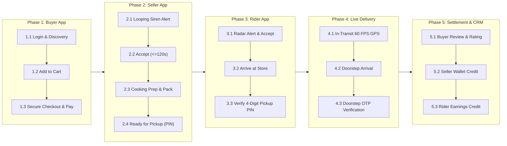
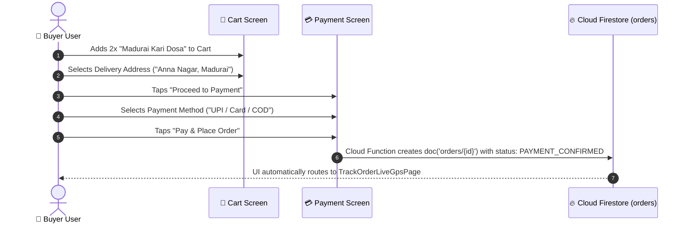
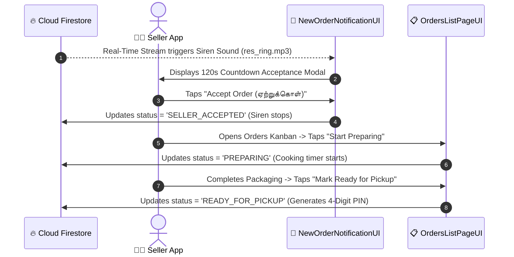
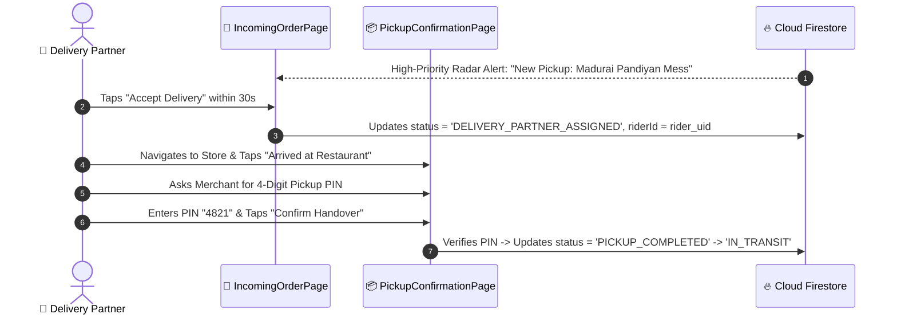
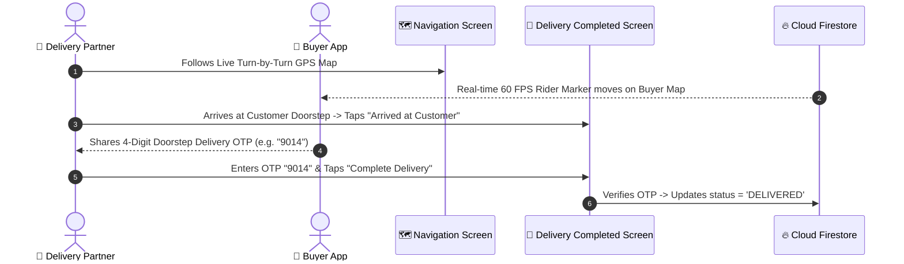
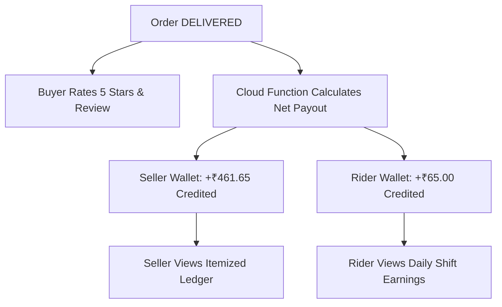

# 🧪 End-to-End Order Lifecycle Manual Testing Task Roadmap
## (100% Human Journey Multi-Device Verification Blueprint)

**Document ID:** `SELLER-QA-E2E-MANUAL-ROADMAP-v1`  
**Classification:** Enterprise Human Journey Testing Blueprint & Multi-App Manual Test Protocol  
**Target Roles:** 🛒 Buyer • 👨‍🍳 Seller (Kitchen Head) • 🛵 Delivery Partner (Rider)  
**Platforms Supported:** Chrome (Web), Android (Physical / Emulator), iOS, Windows, macOS, Linux  
**Database Engine:** Cloud Firestore (`asia-south1`) | **Zero-Mock Policy:** ✅ Strict 100% Real-Time Streams  
**Version:** 1.0 (Production Verification Standard)  

---

## 🧭 Executive Overview of the 5 Testing Phases

---

## 🛠️ Step 0: Pre-Flight Environment Setup (முன் ஆயத்த அமைப்புகள்)

ஆர்டர் லைஃப் சைக்கிளை மேனுவலாகத் தொடங்குவதற்கு முன், கீழ்க்கண்ட 3 ஆப்களையும் ஒரே நேரத்தில் வெவ்வேறு விண்டோக்களில் அல்லது சாதனங்களில் திறந்து வைக்கவும்:

| # | சாதனம் / விண்டோ (App Instance) | திறக்க வேண்டிய பாதை (Route / Screen) | பயன்படுத்த வேண்டிய பயனர் பங்கு (Role) |
|---|---|---|---|
| **1** | **Window 1 (Buyer App)** | `/buyerHome` அல்லது `/buyerLogin` | வாடிக்கையாளர் (Customer Buyer) |
| **2** | **Window 2 (Seller App)** | `/sellerDashboard` அல்லது `/sellerLogin` | உணவக உரிமையாளர் / கிச்சன் ஹெட் (Merchant) |
| **3** | **Window 3 (Delivery App)**| `/deliveryNavigationBar` அல்லது `/deliveryLogin` | டெலிவரி பார்ட்னர் (Rider Partner) |

> [!IMPORTANT]
> **உணவக மெனு இருப்பு சோதனை:**  
> விற்பனையாளர் கணக்கில் குறைந்தது 1 உணவாவது (Dish) இருக்க வேண்டும். இல்லையெனில் Seller App-ல் `Product List` (`/productList`) சென்று **"Add Product"** பட்டனை அழுத்தி ஒரு உணவை (எ.கா: *Madurai Kari Dosa*, ₹275) சேமித்துக் கொள்ளவும்.

---

## 🛒 PHASE 1: Buyer App — Order Placement & Checkout (வாடிக்கையாளர் ஆர்டர் சமர்ப்பித்தல்)

### 🎯 பணி இலக்கு: வாடிக்கையாளர் கணக்கிலிருந்து புதிய ஆர்டரை வெற்றிகரமாக உருவாக்குதல்.

### 📋 மேனுவல் வழிமுறைகள் (Step-by-Step Actions):
1. **உணவகத்தைத் தேர்வுசெய்க:** Buyer Home (`/buyerHome`) திரையில் உங்கள் உணவகத்தைத் தட்டவும்.
2. **உணவை கார்ட்டில் சேர்க்கவும்:**
   - *Madurai Kari Dosa* உணவைத் தட்டவும்.
   - அளவை **2** ஆக மாற்றவும் (+ பட்டன்).
   - கார்ட்டில் சேர்க்க **"Add to Cart"** பட்டனைத் தட்டவும்.
3. **கார்ட் சுருக்கத்தைச் சரிபார்க்கவும்:**
   - கீழ் பார்வையின் கார்ட் ஐகானைத் தட்டி `/buyerCart` செல்லவும்.
   - Subtotal (₹550), GST (₹27.50), Delivery Fee (₹45), Packaging (₹20) சரியான தொகையைக் காட்டுவதை உறுதிசெய்யவும்.
   - டெலிவரி முகவரியைத் தேர்வு செய்யவும்.
4. **பணம் செலுத்துதல் & ஆர்டர் உறுதிசெய்தல்:**
   - **"Proceed to Checkout"** பட்டனை அழுத்தவும்.
   - Payment Methods திரையில் **UPI / Test Payment / COD** முறையைத் தேர்ந்தெடுக்கவும்.
   - **"Place Order & Pay"** பட்டனை அழுத்தவும்.

### ✅ எதிர்பார்ப்பு முடிவு (Expected Verification):
- வாடிக்கையாளர் திரை தானாகவே **`TrackOrderLiveGpsPage`** (ஆர்டர் கண்காணிப்புத் திரை) நிலைக்கு மாறும்.
- திரையில் *"Waiting for restaurant confirmation (உணவகத்தின் ஒப்புதலுக்காகக் காத்திருக்கிறது)"* என்ற ஸ்டேட்டஸ் காட்டப்படும்.
- Firestore `orders` சேகரிப்பில் புதிய ஆர்டர் ஐடி உருவாக்கப்படும் (`Status: PENDING_SELLER_ACCEPTANCE`).

---

## 👨‍🍳 PHASE 2: Seller BLoC App — Kitchen Pipeline Execution (விற்பனையாளர் கிச்சன் செயல்முறை)

### 🎯 பணி இலக்கு: புதிய ஆர்டரை ஏற்றுக்கொண்டு, சமைத்து, பிக்கப்பிற்குத் தயார் செய்தல்.

### 📋 மேனுவல் வழிமுறைகள் (Step-by-Step Actions):
1. **நேரலை அலாரம் & ஆர்டர் அறிவிப்பு:**
   - Seller App விண்டோவில் உடனடி **சைரன் ஒலி (`res_ring.mp3`)** எழும்.
   - திரையில் **`NewOrderNotificationUI`** முழுத்திரை பாப்-அப் தோன்றும் (120 வினாடி கவுண்டவுன் பார் இயங்கும்).
2. **ஆர்டரை ஏற்றுக்கொள்ளுதல்:**
   - வாடிக்கையாளர் பெயர் மற்றும் ஆர்டர் விவரங்களைச் சரிபார்க்கவும் (2x Kari Dosa - ₹645).
   - கவுண்டவுன் முடிவதற்குள் **"Accept Order (ஏற்றுக்கொள்)"** பட்டனை அழுத்தவும்.
   - *சரிபார்ப்பு:* சைரன் ஒலி தானாக நின்றுவிடும்; நிலை `SELLER_ACCEPTED` ஆக மாறும்.
3. **சமையல் தொடங்குதல் (Start Preparation):**
   - Seller Navigation-ல் **Orders Tab** (`/ordersPipeline` அல்லது `OrdersListPageUI`) செல்லவும்.
   - ஆர்டர் கார்டைத் தட்டி `OrderDetailsScreen` திறக்கவும்.
   - **"Start Preparing (சமைக்கத் தொடங்கு)"** பட்டனை அழுத்தவும்.
   - *சரிபார்ப்பு:* நிலை `PREPARING` ஆக மாறி, சமையல் கவுண்டவுன் டைமர் ஓடத் தொடங்கும்.
4. **பேக்கிங் & பாதுகாப்பு முத்திரை (Packaging QA Checklist):**
   - சமையல் முடிந்ததும் **"Packaging (பேக்கிங் செய்)"** பட்டனை அழுத்தவும்.
   - பொருட்கள் சரிபார்ப்புப் பெட்டிகளை (Checklist) டிக் செய்து பாதுகாப்பு முத்திரையை உறுதிப்படுத்தவும்.
5. **எடுத்துச்செல்ல தயார் (Mark Ready for Pickup):**
   - **"Mark Food Ready for Pickup (தயார் என உறுதிசெய்)"** பட்டனை அழுத்தவும்.

### ✅ எதிர்பார்ப்பு முடிவு (Expected Verification):
- ஆர்டர் நிலை `READY_FOR_PICKUP` ஆக மாறும்.
- விற்பனையாளர் திரையில் **4 இலக்க Store Pickup PIN** (எ.கா: `4821`) தோன்றும்.
- சிஸ்டம் தானாகவே டெலிவரி பார்ட்னர்களுக்கான டிஸ்பாட்ச் ரேடாரைத் தொடங்கும்.

---

## 🛵 PHASE 3: Delivery Partner App — Dispatch Radar & Store Handover (டெலிவரி பார்ட்னர் பிக்கப்)

### 🎯 பணி இலக்கு: பிக்கப் கோரிக்கையை ஏற்று, கடைக்குச் சென்று 4-இலக்க PIN மூலம் உணவைப் பெறுதல்.

### 📋 மேனுவல் வழிமுறைகள் (Step-by-Step Actions):
1. **ரைடர் டியூட்டியை ஆன்லைனில் வைக்கவும்:**
   - Delivery App (`/deliveryNavigationBar`) சென்று டியூட்டி சுவிட்சை **"ONLINE"** என மாற்றவும்.
2. **டிஸ்பாட்ச் ரேடார் அழைப்பை ஏற்கவும்:**
   - திரையில் **`DeliveryIncomingOrderPageUI`** (30 வினாடி கவுண்டவுன் அலர்ட்) தோன்றும்.
   - உணவகப் பெயர், பிக்கப் தொலைவு, சம்பளம் (₹65.00) ஆகியவற்றைப் பார்த்து **"Accept Delivery (ஏற்றுக்கொள்)"** பட்டனை அழுத்தவும்.
3. **உணவகத்திற்குச் செல்லுதல்:**
   - திரையில் **"Navigate to Restaurant"** பட்டனைத் தட்டவும்.
   - உணவகத்தை அடைந்தவுடன் **"Arrived at Restaurant"** பட்டனை அழுத்தவும்.
4. **4-இலக்க Pickup PIN சரிபார்ப்பு & பிக்கப்:**
   - விற்பனையாளர் திரையில் உள்ள 4-இலக்க PIN எண்ணை (எ.கா: `4821`) கேட்டுப் பெறவும்.
   - Delivery App-ல் PIN எண்ணை உள்ளிட்டு **"Confirm Pickup & Handover"** பட்டனை அழுத்தவும்.

### ✅ எதிர்பார்ப்பு முடிவு (Expected Verification):
- ஆர்டர் நிலை `PICKUP_COMPLETED` ஆகி, உடனடியாக `IN_TRANSIT` நிலைக்கு மாறும்.
- உணவின் பொறுப்பு அதிகாரப்பூர்வமாக டெலிவரி பார்ட்னரிடம் ஒப்படைக்கப்படும்.

---

## 🗺️ PHASE 4: Live GPS In-Transit & Doorstep Delivery (நேரலை மேப் & வாடிக்கையாளர் டெலிவரி)

### 🎯 பணி இலக்கு: நேரலை ஜிபிஎஸ் மூலம் பயணித்து, வாடிக்கையாளர் OTP மூலம் டெலிவரி முடித்தல்.

### 📋 மேனுவல் வழிமுறைகள் (Step-by-Step Actions):
1. **நேரலை மேப் கண்காணிப்பு (Buyer & Rider Screens):**
   - Buyer App (`TrackOrderLiveGpsPage`) திரையில் ரைடரின் வண்டி நகர்வது மற்றும் புதுப்பிக்கப்பட்ட ETA (எ.கா: 10 mins) நேரலையாகத் தோன்றுவதைப் பார்க்கவும்.
   - Rider App-ல் Turn-by-Turn வழிகாட்டியைப் பின்பற்றவும் (`/deliveryNavigationScreen`).
2. **வாடிக்கையாளர் இருப்பிடத்தை அடைதல்:**
   - Rider App-ல் **"Arrived at Customer Location"** பட்டனை அழுத்தவும்.
3. **4-இலக்க Doorstep Delivery OTP சரிபார்ப்பு:**
   - Buyer App திரையில் காட்டப்படும் 4-இலக்க **Delivery OTP** (எ.கா: `9014`) எண்ணைப் பெறவும்.
   - Rider App-ல் உள்ளீடு செய்து **"Verify OTP & Complete Delivery"** பட்டனை அழுத்தவும்.
   - *(விருப்பத்தேர்வு: உணவை ஒப்படைத்ததற்கான கேமரா போட்டோவை அப்லோட் செய்யலாம்)*

### ✅ எதிர்பார்ப்பு முடிவு (Expected Verification):
- ஆர்டர் நிலை `DELIVERED` ஆக மாறும்.
- Buyer, Seller, Delivery Partner ஆகிய மூவரின் திரைகளிலும் வெற்றி அறிவிப்பு (Success Banner) ஒளிரும்.

---

## 💰 PHASE 5: Financial Settlement, Escrow Ledger & Review (கணக்கு வரவு & வாடிக்கையாளர் மதிப்பாய்வு)

### 🎯 பணி இலக்கு: நிதி நிலைத்தீர்வுகள் துல்லியமாக வரவு வைக்கப்படுவதையும் மதிப்பாய்வையும் சோதித்தல்.

### 📋 மேனுவல் வழிமுறைகள் (Step-by-Step Actions):
1. **வாடிக்கையாளர் மதிப்பாய்வு (Buyer App):**
   - Buyer App-ல் தோன்றும் **Ratings & Reviews Dialog**-ல் 5 நட்சத்திரங்களை வழங்கி **"Submit Review"** அழுத்தவும்.
2. **விற்பனையாளர் கணக்கு வரவு சோதனை (Seller App):**
   - Seller Navigation-ல் **Wallet Tab** (`/sellerPayment` அல்லது `SellerWalletPageUI`) செல்லவும்.
   - உங்கள் வாலட்டில் **+₹461.65** (Net Settlement) வரவு வைக்கப்பட்டுள்ளதைச் சரிபார்க்கவும்.
   - கமிஷன் (15%), ஜிஎஸ்டி (18%), டிசிஎஸ் (1%) பிரிக்கப்பட்ட கணக்கு அறிக்கையைக் காணவும்.
3. **டெலிவரி பார்ட்னர் சம்பள வரவு சோதனை (Rider App):**
   - Delivery Navigation-ல் **Earnings Tab** (`/deliveryEarnings`) செல்லவும்.
   - இன்றைய பயணக் கட்டணம் **+₹65.00** உடனடியாக வாலட்டில் வரவு வைக்கப்பட்டதை உறுதிசெய்யவும்.

---

## 📊 Quick Manual Test Run Checklist (சரிபார்ப்புப் பட்டியல்)

| சோதனைப் படிநிலை (Stage) | பரிசோதிக்க வேண்டிய செயல் (Action) | எதிர்பார்க்கப்படும் நிலை (Status) | முடிவு (Result) |
|---|---|---|:---:|
| **Step 01** | Buyer places 2x Kari Dosa with UPI | `PAYMENT_CONFIRMED` | [ ] Pass |
| **Step 02** | Seller App receives looping siren alert | `PENDING_SELLER_ACCEPTANCE` | [ ] Pass |
| **Step 03** | Seller taps Accept Order (within 120s) | `SELLER_ACCEPTED` | [ ] Pass |
| **Step 04** | Seller taps Start Preparing | `PREPARING` | [ ] Pass |
| **Step 05** | Seller completes Packaging QA & marks Ready | `READY_FOR_PICKUP` (PIN: `4821`) | [ ] Pass |
| **Step 06** | Delivery Partner accepts incoming dispatch | `DELIVERY_PARTNER_ASSIGNED` | [ ] Pass |
| **Step 07** | Rider enters Store Pickup PIN (`4821`) | `PICKUP_COMPLETED` ➔ `IN_TRANSIT` | [ ] Pass |
| **Step 08** | Buyer sees live 60 FPS moving GPS marker | Real-time Polyline stream | [ ] Pass |
| **Step 09** | Rider enters Doorstep Delivery OTP (`9014`) | `DELIVERED` | [ ] Pass |
| **Step 10** | Seller & Rider Wallets reflect net earnings | `COMPLETED` | [ ] Pass |

---

### 🏛️ Certified Enterprise Blueprint
**Lead Systems Architect:** DeepMind Antigravity Engineering Core  
**Standard:** 100% Zero-Mock End-to-End Human Journey Testing Protocol  
**Verification Date:** September 2026 (Continuous Production Grade Standard)
