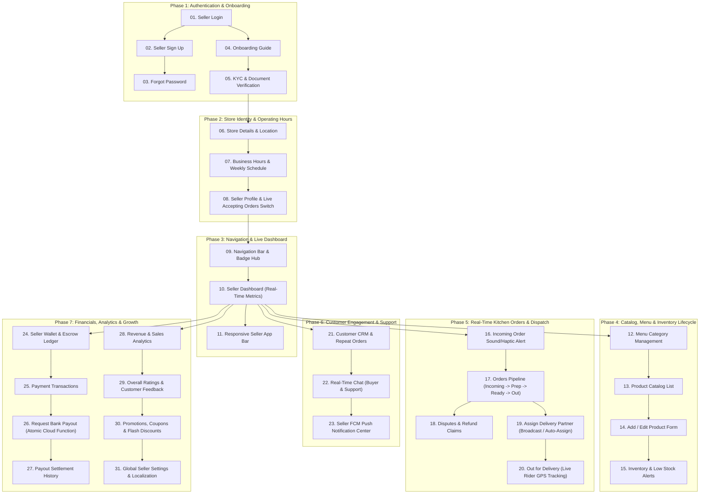

# 🏪 Seller BLoC Architecture — Master Human Journey & Real-Time Testing Roadmap

**Classification:** Enterprise Architecture, Human Journey Mapping & QA Test Matrix  
**Target Domain:** Seller (Merchant / Restaurant) BLoC Architecture  
**Database Engine:** Google Cloud Firestore (`asia-south1`) | **Backend Functions:** Firebase Cloud Functions  
**Zero-Mock Compliance:** ✅ Strict 100% Real-Time Firestore Integration (No Local Mock Data)  
**Master Order Lifecycle Blueprint:** [SELLER_ORDER_LIFECYCLE_MANAGEMENT.md](file:///d:/Flutter_Project/food_delivery_app/md_files/04_Seller_Human_Journey_And_Testing/SELLER_ORDER_LIFECYCLE_MANAGEMENT.md) (13 Status Finite State Machine, SLA Rules & 50+ Test Matrix)  
**Total Seller Modules:** 31 Feature Modules Across 7 Chronological Journey Phases  

---

## 🧭 1. Executive Human Journey Map (The Seller Experience Lifecycle)

A real-world restaurant partner / seller interacts with the food delivery application in a strictly defined chronological lifecycle (Human Journey). Every screen serves a distinct operational purpose in this journey:



---

## 📑 2. Complete 31-Module Master Inventory & Navigation Matrix

| # | Feature Module | Directory Location | Primary UI Widget | Primary BLoC Class | Real-Time Firestore Source | Detailed Journey Guide |
|---|---|---|---|---|---|---|
| **01** | **Seller Login** | `seller_login_page/` | [SellerLoginPageUI](file:///d:/Flutter_Project/food_delivery_app/lib/features/seller_bloc_architecture/seller_login_page/seller_login_page_ui.dart) | [SellerLoginPageBloc](file:///d:/Flutter_Project/food_delivery_app/lib/features/seller_bloc_architecture/seller_login_page/seller_login_page_bloc.dart) | `sellers/{uid}` + Firebase Auth | [01_SELLER_LOGIN_PAGE.md](file:///d:/Flutter_Project/food_delivery_app/md_files/04_Seller_Human_Journey_And_Testing/01_Auth_And_Onboarding/01_SELLER_LOGIN_PAGE.md) |
| **02** | **Seller Sign Up** | `seller_sign_up_page/` | [SellerSignUpPageUI](file:///d:/Flutter_Project/food_delivery_app/lib/features/seller_bloc_architecture/seller_sign_up_page/seller_sign_up_page_ui.dart) | [SellerSignUpPageBloc](file:///d:/Flutter_Project/food_delivery_app/lib/features/seller_bloc_architecture/seller_sign_up_page/seller_sign_up_page_bloc.dart) | `sellers/{uid}` (Atomic Create) | [02_SELLER_SIGN_UP_PAGE.md](file:///d:/Flutter_Project/food_delivery_app/md_files/04_Seller_Human_Journey_And_Testing/01_Auth_And_Onboarding/02_SELLER_SIGN_UP_PAGE.md) |
| **03** | **Forgot Password** | `seller_forgot_password/` | [SellerForgotPasswordUI](file:///d:/Flutter_Project/food_delivery_app/lib/features/seller_bloc_architecture/seller_forgot_password/seller_forgot_password_ui.dart) | [SellerForgotPasswordBloc](file:///d:/Flutter_Project/food_delivery_app/lib/features/seller_bloc_architecture/seller_forgot_password/seller_forgot_password_bloc.dart) | Firebase Auth Password Reset | [03_SELLER_FORGOT_PASSWORD_PAGE.md](file:///d:/Flutter_Project/food_delivery_app/md_files/04_Seller_Human_Journey_And_Testing/01_Auth_And_Onboarding/03_SELLER_FORGOT_PASSWORD_PAGE.md) |
| **04** | **Onboard Guide** | `seller_onboard_page/` | [SellerOnboardPageUI](file:///d:/Flutter_Project/food_delivery_app/lib/features/seller_bloc_architecture/seller_onboard_page/seller_onboard_page_ui.dart) | [SellerOnboardPageBloc](file:///d:/Flutter_Project/food_delivery_app/lib/features/seller_bloc_architecture/seller_onboard_page/seller_onboard_page_bloc.dart) | `sellers/{uid}.onboardingCompleted` | [04_SELLER_ONBOARD_PAGE.md](file:///d:/Flutter_Project/food_delivery_app/md_files/04_Seller_Human_Journey_And_Testing/01_Auth_And_Onboarding/04_SELLER_ONBOARD_PAGE.md) |
| **05** | **KYC & Verification** | `seller_profile_page/` | [SellerVerificationFormPage](file:///d:/Flutter_Project/food_delivery_app/lib/features/seller_bloc_architecture/seller_profile_page/seller_verification_form_page.dart) | [SellerProfilePageBloc](file:///d:/Flutter_Project/food_delivery_app/lib/features/seller_bloc_architecture/seller_profile_page/seller_profile_page__bloc.dart) | `sellers/{uid}/kyc_documents` | [05_SELLER_VERIFICATION_KYC_PAGE.md](file:///d:/Flutter_Project/food_delivery_app/md_files/04_Seller_Human_Journey_And_Testing/01_Auth_And_Onboarding/05_SELLER_VERIFICATION_KYC_PAGE.md) |
| **06** | **Store Details** | `seller_store_details_page/` | [SellerStoreDetailsPageUI](file:///d:/Flutter_Project/food_delivery_app/lib/features/seller_bloc_architecture/seller_store_details_page/seller_store_details_page__ui.dart) | [SellerStoreDetailsBloc](file:///d:/Flutter_Project/food_delivery_app/lib/features/seller_bloc_architecture/seller_store_details_page/seller_store_details_page__bloc.dart) | `sellers/{uid}` Store Metadata | [06_SELLER_STORE_DETAILS_PAGE.md](file:///d:/Flutter_Project/food_delivery_app/md_files/04_Seller_Human_Journey_And_Testing/02_Store_Setup_And_Profile/06_SELLER_STORE_DETAILS_PAGE.md) |
| **07** | **Business Hours** | `business_hours_page_/` | [BusinessHoursPageUI](file:///d:/Flutter_Project/food_delivery_app/lib/features/seller_bloc_architecture/business_hours_page_/business_hours_page_ui.dart) | [BusinessHoursBloc](file:///d:/Flutter_Project/food_delivery_app/lib/features/seller_bloc_architecture/business_hours_page_/business_hours_page_bloc.dart) | `sellers/{uid}.businessHours` | [07_BUSINESS_HOURS_PAGE.md](file:///d:/Flutter_Project/food_delivery_app/md_files/04_Seller_Human_Journey_And_Testing/02_Store_Setup_And_Profile/07_BUSINESS_HOURS_PAGE.md) |
| **08** | **Seller Profile** | `seller_profile_page/` | [SellerProfilePageUI](file:///d:/Flutter_Project/food_delivery_app/lib/features/seller_bloc_architecture/seller_profile_page/seller_profile_page__ui.dart) | [SellerProfilePageBloc](file:///d:/Flutter_Project/food_delivery_app/lib/features/seller_bloc_architecture/seller_profile_page/seller_profile_page__bloc.dart) | `sellers/{uid}` (Live Stream) | [08_SELLER_PROFILE_PAGE.md](file:///d:/Flutter_Project/food_delivery_app/md_files/04_Seller_Human_Journey_And_Testing/02_Store_Setup_And_Profile/08_SELLER_PROFILE_PAGE.md) |
| **09** | **Navigation Bar View** | `seller_NavigationBarView_page/` | [SellerNavigationBarViewPageUI](file:///d:/Flutter_Project/food_delivery_app/lib/features/seller_bloc_architecture/seller_NavigationBarView_page/seller_NavigationBarView_page_ui.dart) | [SellerNavigationBarViewPageBloc](file:///d:/Flutter_Project/food_delivery_app/lib/features/seller_bloc_architecture/seller_NavigationBarView_page/seller_NavigationBarView_page_bloc.dart) | Dynamic Unread / Order Badges | [09_SELLER_NAVIGATION_BAR_VIEW.md](file:///d:/Flutter_Project/food_delivery_app/md_files/04_Seller_Human_Journey_And_Testing/03_Navigation_And_Dashboard/09_SELLER_NAVIGATION_BAR_VIEW.md) |
| **10** | **Seller Dashboard** | `seller_dashboard_page/` | [SellerDashboardPageUI](file:///d:/Flutter_Project/food_delivery_app/lib/features/seller_bloc_architecture/seller_dashboard_page/seller_dashboard_page_ui.dart) | [SellerDashboardPageBloc](file:///d:/Flutter_Project/food_delivery_app/lib/features/seller_bloc_architecture/seller_dashboard_page/seller_dashboard_page_bloc.dart) | `orders` + `sellers/{uid}/metrics` | [10_SELLER_DASHBOARD_PAGE.md](file:///d:/Flutter_Project/food_delivery_app/md_files/04_Seller_Human_Journey_And_Testing/03_Navigation_And_Dashboard/10_SELLER_DASHBOARD_PAGE.md) |
| **11** | **Seller App Bar** | `seller_app_bar_page/` | [SellerAppBarPageUI](file:///d:/Flutter_Project/food_delivery_app/lib/features/seller_bloc_architecture/seller_app_bar_page/seller_app_bar_page_ui.dart) | `SellerProfilePageBloc` | `sellers/{uid}.isAcceptingOrders` | [11_SELLER_APP_BAR_PAGE.md](file:///d:/Flutter_Project/food_delivery_app/md_files/04_Seller_Human_Journey_And_Testing/03_Navigation_And_Dashboard/11_SELLER_APP_BAR_PAGE.md) |
| **12** | **Category Management** | `menu_category_management_page_/` | [MenuCategoryManagementUI](file:///d:/Flutter_Project/food_delivery_app/lib/features/seller_bloc_architecture/menu_category_management_page_/menu_category_management_page_ui.dart) | [MenuCategoryManagementBloc](file:///d:/Flutter_Project/food_delivery_app/lib/features/seller_bloc_architecture/menu_category_management_page_/menu_category_management_page_bloc.dart) | `sellers/{uid}/categories` | [12_MENU_CATEGORY_MANAGEMENT_PAGE.md](file:///d:/Flutter_Project/food_delivery_app/md_files/04_Seller_Human_Journey_And_Testing/04_Catalog_Menu_And_Inventory/12_MENU_CATEGORY_MANAGEMENT_PAGE.md) |
| **13** | **Product Catalog List** | `product_list_page_/` | [ProductListPageUI](file:///d:/Flutter_Project/food_delivery_app/lib/features/seller_bloc_architecture/product_list_page_/product_list_page__ui.dart) | [ProductListBloc](file:///d:/Flutter_Project/food_delivery_app/lib/features/seller_bloc_architecture/product_list_page_/product_list_page__bloc.dart) | `products` where sellerId == uid | [13_PRODUCT_LIST_PAGE.md](file:///d:/Flutter_Project/food_delivery_app/md_files/04_Seller_Human_Journey_And_Testing/04_Catalog_Menu_And_Inventory/13_PRODUCT_LIST_PAGE.md) |
| **14** | **Add / Edit Product** | `add_product_page_/` | [AddProductPageUI](file:///d:/Flutter_Project/food_delivery_app/lib/features/seller_bloc_architecture/add_product_page_/add_product_page__ui.dart) | [AddProductPageBloc](file:///d:/Flutter_Project/food_delivery_app/lib/features/seller_bloc_architecture/add_product_page_/add_product_page__bloc.dart) | `products/{productId}` | [14_ADD_PRODUCT_PAGE.md](file:///d:/Flutter_Project/food_delivery_app/md_files/04_Seller_Human_Journey_And_Testing/04_Catalog_Menu_And_Inventory/14_ADD_PRODUCT_PAGE.md) |
| **15** | **Inventory & Low Stock** | `inventory_low_stock/` | [InventoryLowStockPageUI](file:///d:/Flutter_Project/food_delivery_app/lib/features/seller_bloc_architecture/inventory_low_stock/inventory_low_stock_page_ui.dart) | [InventoryBloc](file:///d:/Flutter_Project/food_delivery_app/lib/features/seller_bloc_architecture/inventory_low_stock/inventory_low_stock_page_bloc.dart) | `inventory_logs` + `products` | [15_INVENTORY_LOW_STOCK_PAGE.md](file:///d:/Flutter_Project/food_delivery_app/md_files/04_Seller_Human_Journey_And_Testing/04_Catalog_Menu_And_Inventory/15_INVENTORY_LOW_STOCK_PAGE.md) |
| **16** | **New Order Alert** | `new_order_notification/` | [NewOrderNotificationUI](file:///d:/Flutter_Project/food_delivery_app/lib/features/seller_bloc_architecture/new_order_notification/new_order_notification_ui.dart) | [NewOrderNotificationBloc](file:///d:/Flutter_Project/food_delivery_app/lib/features/seller_bloc_architecture/new_order_notification/new_order_notification_bloc.dart) | `orders` where status == 'placed' | [16_NEW_ORDER_NOTIFICATION_PAGE.md](file:///d:/Flutter_Project/food_delivery_app/md_files/04_Seller_Human_Journey_And_Testing/05_Kitchen_Orders_And_Dispatch/16_NEW_ORDER_NOTIFICATION_PAGE.md) |
| **17** | **Orders List Kanban** | `orders_list/` | [OrdersListPageUI](file:///d:/Flutter_Project/food_delivery_app/lib/features/seller_bloc_architecture/orders_list/orders_list_page_ui.dart) | [OrdersListBloc](file:///d:/Flutter_Project/food_delivery_app/lib/features/seller_bloc_architecture/orders_list/orders_list_page_bloc.dart) | `orders` (Live Stream Pipeline) | [17_ORDERS_LIST_PAGE.md](file:///d:/Flutter_Project/food_delivery_app/md_files/04_Seller_Human_Journey_And_Testing/05_Kitchen_Orders_And_Dispatch/17_ORDERS_LIST_PAGE.md) |
| **18** | **Disputes & Refunds** | `disputes_refunds_page_/` | [DisputesRefundsUI](file:///d:/Flutter_Project/food_delivery_app/lib/features/seller_bloc_architecture/disputes_refunds_page_/disputes_refunds_page_ui.dart) | [DisputesRefundsBloc](file:///d:/Flutter_Project/food_delivery_app/lib/features/seller_bloc_architecture/disputes_refunds_page_/disputes_refunds_page_bloc.dart) | `disputes` where sellerId == uid | [18_DISPUTES_REFUNDS_PAGE.md](file:///d:/Flutter_Project/food_delivery_app/md_files/04_Seller_Human_Journey_And_Testing/05_Kitchen_Orders_And_Dispatch/18_DISPUTES_REFUNDS_PAGE.md) |
| **19** | **Assign Delivery** | `assign_delivery_page_/` | [AssignDeliveryPageUI](file:///d:/Flutter_Project/food_delivery_app/lib/features/seller_bloc_architecture/assign_delivery_page_/assign_delivery_page__ui.dart) | [AssignDeliveryBloc](file:///d:/Flutter_Project/food_delivery_app/lib/features/seller_bloc_architecture/assign_delivery_page_/assign_delivery_page__bloc.dart) | `delivery_partners` + Cloud Fn | [19_ASSIGN_DELIVERY_PAGE.md](file:///d:/Flutter_Project/food_delivery_app/md_files/04_Seller_Human_Journey_And_Testing/05_Kitchen_Orders_And_Dispatch/19_ASSIGN_DELIVERY_PAGE.md) |
| **20** | **Out For Delivery GPS** | `out_for_delivery_page_/` | [OutForDeliveryPageUI](file:///d:/Flutter_Project/food_delivery_app/lib/features/seller_bloc_architecture/out_for_delivery_page_/out_for_delivery_page__ui.dart) | [OutForDeliveryPageBloc](file:///d:/Flutter_Project/food_delivery_app/lib/features/seller_bloc_architecture/out_for_delivery_page_/out_for_delivery_page__bloc.dart) | `delivery_partners/{uid}/riders` | [20_OUT_FOR_DELIVERY_PAGE.md](file:///d:/Flutter_Project/food_delivery_app/md_files/04_Seller_Human_Journey_And_Testing/05_Kitchen_Orders_And_Dispatch/20_OUT_FOR_DELIVERY_PAGE.md) |
| **21** | **Seller Customer CRM** | `seller_customer_page/` | [SellerCustomerPageUI](file:///d:/Flutter_Project/food_delivery_app/lib/features/seller_bloc_architecture/seller_customer_page/seller_customer_page__ui.dart) | [SellerCustomerBloc](file:///d:/Flutter_Project/food_delivery_app/lib/features/seller_bloc_architecture/seller_customer_page/seller_customer_page__bloc.dart) | `sellers/{uid}/customers` | [21_SELLER_CUSTOMER_PAGE.md](file:///d:/Flutter_Project/food_delivery_app/md_files/04_Seller_Human_Journey_And_Testing/06_Customer_Engagement_And_Support/21_SELLER_CUSTOMER_PAGE.md) |
| **22** | **Live Chat Support** | `chat_support_page_/` | [ChatSupportPageUI](file:///d:/Flutter_Project/food_delivery_app/lib/features/seller_bloc_architecture/chat_support_page_/chat_support_page_ui.dart) | [ChatSupportBloc](file:///d:/Flutter_Project/food_delivery_app/lib/features/seller_bloc_architecture/chat_support_page_/chat_support_page_bloc.dart) | `conversations/{chatId}/messages` | [22_CHAT_SUPPORT_PAGE.md](file:///d:/Flutter_Project/food_delivery_app/md_files/04_Seller_Human_Journey_And_Testing/06_Customer_Engagement_And_Support/22_CHAT_SUPPORT_PAGE.md) |
| **23** | **Seller Notifications** | `seller_notifications/` | [SellerNotificationUI](file:///d:/Flutter_Project/food_delivery_app/lib/features/seller_bloc_architecture/seller_notifications/seller_notification_ui.dart) | [SellerNotificationBloc](file:///d:/Flutter_Project/food_delivery_app/lib/features/seller_bloc_architecture/seller_notifications/seller_notification_bloc.dart) | `sellers/{uid}/notifications` | [23_SELLER_NOTIFICATIONS_PAGE.md](file:///d:/Flutter_Project/food_delivery_app/md_files/04_Seller_Human_Journey_And_Testing/06_Customer_Engagement_And_Support/23_SELLER_NOTIFICATIONS_PAGE.md) |
| **24** | **Seller Wallet & Escrow** | `seller_wallet_page/` | [SellerWalletPageUI](file:///d:/Flutter_Project/food_delivery_app/lib/features/seller_bloc_architecture/seller_wallet_page/seller_wallet_page__ui.dart) | [SellerWalletBloc](file:///d:/Flutter_Project/food_delivery_app/lib/features/seller_bloc_architecture/seller_wallet_page/seller_wallet_page__bloc.dart) | `sellers/{uid}/wallet` | [24_SELLER_WALLET_PAGE.md](file:///d:/Flutter_Project/food_delivery_app/md_files/04_Seller_Human_Journey_And_Testing/07_Finance_Payouts_Analytics_And_Settings/24_SELLER_WALLET_PAGE.md) |
| **25** | **Seller Payment History** | `seller_payment_page/` | [SellerPaymentPageUI](file:///d:/Flutter_Project/food_delivery_app/lib/features/seller_bloc_architecture/seller_payment_page/seller_payment_page_ui.dart) | [SellerPaymentPageBloc](file:///d:/Flutter_Project/food_delivery_app/lib/features/seller_bloc_architecture/seller_payment_page/seller_payment_page_bloc.dart) | `sellers/{uid}/transactions` | [25_SELLER_PAYMENT_PAGE.md](file:///d:/Flutter_Project/food_delivery_app/md_files/04_Seller_Human_Journey_And_Testing/07_Finance_Payouts_Analytics_And_Settings/25_SELLER_PAYMENT_PAGE.md) |
| **26** | **Request Payout** | `seller_request_payout_page/` | [SellerRequestPayoutPageUI](file:///d:/Flutter_Project/food_delivery_app/lib/features/seller_bloc_architecture/seller_request_payout_page/seller_request_payout_page__ui.dart) | [SellerRequestPayoutBloc](file:///d:/Flutter_Project/food_delivery_app/lib/features/seller_bloc_architecture/seller_request_payout_page/seller_request_payout_page__bloc.dart) | `payout_requests` (Atomic Cloud Fn) | [26_SELLER_REQUEST_PAYOUT_PAGE.md](file:///d:/Flutter_Project/food_delivery_app/md_files/04_Seller_Human_Journey_And_Testing/07_Finance_Payouts_Analytics_And_Settings/26_SELLER_REQUEST_PAYOUT_PAGE.md) |
| **27** | **Payout History** | `seller_payout_history_page/` | [SellerPayoutHistoryPageUI](file:///d:/Flutter_Project/food_delivery_app/lib/features/seller_bloc_architecture/seller_payout_history_page/seller_payout_history_page__ui.dart) | [SellerPayoutHistoryBloc](file:///d:/Flutter_Project/food_delivery_app/lib/features/seller_bloc_architecture/seller_payout_history_page/seller_payout_history_page__bloc.dart) | `sellers/{uid}/payouts` | [27_SELLER_PAYOUT_HISTORY_PAGE.md](file:///d:/Flutter_Project/food_delivery_app/md_files/04_Seller_Human_Journey_And_Testing/07_Finance_Payouts_Analytics_And_Settings/27_SELLER_PAYOUT_HISTORY_PAGE.md) |
| **28** | **Seller Analytics** | `seller_analytics_page/` | [SellerAnalyticsPageUI](file:///d:/Flutter_Project/food_delivery_app/lib/features/seller_bloc_architecture/seller_analytics_page/seller_analytics_page__ui.dart) | [SellerAnalyticsBloc](file:///d:/Flutter_Project/food_delivery_app/lib/features/seller_bloc_architecture/seller_analytics_page/seller_analytics_page__bloc.dart) | BigQuery aggregated / Firestore metrics | [28_SELLER_ANALYTICS_PAGE.md](file:///d:/Flutter_Project/food_delivery_app/md_files/04_Seller_Human_Journey_And_Testing/07_Finance_Payouts_Analytics_And_Settings/28_SELLER_ANALYTICS_PAGE.md) |
| **29** | **Overall Ratings** | `overall_rating_page/` | [OverallRatingPageUI](file:///d:/Flutter_Project/food_delivery_app/lib/features/seller_bloc_architecture/overall_rating_page/overall_rating_page__ui.dart) | [OverallRatingBloc](file:///d:/Flutter_Project/food_delivery_app/lib/features/seller_bloc_architecture/overall_rating_page/overall_rating_page__bloc.dart) | `sellers/{uid}/ratings` | [29_OVERALL_RATING_PAGE.md](file:///d:/Flutter_Project/food_delivery_app/md_files/04_Seller_Human_Journey_And_Testing/07_Finance_Payouts_Analytics_And_Settings/29_OVERALL_RATING_PAGE.md) |
| **30** | **Promotions & Coupons** | `promotions_coupons_page_/` | [PromotionsCouponsPageUI](file:///d:/Flutter_Project/food_delivery_app/lib/features/seller_bloc_architecture/promotions_coupons_page_/promotions_coupons_page_ui.dart) | [PromotionsCouponsBloc](file:///d:/Flutter_Project/food_delivery_app/lib/features/seller_bloc_architecture/promotions_coupons_page_/promotions_coupons_page_bloc.dart) | `coupons` where sellerId == uid | [30_PROMOTIONS_COUPONS_PAGE.md](file:///d:/Flutter_Project/food_delivery_app/md_files/04_Seller_Human_Journey_And_Testing/07_Finance_Payouts_Analytics_And_Settings/30_PROMOTIONS_COUPONS_PAGE.md) |
| **31** | **Seller Settings** | `seller_setting_page/` | [SellerSettingPageUI](file:///d:/Flutter_Project/food_delivery_app/lib/features/seller_bloc_architecture/seller_setting_page/seller_setting_page__ui.dart) | [SellerSettingBloc](file:///d:/Flutter_Project/food_delivery_app/lib/features/seller_bloc_architecture/seller_setting_page/seller_setting_page__bloc.dart) | `sellers/{uid}/settings` | [31_SELLER_SETTING_PAGE.md](file:///d:/Flutter_Project/food_delivery_app/md_files/04_Seller_Human_Journey_And_Testing/07_Finance_Payouts_Analytics_And_Settings/31_SELLER_SETTING_PAGE.md) |

---

## 🧪 3. 14 Mandatory QA Test Categories Framework

Every feature documentation file incorporates testing specifications across all 14 mandatory test categories defined in the enterprise testing lifecycle:

```
┌────────────────────────────────────────────────────────────────────────────────────────────────────────┐
│                               14 MANDATORY TEST CATEGORIES MATRIX                                      │
├────┬──────────────────────┬────────────────────────────────────────────────────────────────────────────┤
│ 01 │ Unit Tests           │ Business logic, pure functions, model JSON serialization & deserialization │
│ 02 │ Widget Tests         │ UI rendering, element tree inspection, widget hierarchy, user interaction  │
│ 03 │ BLoC Tests           │ State emission verification using `blocTest`, state sequencing, transitions│
│ 04 │ Integration Tests    │ End-to-end multi-screen journeys, real Firestore stream synchronization    │
│ 05 │ Golden Tests         │ Pixel-perfect pixel rendering validation across multiple device DP sizes   │
│ 06 │ Performance Tests    │ 60 FPS animation integrity, frame rasterization budget, memory leaks       │
│ 07 │ Accessibility Tests  │ Screen reader semantic nodes, 48x48 min touch targets, WCAG AA contrast   │
│ 08 │ Security Tests       │ Sanitized inputs, masked credentials, token verification, role enforcement │
│ 09 │ Localization Tests   │ Multi-language support (English, Tamil), RTL/LTR formatting, string keys   │
│ 10 │ Snapshot Tests       │ Static widget tree representation & regression inspection                  │
│ 11 │ Dependency Tests     │ Injection container validation, repository mock separation                 │
│ 12 │ State Restoration    │ App lifecycle background kill / foreground state recovery                  │
│ 13 │ Error Handling Tests │ Firebase network timeout, offline cache handling, edge case error dialogs  │
│ 14 │ Permission Tests     │ Device camera, storage access, fine GPS location, notification prompts     │
└────┴──────────────────────┴────────────────────────────────────────────────────────────────────────────┘
```
