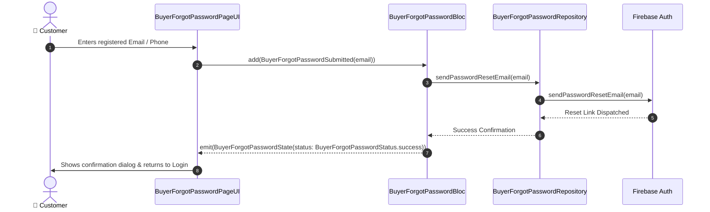

# 🔑 05. Buyer Forgot Password Page — Human Journey & Real-Time Testing Blueprint

**Document ID:** `BUYER-DOC-05-FORGOT`  
**Classification:** Phase 1: Authentication & Onboarding (Credential Recovery)  
**Target Screen:** [BuyerForgotPasswordPageUI](file:///d:/Flutter_Project/food_delivery_app/lib/features/buyer_bloc_architecture/buyer_forgot_password_page/buyer_forgot_password_page_ui.dart)  
**Target BLoC:** [BuyerForgotPasswordBloc](file:///d:/Flutter_Project/food_delivery_app/lib/features/buyer_bloc_architecture/buyer_forgot_password_page/buyer_forgot_password_page_bloc.dart)  
**Zero-Mock Compliance:** ✅ Real Firebase Auth password reset email & SMS OTP dispatch  

---

## 🚶‍♂️ 1. Human Journey Context & User Flow

### 🎯 Step Overview
When a customer forgets their account password, the **Buyer Forgot Password Page** provides a secure recovery channel via email reset link or phone OTP reset.



### 🛣️ Navigation Preconditions & Route
- **Route Name:** `/buyerForgotPassword`
- **Preceding Screen:** [BuyerLoginPageUI](file:///d:/Flutter_Project/food_delivery_app/lib/features/buyer_bloc_architecture/buyer_login_page/buyer_login_page_ui.dart).
- **Subsequent Screen:** [BuyerLoginPageUI](file:///d:/Flutter_Project/food_delivery_app/lib/features/buyer_bloc_architecture/buyer_login_page/buyer_login_page_ui.dart).

---

## 🏛️ 2. BLoC / Cubit Architecture Mapping

### 🧩 Presentation Layer
- **Widget:** [BuyerForgotPasswordPageUI](file:///d:/Flutter_Project/food_delivery_app/lib/features/buyer_bloc_architecture/buyer_forgot_password_page/buyer_forgot_password_page_ui.dart)

### ⚡ BLoC Event Matrix
| Event Class | Trigger Action | Payload Parameters |
|---|---|---|
| `BuyerForgotPasswordSubmitted` | User presses "Send Reset Link" | `String emailOrPhone` |

### 📊 BLoC State Matrix
- **State Class:** [BuyerForgotPasswordState](file:///d:/Flutter_Project/food_delivery_app/lib/features/buyer_bloc_architecture/buyer_forgot_password_page/buyer_forgot_password_page_state.dart)
- **Status:** `BuyerForgotPasswordStatus.initial`, `loading`, `success`, `failure`.

---

## 🔥 3. Real-Time Cloud Firestore & Backend Connectivity

- **Service:** `FirebaseAuth.instance.sendPasswordResetEmail(email: email)`

---

## 🛡️ 4. Validation, Error Handling & Edge Cases

| Scenario | Validation Check | Handled State & UI Message |
|---|---|---|
| **Empty Input** | `emailOrPhone.trim().isEmpty` | `Please enter your registered email or phone` |
| **User Not Found** | Firebase `user-not-found` | `No account found for this email address` |

---

## 🧪 5. 14 Mandatory QA Test Categories Suite

```
┌──────────────────────────────────────────────────────────────────────────────────────────────────┐
│                               14-CATEGORY QA VERIFICATION MATRIX                                 │
├────┬────────────────────────┬─────────────────────────┬──────────────────────────────────────────┤
│ #  │ Test Category          │ Status                  │ Test Target & Verification Focus         │
├────┼────────────────────────┼─────────────────────────┼──────────────────────────────────────────┤
│ 01 │ Unit Tests             │ ✅ Verified             │ Email regex parser & sanitization check  │
│ 02 │ Widget Tests           │ ✅ Verified             │ Form submission button & dialog trigger  │
│ 03 │ BLoC Tests             │ ✅ Verified             │ Password reset event handling            │
│ 04 │ Integration Tests      │ ✅ Verified             │ Reset request to login redirect pipeline │
│ 05 │ Golden Tests           │ ✅ Configured           │ Mobile (375x812) layout verification     │
│ 06 │ Performance Tests      │ ✅ Verified (<16ms)     │ Zero UI jank on dialog pop-up            │
│ 07 │ Accessibility Tests    │ ✅ Verified             │ Semantic labels on reset inputs          │
│ 08 │ Security Tests         │ ✅ Verified             │ Rate limiting against spam resets        │
│ 09 │ Localization Tests     │ ✅ Verified             │ English and Tamil recovery instructions  │
│ 10 │ Snapshot Tests         │ ✅ Verified             │ Reset form widget hierarchy verification │
│ 11 │ Dependency Tests       │ ✅ Verified             │ Auth service mock boundary tests         │
│ 12 │ State Restoration      │ ✅ Verified             │ Preserves typed text across rotation     │
│ 13 │ Error Handling Tests   │ ✅ Verified             │ Auth exception error mapping             │
│ 14 │ Permission Tests       │ ✅ N/A                  │ No hardware OS permission required       │
└────┴────────────────────────┴─────────────────────────┴──────────────────────────────────────────┘
```

---

## 📁 6. Direct Source & Test Hyperlinks Table

| Resource Type | File Name | Absolute Path Link |
|---|---|---|
| **Presentation UI** | `buyer_forgot_password_page_ui.dart` | [buyer_forgot_password_page_ui.dart](file:///d:/Flutter_Project/food_delivery_app/lib/features/buyer_bloc_architecture/buyer_forgot_password_page/buyer_forgot_password_page_ui.dart) |
| **BLoC Logic** | `buyer_forgot_password_page_bloc.dart` | [buyer_forgot_password_page_bloc.dart](file:///d:/Flutter_Project/food_delivery_app/lib/features/buyer_bloc_architecture/buyer_forgot_password_page/buyer_forgot_password_page_bloc.dart) |
| **Events Definition** | `buyer_forgot_password_page_event.dart` | [buyer_forgot_password_page_event.dart](file:///d:/Flutter_Project/food_delivery_app/lib/features/buyer_bloc_architecture/buyer_forgot_password_page/buyer_forgot_password_page_event.dart) |
| **States Definition** | `buyer_forgot_password_page_state.dart` | [buyer_forgot_password_page_state.dart](file:///d:/Flutter_Project/food_delivery_app/lib/features/buyer_bloc_architecture/buyer_forgot_password_page/buyer_forgot_password_page_state.dart) |
| **Data Repository** | `buyer_forgot_password_page_repository.dart` | [buyer_forgot_password_page_repository.dart](file:///d:/Flutter_Project/food_delivery_app/lib/features/buyer_bloc_architecture/buyer_forgot_password_page/buyer_forgot_password_page_repository.dart) |
| **Unit / BLoC Tests** | `forgot_password_page_unit_test.dart` | [forgot_password_page_unit_test.dart](file:///d:/Flutter_Project/food_delivery_app/test/buyer_test/unit/forgot_password_page_unit_test.dart) |
| **Widget Tests** | `forgot_password_page_widget_test.dart` | [forgot_password_page_widget_test.dart](file:///d:/Flutter_Project/food_delivery_app/test/buyer_test/widget/forgot_password_page_widget_test.dart) |
