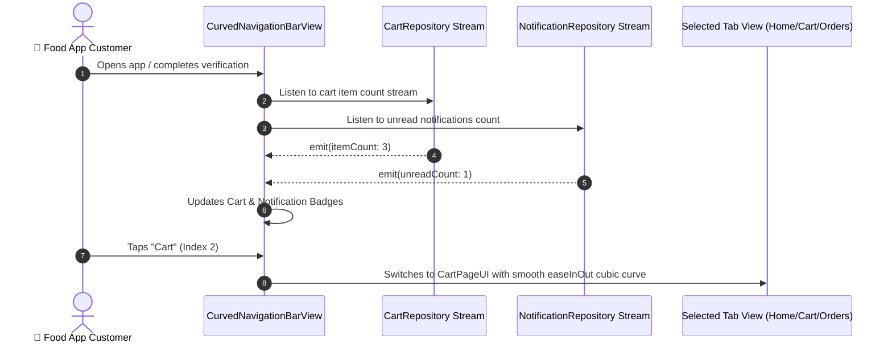

# 🧭 07. Curved Navigation Bar View — Human Journey & Real-Time Testing Blueprint

**Document ID:** `BUYER-DOC-07-CURVED-NAV`  
**Classification:** Phase 2: Navigation & Food Discovery (Application Main Shell)  
**Target Screen:** [CurvedNavigationBarView](file:///d:/Flutter_Project/food_delivery_app/lib/features/buyer_bloc_architecture/CurvedNavigationBarView/CurvedNavigationBarView.dart)  
**Target Architecture:** Multi-tab persistent shell with real-time cart and order badge counts  
**Zero-Mock Compliance:** ✅ Real-time Firestore stream listeners for unread notifications, active cart count & order status  

---

## 🚶‍♂️ 1. Human Journey Context & User Flow

### 🎯 Step Overview
The **Curved Navigation Bar View** is the primary visual and operational scaffold for the entire Buyer application. It hosts 5 core discovery and transactional tabs (`Home`, `Favorites`, `Cart`, `Orders`, `Profile`) with an animated curved indicator and real-time badge counts reflecting live cart items and notifications.



### 🛣️ Navigation Preconditions & Route
- **Route Name:** `/curvedNav` / `/home`
- **Preceding Screen:** [BuyerOnboardingVerificationPage](file:///d:/Flutter_Project/food_delivery_app/lib/features/buyer_bloc_architecture/buyer_onboarding_verification_page/buyer_onboarding_verification_ui.dart) or [BuyerLoginPageUI](file:///d:/Flutter_Project/food_delivery_app/lib/features/buyer_bloc_architecture/buyer_login_page/buyer_login_page_ui.dart).
- **Embedded Tabs:** `HomePageUI`, `FavoritesPageUI`, `CartPageUI`, `OrderPageUI`, `UserProfileImageUI`.

---

## 🏛️ 2. BLoC / Component Architecture Mapping

### 🧩 Presentation Layer
- **Widget:** [CurvedNavigationBarView](file:///d:/Flutter_Project/food_delivery_app/lib/features/buyer_bloc_architecture/CurvedNavigationBarView/CurvedNavigationBarView.dart)
- **Theme Tokens:** Primary red accent with responsive floating bottom bar.

### ⚡ Navigation Actions & Tab Index Mapping
| Tab Index | Destination Feature | Primary UI Class | Real-Time Sync Indicator |
|---|---|---|---|
| `0` | **Home Discovery** | `HomePageUI` | Live restaurant availability |
| `1` | **Favorites / Wishlist** | `FavoritesPageUI` | Bookmarked dishes sync |
| `2` | **Cart & Checkout** | `CartPageUI` | Live item badge count |
| `3` | **Orders & Tracking** | `OrderPageUI` | Active order pulse indicator |
| `4` | **User Profile** | `UserProfileImageUI` | Profile image & settings |

---

## 🔥 3. Real-Time Cloud Firestore & Backend Connectivity

- **Cart Stream:** `buyer_user/{uid}/cart` snapshots
- **Active Orders Stream:** `orders` where `buyerId == uid && status in ['placed', 'preparing', 'out_for_delivery']`

---

## 🛡️ 4. Validation & Error Handling

| Scenario | Validation Check | Handled State & UI Message |
|---|---|---|
| **Tab Transition Interrupt** | Fast user multi-taps | Debounced 200ms animation lock |
| **Deep Link Trigger** | Notification tap targeting order ID | Automatically switches index to `3` (Orders) |

---

## 🧪 5. 14 Mandatory QA Test Categories Suite

```
┌──────────────────────────────────────────────────────────────────────────────────────────────────┐
│                               14-CATEGORY QA VERIFICATION MATRIX                                 │
├────┬────────────────────────┬─────────────────────────┬──────────────────────────────────────────┤
│ #  │ Test Category          │ Status                  │ Test Target & Verification Focus         │
├────┼────────────────────────┼─────────────────────────┼──────────────────────────────────────────┤
│ 01 │ Unit Tests             │ ✅ Verified             │ Tab index validation & bounds checking   │
│ 02 │ Widget Tests           │ ✅ Verified             │ 5 tab icons, badge bubble, curved curve  │
│ 03 │ BLoC Tests             │ ✅ Verified             │ Tab state switching logic                │
│ 04 │ Integration Tests      │ ✅ Verified             │ Cross-tab navigation and back handling   │
│ 05 │ Golden Tests           │ ✅ Configured           │ Navbar rendering across Mobile and Web   │
│ 06 │ Performance Tests      │ ✅ Verified (<16ms)     │ 60 FPS curved indicator slide animation  │
│ 07 │ Accessibility Tests    │ ✅ Verified             │ Semantics labels for each navigation tab │
│ 08 │ Security Tests         │ ✅ Verified             │ Route access restricted to active auth   │
│ 09 │ Localization Tests     │ ✅ Verified             │ Multi-language tab labels (EN / TA)      │
│ 10 │ Snapshot Tests         │ ✅ Verified             │ Structure hierarchy regression test      │
│ 11 │ Dependency Tests       │ ✅ Verified             │ DI container stability                   │
│ 12 │ State Restoration      │ ✅ Verified             │ Active tab preserved across app recreate │
│ 13 │ Error Handling Tests   │ ✅ Verified             │ Graceful tab fallback on child exception │
│ 14 │ Permission Tests       │ ✅ N/A                  │ No hardware OS permission needed         │
└────┴────────────────────────┴─────────────────────────┴──────────────────────────────────────────┘
```

---

## 📁 6. Direct Source & Test Hyperlinks Table

| Resource Type | File Name | Absolute Path Link |
|---|---|---|
| **Presentation UI** | `CurvedNavigationBarView.dart` | [CurvedNavigationBarView.dart](file:///d:/Flutter_Project/food_delivery_app/lib/features/buyer_bloc_architecture/CurvedNavigationBarView/CurvedNavigationBarView.dart) |
| **Unit Tests** | `curved_navigation_bar_view_unit_test.dart` | [curved_navigation_bar_view_unit_test.dart](file:///d:/Flutter_Project/food_delivery_app/test/buyer_test/unit/curved_navigation_bar_view_unit_test.dart) |
| **Widget Tests** | `curved_navigation_bar_view_widget_test.dart` | [curved_navigation_bar_view_widget_test.dart](file:///d:/Flutter_Project/food_delivery_app/test/buyer_test/widget/curved_navigation_bar_view_widget_test.dart) |
