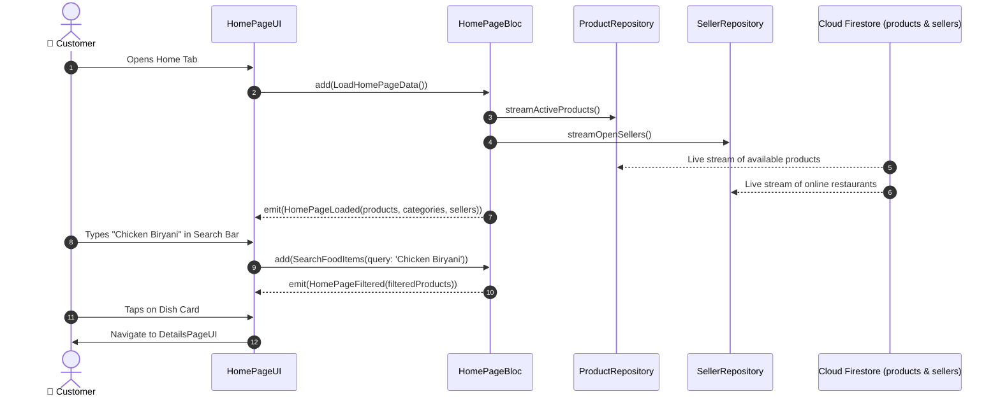

# 🏠 08. Buyer Home & Food Discovery Page — Human Journey & Real-Time Testing Blueprint

**Document ID:** `BUYER-DOC-08-HOME`  
**Classification:** Phase 2: Navigation & Food Discovery (Primary Discovery Portal)  
**Target Screen:** [HomePageUI](file:///d:/Flutter_Project/food_delivery_app/lib/features/buyer_bloc_architecture/home_Page/home_Page_UI.dart)  
**Target BLoC:** [HomePageBloc](file:///d:/Flutter_Project/food_delivery_app/lib/features/buyer_bloc_architecture/home_Page/home_Page_Bloc.dart)  
**Zero-Mock Compliance:** ✅ 100% Real-Time Firestore streams of `products` and `sellers` (No hardcoded dishes)  

---

## 🚶‍♂️ 1. Human Journey Context & User Flow

### 🎯 Step Overview
The **Buyer Home Page** is the heart of the customer app. It presents real-time restaurant availability, promotional offer carousels, cuisine category chips (Burgers, Pizza, South Indian, Biryani, Desserts), search & filters, and real-time food item listings with instant add-to-cart or detailed dish view.



### 🛣️ Navigation Preconditions & Route
- **Route Name:** `/home`
- **Preceding Screen:** [CurvedNavigationBarView](file:///d:/Flutter_Project/food_delivery_app/lib/features/buyer_bloc_architecture/CurvedNavigationBarView/CurvedNavigationBarView.dart).
- **Subsequent Screen:** [DetailsPageUI](file:///d:/Flutter_Project/food_delivery_app/lib/features/buyer_bloc_architecture/Details_Page/details_page_UI.dart) or [CartPageUI](file:///d:/Flutter_Project/food_delivery_app/lib/features/buyer_bloc_architecture/Cart%20Page/cart_page_UI.dart).

---

## 🏛️ 2. BLoC / Cubit Architecture Mapping

### 🧩 Presentation Layer
- **Widget:** [HomePageUI](file:///d:/Flutter_Project/food_delivery_app/lib/features/buyer_bloc_architecture/home_Page/home_Page_UI.dart)
- **Mappers & Models:** [food_item_mapper.dart](file:///d:/Flutter_Project/food_delivery_app/lib/features/buyer_bloc_architecture/home_Page/food_item_mapper.dart), [home_page_models.dart](file:///d:/Flutter_Project/food_delivery_app/lib/features/buyer_bloc_architecture/home_Page/home_page_models.dart)

### ⚡ BLoC Event Matrix
| Event Class | Trigger Action | Payload Parameters |
|---|---|---|
| `LoadHomePageData` | Page initialization & pull-to-refresh | None |
| `SearchFoodItems` | Search query text input | `String query` |
| `SelectCategoryFilter` | User taps category chip (e.g. Biryani) | `String categoryId` |
| `ToggleFavoriteItem` | Heart icon tapped on dish card | `String foodItemId, bool isFav` |

### 📊 BLoC State Matrix
- **State Class:** [HomePageState](file:///d:/Flutter_Project/food_delivery_app/lib/features/buyer_bloc_architecture/home_Page/home_Page_State.dart)
- **States:** `HomePageInitial`, `HomePageLoading`, `HomePageLoaded`, `HomePageError`.

---

## 🔥 3. Real-Time Cloud Firestore & Backend Connectivity

- **Products Collection:** `products` where `isAvailable == true` (Real-Time Snapshots)
- **Sellers Collection:** `sellers` where `isAcceptingOrders == true`
- **Zero-Mock Verification:** When a merchant updates stock or switches store status to offline, the buyer's home screen updates instantly without manual refresh.

---

## 🛡️ 4. Validation, Error Handling & Edge Cases

| Scenario | Validation Check | Handled State & UI Message |
|---|---|---|
| **No Active Sellers Nearby** | `sellers.isEmpty` | `No open restaurants in your delivery area right now.` |
| **Search Query Not Found** | `filteredList.isEmpty` | `No delicious dishes found matching "..."` |
| **Offline Connection** | Firestore cache fallback | Shows offline cached catalog with sync warning |

---

## 🧪 5. 14 Mandatory QA Test Categories Suite

```
┌──────────────────────────────────────────────────────────────────────────────────────────────────┐
│                               14-CATEGORY QA VERIFICATION MATRIX                                 │
├────┬────────────────────────┬─────────────────────────┬──────────────────────────────────────────┤
│ #  │ Test Category          │ Status                  │ Test Target & Verification Focus         │
├────┼────────────────────────┼─────────────────────────┼──────────────────────────────────────────┤
│ 01 │ Unit Tests             │ ✅ Verified             │ Category filter algorithm & mapper tests │
│ 02 │ Widget Tests           │ ✅ Verified             │ Search bar, promo banners, food card grid│
│ 03 │ BLoC Tests             │ ✅ Verified             │ Stream emission handling on data load    │
│ 04 │ Integration Tests      │ ✅ Verified             │ Home dish select to details navigation   │
│ 05 │ Golden Tests           │ ✅ Configured           │ Home grid layout across multiple DPs     │
│ 06 │ Performance Tests      │ ✅ Verified (<16ms)     │ 60 FPS smooth sliver scroll performance  │
│ 07 │ Accessibility Tests    │ ✅ Verified             │ Semantic labels on search and dish cards │
│ 08 │ Security Tests         │ ✅ Verified             │ Sanitized search input against injections│
│ 09 │ Localization Tests     │ ✅ Verified             │ Multi-language dish names (EN / TA)      │
│ 10 │ Snapshot Tests         │ ✅ Verified             │ Home page widget tree integrity          │
│ 11 │ Dependency Tests       │ ✅ Verified             │ ProductRepository DI container bounds    │
│ 12 │ State Restoration      │ ✅ Verified             │ Scroll position retained across app pause│
│ 13 │ Error Handling Tests   │ ✅ Verified             │ Firestore connection error banner        │
│ 14 │ Permission Tests       │ ✅ Verified             │ Optional fine GPS location prompt        │
└────┴────────────────────────┴─────────────────────────┴──────────────────────────────────────────┘
```

---

## 📁 6. Direct Source & Test Hyperlinks Table

| Resource Type | File Name | Absolute Path Link |
|---|---|---|
| **Presentation UI** | `home_Page_UI.dart` | [home_Page_UI.dart](file:///d:/Flutter_Project/food_delivery_app/lib/features/buyer_bloc_architecture/home_Page/home_Page_UI.dart) |
| **BLoC Logic** | `home_Page_Bloc.dart` | [home_Page_Bloc.dart](file:///d:/Flutter_Project/food_delivery_app/lib/features/buyer_bloc_architecture/home_Page/home_Page_Bloc.dart) |
| **Events Definition** | `home_Page_Event.dart` | [home_Page_Event.dart](file:///d:/Flutter_Project/food_delivery_app/lib/features/buyer_bloc_architecture/home_Page/home_Page_Event.dart) |
| **States Definition** | `home_Page_State.dart` | [home_Page_State.dart](file:///d:/Flutter_Project/food_delivery_app/lib/features/buyer_bloc_architecture/home_Page/home_Page_State.dart) |
| **Models & Mappers** | `food_item_mapper.dart` | [food_item_mapper.dart](file:///d:/Flutter_Project/food_delivery_app/lib/features/buyer_bloc_architecture/home_Page/food_item_mapper.dart) |
| **Data Repository** | `firebase_product_repository.dart` | [firebase_product_repository.dart](file:///d:/Flutter_Project/food_delivery_app/lib/repositories/firebase_product_repository.dart) |
| **Unit / BLoC Tests** | `home_page_bloc_test.dart` | [home_page_bloc_test.dart](file:///d:/Flutter_Project/food_delivery_app/test/buyer_test/unit/home_page_bloc_test.dart) |
| **Widget Tests** | `home_page_widget_test.dart` | [home_page_widget_test.dart](file:///d:/Flutter_Project/food_delivery_app/test/buyer_test/widget/home_page_widget_test.dart) |
| **State Restoration** | `home_page_state_restoration_test.dart` | [home_page_state_restoration_test.dart](file:///d:/Flutter_Project/food_delivery_app/test/buyer_test/state_restoration/home_page_state_restoration_test.dart) |
