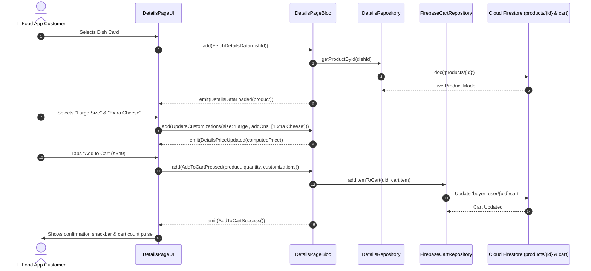

# 🍲 09. Food Item & Restaurant Details Page — Human Journey & Real-Time Testing Blueprint

**Document ID:** `BUYER-DOC-09-DETAILS`  
**Classification:** Phase 2: Navigation & Food Discovery (Dish Customization & Details)  
**Target Screen:** [DetailsPageUI](file:///d:/Flutter_Project/food_delivery_app/lib/features/buyer_bloc_architecture/Details_Page/details_page_UI.dart)  
**Target BLoC:** [DetailsPageBloc](file:///d:/Flutter_Project/food_delivery_app/lib/features/buyer_bloc_architecture/Details_Page/details_page_Bloc.dart)  
**Zero-Mock Compliance:** ✅ Real-time Firestore product modifiers, size variants & dynamic pricing  

---

## 🚶‍♂️ 1. Human Journey Context & User Flow

### 🎯 Step Overview
When a customer selects a dish from the discovery feed or search results, the **Food Item Details Page** provides high-definition food photography, nutritional info, spice customization, portion size options, add-ons (Extra Cheese, Dips, Toppings), quantity increment/decrement, and live price computation before adding to the cart.



### 🛣️ Navigation Preconditions & Route
- **Route Name:** `/foodDetails`
- **Preceding Screen:** [HomePageUI](file:///d:/Flutter_Project/food_delivery_app/lib/features/buyer_bloc_architecture/home_Page/home_Page_UI.dart) or [FavoritesPageUI](file:///d:/Flutter_Project/food_delivery_app/lib/features/buyer_bloc_architecture/Favorites_Page/favorites_UI.dart).
- **Subsequent Screen:** [CartPageUI](file:///d:/Flutter_Project/food_delivery_app/lib/features/buyer_bloc_architecture/Cart%20Page/cart_page_UI.dart).

---

## 🏛️ 2. BLoC / Cubit Architecture Mapping

### 🧩 Presentation Layer
- **Widget:** [DetailsPageUI](file:///d:/Flutter_Project/food_delivery_app/lib/features/buyer_bloc_architecture/Details_Page/details_page_UI.dart)
- **Repository:** [details_repository.dart](file:///d:/Flutter_Project/food_delivery_app/lib/features/buyer_bloc_architecture/Details_Page/details_repository.dart)

### ⚡ BLoC Event Matrix
| Event Class | Trigger Action | Payload Parameters |
|---|---|---|
| `FetchDetailsData` | Screen load | `String productId` |
| `QuantityIncremented` | Plus (+) button tapped | None |
| `QuantityDecremented` | Minus (-) button tapped | None |
| `SizeVariantSelected` | Size option radio button tapped | `String size` |
| `AddOnOptionToggled` | Checkbox tapped on add-ons | `String addOnId, double price` |
| `AddToCartPressed` | Main bottom CTA button tapped | `Map<String, dynamic> itemPayload` |

### 📊 BLoC State Matrix
- **State Class:** [DetailsPageState](file:///d:/Flutter_Project/food_delivery_app/lib/features/buyer_bloc_architecture/Details_Page/details_page_State.dart)
- **States:** `DetailsPageInitial`, `DetailsPageLoading`, `DetailsPageLoaded`, `DetailsPageError`.

---

## 🔥 3. Real-Time Cloud Firestore & Backend Connectivity

- **Product Document:** `products/{productId}`
- **Cart Sync Document:** `buyer_user/{uid}/cart/{cartItemId}`

---

## 🛡️ 4. Validation, Error Handling & Edge Cases

| Scenario | Validation Check | Handled State & UI Message |
|---|---|---|
| **Out of Stock Item** | `product.stockCount <= 0` | Add to Cart button disabled with "Item Sold Out" |
| **Max Quantity Limit** | `quantity > 10` | `Maximum 10 quantities allowed per dish` |

---

## 🧪 5. 14 Mandatory QA Test Categories Suite

```
┌──────────────────────────────────────────────────────────────────────────────────────────────────┐
│                               14-CATEGORY QA VERIFICATION MATRIX                                 │
├────┬────────────────────────┬─────────────────────────┬──────────────────────────────────────────┤
│ #  │ Test Category          │ Status                  │ Test Target & Verification Focus         │
├────┼────────────────────────┼─────────────────────────┼──────────────────────────────────────────┤
│ 01 │ Unit Tests             │ ✅ Verified             │ Price computation with add-on modifiers  │
│ 02 │ Widget Tests           │ ✅ Verified             │ Quantity steppers, size chips, CTA button│
│ 03 │ BLoC Tests             │ ✅ Verified             │ FetchDetailsData & AddToCart emissions   │
│ 04 │ Integration Tests      │ ✅ Verified             │ Dish details selection to Cart addition  │
│ 05 │ Golden Tests           │ ✅ Configured           │ Dish hero image & details alignment      │
│ 06 │ Performance Tests      │ ✅ Verified (<16ms)     │ 60 FPS hero animation into details screen│
│ 07 │ Accessibility Tests    │ ✅ Verified             │ Quantity button semantics & screen voice │
│ 08 │ Security Tests         │ ✅ Verified             │ Price tampering protection on submission │
│ 09 │ Localization Tests     │ ✅ Verified             │ Multi-language dish descriptions (EN/TA) │
│ 10 │ Snapshot Tests         │ ✅ Verified             │ Details widget tree hierarchy integrity  │
│ 11 │ Dependency Tests       │ ✅ Verified             │ DetailsRepository isolation & container  │
│ 12 │ State Restoration      │ ✅ Verified             │ Quantity and size selections preserved   │
│ 13 │ Error Handling Tests   │ ✅ Verified             │ Missing product ID error screen          │
│ 14 │ Permission Tests       │ ✅ N/A                  │ No hardware OS permission required       │
└────┴────────────────────────┴─────────────────────────┴──────────────────────────────────────────┘
```

---

## 📁 6. Direct Source & Test Hyperlinks Table

| Resource Type | File Name | Absolute Path Link |
|---|---|---|
| **Presentation UI** | `details_page_UI.dart` | [details_page_UI.dart](file:///d:/Flutter_Project/food_delivery_app/lib/features/buyer_bloc_architecture/Details_Page/details_page_UI.dart) |
| **BLoC Logic** | `details_page_Bloc.dart` | [details_page_Bloc.dart](file:///d:/Flutter_Project/food_delivery_app/lib/features/buyer_bloc_architecture/Details_Page/details_page_Bloc.dart) |
| **Events Definition** | `details_page_Event.dart` | [details_page_Event.dart](file:///d:/Flutter_Project/food_delivery_app/lib/features/buyer_bloc_architecture/Details_Page/details_page_Event.dart) |
| **States Definition** | `details_page_State.dart` | [details_page_State.dart](file:///d:/Flutter_Project/food_delivery_app/lib/features/buyer_bloc_architecture/Details_Page/details_page_State.dart) |
| **Data Repository** | `details_repository.dart` | [details_repository.dart](file:///d:/Flutter_Project/food_delivery_app/lib/features/buyer_bloc_architecture/Details_Page/details_repository.dart) |
| **Unit / BLoC Tests** | `Details_Page_bloc_test.dart` | [Details_Page_bloc_test.dart](file:///d:/Flutter_Project/food_delivery_app/test/buyer_test/unit/Details_Page_bloc_test.dart) |
| **Widget Tests** | `Details_Page_ui_test.dart` | [Details_Page_ui_test.dart](file:///d:/Flutter_Project/food_delivery_app/test/buyer_test/widget/Details_Page_ui_test.dart) |
