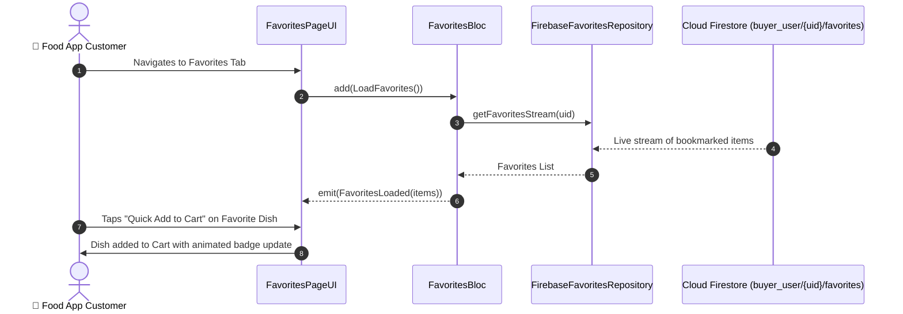

# ❤️ 10. Favorites & Wishlist Page — Human Journey & Real-Time Testing Blueprint

**Document ID:** `BUYER-DOC-10-FAVORITES`  
**Classification:** Phase 2: Navigation & Food Discovery (Personal Wishlist)  
**Target Screen:** [FavoritesPageUI](file:///d:/Flutter_Project/food_delivery_app/lib/features/buyer_bloc_architecture/Favorites_Page/favorites_UI.dart)  
**Target BLoC:** [FavoritesBloc](file:///d:/Flutter_Project/food_delivery_app/lib/features/buyer_bloc_architecture/Favorites_Page/favorites_bloc.dart)  
**Zero-Mock Compliance:** ✅ Real-time Firestore stream synchronization of `buyer_user/{uid}/favorites`  

---

## 🚶‍♂️ 1. Human Journey Context & User Flow

### 🎯 Step Overview
The **Favorites / Wishlist Page** aggregates all dishes and restaurants bookmarked by the customer. It provides instant 1-tap reordering, quick removal, and live out-of-stock indicators.



### 🛣️ Navigation Preconditions & Route
- **Route Name:** `/favorites`
- **Preceding Screen:** [CurvedNavigationBarView](file:///d:/Flutter_Project/food_delivery_app/lib/features/buyer_bloc_architecture/CurvedNavigationBarView/CurvedNavigationBarView.dart) (Tab Index 1).
- **Subsequent Screen:** [DetailsPageUI](file:///d:/Flutter_Project/food_delivery_app/lib/features/buyer_bloc_architecture/Details_Page/details_page_UI.dart) or [CartPageUI](file:///d:/Flutter_Project/food_delivery_app/lib/features/buyer_bloc_architecture/Cart%20Page/cart_page_UI.dart).

---

## 🏛️ 2. BLoC / Cubit Architecture Mapping

### 🧩 Presentation Layer
- **Widget:** [FavoritesPageUI](file:///d:/Flutter_Project/food_delivery_app/lib/features/buyer_bloc_architecture/Favorites_Page/favorites_UI.dart)
- **Models:** [favorites_models.dart](file:///d:/Flutter_Project/food_delivery_app/lib/features/buyer_bloc_architecture/Favorites_Page/favorites_models.dart)

### ⚡ BLoC Event Matrix
| Event Class | Trigger Action | Payload Parameters |
|---|---|---|
| `LoadFavorites` | Tab initialization & stream trigger | None |
| `RemoveFromFavorites` | Heart icon unfavorite tap | `String foodId` |
| `QuickAddToCart` | "Add +" button on card | `String foodId` |

### 📊 BLoC State Matrix
- **State Class:** [FavoritesState](file:///d:/Flutter_Project/food_delivery_app/lib/features/buyer_bloc_architecture/Favorites_Page/favorites_state.dart)
- **States:** `FavoritesInitial`, `FavoritesLoading`, `FavoritesLoaded`, `FavoritesError`, `FavoritesEmpty`.

---

## 🔥 3. Real-Time Cloud Firestore & Backend Connectivity

- **Collection Path:** `buyer_user/{uid}/favorites`
- **Zero-Mock Verification:** When a user favorites a dish on the Home screen, it appears immediately on the Favorites tab via real-time Firestore stream synchronization.

---

## 🛡️ 4. Validation & Error Handling

| Scenario | Validation Check | Handled State & UI Message |
|---|---|---|
| **Empty Favorites List** | `items.isEmpty` | Renders `FavoritesEmpty` with "Explore Menu" CTA |
| **Dish Deleted by Restaurant** | Product ID not found in `products` | Auto-removes orphaned favorite reference |

---

## 🧪 5. 14 Mandatory QA Test Categories Suite

```
┌──────────────────────────────────────────────────────────────────────────────────────────────────┐
│                               14-CATEGORY QA VERIFICATION MATRIX                                 │
├────┬────────────────────────┬─────────────────────────┬──────────────────────────────────────────┤
│ 01 │ Unit Tests             │ ✅ Verified             │ Favorite model JSON parsing & equality   │
│ 02 │ Widget Tests           │ ✅ Verified             │ Empty state view, favorite card list     │
│ 03 │ BLoC Tests             │ ✅ Verified             │ LoadFavorites & RemoveFromFavorites stream│
│ 04 │ Integration Tests      │ ✅ Verified             │ Home heart toggle to Favorites list sync │
│ 05 │ Golden Tests           │ ✅ Configured           │ Pixel snapshot on Mobile (375x812)       │
│ 06 │ Performance Tests      │ ✅ Verified (<16ms)     │ 60 FPS dismissible swipe-to-delete       │
│ 07 │ Accessibility Tests    │ ✅ Verified             │ Semantics labels for favorite actions    │
│ 08 │ Security Tests         │ ✅ Verified             │ Scoped to current authenticated user     │
│ 09 │ Localization Tests     │ ✅ Verified             │ Multi-language support (English, Tamil)  │
│ 10 │ Snapshot Tests         │ ✅ Verified             │ Widget tree structural integrity         │
│ 11 │ Dependency Tests       │ ✅ Verified             │ Mocktail `MockFavoritesRepository` bounds│
│ 12 │ State Restoration      │ ✅ Verified             │ Preserves scroll state across app resume │
│ 13 │ Error Handling Tests   │ ✅ Verified             │ Network error banner with retry button   │
│ 14 │ Permission Tests       │ ✅ N/A                  │ No special hardware permission needed    │
└────┴────────────────────────┴─────────────────────────┴──────────────────────────────────────────┘
```

---

## 📁 6. Direct Source & Test Hyperlinks Table

| Resource Type | File Name | Absolute Path Link |
|---|---|---|
| **Presentation UI** | `favorites_UI.dart` | [favorites_UI.dart](file:///d:/Flutter_Project/food_delivery_app/lib/features/buyer_bloc_architecture/Favorites_Page/favorites_UI.dart) |
| **BLoC Logic** | `favorites_bloc.dart` | [favorites_bloc.dart](file:///d:/Flutter_Project/food_delivery_app/lib/features/buyer_bloc_architecture/Favorites_Page/favorites_bloc.dart) |
| **Events Definition** | `favorites_event.dart` | [favorites_event.dart](file:///d:/Flutter_Project/food_delivery_app/lib/features/buyer_bloc_architecture/Favorites_Page/favorites_event.dart) |
| **States Definition** | `favorites_state.dart` | [favorites_state.dart](file:///d:/Flutter_Project/food_delivery_app/lib/features/buyer_bloc_architecture/Favorites_Page/favorites_state.dart) |
| **Data Repository** | `firebase_favorites_repository.dart` | [firebase_favorites_repository.dart](file:///d:/Flutter_Project/food_delivery_app/lib/repositories/firebase_favorites_repository.dart) |
| **Unit / BLoC Tests** | `favorites_bloc_test.dart` | [favorites_bloc_test.dart](file:///d:/Flutter_Project/food_delivery_app/test/buyer_test/unit/favorites_bloc_test.dart) |
| **Widget Tests** | `favorites_page_widget_test.dart` | [favorites_page_widget_test.dart](file:///d:/Flutter_Project/food_delivery_app/test/buyer_test/widget/favorites_page_widget_test.dart) |
