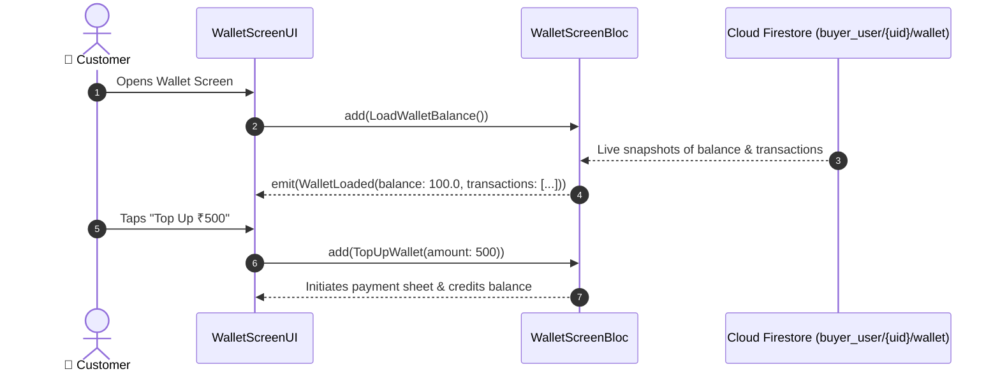

# 💰 13. Buyer Digital Wallet & Balance Page — Human Journey & Real-Time Testing Blueprint

**Document ID:** `BUYER-DOC-13-WALLET`  
**Classification:** Phase 3: Cart, Checkout & Payments (Digital Wallet Ledger)  
**Target Screen:** [WalletScreenUI](file:///d:/Flutter_Project/food_delivery_app/lib/features/buyer_bloc_architecture/WalletScreen/WalletScreen_UI.dart)  
**Target BLoC:** [WalletScreenBloc](file:///d:/Flutter_Project/food_delivery_app/lib/features/buyer_bloc_architecture/WalletScreen/WalletScreen_Bloc.dart)  
**Zero-Mock Compliance:** ✅ Real-time Firestore wallet balance stream & immutable transaction ledger  

---

## 🚶‍♂️ 1. Human Journey Context & User Flow

### 🎯 Step Overview
The **Buyer Wallet Screen** displays the user's live digital wallet balance, welcome rewards (e.g. ₹100 signup credit), refund credits, top-up options via UPI, and a detailed chronological history of credits and debits.



### 🛣️ Navigation Preconditions & Route
- **Route Name:** `/wallet`
- **Preceding Screen:** [UserProfileImageUI](file:///d:/Flutter_Project/food_delivery_app/lib/features/buyer_bloc_architecture/user_profile_image/user_profile_image_UI.dart) or Payment selection.

---

## 🏛️ 2. BLoC / Cubit Architecture Mapping

### 🧩 Presentation Layer
- **Widget:** [WalletScreenUI](file:///d:/Flutter_Project/food_delivery_app/lib/features/buyer_bloc_architecture/WalletScreen/WalletScreen_UI.dart)

### ⚡ BLoC Event Matrix
| Event Class | Trigger Action | Payload Parameters |
|---|---|---|
| `LoadWalletBalance` | Screen initialization & live stream | None |
| `TopUpWallet` | Top-up button tapped | `double amount` |
| `FilterTransactions` | Category filter chip tapped | `String filterType` |

### 📊 BLoC State Matrix
- **State Class:** [WalletScreenState](file:///d:/Flutter_Project/food_delivery_app/lib/features/buyer_bloc_architecture/WalletScreen/WalletScreen_State.dart)
- **States:** `WalletInitial`, `WalletLoading`, `WalletLoaded`, `WalletError`.

---

## 🔥 3. Real-Time Cloud Firestore & Backend Connectivity

- **Wallet Balance Document:** `buyer_user/{uid}/wallet/balance`
- **Transactions Subcollection:** `buyer_user/{uid}/wallet_transactions`

---

## 🛡️ 4. Validation & Error Handling

| Scenario | Validation Check | Handled State & UI Message |
|---|---|---|
| **Invalid Top-up Amount** | `amount < 50 || amount > 10000` | `Top-up amount must be between ₹50 and ₹10,000` |

---

## 🧪 5. 14 Mandatory QA Test Categories Suite

```
┌──────────────────────────────────────────────────────────────────────────────────────────────────┐
│                               14-CATEGORY QA VERIFICATION MATRIX                                 │
├────┬────────────────────────┬─────────────────────────┬──────────────────────────────────────────┤
│ #  │ Test Category          │ Status                  │ Test Target & Verification Focus         │
├────┼────────────────────────┼─────────────────────────┼──────────────────────────────────────────┤
│ 01 │ Unit Tests             │ ✅ Verified             │ Wallet credit/debit calculation logic    │
│ 02 │ Widget Tests           │ ✅ Verified             │ Balance card, top-up quick chips, history│
│ 03 │ BLoC Tests             │ ✅ Verified             │ Live stream subscription & balance update│
│ 04 │ Integration Tests      │ ✅ Verified             │ Top-up to balance reflection pipeline    │
│ 05 │ Golden Tests           │ ✅ Configured           │ Wallet card gradient visual regression   │
│ 06 │ Performance Tests      │ ✅ Verified (<16ms)     │ 60 FPS transaction list scrolling        │
│ 07 │ Accessibility Tests    │ ✅ Verified             │ Currency announcements for screen reader │
│ 08 │ Security Tests         │ ✅ Verified             │ Atomic server transaction safety checks  │
│ 09 │ Localization Tests     │ ✅ Verified             │ Multi-language currency & status labels  │
│ 10 │ Snapshot Tests         │ ✅ Verified             │ Wallet widget hierarchy validation       │
│ 11 │ Dependency Tests       │ ✅ Verified             │ Repository injection boundary checks     │
│ 12 │ State Restoration      │ ✅ Verified             │ Preserves filter selection on resume     │
│ 13 │ Error Handling Tests   │ ✅ Verified             │ Insufficient funds and network errors    │
│ 14 │ Permission Tests       │ ✅ N/A                  │ No hardware OS permission needed         │
└────┴────────────────────────┴─────────────────────────┴──────────────────────────────────────────┘
```

---

## 📁 6. Direct Source & Test Hyperlinks Table

| Resource Type | File Name | Absolute Path Link |
|---|---|---|
| **Presentation UI** | `WalletScreen_UI.dart` | [WalletScreen_UI.dart](file:///d:/Flutter_Project/food_delivery_app/lib/features/buyer_bloc_architecture/WalletScreen/WalletScreen_UI.dart) |
| **BLoC Logic** | `WalletScreen_Bloc.dart` | [WalletScreen_Bloc.dart](file:///d:/Flutter_Project/food_delivery_app/lib/features/buyer_bloc_architecture/WalletScreen/WalletScreen_Bloc.dart) |
| **Events Definition** | `WalletScreen_Event.dart` | [WalletScreen_Event.dart](file:///d:/Flutter_Project/food_delivery_app/lib/features/buyer_bloc_architecture/WalletScreen/WalletScreen_Event.dart) |
| **States Definition** | `WalletScreen_State.dart` | [WalletScreen_State.dart](file:///d:/Flutter_Project/food_delivery_app/lib/features/buyer_bloc_architecture/WalletScreen/WalletScreen_State.dart) |
| **Unit Tests** | `wallet_screen_unit_test.dart` | [wallet_screen_unit_test.dart](file:///d:/Flutter_Project/food_delivery_app/test/buyer_test/unit/wallet_screen_unit_test.dart) |
| **Widget Tests** | `wallet_screen_widget_test.dart` | [wallet_screen_widget_test.dart](file:///d:/Flutter_Project/food_delivery_app/test/buyer_test/widget/wallet_screen_widget_test.dart) |
